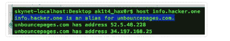
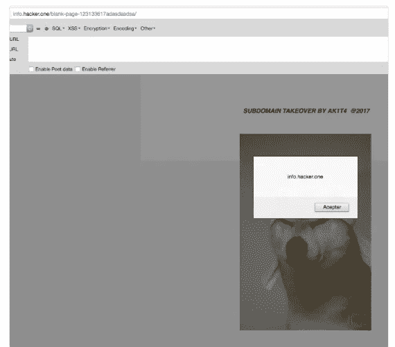
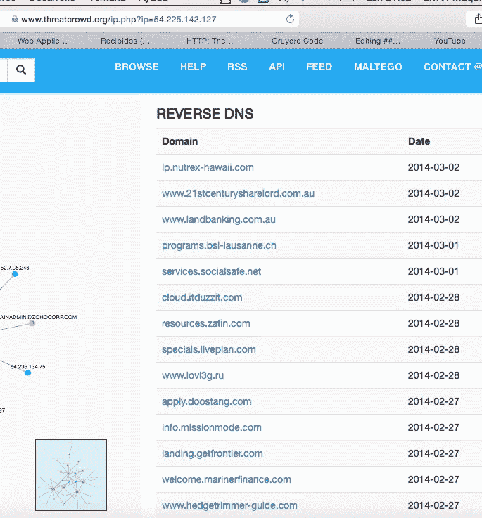
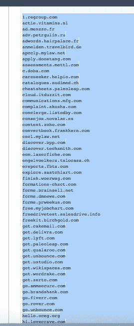
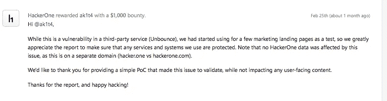

# 几百个几百个子 secdomains hack3d！(包括 Hacker0ne)

> 原文：<https://infosecwriteups.com/hundreds-of-hundreds-subdomains-hack3d-including-hacker0ne-ad3acd1c0a44?source=collection_archive---------0----------------------->

上个月发生了一些有趣的事情，我打算接管 HackerOne 的一些子域名，其中一个引起了我的注意，那就是 **info.hacker。dns 指向 unbouncespages.com 的一个登陆页面应用服务。查看 API，我尝试添加 hackerone 域，但是当我尝试时，输出是:“域已经被声明”。**

良好的..我试图找到另一种方法来绕过这一点，几个小时寻找端点，尝试不同的请求和改变一些参数，我可以黑客攻击&绕过过滤域，这种黑客给我的权力，以增加任何由 unbouncepages.com 的 dns 管理的域。

良好的..这时 **info.hacker.one** 被黑了！

看着 unbouncepages 服务器，我决定做一个反向 Dns 到 54.225.142.127，看看哪些其他领域可以通过这种旁路妥协..令我惊讶的是，数百个子域名出现了！下面列出了几个领域:

(对于一些谷歌呆子，我可以在这项服务下找到更多的域名)

(在完整的列表中，payoneer.com、fiverr 和其他重要公司的域名受到了影响)

# 赏金:

【https://hackerone.com/reports/202767】详情请点击

感谢 HackerOne 提供的令人敬畏的平台，特别感谢所有激励我每天进步的了不起的黑客们:

*   彼得·亚沃斯基
*   **纳哈姆塞**
*   **亚辛·阿布基尔**
*   **Zseano**
*   弗兰斯·罗森

黑客快乐！由 ak1t4

 [## HackerOne 简介- ak1t4

### 怀特 4t Hack3r &禅宗和尚&赏金猎人-https://twitter.com/knowledge_2014

hackerone.com](https://hackerone.com/ak1t4)  [## ak1t4 z3n (@knowledge_2014) |推特

### ak1t4 z3n 的最新推文(@knowledge_2014)。赏金猎人。黑客&禅僧

twitter.com](https://twitter.com/knowledge_2014)