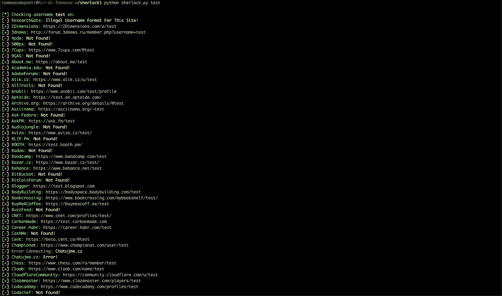
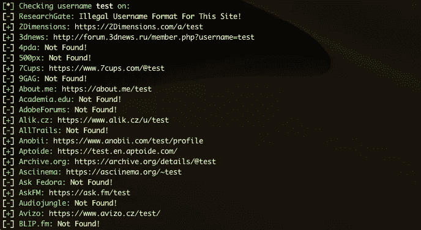

# 通过社交网络中的用户名搜索社交媒体账户

> 原文：<https://infosecwriteups.com/hunt-down-social-media-accounts-by-username-across-social-networks-b326af2d54ed?source=collection_archive---------2----------------------->



谢洛克

## 如何从使用夏洛克的用户名中找到社交媒体账户

今天，我们将使用一个伟大的工具来搜寻社交网络中的社交媒体账户:[夏洛克](https://sherlock-project.github.io/)。这个工具允许我们通过用户名搜索社交媒体账户。

我们要做的第一件事是安装夏洛克，然后我们将学习如何使用它。最后，我们将发现夏洛克在哪些社交媒体平台上运营。我们开始吧！

# 装置

夏洛克是用 Python 制作的工具，所以如果你没有安装 Python3，夏洛克就不能工作。要安装 python3，你可以遵循这个指南[。](https://realpython.com/installing-python/)

安装 Python3 后，我们准备安装来自 Github 的[夏洛克:](https://github.com/sherlock-project/sherlock.git)

```
git clone [https://github.com/sherlock-project/sherlock.git](https://github.com/sherlock-project/sherlock.git)
```

如果你没有安装 git，你可以通过[这个 repo](https://github.com/sherlock-project/sherlock.git) 点击绿色按钮:“克隆或下载”，然后“下载 zip”。

一旦你下载了夏洛克，浏览一下:`cd Sherlock`。现在您已经准备好使用它了

# 使用

现在最精彩的部分来了，我们要在社交网络中搜索“测试”用户名。这真的很简单，只需输入:

```
python3 sherlock.py test
```

这个命令是要在 301 社交网络中搜索“测试用户名”。

通过执行它，您应该开始看到如下输出:



搞定了。我们在 301 个社交网络中搜索了一个用户名，现在让我们看看如何搜索多个用户名。

## 搜索多个用户名

要搜索多个用户名，只需执行这个命令，记住你必须在夏洛克文件夹，否则，它不会工作:

```
python3 sherlock.py test1 test2 test3
```

该命令将搜索树用户名。

相当简单！

# 夏洛克在什么平台上运营？

这是一个经常被问到的问题，了解夏洛克在哪些社交媒体平台上运营是非常重要的。幸运的是，夏洛克的开发人员创建了一个文件，其中有一个夏洛克使用的所有平台的列表。

你可以在这里找到这个文件[。无论如何，你也可以在这里查看列表:](https://github.com/sherlock-project/sherlock/blob/master/sites.md)

1.  [2 尺寸](https://2dimensions.com/)
2.  [3d 新闻](http://forum.3dnews.ru/)
3.  [4pda](https://4pda.ru/)
4.  [500 像素](https://500px.com/)
5.  [7Cups](https://www.7cups.com/)
6.  [9GAG(T3)](https://9gag.com/)
7.  [About.me](https://about.me/)
8.  [Academia.edu](https://www.academia.edu/)
9.  [AdobeForums (T9)](https://forums.adobe.com/)
10.  [Alik.cz](https://www.alik.cz/)
11.  (T12) AllTrails (T13)
12.  (T14) Anobii (T15)
13.  (T16) Aptoide (T17)
14.  [Archive.org](https://archive.org/)
15.  [Asciinema(T21)](https://asciinema.org/)
16.  [Ask Fedora(T23)](https://ask.fedoraproject.org/)
17.  [AskFM](https://ask.fm/)
18.  [Audiojungle(T27)](https://audiojungle.net/)
19.  (T28) Avizo (T29)
20.  [BLIP.fm](https://blip.fm/)
21.  [Badoo](https://badoo.com/)
22.  (T34) Bandcamp(T35)
23.  [Bazar.cz](https://www.bazar.cz/)
24.  (T38) Behance (T39)
25.  (T40) BitBucket (T41)
26.  [BitCoinForum(T43)](https://bitcoinforum.com/)
27.  [部落客(T45)](https://www.blogger.com/)
28.  (T46) Bodybuilding(T47)
29.  (T48) Bookcrossing (T49)
30.  [BuyMeACoffee(T51)](https://www.buymeacoffee.com/)
31.  (T52) BuzzFeed (T53)
32.  [CNET(T55)](https://www.cnet.com/)
33.  [碳制](https://carbonmade.com/)
34.  [CashMe](https://cash.me/)
35.  [分](https://cent.co/)
36.  [冠军赛](https://www.championat.com/)
37.  [Chatujme.cz](https://chatujme.cz/)
38.  [象棋](https://www.chess.com/ru/)
39.  [Cloob](https://www.cloob.com/)
40.  [cloudflarecombunity](https://community.cloudflare.com/)
41.  [完形填空大师](https://www.clozemaster.com/)
42.  [代码学院](https://www.codecademy.com/)
43.  主厨
44.  [码墙](https://coderwall.com/)
45.  [代码大战](https://www.codewars.com/)
46.  [色彩爱好者](https://www.colourlovers.com/)
47.  [心满意足地](https://contently.com/)
48.  [科罗弗洛](https://coroflot.com/)
49.  [破解了](https://www.cracked.com/)
50.  [创意市场](https://creativemarket.com/)
51.  [Crevado](https://crevado.com/)
52.  [松脆卷](https://www.crunchyroll.com/)
53.  [开发社区](https://dev.to/)
54.  [每日运动](https://www.dailymotion.com/)
55.  [设计灵感](https://www.designspiration.net/)
56.  [DeviantART](https://deviantart.com/)
57.  [迪斯科舞厅](https://www.discogs.com/)
58.  [Discuss.Elastic.co](https://discuss.elastic.co/)
59.  [缺陷](https://disqus.com/)
60.  [码头工人中心](https://hub.docker.com/)
61.  [Dribbble(T1)](https://dribbble.com/)
62.  (T2) Duolingo (T3)
63.  [eBay(T5)](https://www.ebay.com/)
64.  [埃洛(T7)](https://ello.co/)
65.  [Etsy(T9)](https://www.etsy.com/)
66.  [EyeEm(T11)](https://www.eyeem.com/)
67.  [F3.cool](https://f3.cool/)
68.  [Facebook](https://www.facebook.com/)
69.  (T16) Facenama (T17)
70.  [Fandom(T19)](https://www.fandom.com/)
71.  [电影人(T21)](https://www.filmo.gs/)
72.  (T22) Fiverr (T23)
73.  [Flickr (T25)](https://www.flickr.com/)
74.  (T26) Flightradar24(T27)
75.  (T28) Flipboard (T29)
76.  [足球(T31)](https://www.rusfootball.info/)
77.  (T32) FortniteTracker (T33)
78.  (T34) Freesound(T35)
79.  [GDProfiles](https://gdprofiles.com/)
80.  (T38) GPSies (T39)
81.  (T40) Gamespot (T41)
82.  (T42 ) Giphy (T43 )
83.  (T44) GitHub (T45)
84.  (T46) GitLab (T47)
85.  (T48) Gitee (T49)
86.  (T50) GoodReads (T51)
87.  (T52) Gravatar(T53)
88.  [Gumroad(T55)](https://www.gumroad.com/)
89.  (T56) GunsAndAmmo(T57)
90.  [GuruShots(T1)](https://gurushots.com/)
91.  [HackTheBox(T3)](https://forum.hackthebox.eu/)
92.  [HackerNews(T5)](https://news.ycombinator.com/)
93.  [HackerOne(T7)](https://hackerone.com/)
94.  (T8) HackerRank(T9)
95.  [House-Mixes.com](https://www.house-mixes.com/)
96.  [Houzz(T13)](https://houzz.com/)
97.  [HubPages](https://hubpages.com/)
98.  (T16)Hubski(T17)
99.  [IFTTT(T19)](https://www.ifttt.com/)
100.  [ImageShack(T21)](https://imageshack.us/)
101.  [ImgUp.cz](https://imgup.cz/)
102.  [Instagram](https://www.instagram.com/)
103.  (T26) Instructables (T27)
104.  [Investing.com](https://www.investing.com/)
105.  [Issuu(T31)](https://issuu.com/)
106.  (T32) Itch.io (T33)
107.  (T34) Jimdo (T35)
108.  (T36) Kaggle (T37)
109.  (T38) KanoWorld (T39)
110.  [Keybase(T41)](https://keybase.io/)
111.  (T42) Kik (T43)
112.  (T44) Kongregate (T45)
113.  [LOR(T47)](https://linux.org.ru/)
114.  (T48) Launchpad (T49)
115.  [LeetCode (T51)](https://leetcode.com/)
116.  (T52) Letterboxd (T53)
117.  (T54) Lichess (T55)
118.  [LiveJournal](https://www.livejournal.com/)
119.  [LiveLeak](https://www.liveleak.com/)
120.  [龙虾](https://lobste.rs/)
121.  [中等](https://medium.com/)
122.  [遇见我](https://www.meetme.com/)
123.  [记忆](https://www.memrise.com/)
124.  [MixCloud](https://www.mixcloud.com/)
125.  [我的动画列表](https://myanimelist.net/)
126.  [我的空间](https://myspace.com/)
127.  [网络论坛](https://www.native-instruments.com/forum/)
128.  [NPM](https://www.npmjs.com/)
129.  [NPM-包](https://www.npmjs.com/)
130.  [name MC(Minecraft.net 皮肤)](https://namemc.com/)
131.  民族国家民族国家
132.  [国家州地区](https://nationstates.net/)
133.  [新理由](https://newgrounds.com/)
134.  [OK](https://ok.ru/)
135.  [OpenCollective](https://opencollective.com/)
136.  [OpenStreetMap](https://www.openstreetmap.org/)
137.  [甲骨文社区](https://community.oracle.com/)
138.  [奥特佐维克](https://otzovik.com/)
139.  [OurDJTalk](https://ourdjtalk.com/)
140.  [PCPartPicker](https://pcpartpicker.com/)
141.  [PSNProfiles.com](https://psnprofiles.com/)
142.  [包装商](https://packagist.org/)
143.  [垃圾桶](https://pastebin.com/)
144.  [帕特里翁](https://www.patreon.com/)
145.  [潜望镜](https://www.periscope.tv/)
146.  [摄影桶](https://photobucket.com/)
147.  [Pinkbike](https://www.pinkbike.com/)
148.  [Pinterest](https://www.pinterest.com/)
149.  [PlayStore](https://play.google.com/store)
150.  [Pling](https://www.pling.com/)
151.  [插头。DJ](https://plug.dj/)
152.  [口袋妖怪对决](https://pokemonshowdown.com/)
153.  [扑克策略](http://www.pokerstrategy.net/)
154.  [多边形](https://www.polygon.com/)
155.  [产品搜索](https://www.producthunt.com/)
156.  PromoDJ
157.  [Quora](https://www.quora.com/)
158.  [Rajce.net](https://www.rajce.idnes.cz/)
159.  给你的音乐评分
160.  [红色泡泡](https://www.redbubble.com/)
161.  [Reddit](https://www.reddit.com/)
162.  [Redsun.tf](https://redsun.tf/)
163.  [Repl.it](https://repl.it/)
164.  [研究之门](https://www.researchgate.net/)
165.  [复原](https://www.reverbnation.com/)
166.  [Roblox](https://www.roblox.com/)
167.  [RubyGems](https://rubygems.org/)
168.  [Sbazar.cz](https://www.sbazar.cz/)
169.  [划痕](https://scratch.mit.edu/)
170.  [Scribd](https://www.scribd.com/)
171.  [ShitpostBot5000](https://www.shitpostbot.com/)
172.  [信号](https://community.signalusers.org/)
173.  [松弛](https://slack.com/)
174.  [SlideShare(T1)](https://slideshare.net/)
175.  [Smashcast(T3)](https://www.smashcast.tv/)
176.  [Smule(T5)](https://www.smule.com/)
177.  [SoundCloud](https://soundcloud.com/)
178.  (T8) SourceForge (T9)
179.  [Speedrun.com](https://speedrun.com/)
180.  [Splits.io](https://splits.io/)
181.  [Sporcle(T15)](https://www.sporcle.com/)
182.  [SportsRU](https://www.sports.ru/)
183.  [SportsTracker(T19)](https://www.sports-tracker.com/)
184.  [Spotify(T21)](https://open.spotify.com/)
185.  《星际公民》(T23)
186.  [Steam(T25)](https://steamcommunity.com/)
187.  (T26) SteamGroup (T27)
188.  [SublimeForum(T29)](https://forum.sublimetext.com/)
189.  [T-MobileSupport(T31)](https://support.t-mobile.com/)
190.  (T32) TamTam (T33)
191.  (T34) 塔林加(T35)
192.  [Telegram(T37)](https://t.me/)
193.  (T38) Tellonym.me (T39)
194.  [TikTok(T41)](https://www.tiktok.com/)
195.  [Tinder(T43)](https://tinder.com/)
196.  曲名 : TrackmaniaLadder (T45)
197.  [TradingView(T47)](https://www.tradingview.com/)
198.  (T48) TRACT(T49)
199.  [TrashboxRU(T51)](https://trashbox.ru/)
200.  (T52) Trello(T53)
201.  [Trip(T55)](https://www.trip.skyscanner.com/)
202.  [TripAdvisor](https://tripadvisor.com/)
203.  [Twitch(T3)](https://www.twitch.tv/)
204.  [推特(T5)](https://www.twitter.com/)
205.  (T6) Typeracer(T7)
206.  [终极吉他(T9)](https://ultimate-guitar.com/)
207.  [Unsplash(T11)](https://unsplash.com/)
208.  [VK](https://vk.com/)
209.  [VSCO](https://vsco.co/)
210.  维洛马尼亚(Velomania,T17)
211.  [Venmo(T19)](https://venmo.com/)
212.  [Viadeo(T21)](http://fr.viadeo.com/en/)
213.  [Vimeo(T23)](https://vimeo.com/)
214.  [处女座(T25)](https://virgool.io/)
215.  [VirusTotal(T27)](https://www.virustotal.com/)
216.  [Wattpad(T29)](https://www.wattpad.com/)
217.  此分类上一篇: We Heart It (T31)
218.  (T32) WebNode (T33)
219.  (T34) Whonix Forum(T35)
220.  [Wikidot (T37)](http://www.wikidot.com/)
221.  [维基百科(T39)](https://www.wikipedia.org/)
222.  [Wix(T41)](https://wix.com/)
223.  [WordPress](https://wordpress.com/)
224.  [WordPressOrg(T45)](https://wordpress.org/)
225.  [YandexCollection(T47)](https://yandex.ru/collections/)
226.  (T48) YouNow (T49)
227.  [YouPic(T51)](https://youpic.com/)
228.  (T52) YouTube (T53)
229.  (T54) Zhihu (T55)
230.  (T56) Zomato(T57)
231.  [ak جد](https://akniga.org/profile/blue/)
232.  [allmylinks](https://allmylinks.com/)
233.  [authorSTREAM](http://www.authorstream.com/)
234.  [babyRU](https://www.baby.ru/)
235.  [babyblogRU](https://www.babyblog.ru/)
236.  (T10) boingboing.net (T11)
237.  (T12) chaos.social (T13)
238.  曲名 : Couchsurfing (T15)
239.  [d3RU](https://d3.ru/)
240.  (T18) dailykos (T19)
241.  [datingRU](http://dating.ru/)
242.  [devRant (T23)](https://devrant.com/)
243.  [tracr.co](https://tracr.co/)
244.  [drive2](https://www.drive2.ru/)
245.  [eGPU](https://egpu.io/)
246.  [easyen(T31)](https://easyen.ru/)
247.  [到达(T33)](https://eintracht.de/)
248.  (T34) elwoRU (T35)
249.  (T36) fixya (T37)
250.  [fl](https://www.fl.ru/)
251.  [forum_guns](https://forum.guns.ru/)
252.  [forumhouseRU](https://www.forumhouse.ru/)
253.  (T44) Geocaching (T45)
254.  (T46) gfycat (T47)
255.  (T48) gpodder.net (T49)
256.  [habr (T51)](https://habr.com/)
257.  (T52) 黑客(T53)
258.  (T54) 狩猎 (T55)
259.  [iMGSRC。RU (T57)](https://imgsrc.ru/)
260.  [igromania(T1)](http://forum.igromania.ru/)
261.  [ingvarr.net.ru](http://ingvarr.net.ru/)
262.  (T4) interpals (T5)
263.  [irrecommend](https://irecommend.ru/)
264.  [游戏视频](http://www.jeuxvideo.com/)
265.  [kwork(T11)](https://www.kwork.ru/)
266.  [labpentمير (T13)](https://lab.pentestit.ru/)
267.  [last.fm](https://last.fm/)
268.  (T16) Leasehackr (T17)
269.  [livelib (T19)](https://www.livelib.ru/)
270.  [mastodon.cloud](https://mastodon.cloud/)
271.  [mastodon.social](https://chaos.social/)
272.  [mastodon.technology](https://mastodon.xyz/)
273.  [mastodon.xyz](https://mastodon.xyz/)
274.  (T28) metacritic (T29)
275.  [mixer.com](https://mixer.com/)
276.  (T32) moikrug (T33)
277.  (T34) mstdn.io (T35)
278.  [nnru](https://https//www.nn.ru/)
279.  (T38) notabug.org (T39)
280.  [注意(T41)](https://note.com/)
281.  (T42) opennet (T43)
282.  (T44) opensource (T45)
283.  [OSO!(T47 )](https://osu.ppy.sh/)
284.  (T48) pedsovet (T49)
285.  [phpRU](https://php.ru/forum/)
286.  [pikabu(T53)](https://pikabu.ru/)
287.  [pr0gramm](https://pr0gramm.com/)
288.  [pvpru](https://pvpru.com/)
289.  [radio_echo_msk(T3)](https://echo.msk.ru/)
290.  [Radioskot](https://radioskot.ru/)
291.  [satsisRU](https://satsis.info/)
292.  [segmentfault(T9)](https://segmentfault.com/)
293.  [social.tchncs.de](https://social.tchncs.de/)
294.  [Sparkpeople(T13)](https://www.sparkpeople.com/)
295.  [zhennik](https://spletnik.ru/)
296.  [svidbook](https://www.svidbook.ru/)
297.  [咳嗽(T19)](https://www.toster.ru/)
298.  [travellerspoint(T21)](https://www.travellerspoint.com/)
299.  [uid](https://uid.me/)
300.  [战士论坛(T25)](https://www.warriorforum.com/)
301.  [Windy(T27)](https://windy.com/)