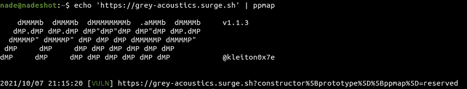
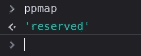
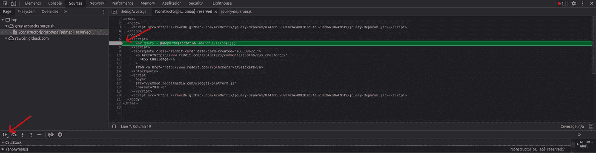
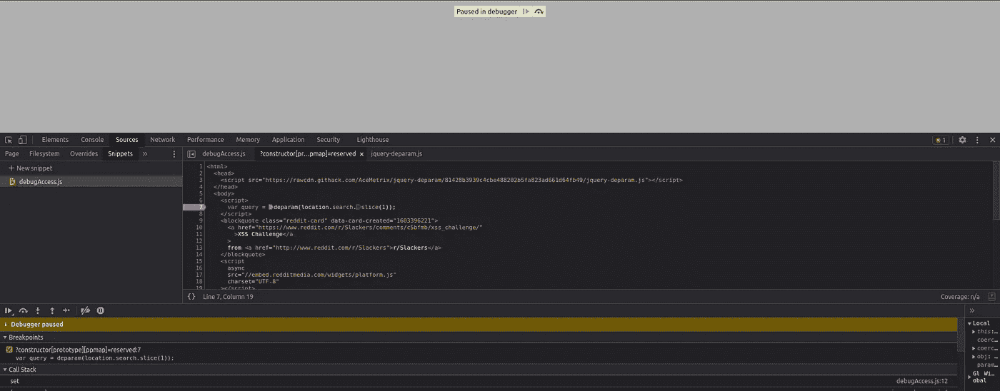
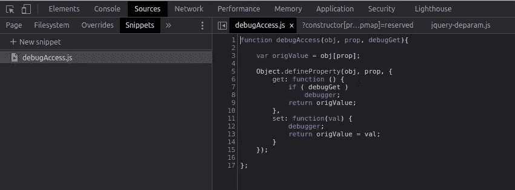
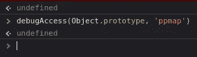
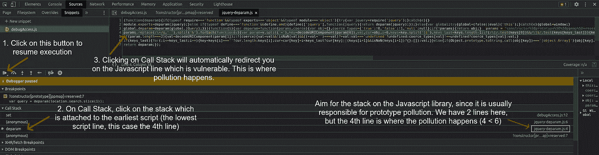
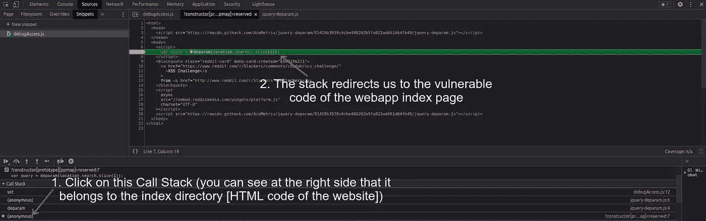

# 寻找 JS 库上的原型污染及其易受攻击的代码

> 原文：<https://infosecwriteups.com/hunting-for-prototype-pollution-and-its-vulnerable-code-on-js-libraries-5bab2d6dc746?source=collection_archive---------1----------------------->


距离我发布 [ppmap](https://github.com/kleiton0x00/ppmap) 已经过去几个月了，因为原型污染漏洞实际上是多么疯狂和流行，所以这个工具并没有很快流行起来。

在这篇文章中，我不会向你介绍什么是原型污染，因为有很多文章/视频比我解释得更好。这篇文章是关于这个主题的几个星期的研究工作，给你带来了新的和创新的想法(当然不是全部)，关于如何大规模扫描 Javascript 包( [npm 包](https://www.npmjs.com/)也是)，以及如何手动调试(对于复杂的 Javascript 代码)来找到客户端原型污染的根本原因。

# 搜索客户端原型污染

对于这种类型的搜索，我们将使用 Chrome/Chromium，因为他们有开发者工具，肯定更适合调试。

该利用从首先发现网站是否易受客户端原型污染开始。我们将使用 [ppmap](https://github.com/kleiton0x00/ppmap) ，它将自动尝试不同的有效载荷来污染全球环境中的变量。将该工具下载到您的本地计算机后，只需使用以下命令在目标网站上运行它，就这么简单:

```
echo '[https://grey-acoustics.surge.sh](https://grey-acoustics.surge.sh)' | ./ppmap
```



ppmap 发现原型污染

很好，让我们打开网站，有效载荷 [ppmap](https://github.com/kleiton0x00/ppmap) 显示为易受攻击([https://grey-acoustics.surge.sh/?)构造函数% 5b prototype % 5D % 5b pmap % 5D =保留的](https://grey-acoustics.surge.sh/?constructor%5Bprototype%5D%5Bppmap%5D=reserved))并打开控制台(在开发者工具上)确认我们是否成功地污染了它。



# 设置断点

是时候找到易受攻击的代码了，为此我们需要转到 **Source** 并在页面的第一个脚本上设置一个断点。这样做的原因是我们不想执行整个 Javascript，因为这样我们就不知道 ppmap gadget 什么时候会被污染。设置断点后，点击“恢复脚本执行”按钮。只需刷新网站即可应用更改，网站应在调试器上**暂停。**



设置断点，然后恢复脚本执行

在这种情况下，第 7 行将是第一个执行的 javascript 代码，因此我们将在那一行放置一个断点。如果我们在控制台上输入 **ppmap** ，会显示为未定义，因为网站卡在断点上，ppmap 还没有被污染。



网站在调试器上暂停

# 在代码片段的帮助下检查何时属性被污染

现在我们必须运行一个片段，你可以从[这里](https://gist.githubusercontent.com/dmethvin/1676346/raw/24cde96c341e524dc8706104afbd0748752c7432/gistfile1.txt)得到它。一旦属性被污染，脚本将设置一个断点(在本例中为 ppmap 属性)。为此，只需转到**源**，然后点击**片段**，通过添加如下图所示的代码创建一个新的:



执行代码片段

执行代码片段，您将在控制台上看到一个“未定义”的输出，这意味着代码片段已经成功运行。

返回**控制台**选项卡，执行以下代码，一旦“ppmap”属性发生污染，将自动设置一个断点。这意味着它会将我们重定向到发生污染的易受攻击的代码:

```
debugAccess(Object.prototype, 'ppmap')
```



在控制台上执行的命令

没有输出，但那完全没问题。

# 寻找原型污染的根本原因

返回到**源**并点击“恢复脚本执行”。这样做之后，整个 javascript 将被执行，ppmap 将如预期的那样再次被污染。在该代码片段的帮助下，我们可以找到 ppmap 属性被污染的确切位置。我们可以点击调用堆栈，您将看到发生污染的不同堆栈。

但是选哪个呢？大多数情况下，原型污染发生在 Javascript 库上，所以应该把目标放在附加到。js 库文件(看右边，就像图片中一样，以了解堆栈附加到哪个端点)。在这种情况下，我们在第 4 行和第 6 行有 2 个堆栈，逻辑上我们将选择第 4 行，因为该行是第一次发生污染的地方，这意味着该行是漏洞的原因。单击堆栈会将我们重定向到易受攻击的代码。



借助 Beautifier，我们可以看到 JS 库易受攻击的代码:

```
params.replace(/\+/g, ' ').split('&').forEach(function(v) {
            var param = v.split('='),
                key = decodeURIComponent(param[0]),
                val, cur = obj,
                i = 0,
                keys = key.split(']['),
                keys_last = keys.length - 1;
            if (/\[/.test(keys[0]) && /\]$/.test(keys[keys_last])) {
                keys[keys_last] = keys[keys_last].replace(/\]$/, '');
                keys = keys.shift().split('[').concat(keys);
                keys_last = keys.length - 1;
            } else {
                keys_last = 0;
            }
```

这不是网站易受攻击的唯一原因，如果我们仔细查看堆栈，会发现还有一个端点 ppmap 受到污染(位于索引 HTML 页面):



HTML 代码的另一个堆栈

下面是索引 HTML 页面的易受攻击代码:

```
var query = deparam(**location.search**.slice(1));
```

如果你有一些 Javascript 的经验，你会直接发现这里的问题。该漏洞利用始于将有效负载注入到用于构建客户端逻辑或呈现应用程序的输入(本例中是 URL 解析)中。最常见的输入来源是 URL 及其不同的属性，如 **location.search**