# 和亚拉一起打猎

> 原文：<https://infosecwriteups.com/hunting-malwares-with-yara-6b451b2ad1a8?source=collection_archive---------2----------------------->

## 恶意软件分析行业中最广泛使用的工具之一的初学者指南。

[](https://www.cybersecurityup.it/i-nostri-blog/cyber-pillole/443-pillole-di-malware-analysis-le-yara-rules+)

Yara 标志

嗨伙计们！

近年来，正如数据显示的那样，我们正在目睹每年造成数十亿美元损失的恶意软件攻击的惊人增长。

[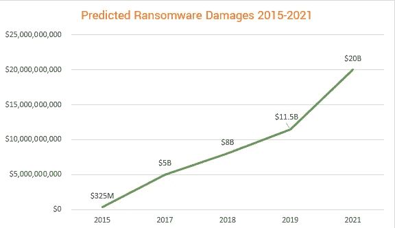](https://securityboulevard.com/2020/02/20-ransomware-statistics-youre-powerless-to-resist-reading/)

我最近对这个世界产生了兴趣，今天我想向大家展示一个恶意软件狩猎的必备工具， **Yara** 。

该工具由一组规则组成，允许我们识别所有与之匹配的文件。
如果你感到困惑，不要担心，甚至当我第一次开始使用它时，我也很困惑。
我们开始吧！

您可以使用“**sudo apt install Yara”***在 Linux 上安装 Yara，并通过以下链接下载 zip 文件在 Windows 上安装 Yara。*

*[发布 VirusTotal/yara GitHub](https://github.com/VirusTotal/yara/releases)*

*为 yara 创建一个文件是非常容易的，你可以简单地创建一个 txt 文件，并将扩展名改为. yar。*

*首先要做的是创建我们的规则，并按照我们喜欢的方式命名。*

*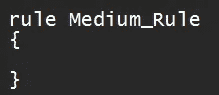*

*接下来，我们必须把元部分在这里，我们可以输入信息，如描述，作者，日期等等。*

*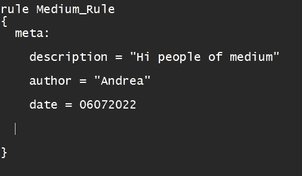*

***注意:Yara 有一个非常大的规则集，我将只列出最重要的规则，但是在文章的最后，我会给你留下文档的链接。***

*请记住，字符串必须始终放在" "*

*现在是弦乐部分。
Yara 在这些文件上使用文件标识。*

*对于外行来说，字符串是可以从二进制文件中读取的文本。*

*以这个 c++文件为例。*

*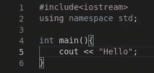*

*一旦编译并执行，它将在控制台上打印“Hello”。*

*如果我们在 Linux 上运行 strings 命令，我们可以看到字符串“Hello”。*

*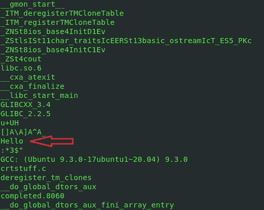*

***注意:你肯定已经注意到了所有其他奇怪的字符串，不要担心它们是正常的，事实上它们是在编译时添加的。***

*让我们假设我们的文件是恶意软件，我们可以添加字符串 hello，因为它允许我们识别我们的文件。*

*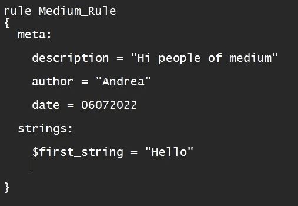*

***注意:字符串需要$才能被声明。***

*现在我们做一些更难的事情。*

*每个文件在开头都有一个精确的字节序列，用来标识文件类型。*

*[文件签名列表—维基百科](https://en.wikipedia.org/wiki/List_of_file_signatures)*

*例如，Linux (ELF)中的可执行文件序列为 7f 45 4c 46 02 01 01。*

*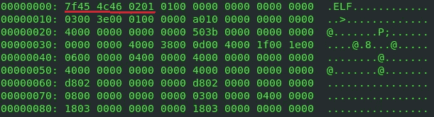*

***注意:在 Windows (MZ)上是 4D 5A。***

*我们可以添加这个十六进制数字序列来避免误报。*

*事实上，如果文件系统中有包含字符串“Hello”的 txt 文件或任何其他扩展名，如果我们不添加神奇的字节，就会被报告，这是我们不希望的。*

*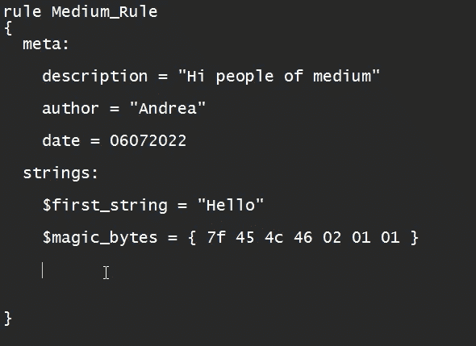*

***注意:十六进制字符串必须放在{ }之间。***

*最后一部分是条件部分。*

*在这里，我们指定定位文件的条件。*

*有几个关键词。*

***And:两个条件都为真时为真。***

*$first_string 和$second_string*

*当两个字符串都存在时标识文件。*

***Or:至少有一个在场时为真。***

*$first_string 或$second_string*

*当至少有第一个或第二个字符串时，它标识文件。*

***任何一个:仅当所有字符串都存在时为真。***

*让我们看一个例子。*

*我们通过使用 or 操作符调用 casual_string 来声明一个无意义的字符串，由于存在字符串“hello ”,我们仍然能够定位该文件。*

*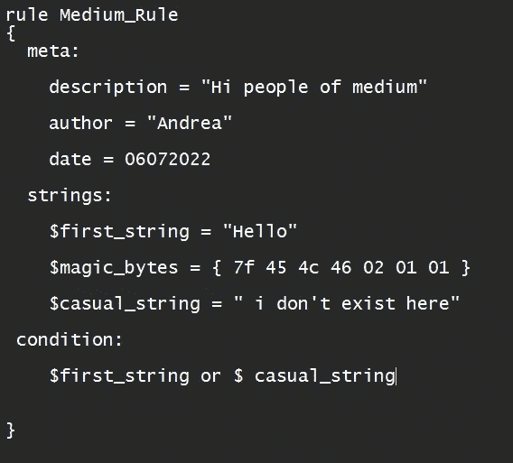*

*另一个非常有用的关键字是“at ”,它用于检查字符串是否出现在指定的偏移量处。*

*偏移量是从文件开始的距离，以字节为单位，因为魔术字节在文件的开始，所以偏移量为 0。*

*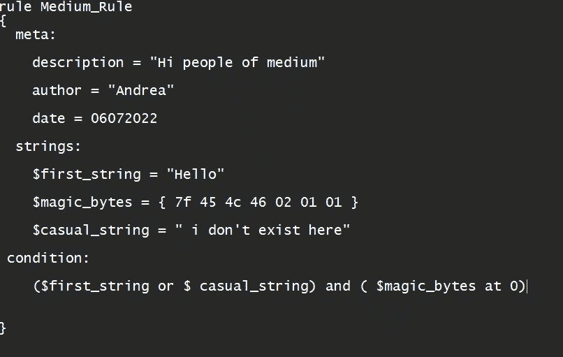*

*现在，让我们试着看看是否一切正常。让我们运行 Yara，正如我们所看到的，这是我们的文件。*

*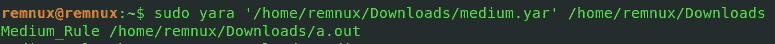*

*如前所述，Yara 是一个非常先进的工具，可能需要一整本书来描述它包含的所有功能，如果你感兴趣，我在这里留下了官方文档的链接。*

*欢迎来到 YARA 文档中心！— yara 4.2.0 文档*

*我特别推荐看看这些模块，因为它们非常有用。*

# *奖金:雅根*

*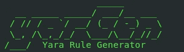*

*随着时间的推移，恶意软件变得越来越复杂和不可预测，手动编写 yara 规则可能是一项非常困难的任务。*

*为此，雅根来救我们了！*

*[GitHub—neo 23 x 0/yarGen:yarGen 是 YARA 规则的生成器](https://github.com/Neo23x0/yarGen)*

*一旦安装完毕，我建议您使用以下命令。*

```
*python3 yarGen.py -a "Your name" --excludegood -z 2 -m 'YourDirectory' -o Yourfile.yar*
```

*   *-a:用于将作者的名字赋予规则。*
*   *— excludegood: yarGen 可能会将非恶意字符串放入规则中，为了避免这种情况，我们使用了此标志。*
*   *-z: yarGen 给字符串打分，分数越高，字符串越有可能是恶意的，为了避免误报，我们将最低分设为 2。*
*   *-m:用于指定文件所在的目录。*
*   *-o:用于输出文件。*

***注意:yarGen 工作在目录上，而不是文件上，所以确保文件是目录中的唯一文件，以避免不便。还要记住，工具不能完全代替人，所以学习如何为自己手动编写规则也是很好的。***

# *结论*

*我希望这篇文章对您有所帮助，并帮助您更好地理解这个工具提供的潜力。*

*我计划带来更多关于恶意软件分析的文章，因为我相信这是一个仍然没有得到足够重视的领域。*

*下一篇文章再见，再见伙计们！*