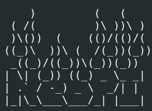
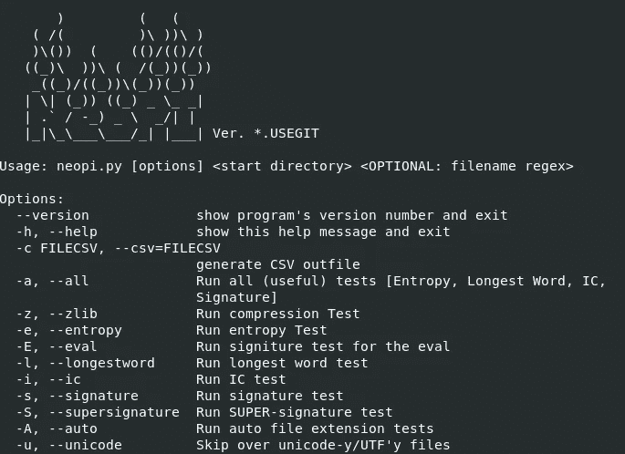
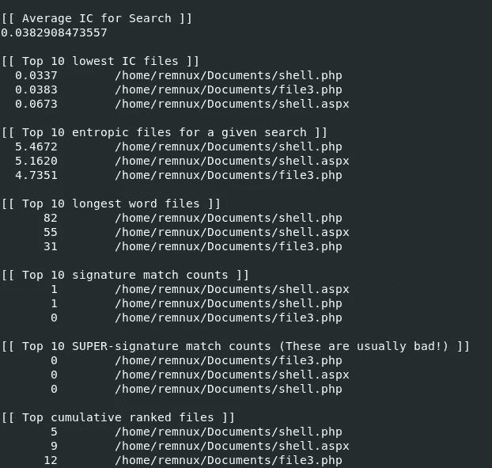

# 用 NeoPI 搜索 webshell

> 原文：<https://infosecwriteups.com/hunting-webshell-with-neopi-62b76ce10d6b?source=collection_archive---------0----------------------->



嗨伙计们！

在这篇短文中，我想展示 NeoPI 工具的功能，它是一个 python 脚本，通过统计可以检测恶意的 webshells。

开始吧！

要下载该文件，请克隆以下存储库。

```
git clone https://github.com/Neohapsis/NeoPI.git
```

要运行该工具并查看标志，请使用以下命令。

```
python neopi.py -h
```



让我们来看看这个工具的一个实际应用。

通常，web 服务器中的文件存储在/var/html/www 目录中。

我将把 3 个 php 文件放在目录中，其中只有一个是恶意的，还有一个 aspx shell，看看这个工具是否能检测到任何东西。

注意:为了方便起见，我将使用 Documents 文件夹，而不是/var/www/html。

我将使用下面的命令。

```
python neopi.py "Your directory" -a -A
```

*注意:永远记住使用-A 标志只分析扩展名可能有害的文件，否则该工具将花费很长时间来分析所有文件。*

这是输出。



*注意:还有另一个 PHP 文件，但是该工具识别出它没有恶意，并将其从输出中排除。*

正如我们所看到的，该工具已经成功地实现了它的意图，请记住，数字越低，该文件是恶意的可能性就越高。还要密切注意签名计数(通常 1 是恶意的)。

在结束之前，我想对这个工具的使用提出一个前提。

可能会发生一些模糊的 webshells 不容易被检测到的情况，所以我还是建议进行手动文件审查。

感谢您阅读我的文章。

到下一篇，拜拜！

*来自 Infosec 的报道:Infosec 上每天都会出现很多难以跟上的内容。* [***加入我们的每周简讯***](https://weekly.infosecwriteups.com/) *以 5 篇文章、4 个线程、3 个视频、2 个 Github Repos 和工具以及 1 个工作提醒的形式免费获取所有最新的 Infosec 趋势！*