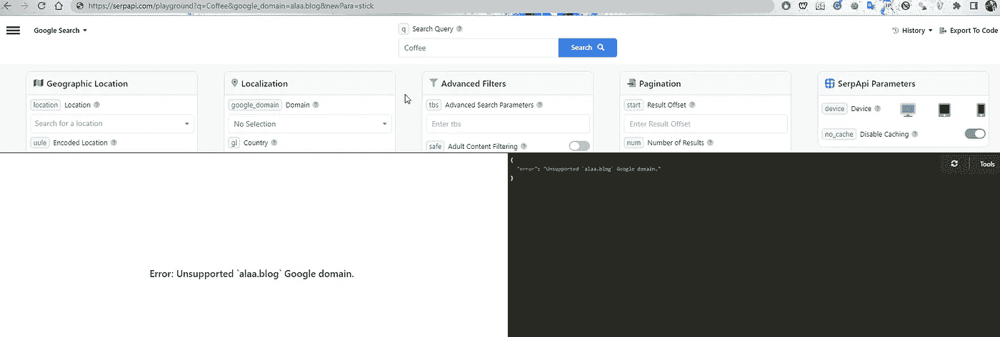
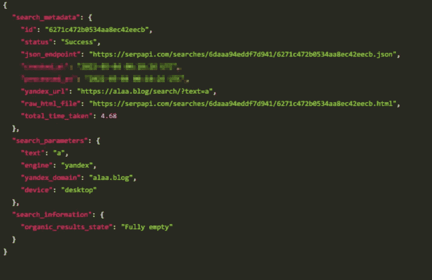
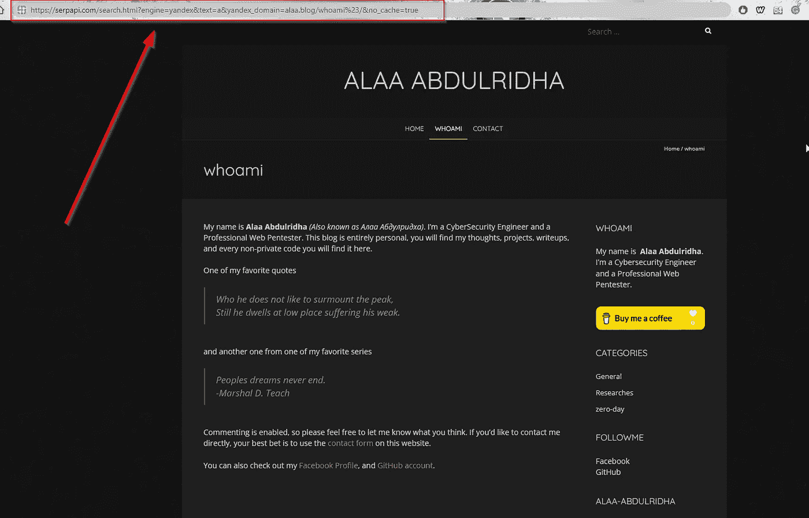
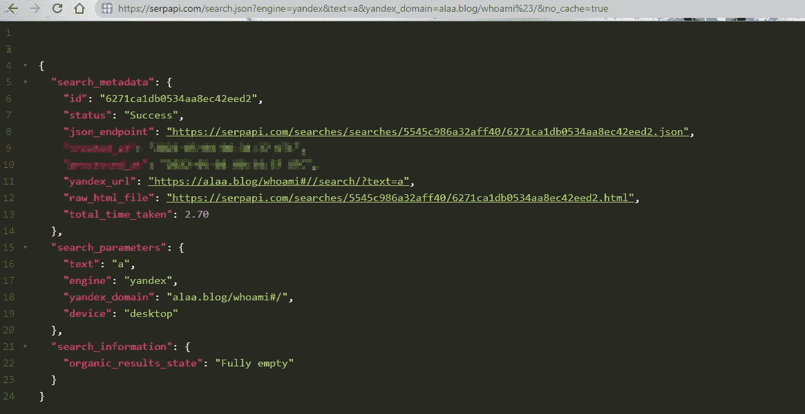
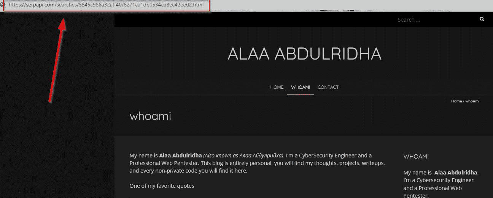
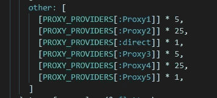

# 我有 1%的机会黑掉这家公司

> 原文：<https://infosecwriteups.com/i-have-1-chance-to-hack-this-company-1044879f41a9?source=collection_archive---------0----------------------->


我只有 1%的机会利用 SSRF 漏洞黑掉这家公司

今天我将与你分享我在 [SerpApi，LLC 上发现的第一个漏洞。](https://serpapi.com/)

我在完成在 [SerpApi，LLC 的入职流程后，就发现了这个漏洞。](https://serpapi.com/)

# 目录

— [目标。](#fe91)
——[将漏洞武器化。](#b6ca)
——[剥削。](#12f9)
— [影响和严重程度。](#3bb7)
— [报告时间线。](#9823)
——[结局。](#583a)

# **目标**

SerpApi 是一个实时 Api，用于访问谷歌搜索结果和其他搜索引擎。他们处理代理，解决验证码，解析所有丰富的结构化数据， [SerpApi](https://serpapi.com/) 是这个行业的全球第一。

我真的很想找到一个漏洞，一个关键的漏洞！..是的，我可以访问该公司的代码，但代码非常庞大，我刚刚加入，所以我决定先从黑盒方法开始(不看代码进行测试)。

我注意到了他们的 API URLs

对于雅虎 API : `[https://serpapi.com/search?engine=yahoo&p=Coffee&yahoo_domain=be](https://serpapi.com/search?engine=yahoo&p=Coffee&yahoo_domain=be)`

对于谷歌 API: `[https://serpapi.com/search.json?engine=google&q=Coffee&google_domain=google.com](https://serpapi.com/search.json?engine=google&q=Coffee&google_domain=google.com)`

等等...

我已经决定检查每个 API 的域，并尝试用另一个主机名替换该域，但不幸的是，每次我这样做时，都会收到一个错误，指出该域不受支持！



谷歌搜索 API — SerpApi，LLC。

我开始变得绝望，我打算放弃，测试了超过 5 或 6 个使用`xx_domain`参数的 API，但没有运气。

直到我穿越了 Yandex！


SerpApi Playground — HTML 和 JSON API 结果


是的，我做到了

看来对参数`yandex_domain`没有保护。现在我开始变得非常兴奋！

让我们开始稍微分析一下目标，这样我们就可以用正确的方式利用这个漏洞。

# **将漏洞武器化**

让我们暂时忘记 HTML，专注于 JSON 输出，它看起来包含了非常丰富的有用信息:



Yandex 搜索 API — SerpApi，LLC。

如果你看一看`yandex_url`，你会注意到几件事:

*   URL 协议模式是`https://`——我们不能控制也不能改变它。
*   网址总是以`/search/?text=a`结尾。

我试过用#绕过网址，但是没用所以我试着编码直接发给操场，但是没用，看起来操场在逃避它！

所以我尝试使用端点`search.html`直接请求 API
我使用 urlencode 和`/`最终结果将是`%23/`猜猜看？

是的，效果很好。:D 现在我们在塞尔帕皮有限责任公司拥有一个完整的 SSRF。



服务器端请求伪造 SerpApi，LLC。

我们使用`#`来绕过硬编码的端点`/search/?test=a`。

问题是，我们不能绕过协议`https://`，如果我们绕过它，我们可以使用`file:///`来读取本地文件，或者任何其他协议来利用它作为适当的 SSRF。

我所想的就是把它升级到远程代码执行……
仅仅一个请求怎么可能把一个 [SSRF](https://portswigger.net/web-security/ssrf) 升级到 [RCE](https://www.bugcrowd.com/glossary/remote-code-execution-rce/) ？

# **剥削**

嗯，我有很多步骤要走。

*   升级到 [XSS](https://portswigger.net/web-security/cross-site-scripting) 然后接管账户。
*   尝试找到真正的服务器 IP，并希望它托管在 AWS 或 Digitalocean 等云上。

我注意到，我对任何页面的每个请求都缓存在公司的本地服务器上，所以当我从 JSON 请求我的页面时，我将获得页面的缓存 HTML 副本。



SerpApi JSON 结果

这就是缓存的 HTML 页面。



HTML 结果 serpapi

此时，我可以缓存任何带有 [XSS](https://portswigger.net/web-security/cross-site-scripting) 和 JS 有效载荷的页面，并简单地将链接发送给任何管理员来劫持他的帐户。

然而，这不是我的目标，我想要更多，所以我继续做了一些调查，我通过使用 Shodan.io 发现 https://serpapi.com 的[正在使用:D 的数字海洋，这意味着我可以访问这个神奇的链接，并且可以完全访问](https://serpapi.com)[的元数据。](https://docs.digitalocean.com/reference/api/metadata-api/)

我没有继续下去，因为它太明显了，我继续阅读代码，看看它是如何工作的。

因此，当我请求任何 URL 时， [SerpApi](https://serpapi.com/) 引擎将尝试使用私有代理来访问该 URL(不是 Digitalocean ),至少我是这样认为的:



SerpApi 代理选择器

通过查看，我意识到当发送请求时，应用程序将使用外部商业代理来发送大多数请求，当然，除了(1%) `direct`之外，这意味着只有一个来自 Digitalocean。

所以通过简单的计算:

```
5 + 5 + 20 + 1 + 5 + 25 + 1 = 62
1/62=0.016 
Direct = 0.0016 
```

大约我们有`1%`或更少的时间来获得正确的请求。

幸运的是， [SerpApi](https://serpapi.com/) 正在代理上进行循环，不管百分比如何，直到目标 URL 可以工作或者继续重复请求。

# **影响和严重性**

该漏洞具有高可用性和低复杂性。

由于这些事实，我可以认为严重性**至关重要**。

这里的影响是未经验证的 [SSRF](https://portswigger.net/web-security/ssrf) ，通过与 [XSS](https://portswigger.net/web-security/cross-site-scripting) 链接，可以升级为 ATO 攻击者可以利用 [SSRF](https://portswigger.net/web-security/ssrf) 发送内部请求来访问数字海洋元数据 API。

# **报告时间表**

-2021 年 3 月 4 日报道-凌晨 4 点 18 分。
——2021 年 3 月 4 日开审——上午 6:37。
——定格在 2021 年 3 月 4 日——上午 7 点 24 分。
-2021 年 3 月 4 日-上午 9:00 确定。

# **结局**

在 Twitter 上关注我，我会发布我的最新文章: [@alaa0x2](https://twitter.com/alaa0x2)

也可以关注 [SerpApi，LLC。](https://serpapi.com/)在 Twitter 上: [@serp_api](https://twitter.com/serp_api)
要报告安全漏洞，你可以发送给[contact@serpapi.com](mailto:contact@serpapi.com)