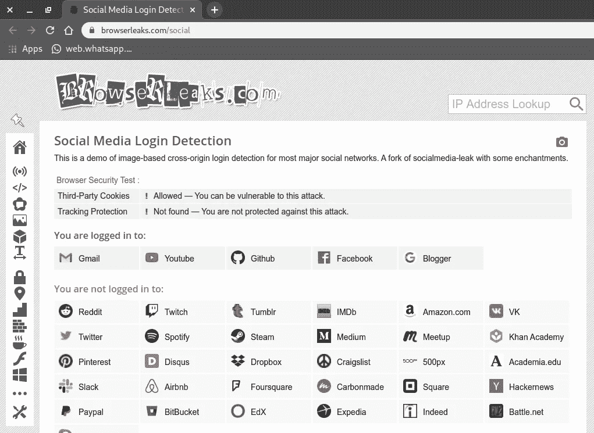
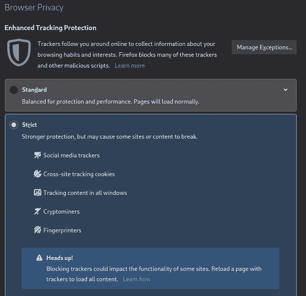
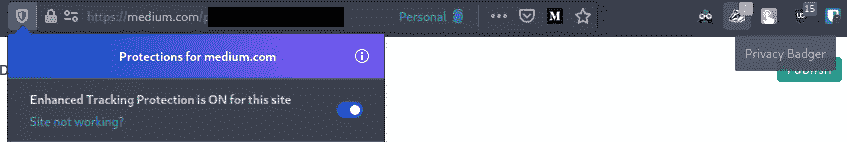
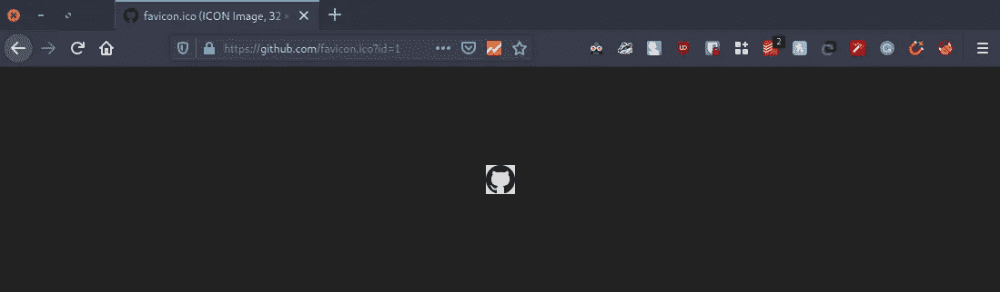
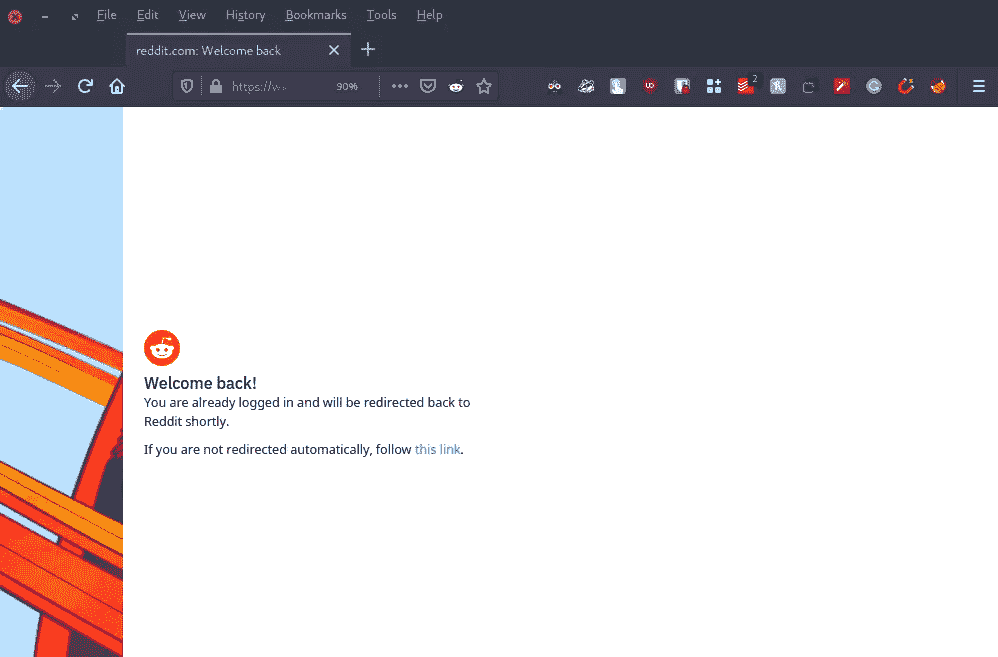

# 我知道你登录的所有社交媒体网站

> 原文：<https://infosecwriteups.com/i-know-all-the-social-media-websites-you-are-logged-into-be5c6307d439?source=collection_archive---------0----------------------->

好吧，在我们开始之前，我要坦白一件事。我可能会点击引诱你进入这篇文章(这是我从我的偶像 PewDiePie 和野兽先生那里学到的技巧)，因为我实际上不知道你登录的**【所有】**社交媒体网站，只知道那些著名的网站(因为我们必须手动准备每个网站的链接，所以我们只对著名的网站使用它)。

# 我如何知道你登录了哪些网站？

这是一个相当常见的漏洞，已经存在多年了。在谷歌上简单搜索一下，就能找到 2012 年甚至 2008 年的文章。由于这个漏洞还没有被修复，它显然是一个特性，所以我在整篇文章中称它为*“特性”*。

# 我登录了哪些网站？

要查看您登录的网站，请访问展示此*功能的网站。*

我登录的社交媒体网站的详细信息。

你可以自己检查一下，看看自己是否容易受到这个*【特性】*的攻击。

 [## 社交媒体登录检测

### 这是一个基于图像的跨原点登录检测的演示，适用于大多数主流社交网络。

browserleaks.com](https://browserleaks.com/social) 

这里有更多关于[浏览器 Leaks](https://browserleaks.com/) 的内容。这是对他们的描述，直接取自他们的网站:

> BrowserLeaks 是关于浏览隐私和网络浏览器指纹的。在这里，您会发现一个 web 技术安全测试工具的图库，它将向您展示什么样的个人身份数据会被泄露，以及如何保护自己免受泄露。

# 您的帐户详细信息也可见吗？

不。唯一看得见的是有人登录了网站。

所以这意味着你是安全的…或者你是吗？有人知道你是否登录了社交媒体网站，这一事实可能足以应对各种社交工程攻击。

# 如何保护自己

## 切换到 Mozilla Firefox

Mozilla Firefox 有一个内置的工具，可以保护你免受各种跟踪机制的影响，防止*“社交媒体泄露”*是它们提供的众多保护措施之一。

以下是 Firefox 设置的*浏览器隐私*部分的截图:

## 使用隐私獾之类的扩展

不想换成火狐？很公平。你可以像隐私獾一样使用扩展。下面是从他们的网站上无耻地复制的关于这个扩展的描述:

> 隐私獾**自动学习屏蔽隐形追踪器**。Privacy Badger 通过观察你浏览网页时哪些域似乎在跟踪你来学习，而不是保留阻止哪些内容的列表。
> 
> 隐私獾会在你浏览的时候发送[不要跟踪信号](https://outgoing.prod.mozaws.net/v1/9945620a688bfc1f32e4ecd44d4e6d6006bfb763b04c194293b87fa00acc9446/https%3A//www.eff.org/issues/do-not-track)。如果追踪者无视你的愿望，你的獾会学会阻止他们。一旦隐私獾在三个不同的网站上看到相同的追踪器，它就开始阻止。
> 
> 除了自动跟踪拦截之外，隐私獾取消了对[脸书](https://outgoing.prod.mozaws.net/v1/74bc8198d1396c6b1a333f38763229b5199c5f5e0220c6814bafe0ee27045f20/https%3A//www.eff.org/deeplinks/2018/05/privacy-badger-rolls-out-new-ways-fight-facebook-tracking)、[谷歌](https://outgoing.prod.mozaws.net/v1/91c6a37074848da9be49ac657dd8a9847d2cdc3e26faae187b8e6829ef186cca/https%3A//www.eff.org/deeplinks/2018/10/privacy-badger-now-fights-more-sneaky-google-tracking)和[推特](https://outgoing.prod.mozaws.net/v1/3eef7d09b705783117c73b006602199c1104605b8adbb6dd5387727537e025d0/https%3A//www.eff.org/deeplinks/2017/08/privacy-badger-makes-twitter-little-less-creepy)的链接点击追踪，还会有更多的隐私保护措施。

如果你想知道像我这样没有安全感的人用什么，答案是两者都用。

## 禁用第三方 cookies

以上方法足以保护您免受此漏洞的攻击。但是，如果您担心您的隐私，并希望采取更严格的方法来保护自己，您可以查看这篇关于如何禁用第三方 Cookies 的文章。

 [## 如何在每个网络浏览器中阻止第三方 Cookies

### 自从网络出现以来，网络 cookies 就一直存在，而且在很大程度上，它们有一个有用的目的…

www.howtogeek.com](https://www.howtogeek.com/241006/how-to-block-third-party-cookies-in-every-web-browser/) 

# 这个功能到底是如何工作的*？*

*现在，如果您不理解这一部分，完全没关系。这篇文章的主要动机是让你知道你在网上很容易受到攻击，但是你可以通过几个简单的步骤来保护自己，这已经在网上讨论过了。*

为了理解它是如何工作的，让我们看看下面这个例子，我在我们心爱的 Github 上执行了这个。

让我们逐一查看`img`标签的每个组件:

1.  `style=”display:none;”` —这有助于不显示图像标签。因此，用户看不到该标签。所以我们可以秘密收集信息。
2.  `onload=”show_login_status(‘Github’, true)` —如果从源加载图像，则加载 JavaScript 函数`show_login_status`。JavaScript 函数是一个简单的 if-else 语句，根据作为第二个参数传递的布尔值，无论用户是否登录，它都会在控制台中打印出来。
3.  `onerror=”show_login_status(‘Github’, false)` —如果图像不是从源加载的，则调用`show_login_status`。
4.  `src=”https://github.com/login?return_to=https%3A%2F%2Fgithub.com%2Ffavicon.ico%3Fid%3D1"`——有趣的部分来了。让我们来看看这个链接是如何构成的。
    `https://github.com/login` + `?return_to=` + `https%3A%2F%2Fgithub.com%2Ffavicon.ico%3Fid%3D1`

第一部分将我们带到网站的登录页面。现在，通常如果你登录，你会被自动重定向到主页。但是我们通过使用`?return_to=`改变了这一点。这确保被重定向到值`https%3A%2F%2Fgithub.com%2Ffavicon.ico%3Fid%3D1`。

如果我们清理 url ( `https://github.com/favicon.ico?id=1`)并打开它，下面是它的样子

所以，如果我们登录到 Github，你会被直接重定向到 favicon。这意味着在图像标签中，由于加载了图像，所以会调用`onload`的函数。因此，我们知道您登录了 Github。

如果您没有登录，您将被重定向到登录页面。在这种情况下，将不会加载 favicon，因此在图像标签中，将调用函数`onerror`。

# 网站如何保护他们的用户？

根据该漏洞的结构，如果触发`onerror`，网站可以欺骗该漏洞，即使用户已经登录。这正是像 Reddit、Twitter(和 Medium*)这样的网站所做的。比如我们来看看 Reddit。

Reddit 的链接如下:`[https://www.reddit.com/login/?dest=https%3A%2F%2Fwww.reddit.com%2Ffavicon.ico](https://www.reddit.com/login/?dest=https%3A%2F%2Fwww.reddit.com%2Ffavicon.ico)`

现在，如果你登录到 Reddit，而不是立即重定向到`www.reddit.com/favicon.io`，你会被带到一个登录页面，然后被重定向。因为你被带到登陆页面，这意味着图像没有被加载，因此`onerror`被调用。

用户登录后的登录页面

最后，我感谢您花时间阅读这篇文章，并采取措施保护您的隐私。干杯！🍺

## 现在，让我无耻地要求你

在 [Github](https://github.com/harshitm98) 、 [Twitter](https://twitter.com/fake_batman_) 上关注我，或者在 [LinkedIn](https://linkedin.com/in/harshitm98) 上联系我。

# 参考

我想重申，这不是什么新鲜事，早在 2008 年就已经发布了。以下是一些参考资料:

[https://moz . com/blog/visitor-social-network-log in-status-Google-analytics](https://moz.com/blog/visitor-social-network-login-status-google-analytics)

[https://blog . jeremiahgrossman . com/2008/03/log in-detection-who-problem-is-it . html/](https://blog.jeremiahgrossman.com/2008/03/login-detection-whose-problem-is-it.html)

[https://www . tomanthony . co . uk/blog/detect-visitor-social-networks/](https://www.tomanthony.co.uk/blog/detect-visitor-social-networks/)

*关注* [*Infosec 报道*](https://medium.com/bugbountywriteup) *获取更多此类精彩报道。*

 [## 信息安全报道

### 收集了世界上最好的黑客的文章，主题从 bug 奖金和 CTF 到 vulnhub…

medium.com](https://medium.com/bugbountywriteup)