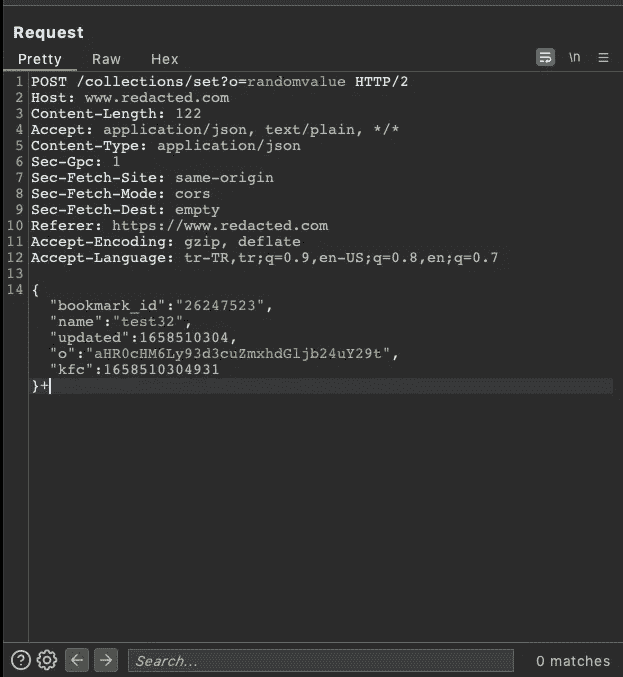
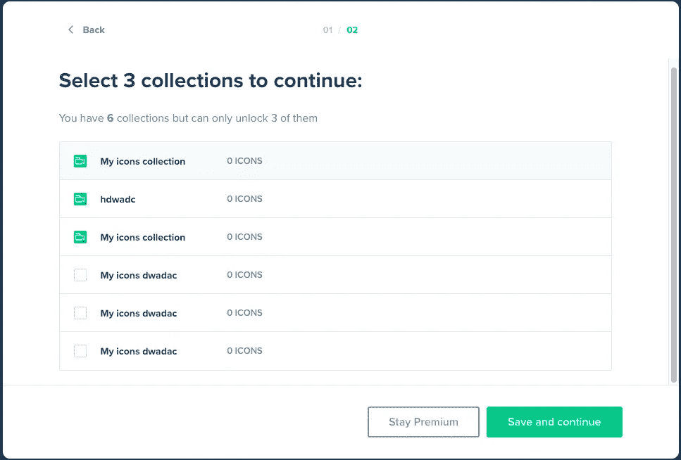
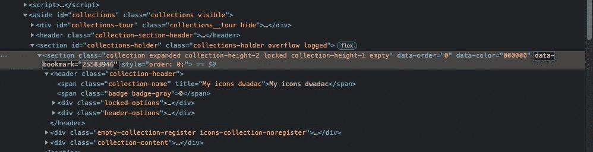
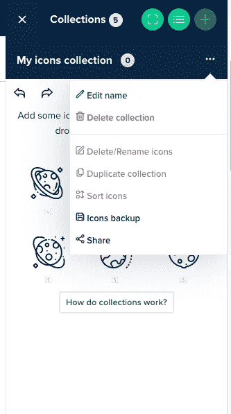
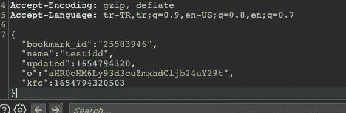
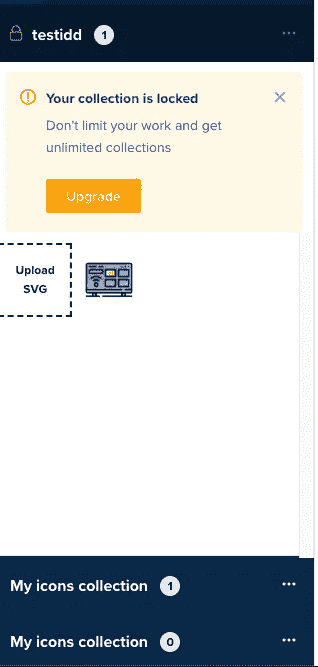

# 我的意思是，我的身份不仅仅是别人的身份

> 原文：<https://infosecwriteups.com/i-mean-idor-is-not-only-about-others-id-2d26115072ba?source=collection_archive---------0----------------------->

嗨伙计们！在这篇文章中，我将谈谈我发现的漏洞，以拓宽您对 IDORs 的看法。

像往常一样，我不能提供公司的信息，因为他们有一个私人的 bug 赏金计划。所以，让我们称它们为“修订的”。这也是一篇简短的报道，但我认为它是可以理解的。那么，我们开始吧。

**预知**:在编校公司，自由用户最多可以同时创建 3 个列表。如果您发送创建三个以上列表的请求，网站将授予您选择三个列表并锁定第四个和其他列表的权利。此外，不能管理、添加或删除、共享或重命名锁定列表。

我们来分析一下正常的流程。

首先，我提交了一个创建列表的请求，并审查了我遇到的请求。

首先引起我注意的是 bookmark_id 参数中可能存在 IDOR。但是我看不到其他用户的 bookmark_id 值，他们的 id 值也没有增加。无论如何，我也从我的第二个帐户尝试了 IDOR。我发现了 403 禁忌。

这就是为什么我想到了我在预知中注意到的情况。我创建了一个列表，发给复读机，看我上面说的流程。我用不同的名字重新提交了申请，并增加了名单。我的主要目标是看看我是否还能通过 IDOR 检查锁定列表。

正如我们所料，我回到网站，弹出了一条消息。该网站说，我只能有三个上市，因为我不是溢价。

于是，我选择了三个列表，看到另外三个列表都是自动锁定的。

我试图在不拦截请求的情况下操作锁定列表，但没有成功。我无法将图标添加到锁定列表、编辑其名称以及共享它。我只有删除它们的权利。

现在是时候回到 bookmark_id 参数了。

我选择了一个目标锁定列表，并通过 DevTools 复制了 bookmark_id 值。

我回到解锁列表，选择了一个。我打开了拦截器，发送了一个改名请求。

我再次遇到了相同的请求，并用我复制的锁定列表的值替换了 bookmark_id 的值。

答对了。我可以重命名锁定列表。我对其他选择做了同样的事情。我更改了锁定列表的名称，添加了一个图标。最重要的是，即使列表被锁定，我也可以与其他人分享。该公司将 bookmark_id 值直接添加到 URL 路径中，以导航到列表。因此，即使列表被锁定，我也可以使用 redacted.com/lists/路径<<bookmarkid>与其他人分享它。</bookmarkid>

因此，我能够像普通列表一样使用和共享它，即使列表被锁定。我的猜测是，该公司不认为他们应该为这一功能设置一个单独的安全程序，尽管攻击场景中的所有列表和 id 都是我们的，但 IDOR 确实发生了。

目前就这些。感谢阅读。下次再见了！

你可以在推特上关注我:[https://twitter.com/canmustdie](https://twitter.com/canmustdie)

*来自 Infosec 的报道:Infosec 上每天都有很多事情发生，很难跟上。加入我们的每周简讯，以 5 篇文章、4 个线程、3 个视频、2 个 Github Repos 和工具以及 1 个工作提醒的形式免费获取所有最新的 Infosec 趋势！*