# IDE - TryHackMe 书面报告

> 原文：<https://infosecwriteups.com/ide-tryhackme-writeup-b0f4922c80f?source=collection_archive---------0----------------------->

大家好，今天我们将在 TryHackMe 的 IDE 房间进行讨论。它被评为简单，房间的描述说:“一个简单的盒子来提高你的计数技能！”

因此，在 nmap 扫描中，我们获得了四种服务:

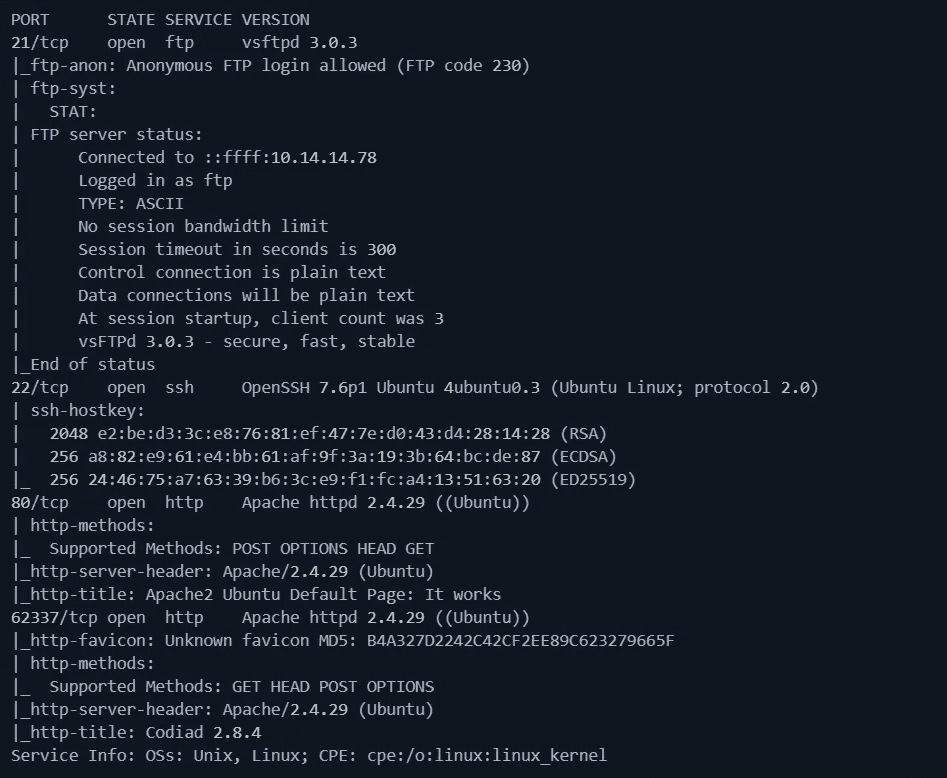

Nmap 输出

# FTP 服务器:

根据 nmap 扫描，允许匿名登录。使用以下凭证登录:**匿名** : **匿名**。

登录后，我们必须遍历到`...`目录，然后下载名为`-`的文件。要下载该文件，只需使用`get ./-`命令。

为了方便，下载后我把它改名为 ftp-file。ftp 文件的内容:

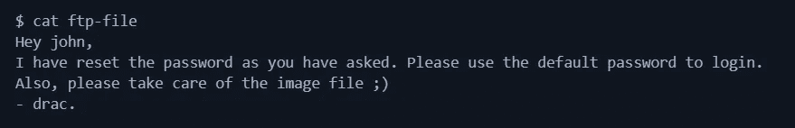

这暗示了我们两件事:

1.  至少有两个不同的用户名为`drac`和`john`。
2.  用户`john`的密码是默认密码(因此很容易被破解)

# 网络服务器

*   端口 80:它有默认的 Apache 网页。经过目录破坏，我们找不到任何有用的东西。
*   端口 62337:我们得到一个 Codiad 的登录页面(版本:2.8.4)。Codiad 是一个基于 web 的 IDE 和代码编辑器。

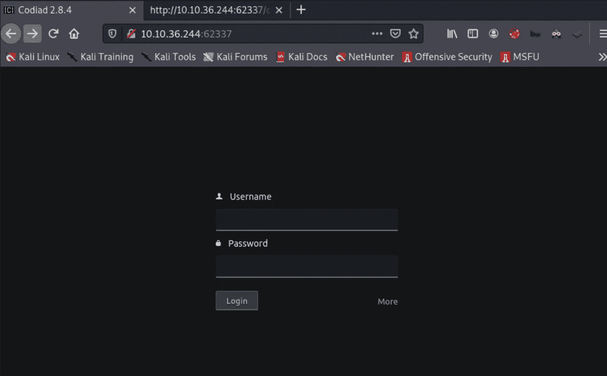

从上面我们知道用户`john`有默认密码。我尝试了一些密码，并能够使用凭证登录:**约翰** : **密码**。

在浏览网站时，我用绝对路径`/var/www/html/codiad/xplo1t`创建了一个项目

# 搜索漏洞:

我用 searchsploit 在 Codiad 中搜索任何已知的漏洞。

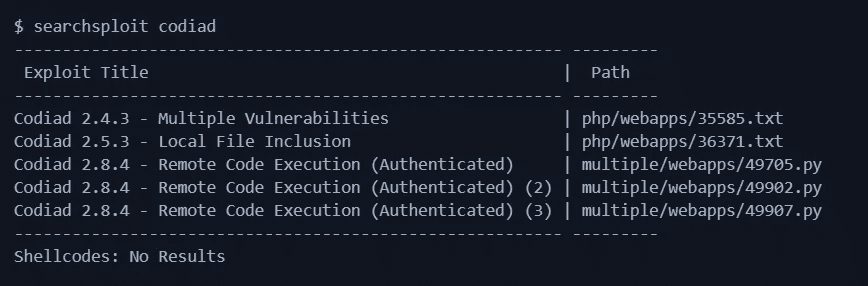

对我来说，经过一些调整后，最后一个漏洞发挥了作用。

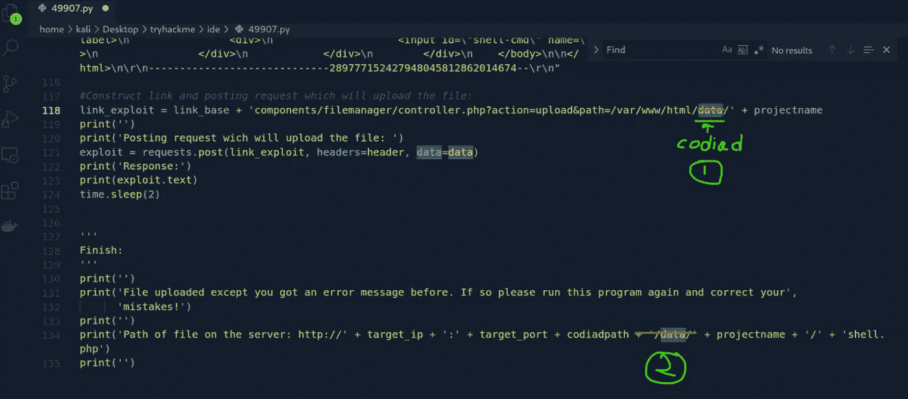

不得不在漏洞上改变这些

运行漏洞。

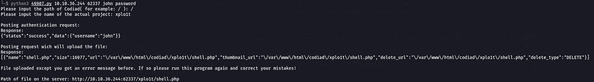

将 Codiad 的路径设置为`/`，将实际项目的名称设置为`xplo1t`(我们之前已经创建了一个同名的项目。记得吗？)这将在`/xplo1t/shell.php`中上传一个 webshell `shell.php`

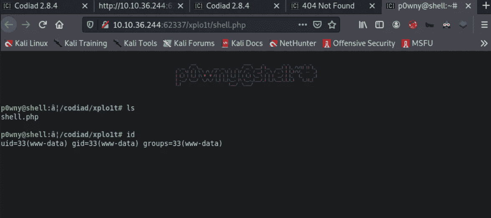

我们得到一个漂亮的网络外壳

我们现在有一个外壳作为`www-data`为了得到一个合适的外壳，我使用了一个来自[revshells.com](https://www.revshells.com/)的反向外壳。
在用户`drac`的`.bash_history`文件中，我找到了密码。

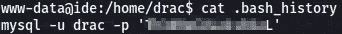

使用此密码切换到 drac(密码重用)。用户`drac`可以作为 sudo 运行如下:

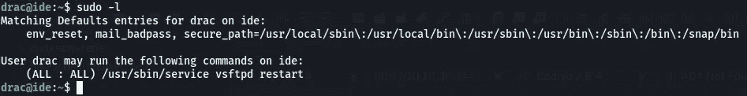

检查与 vsftpd 服务相关的文件:

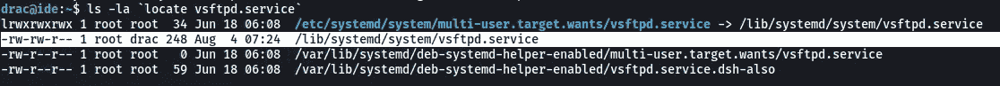

文件`/lib/systemd/system/vsftpd.service`可由`drac`写入。让我们改变服务文件，使`/bin/bash`成为 SUID，这样我们就可以得到根。

我们可以这样做:

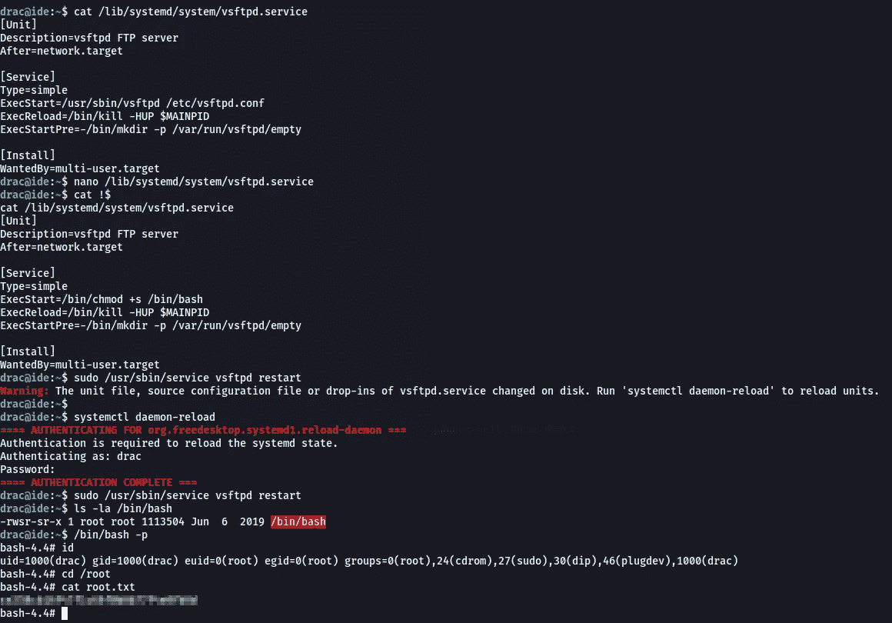

Pwned！

我们现在拥有这个系统。如果你被困在这个房间里，希望对你有帮助。如果您对本演练有任何问题或有任何建议，请告诉我。

在推特上联系我，电话是 [@manash036](https://twitter.com/manash036)

再见👋