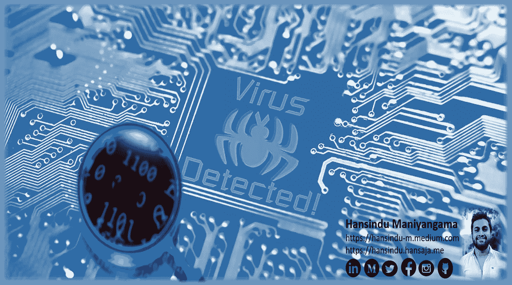
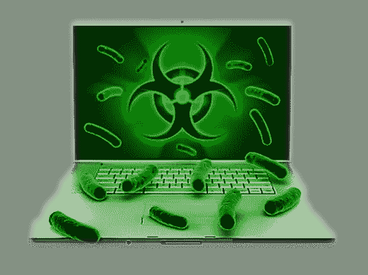
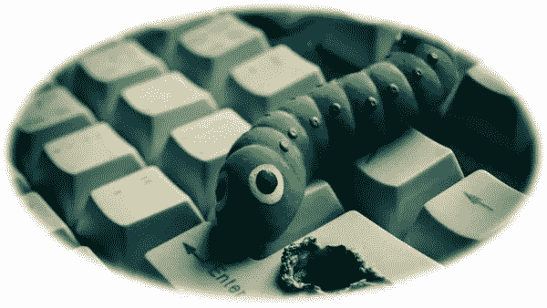

# 识别恶意软件威胁:恶意软件术语(第 1 部分:病毒和蠕虫)

> 原文：<https://infosecwriteups.com/identify-malware-threats-malware-terminology-part-1-viruses-and-worms-24fbd0a6e9f7?source=collection_archive---------1----------------------->

随着世界上新兴技术的发展，对 IT 行业网络安全的主要影响是恶意软件。随着新技术的发展和更好的安全实现，恶意软件也与新技术保持一致。所以，我决定在我的博客中写下什么是恶意软件，恶意软件的类型是什么…我相信在即将到来的 cybersecurity🥰挑战中提高你的进一步知识会很有趣

因此，我们要回答的问题是，什么是恶意软件，那是恶意软件，我们如何防范它？我们要做的第一件事是定义它。如果我从什么是恶意软件的正确定义开始会更好。

*通常是秘密插入系统的程序，目的是破坏受害者数据、应用程序或操作系统的机密性、完整性或可用性，或者以其他方式骚扰或扰乱受害者。*(NIST 就是这样定义恶意软件的)

单纯；🐱‍💻恶意代码或恶意软件是在主机上运行的任何不受欢迎或未经批准的程序，用于扰乱活动或利用主机资产为自己谋利。

## 哪种计算机系统最担心这种恶意软件威胁？

*   像网络浏览器这样的应用程序
*   图形软件
*   文字处理器
*   内核级程序
*   实用程序，如备份软件、编译器和固件等。

后期恶意软件攻击努力在主机上保持隐蔽，利用资产进行潜在用途，例如，派遣管理攻击，获取过于敏感的个人信息和商业信息。其中一些尝试是通过恶意网站或垃圾邮件和网络欺骗进行的。
恶意软件没有普遍接受的分类。但是我选择了最常见的恶意软件分类。

*   第一种是基于恶意软件第一次传播到目标的方式
*   下一个是恶意软件如何在目标上执行有效负载/操作

在传播机制下的上述分类中，包括像病毒、蠕虫这样的恶意软件。在有效载荷系统损坏，机器人，网络钓鱼，间谍软件包括在内。那么，让我们看看这些恶意软件的类型是什么…

🛑 ***病毒*** :-它是一种恶意代码，通过自我复制的方式从一台电脑传播到另一台电脑，并附着在文件上。应该注意的是，这种自我复制需要人类的互动。这种恶意代码可以是感染现有程序的机器代码，也可以是用于支持数据文件的脚本代码。当被感染的代码被执行时，病毒也会被执行。此外，由于它的复制特性，它很难从系统中删除。此外，它使用的策略，如加密和复制自己，使反病毒更难找到。例如，这类病毒被称为多态病毒。

病毒在其生命周期中有四个阶段。

**1** 。**休眠阶段**:病毒在这个阶段是不活跃的。但是病毒已经进入了目标电脑系统。它等待触发命令。这个触发器可以是任何东西，比如预定义的日期、磁盘容量超过其限制等等。注意所有的病毒都有这个阶段。

**2。传播阶段**:在这个阶段，病毒会开始将自己的副本插入磁盘或某些系统区域。这些拷贝可能与检测结果相同，也可能不同。每个被感染的程序都包含病毒的克隆体。

**3。触发阶段:**在这个阶段，病毒被激活执行其指定的功能。

**4。执行阶段:**在这个阶段病毒的有效载荷被释放，功能被执行。也许最终用户能够注意到系统中的损坏。它会导致敏感数据和程序的破坏。

根据(Aycock，J，2006)所述，该病毒由三个组分组成。

图片由 HiClipart 提供

👉**传染媒介**:是病毒传播或扩散的机制；允许它复制。

👉**逻辑炸弹/触发器**:决定有效载荷何时启动或何时交付的时机或条件。

👉**有效载荷**:可能需要损失或伤害，可能需要良性但可见的活动。

当谈到可执行病毒时，有两种类型，

*   一个是前置或后置到某个可执行程序。这个在攻击者中更受青睐。预挂起意味着它首先执行病毒代码，然后执行原始程序。在后挂起中，它首先执行原始代码，然后执行病毒代码。
*   还有一个是嵌入到一些可执行程序里的。

## 什么是宏或脚本代码病毒？

宏病毒会感染用于宣传多种类型的消费者记录中的活动内容的脚本代码。它感染活动内容是最常用的应用程序。任何支持使用宏的应用程序的系统都可能像(MS Office，PDF)一样被感染。平台是独立的。特点是宏病毒不影响代码，但影响文档。它们还用于支持交互式内容、表单验证以及其他与这些记录相关的有用活动。传统的文件系统访问控制无法有效防止宏病毒的传播。

这是一些历史上流行的病毒；
➛ILOVEYOU😉
➛监狱
➛密码柜

🛑 ***蠕虫*** :它是一种自我复制的恶意软件，不需要人类的干预。它可以将自身的完整工作版本传播到网络中的主机上。它将削弱资源和/或把计算机变成僵尸。这通常可以通过利用目标系统中的漏洞来实现。蠕虫的生命周期包含四个阶段，与病毒相似。它们处于休眠状态，传播，触发，执行。

LiberoTecnologia 提供的图片

为了复制自己，蠕虫使用一些方法来访问远程系统。

*   远程登录能力
*   远程执行能力
*   远程文件访问或传输能力
*   文件共享(例如:Stuxnet 蠕虫)

## 如果蠕虫在没有人类干预的情况下自我复制，那么它是如何找到目标的呢？🐛

它使用网络扫描或指纹识别来识别易受攻击的系统服务。以下是蠕虫可以使用的一些网络扫描策略；
⇨Local 子网
⇨Topological
⇨Random

*蠕虫技术使用这些种类的艺术状态*

✔️ **多平台**:早期的蠕虫主要针对 windows 平台。但是新的蠕虫不仅限于 Windows 平台。他们还瞄准了 UNIX 和其他平台。

✔️ **变形**:除了改变它们的外表，变形病毒还有一系列行为模式，它们在传播阶段的不同阶段被释放出来

✔️ **零日漏洞利用**:应该利用一般网络社区才发现的未知漏洞。

✔️ **多重利用**:蠕虫以各种各样的方式进入框架，利用对 Web 服务器、程序、电子邮件和其他基于组织的应用程序的滥用，或者通过共享媒体。

*蠕虫的繁殖有三个阶段*

**1。初始阶段**:这是一个缓慢的开始阶段，同时主机数量急剧增加。
2**2。中期:**是线性增长的快速蔓延期
**3。结束阶段:**这是一个缓慢的结束阶段，因为剩余的主机大多被感染

*这是一些历史上流行的蠕虫；
➛nimda
➛梅丽莎
➛风暴蠕虫
➛震网病毒*

我将在我的下一篇博客中发布其他类型的恶意软件。希望你们都能从我的博客中获得一些知识👨‍💻

## 👉👉👉👉👉黑客快乐！😷注意安全！👈👈👈👈👈