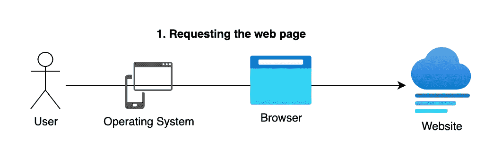
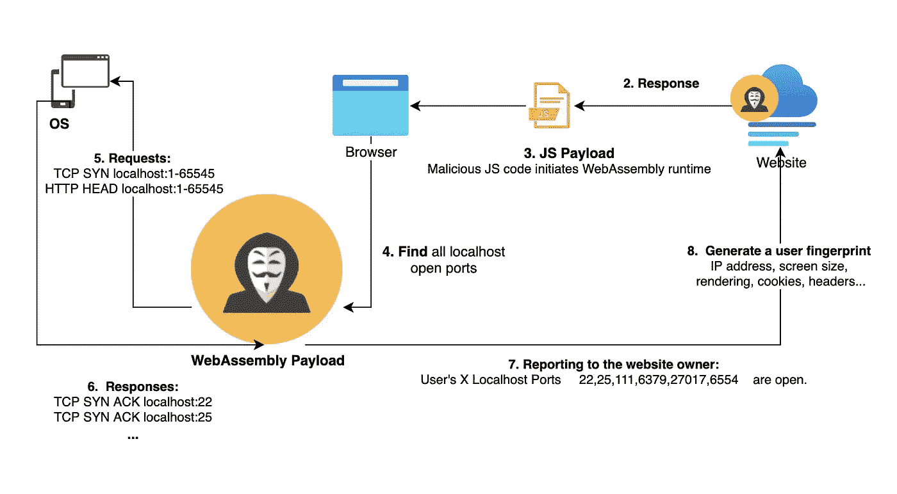
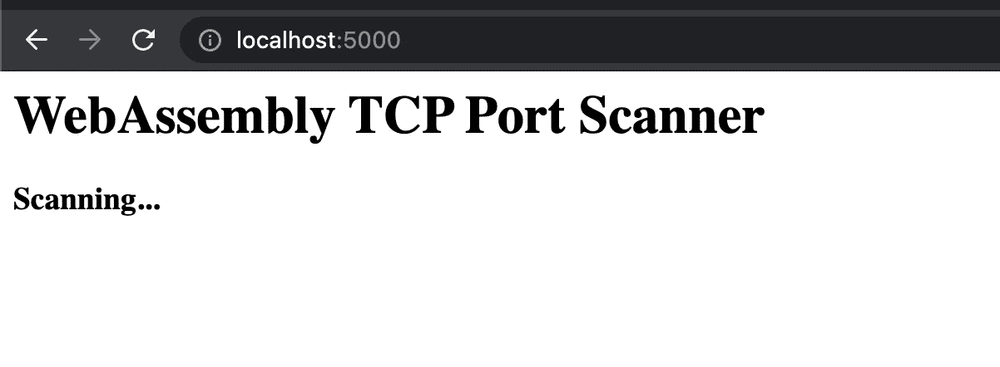
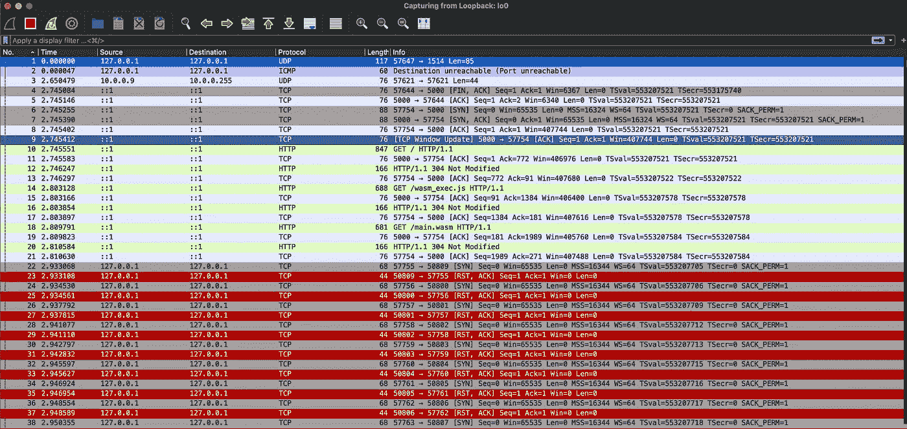
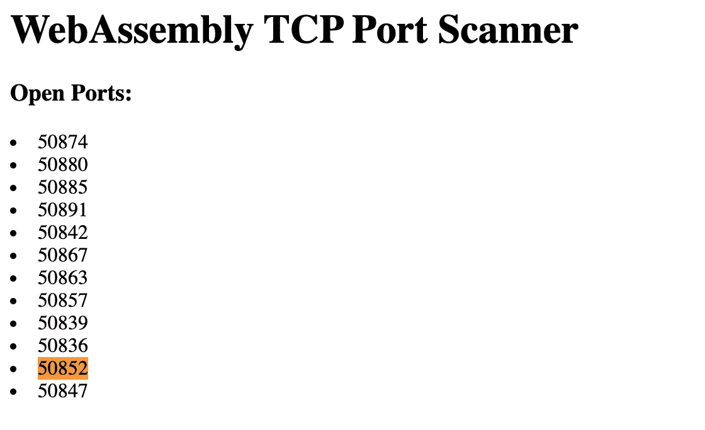
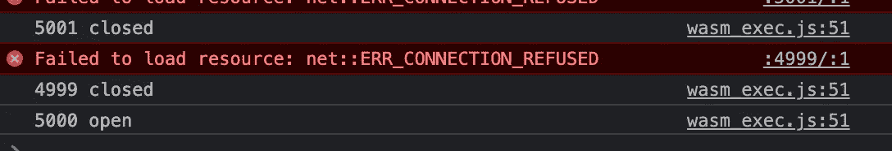
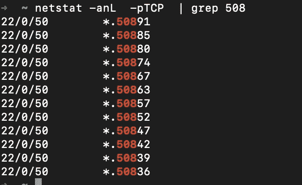
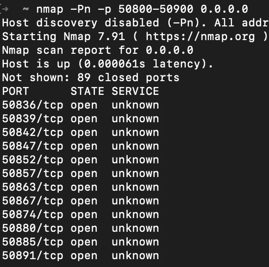

# 浏览器—本地主机网关:使用 WebAssembly 和 Go 进行客户端端口扫描

> 原文：<https://infosecwriteups.com/identify-website-users-by-client-port-scanning-using-webassembly-and-go-e9798b4aa05c?source=collection_archive---------1----------------------->

网站倾向于从浏览器扫描其用户的开放端口，以更好地识别新用户/回头客。
‘localhost’会不会被浏览器滥用？
可以通过 WebAssembly 实现吗？

> 代码可在 https://github.com/avilum/portsscan 的，
> 获得，欢迎投稿。

在本文中，我将展示浏览器如何被滥用来攻击本地主机服务——渗透组织或从浏览器运行远程代码。


照片由 [Immo Wegmann](https://unsplash.com/@macroman?utm_source=medium&utm_medium=referral) 在 [Unsplash](https://unsplash.com?utm_source=medium&utm_medium=referral) 上拍摄

当我们访问网页时，我们每个人都有一个独一无二的指纹，这不是什么秘密。客户指纹帮助网站跟踪我们在许多其他网站上的活动。
指纹是许多因素的组合，包括您的设备、浏览器、屏幕大小、IP 地址和许多其他变量。当两者结合在一起时，它们使我们很容易被网站识别。

# 关于客户端代码的一句话

易贝等网站无休止地在我们的电脑上运行代码。他们以前只用 JavaScript 就能做到。
这些年来，前端技术不断发展，比如
**Javascript**(ECMAScript)**TypeScript**、 [**Deno**](https://deno.land/manual/getting_started/webassembly) (安全快速的 Javascript 运行时，用 rust 编写)

浏览器的 Javascript API 一直被恶意软件滥用，因为它是浏览器支持的唯一语言。随着近年来下一代 web 技术的发展，例如 **WebAssembly** ，下一代恶意软件可能会更加复杂。

**WebAssembly** (WASM)运行时允许将语言编译成二进制代码，浏览器的 WebAssembly 运行时可以使用这些代码在访问网页时在您的浏览器中执行低级代码。除了快得多**(编译后的代码通常比 JS、**快，但不总是**)之外，WASM 将编程语言解耦，专注于“做什么”。**

**WebAssembly 的运行时间令人惊叹——它为浏览器带来了许多新的 API 和功能，但没有免费的午餐——WASM 是安全研究人员和黑客的一个很好的目标。毕竟，尽管它是公开的，但 WASM 有大量的代码没有经过多少人的审查。**

**这就是为什么许多新语言，如 [Rust](https://www.rust-lang.org/) 、 [Go](https://golang.org/) 和 [Deno](https://deno.land/manual/getting_started/webassembly) ，为 WebAssembly 作为目标架构/运行时提供开箱即用的支持。到今天为止，你可以用 Go、Rust 等等编写代码，而不是使用 javascript 派生的语言。因此，系统编程语言在开发人员中变得广泛适用，他们希望获得超越我们曾经认为的“跨平台”的能力。
**Python** 现在不那么“跨平台”了吧？(开个玩笑——你可能会觉得 https://pyodide.org/en/stable/console.html 很有趣)。**

# **研究 WebAssembly 运行时(使用 Go)**

********

**H 当用户访问我的网站时，从浏览器上下文映射主机上的开放端口(活动的监听服务)有多容易？我能用一种低级语言做到吗？**

**作为一个网站所有者，假设我想识别一个用户是否是开发者。
端口扫描技术每秒都能发现资产和服务器。“开放端口”字面上指的是绑定到 [NIC](https://en.wikipedia.org/wiki/Network_interface_controller) 设备上特定端口的服务器。有些服务必须手动定义，但许多操作系统在启动时运行服务，公开许多本地主机上可用的应用程序 API，如 IPC、SMB/Samba、SSH、SMTP、FTP 等。**

**由于这一点，找到易受 1day 漏洞(公开但未披露)攻击的资产变得非常容易。只是谁先到那里，是否被报告(和修复)的问题。**

**自从几年前第一次听说 WASM，我就一直相信它。我开始玩它。我选择 Go 是因为它的 easy Net/Socket 和 HTTP 标准库 API。顺便说一下， **Rust** 也获得了开箱即用的海量 WebAssembly 编译支持。**

# **理解流程**

****

**用户访问网页**

**现在，用户的浏览器将初始化 WebAssembly 运行时。然后，它将自动运行我的 Go 端口扫描器，它被编译成一个 WebAssembly 二进制文件。**

****

# **让我们开始:编写一个(不那么简单的)端口扫描器**

**我使用 Go 的“syscalls/js”绑定遵循 Javascript API。当我使用 HTTP Go API 时，我发现浏览器很喜欢它，但它不能很好地与(可能没有完全实现的)“net”Go API 一起工作。**

**浏览器中尚不支持 WebAssembly 原始 TCP 会话和 UDP。这个社区也在致力于新的[](https://github.com/WebAssembly/WASI)**标准——最终有一天会要求浏览器实现原始的 TCP/UDP 会话。****

****在尝试了几种滥用 WebAssembly 的原始 TCP 会话来接收原始 TCP 响应的方法后，我明白了使用本机 TCP 会话扫描的**编程是行不通的**。出于安全原因(如 CORS 和不安全端口)，Chrome 代理(有时会阻止)WebAssembly 请求和响应。****

## ****让我们定义端口扫描器:****

## ****然后，我们将定义端口扫描功能:****

****Go 的“http”API 有一些很大的好处，比如用于 HTTP 跟踪的“GotFirstResponseByte”处理程序。我希望它能起作用，但它没有——想象一下这将是多么容易。****

****使用 Go 著名的“http”包会更好，毕竟——浏览器都是关于应用程序的。使用像 HTTP 这样的应用程序协议应该更容易。****

# ****理解反应。****

******您如何使用高级 HTTP 会话一致地扫描端口？** 得到回应是一回事。理解它们并对它们进行正确的分类是一个挑战，因为我们不能按原样看到响应。端口扫描器通常使用原始数据包和会话对网络进行分类。在 WebAssembly 运行时内部，这在撰写本文时是不可能的。****

******我们可以积极地对以下响应进行分段:**
-连接被拒绝(端口关闭)
**-** 超时(端口可以是打开的，也可以是关闭的)。- HTTP 响应(打开——并且对方有有效的 HTTP 服务器！)****

## ****我发现相对较小的超时非常可靠。****

****随着我的进步，我遇到了更多的问题。浏览器拦截了缺少 [CORS](https://developer.mozilla.org/en-US/docs/Web/HTTP/CORS) 报头的有效 HTTP 响应，将其描述为一般的“获取错误”，掩盖了错误的真正原因，并将请求标记为“不安全”。浏览器甚至没有将错误内容转发给 WASM 运行时——它只是失败了，没有进一步的细节。****

****迭代常见错误。将它们视为“开放端口”。****

## ****CORS 怎么样？****

****localhost HTTP 服务经常错过“跨源-****”头。
**(不同于 **window.location** 的**主机+端口**的组合)保护默认可用，所以没有这些头的 HTTP 请求会失败。您无法知道请求失败是因为 WebAssembly 上下文中的 CORS。******

****我不得不设法克服这一点，在经典的 JS 中，人们会简单地在 fetch()请求中添加一个‘no-CORS’模式。在做了一些研究之后，想到了一种覆盖 JS 的 fetch() API 调用的方法，我发现了一个非常简单的方法，它非常有效！****

****我从来没有想过在我的请求中添加这样一个 HTTP 头。使用 Go 语言修改浏览器行为(syscall)就是这样一种有线方式。****

****因此，CORS 不再是演示的问题，但这并不意味着它将在明确指定“访问控制允许来源”标题的网站上工作。我们无法处理这种情况。尽管如此，世界上仍有很多网站可以成功运行这一 WASM 代码。****

## ****支持 TLS/SSL 服务的端口****

****如果没有 SSL 握手，我们会“跳过”浏览器默认激活的许多 SSL 安全特性。这有助于我找到任何 TCP 开放端口，而不仅仅是接受 SSL 传输的服务。****

****我们必须记住，WebAssembly 运行时的 TCP 栈是由 Chrome 自己的 TCP 栈代理的。如果证书不匹配，浏览器会终止我们的 SSL 请求，而不说明原因——这看起来就像典型的“连接被拒绝”。SSL 增加了复杂性和安全性，因此我继续使用纯文本 HTTP。****

## ****定义启动功能:****

****请注意我使用 syscalls/js 库注入的 JS DOM 元素，它支持使用 Go 代码修改 DOM。我对它的简单感到惊讶。****

## ****编译代码:****

# ****定义加载 WASM 的网页****

****现在我们来看看客户的电脑。哪些端口当前正在监听(例如“打开”)？****

****注意 wasm_exec.js 脚本标记，它是 WebAssembly Go 运行时绑定。****

****开始本地演示:****

```
**>>> python3 -m http.server 5000**
```

# ****访问时运行本地端口扫描:****

********

****访问者在启动时看到的(index.html)——HTML 本身作为 Go loads 被注入！多酷啊。****

## ****让我们来看看访问者的网络数据包****

********

****网络数据包在本地主机(环回)网络接口上被捕获。数据包在左边编号:数据包 10–20，是 index.html 请求和响应，包括脚本。在数据包 22 之后，浏览器开始端口扫描。它发出(TCP SYN)数据包，并接收(RST，ACK)数据包作为响应，这意味着端口关闭。****

****现在我们来看一个开放端口指示器。
如果套接字接收到 HTTP 超时，但没有接收到 ConnectionRefused 错误，则在接受连接的端口(通常被视为“已过滤”)上一定有什么在侦听，并返回 Reset / Ack 响应。****

********

****注意有效的 HTTP / TCP 响应(蓝色/紫色)。有人在外面偷听！****

# ****综上所述:****

********

****通过浏览器的 WebAssmebly 运行时对访问者运行端口扫描的 HTML 页面****

********

# ****将结果与实际情况进行比较。****

****我用 [netstat](https://en.wikipedia.org/wiki/Netstat) 和 [nmap](https://nmap.org/) 来验证我所看到的。
我期望我的结果是一样的，事实也的确如此。****

****************

****NetStat 输出(打开侦听当前操作系统的端口)与 NMap 输出(从攻击者的角度看，TCP 扫描这些端口)的对比。我在 WASM 港口扫描仪中找到的每个港口都得到这些结果的支持。****

# ****Localhost 不是本地的，毕竟是远程的。****

****今天，当在个人计算机上配置或工作时，我们将 Localhost 视为一个“安全”或“封闭”的环境。曾经，攻击本地主机服务似乎要困难得多。我们安装的持久化应用程序经常在本地主机上分配和监听端口。****

******操作系统**倾向于**打开本地主机**网络接口上的端口，**在启动**时开始工作。无论是 **Windows，Mac，Linux**——你的电脑在本地主机上监听某些东西。正如我所展示的——Javascript 或 WebAssembly 应用程序可以轻松地扫描这些本地主机服务。他们也可以虐待他们。****

# ****场景 1:使用单一访问，通过 Linux 客户端上的 RPC 漏洞拒绝服务。****

****[https://cve.mitre.org/cgi-bin/cvename.cgi?name = CVE-2017-8779](https://cve.mitre.org/cgi-bin/cvename.cgi?name=CVE-2017-8779)
**RPC-BOMB**是一个示例漏洞，攻击者可以通过过时的 Linux 内置 RPC 服务( [**rpcbind**](https://man7.org/linux/man-pages/man8/rpcbind.8.html#:~:text=The%20rpcbind%20utility%20is%20a,it%20is%20prepared%20to%20serve.) )，使用**恶意 TCP 数据包**，在操作系统上造成拒绝服务攻击。****

****想象一下:你访问一个网站。一秒钟后——你的电脑卡住或重启，破坏了你最近未保存的工作。 **1。**查找易受攻击端口是否打开(111)
**2。**向本地主机发送巧尽心思构建的 TCP 数据包:111
**3。您已经成功关闭了访客的电脑。******

# ****场景 2: Windows 后台打印程序远程代码执行漏洞([CVE-2021–34527](https://msrc.microsoft.com/update-guide/vulnerability/CVE-2021-34527)):****

> ****当 Windows 后台打印程序服务不正确地执行特权文件操作时，存在一个远程代码执行漏洞。成功利用此漏洞的攻击者可以使用系统权限运行任意代码。然后，攻击者可以安装程序；查看、更改或删除数据。或者创建具有完全用户权限的新帐户。****

****由于浏览器对 localhost、0.0.0.0、192.168.1.1 等的访问，该漏洞可用于攻击数百万用户，利用不同的设备。我们很多人都使用 windows，这种易受攻击的服务会在启动时启动并运行。绑定在 0.0.0.0 上，可通过网络访问，黑客可以利用此漏洞渗透组织。****

****开发人员(比如我自己)经常在 localhost 上运行本地服务器/容器。
我也经常忘记关闭它们(例如，当使用 restart=always 运行 docker 容器时)。除了利用漏洞之外，开发人员还可以被识别(例如通过 stack overflow/Linkedin/脸书),以了解我们在开发中使用了哪些技术。****

****依我拙见，浏览器 WASM 攻击面将随着时间的推移被滥用，因为更多的未来将被实现。
在本文中，我展示了关于浏览器的安全特性，一个 web 页面如何在用户的本地主机网络上通信和映射服务。它可以在许多编译成 web 程序集的语言中实现，尽管目前还不可能使用原始的 TCP/UDP 会话。****

****我举了一个例子，Linux 主机可以通过从浏览器访问网页来体验 DOS 以及如何利用微软的新漏洞[CVE-2021–34527](https://msrc.microsoft.com/update-guide/vulnerability/CVE-2021-34527)。****

****[**WASI**](https://wasi.dev/) 令人惊叹。
[**web assembly**](https://webassembly.org/)很棒。
[**浏览器**](https://community.spiceworks.com/topic/1244428-i-need-a-new-browser-one-that-doesn-t-suck-when-you-use-it) 并没有那么好——它们将永远对我们所有人构成严重的风险&攻击媒介，因为随着时间的推移，它们将变成操作系统，支持越来越多的 WASI 规范功能。****

# ****密码****

****代码可在[https://github.com/avilum/portsscan](https://github.com/avilum/portsscan)获得，欢迎投稿。****