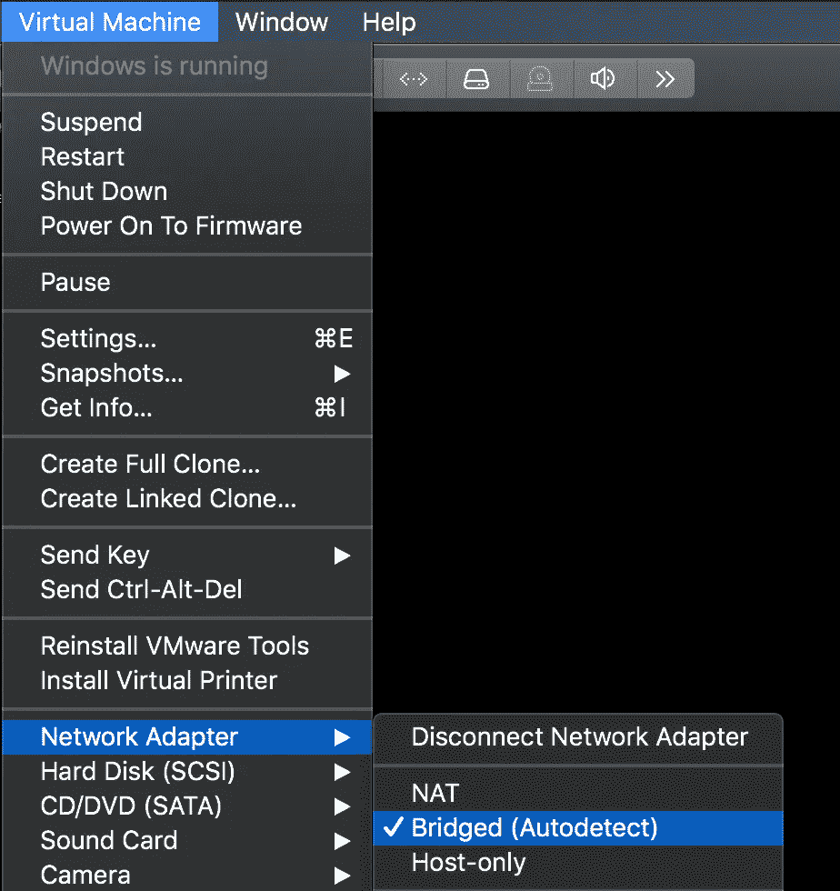
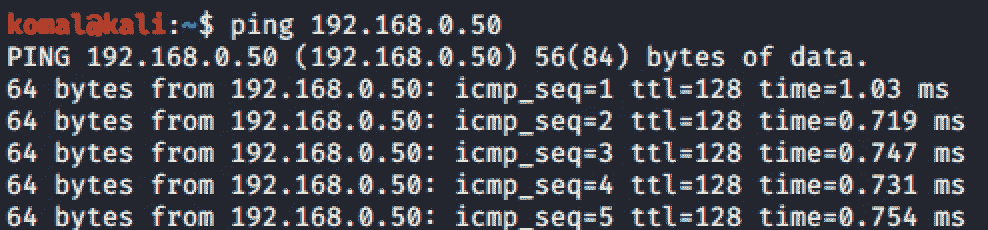
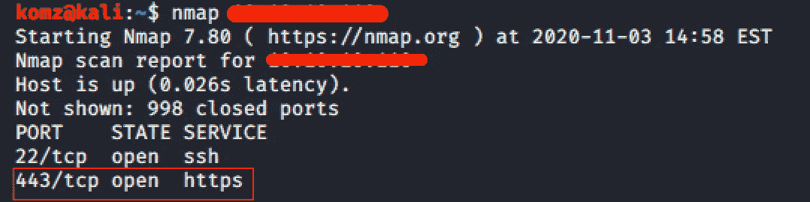
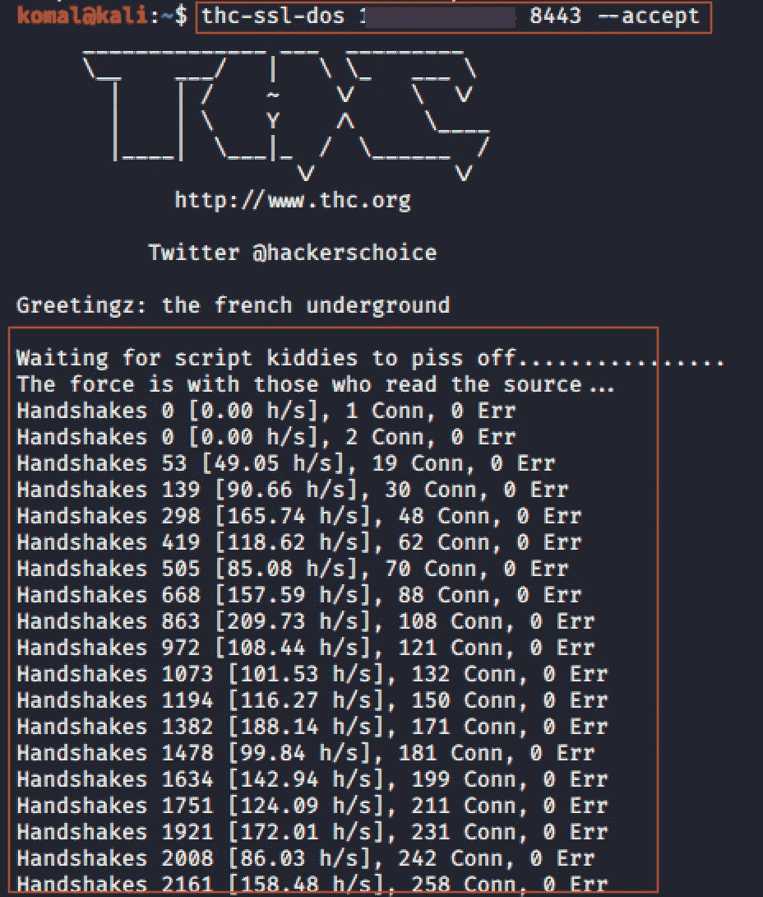
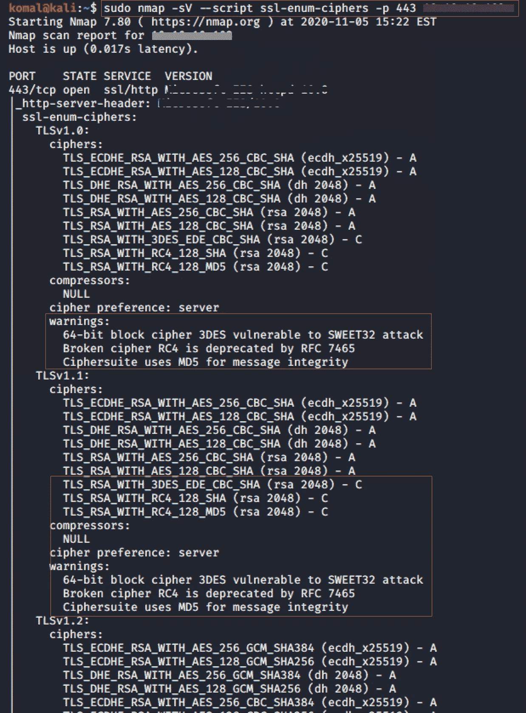

# 识别 SSL/TLS 中的漏洞并攻击它们

> 原文：<https://infosecwriteups.com/identifying-vulnerabilities-in-ssl-tls-and-attacking-them-e7487877619a?source=collection_archive---------2----------------------->

## SSL 重新协商攻击| Sweet32 生日攻击

由[马库斯·斯皮斯克](https://unsplash.com/@markusspiske?utm_source=medium&utm_medium=referral)在 [Unsplash](https://unsplash.com?utm_source=medium&utm_medium=referral) 拍摄的照片

在本文中，我们将探讨 SSL/TLS 中与安全相关的问题，了解它们是如何受到攻击的，以及后续的补救措施。

# 实验室**设置**

**这里我有两个虚拟机:**

(1.)**受害机器** — Windows 还是 Linux

(2.)**攻击者机器** — Kali Linux

在您的 VMware 中，确保两台虚拟机的网络适配器都设置为“桥接”模式。

这将允许两台机器连接到您的路由器，以自动从 DHCP 服务器获取 IP 地址*(或者可能需要设置一个静态 IP 地址)*

> 桥接模式允许这些虚拟机就像网络上的物理机一样。

# 攻击者机器

**检查 I.** `ping`检查受害机是否处于活动状态。

**检查二。**运行`nmap`查看哪些端口是打开的，以及这些端口后面运行的服务。

# 拒绝服务攻击

## 1.SSL 重新协商攻击

这是一种 DoS 攻击，利用服务器的处理能力和重新协商攻击，根据 [McAfee](https://www.mcafee.com/blogs/enterprise/tips-securing-ssl-renegotiation/) 的说法，它可以使一台[30gb 的链接服务器](https://www.mcafee.com/blogs/enterprise/tips-securing-ssl-renegotiation/)瘫痪，而流量只来自一个终端设备。

工具`THC-SSL-DOS`利用所有 SSL 实现和重新协商攻击。该工具能够通过单个 TCP 连接触发数千次重新协商。该工具最初完成 TCP 3 次握手以连接到服务器。完成后，它立即反复请求对**加密方法**的**重新协商**，直到服务器完全耗尽并从互联网上断开。

## 减轻

*   如果不需要，在服务器上禁用 SSL 重新协商支持。
*   始终只允许安全的重新协商。
*   限制 SSL 握手的次数
*   通过实施 SSL 加速器等产品来升级服务器资源

# 中间人

## 1.Sweet32 生日袭击

CVE-2016–2183，CVE-2016–6329

Sweet32 攻击利用了传统的 64 位 3DES 密码套件。此漏洞使得能够进行中间人攻击的远程用户可以利用此漏洞在纯文本数据中暴露敏感信息。

使用以下 nmap NSE 脚本，您可以确定网站是否易受 Sweet32 攻击。

`nmap --script ssl-enum-ciphers -p 443 <IP>`

## 减轻

*   网络服务器和 VPN 应配置为最低 128 位密码套件。例如，优选密码 AES-128-CBC。**注意:** *3DES 是 TLS 1.0 和 1.1 中的强制算法，而 AES 是最常支持的批量* ***密码*** *在****TLS 1.2****&****TLS****1.3****密码***
*   禁用 3DES 密码套件。
*   在 TLS 模式下实现 64MB 的默认重新协商。

*更多跟随……*

# 测试 SSL/TLS 的其他命令行工具

*   `openssl s_client -connect <ip>:<port> -msg`
*   `[SSLyze](https://github.com/nabla-c0d3/sslyze)`
*   `[testssl.sh](https://testssl.sh)`

# 参考

1.  [https://www . cloud flare . com/learning/DDOS/glossary/denial-of-service/](https://www.cloudflare.com/learning/ddos/glossary/denial-of-service/)
2.  http://kb.mit.edu/confluence/pages/viewpage.action?pageId=154192964
3.  [https://www . McAfee . com/blogs/enterprise/tips-securing-SSL-re negotiation/](https://www.mcafee.com/blogs/enterprise/tips-securing-ssl-renegotiation/)
4.  [https://case security . org/2016/09/07/how-a-sweet 32-birthday-attack-is-deployed-and-how-to-prevent-it/](https://casecurity.org/2016/09/07/how-a-sweet32-birthday-attack-is-deployed-and-how-to-prevent-it/)