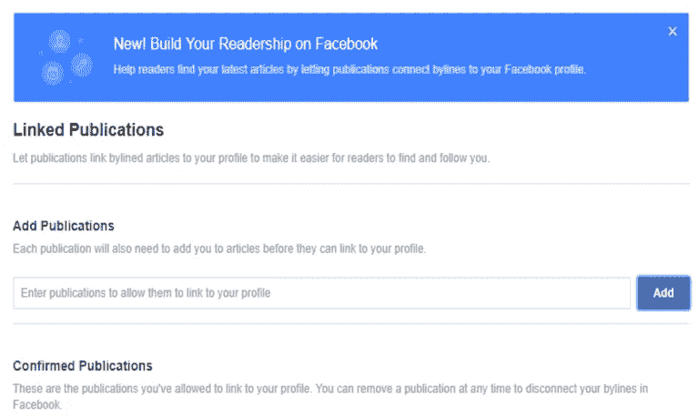
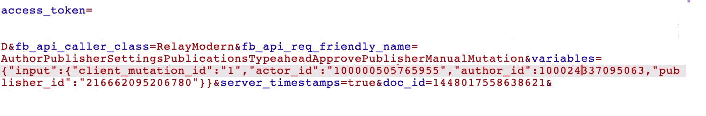
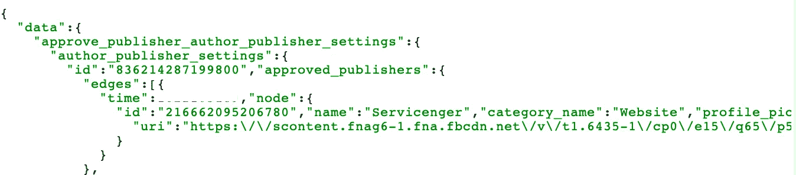
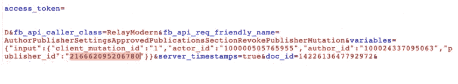

# [IDOR]在作者发布者设置中添加或删除链接的出版物—脸书虫赏金

> 原文：<https://infosecwriteups.com/idor-add-or-remove-the-linked-publications-from-author-publisher-settings-facebook-bug-bounty-2e5f8355aa01?source=collection_archive---------3----------------------->

脸书链接出版物(作者身份或作者标签)功能旨在为记者们所写的文章提供更多的信任和可见性，无论这些文章在哪里发表，这导致了您在许多帖子中看到的署名，以及轻松跟踪该记者并查看他们何时公开分享新文章的能力。

要使用该功能，作者需要获得出版物或网站(特别是该网站的 FB 页面)的许可，才能在脸书的署名功能中被引用为作者。

因此，作者需要登录到他们自己的脸书个人资料，并在设置(他们自己的个人资料)中点击“链接的出版物”(或只是发送到这个链接:https://www.facebook.com/settings?tab=author_publisher)

在那里，他们需要添加/删除作为“链接出版物”的出版物(或网站)的脸书页面

此功能易受间接对象引用(IDOR)的攻击，这可能导致攻击者在作者发布者设置中添加或删除批准的出版物。

要复制以下 graphQL 请求:
易受攻击的参数:author_id 和 publisher_id
访问令牌:第一方令牌(Android)

## 1.在受害者环境中添加出版物:

author_id 是受害者档案 id，publisher_id 是任何媒体/新闻页面 id。

请参见下面的请求和响应:

## 2.从受害者环境中移除出版物:

## 时间线:

2021 年 5 月 27 日:提交报告。

2021 年 5 月 27 日:审判。

07/06/2021:已修复(添加/删除已修补的漏洞，但我可以看到任何页面上以前批准的出版物)。

21/07/2021:赏金-> $750 + $75(黄金联赛奖金)+ $38(延迟奖金)。

28/09/2021: FB 回复:产品团队决定移除此功能的添加和删除功能，此功能的清理仍在进行中，因为添加/删除功能现在不可用，您只能看到以前添加的设置。

07/12/2021:功能已完全删除，此问题的清理工作已完成。

本文也发表在:[https://service nger . com/mobile/idor-add-or-remove-the-linked-publications-from-author-publisher-settings-Facebook-bug-bounty/](https://servicenger.com/mobile/idor-add-or-remove-the-linked-publications-from-author-publisher-settings-facebook-bug-bounty/)

在 Twitter 上关注我:rahulkankrale