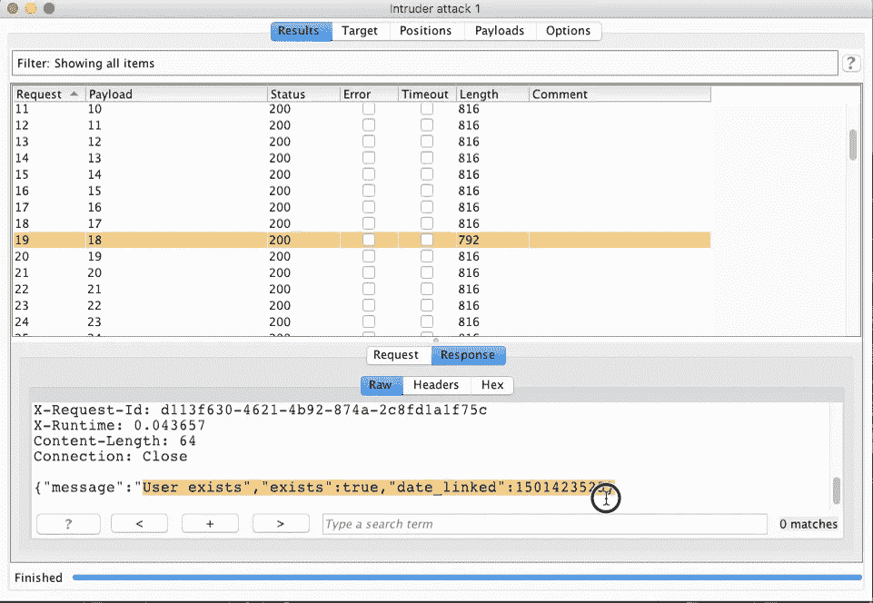
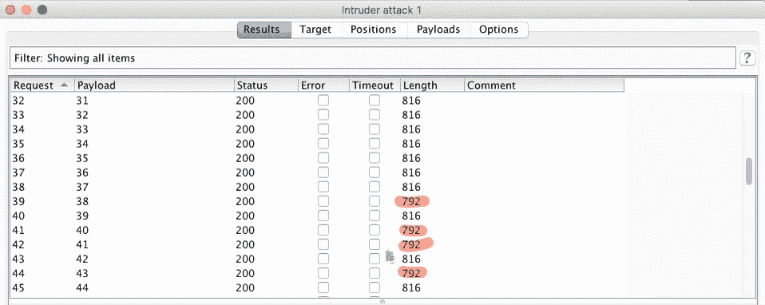
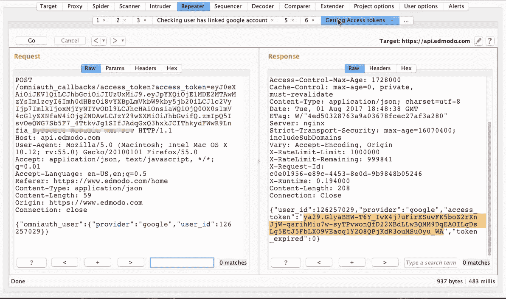

# IDOR 导致用户访问 Edmodo 上链接到 Google Drive 的令牌

> 原文：<https://infosecwriteups.com/idor-leads-to-getting-access-tokens-of-users-linked-to-google-drive-on-edmodo-3978017134bd?source=collection_archive---------1----------------------->

大家好，

希望你做得很好，在这篇文章中，我想与你分享我在 [Edmodo](https://www.edmodo.com) 上的发现，我是如何获得用户的访问令牌的，这些用户已经将他们的帐户与 Google drive 链接，以便从它添加文件，让我们深入了解一下。

基本上，edmodo 是一个教师和学生的平台，他们可以在那里创建一个小组，并开展各种活动，如作业、测验等。所以，最近我开始在 edmodo 中寻找 bug，经过两天的搜索，我得到了我的第一个 bug，那是一个存储的 XSS，但遗憾的是，它被复制了。但是我想。


在查找 bug 时，请始终记住这一点。

我重新开始，再次完成了应用程序的映射。我看到增加了一个新的功能，那就是学生可以直接从他们的 Google drive 中添加文件到他们在 edmodo 的背包中。我很快就完成了添加文件的过程，并在 Burp 中处理所有请求。现在问题来了

我找到了一个 API 端点，它检查用户是否已经将他/她的帐户链接到 Google drive。

```
https://api.edmodo.com/omniauth_callbacks/sso_user_exists?provider=google&user_id=123456789&_=1501610351655&access_token=<Our access token here of edmodo>
```

因此，通过改变参数 **user_id** 的值，我们可以得到用户是否已经将他/她的帐户链接到 Google drive，这是我使用入侵者扩展的。



链接时用户存在且 Unix 时间戳



正如你所看到的，我得到了很多 edmodo 用户的 id，他们将自己的账户链接到了 google drive。

现在我有了另一个端点，它将访问令牌分配给用户。

```
https://api.edmodo.com/omniauth_callbacks/access_token?access_token=<our edmodo access token here>
```

因此，这个请求发送两个参数*提供者*和 *user_id* 作为 POST 请求，其中我将 *user_id* 更改为使用先前端点找到的其他用户。它还给我一个有效的访问令牌，用于另一个用户添加文件。



因此，它没有验证用户并返回访问令牌。我很快向 Edmodo 报告了这件事，一天后他们奖励了我一个很酷的礼包。Edmodo 也修复了这个问题，现在它给出了一个禁止消息。


埃德蒙多糖果

**要点:**根据许多其他研究人员的建议，新功能总是不断增加，而且它们也有缺陷。这在这里对我有用。一定要记得检查新功能。

希望你能愉快地阅读这篇文章。这是我第一个值得分享的有趣发现。我们随时欢迎您的评论，或者您可以在 twitter 上给我发消息。祝你过得愉快。☺️☺️