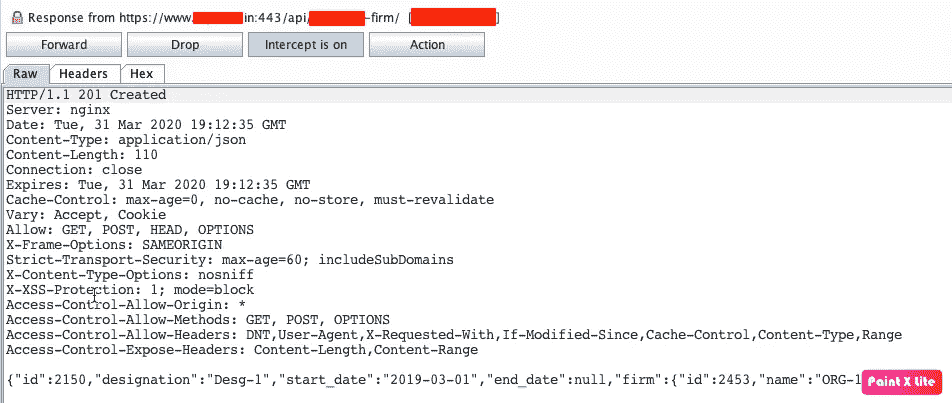
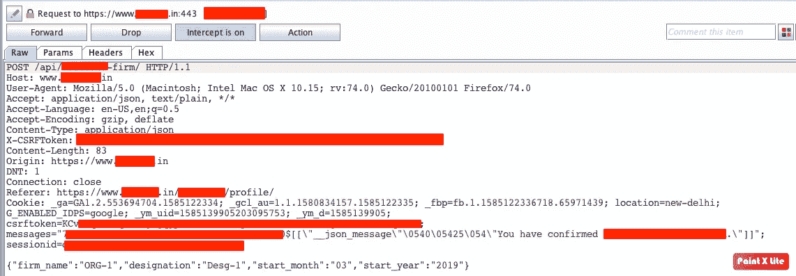
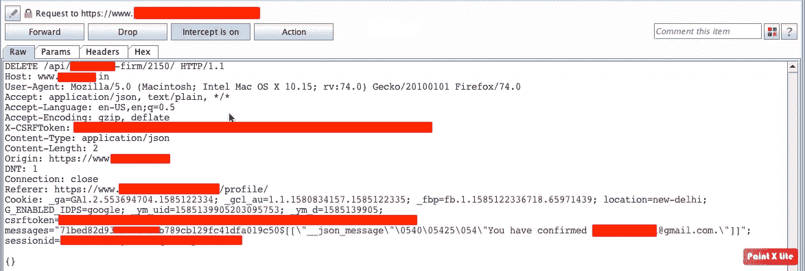
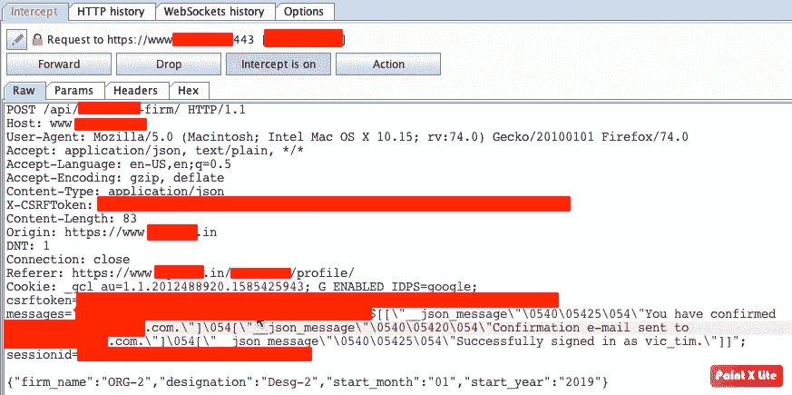
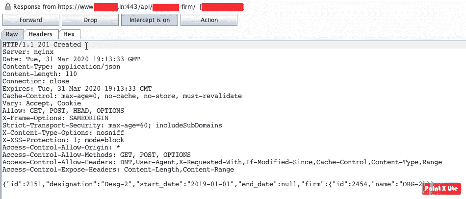

# API 端点上的 IDOR。

> 原文：<https://infosecwriteups.com/idor-on-api-endpoints-e08c740e87a2?source=collection_archive---------0----------------------->

嘿，伙计们，我在这里分享我最近在一个网站上的发现，这个网站让我写下了我的第一篇文章。因为保密协议，我不能透露公司的名字(NDA)。所以我将用 target.com 的 ***和 T4 的*作为参考。**

# TL；速度三角形定位法(dead reckoning)

我发现在请求一个 API 的端点时，缺少访问控制策略(中断的访问控制)，这导致我在未经用户允许的情况下编辑/删除任何用户的工作经历和教育细节。

# 先决条件

IDOR 是什么？
*不安全的直接对象引用(IDOR)是一种访问控制漏洞，当应用程序使用用户提供的输入直接访问对象时会出现这种漏洞。*

所以，我测试了过去三天的 target.com。我发现了一些错误，包括跨站点脚本，速率限制等。我对我所拥有的不满意。所以我开始挖掘更多。经过一个小时的搜索，我的目光停留在一个 API 请求 的 ***响应上，它是:***

作品创作**响应**

您可以清楚地看到，这个响应包含一个“id”参数(“id”:2150)。这引起了我的注意。
这个**回复**是因为我在 target.com**的个人资料里添加了一段工作经历而产生的。最初的请求是:**

作品创作**请求**

现在我开始模糊到那个位置。我尝试了一些事情，比如通过在 JSON 中的请求体中添加一些参数来创建另一个用户的工作体验，但是什么也没有发生。我正准备离开这个端点，但突然我想到了检查工作体验的删除功能。
我删除了个人资料中的工作经历，并捕捉到了请求:

删除工作经验的**要求**。

现在我想你也已经在那个 URL 中抓住了那个有趣的参数。方法是**删除**，URL 是
***https://www.target.com/api/user-firm/2150.***请求中的那个数字(*2150*’)再次引起了我的注意。现在请看 ***响应*** 的上述请求:

删除工作经历的**回复**。

响应包含状态码' 204' *没有内容。其中*表示工作经历删除成功，该位置没有内容。
现在我按照上面的步骤再次创建了另一个账户。我在这个简介里加了一段工作经历。要求是:

创建工作的请求[第二帐户]

这个回答又唤起了我以前的一些想法。

创建工作的响应[第二帐户]

这里的“id”= 2151 是我用我的第一个帐户创建的先前工作经验的后续编号。现在我知道这是一致的。现在，从第一个账户开始，我又创造了另一个工作经历。
现在的想法是检查 IDOR 漏洞。
于是，我利用第一个账号的请求，尝试删除第二个账号的工作经历。
确保您记住第一次工作经历的创建 id(2150)。
我的第一个账户的删除请求是:

我的第一个帐户的删除请求。

在上面的请求中，我将 id 的值从 2150 更改为 2151。回应是:

回应。

***瞧！！***

所以，我刚刚用我的第一个账户删除了我的第二个账户的工作经历。我再次尝试在网站上添加教育信息。幸运的是，我又成功了。

# 影响

我可以在没有任何许可的情况下编辑/删除 target.com 网站上注册的整个用户的工作经历和教育细节。

# 小贴士:

> >必须看到带参数的 API 端点的响应。
> >如果某个数字在 API 中传递，那么您必须尝试模糊端点并查找 IDOR。

这个网站是我实习时测试过的。
所以，是的我没有得到任何特殊的赏金。

感谢您阅读至此。希望你已经学到了一些东西。

如果你想联系我，你可以在这里找到我。
**推特:**[*https://twitter.com/abhiunix*](https://twitter.com/abhiunix)
**领英:**[*https://linkedin.com/in/abhiunix*](https://linkedin.com/in/abhiunix)