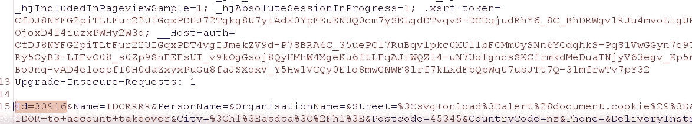

# 一个非常致命的恶魔的故事。

> 原文：<https://infosecwriteups.com/idor-that-allowed-me-to-takeover-any-users-account-129e55871d8?source=collection_archive---------0----------------------->

大家好！我叫韦丹特，也叫贝吉塔(在推特上)。我是一名网络安全爱好者，计算机工程专业的学生，也是一名 bug 赏金猎人。今天我将与你分享我的一个最好的发现。关于目标的信息很少，它是一个 target.com 的 RDP，我们暂且称它为。它基本上是一个有很多功能的在线购物网站。

所以事不宜迟，让我们开始吧:)

**第一阶段:-**

所以当 target.com 有很多功能让我玩的时候，我决定在它上面创建一个账户，开始寻找一些基本的漏洞，而不做任何侦察。所以我打开打嗝，开始捕捉请求。我在注册或登录功能中没有发现任何有趣的东西，但是密码重置和其他一些功能容易受到限速攻击。在任何网站上创建帐户时，我输入自己的名字**<h1>tester</h1>**来检查 HTML 注入和 XSS，因此在 target.com 上创建帐户时，我也这样做，登录并访问我的仪表板，但不幸的是 h1 标签没有执行。我继续在我的个人资料部分寻找存储的 XSS，但这些字段都不容易受到攻击。然后我转到地址簿部分，在那里我也在所有字段中输入了相同的有效载荷，这次它对名字和姓氏字段有效:)然后我迅速将有效载荷更改为一个简单的 XSS 有效载荷(**<【SVG onload = alert(document . cookie)>**)，单击保存更改，是的，存储的 XSS 成功触发了！但是我想到了一个问题，我该如何利用这一点？然后我想起来我以前遇到过这种情况(如果你看过我以前的博客，你就会知道我在想什么)我试图通过将我的名字和姓氏字段改为一个盲 XSS 有效载荷来利用它，我等了 2 天，希望管理员会访问我的个人资料，但是没有，似乎管理员并不关心它。然后，我试图利用 CSRF 攻击存储的 XSS，但它也没有工作。

那时的我😂

**第二阶段:-**

在尝试了所有可能的东西后，我几乎放弃了存储 XSS，并开始寻找其他漏洞。我几乎测试了我通常在任何目标中寻找的每个漏洞，但是没有一个有效:(在这一点上，我真的很沮丧。然后，我再次访问了地址簿部分，自我存储的 XSS 再次触发，所以我点击编辑地址删除 XSS 有效载荷(它是一次又一次地触发，这真的很烦我😂😂)然后我观察了一下它跟的网址，

[https://www.target.com/my/addressbook/3091](https://www.target.com/my/addressbook/30913)6

看完之后，你可能知道该怎么做了，我把那个号码从 30916 改成了 30915，希望能看到别人的地址簿，但是没有，出现了一条信息说，“*你不允许做这个动作”。*然后我再次编辑地址部分，删除 XSS 有效载荷，这次我拦截了这个请求，然后我观察到请求中有以下参数:

这一次，我将 Id 参数从 30916 更改为 30915，并转发请求，消息显示地址更改成功，但存储的 XSS 再次触发😂但这一次我知道到底发生了什么，我改变了别人的地址簿:)为了确认这一点，我创建了另一个帐户，并获得了它的地址 Id 和我的第一个帐户，我去编辑地址部分，只是点击保存更改(保持 XSS 有效载荷是这样的)， 拦截了这个请求，把我的第一个账户 Id 改成了第二个账户 Id，转发了这个请求，这一次非常成功！ 由于 Id 很容易被猜到，并且在任何端点上都没有速率限制，所以我可以很容易地接管任何用户的帐户:)

于是我从**自存 XSS→IDOR→账号接管**。

因为这是一个 RDP，很遗憾我没有因此得到任何奖励，但是我从这个发现中学到了宝贵的一课。我们必须走出舒适区，才能成就大事。如果我甚至没有试图找到那个 IDOR 漏洞，我就不可能实现这个帐户接管。

如果你喜欢读这篇文章，请鼓掌:)如果你对这篇文章有任何疑问，你可以在这里给我发短信。

下次见，再见，黑客快乐！