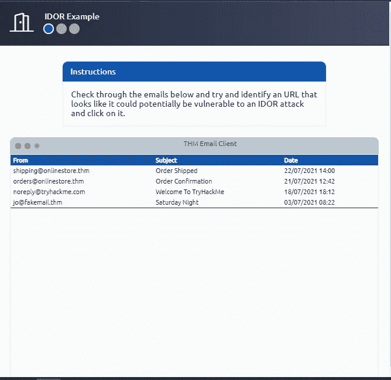
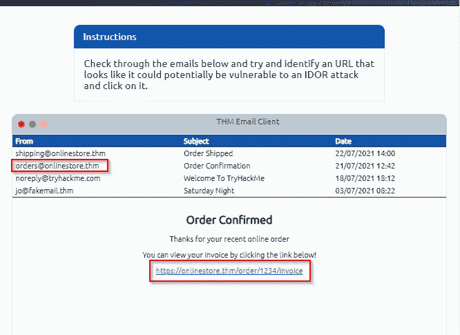
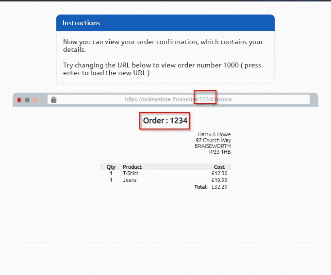
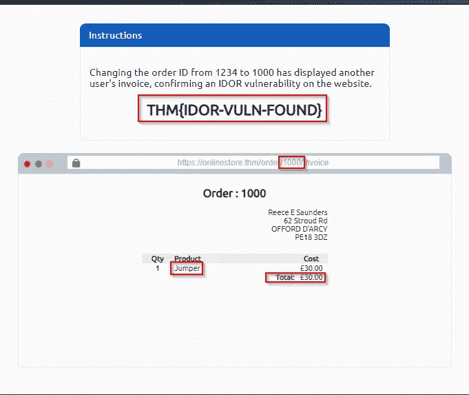
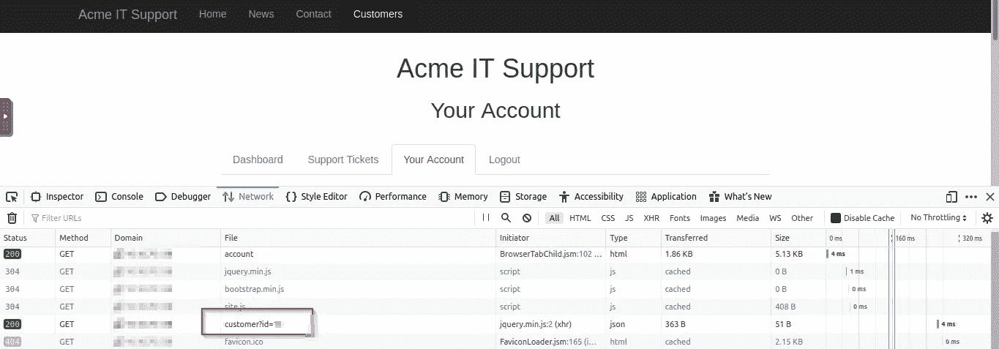
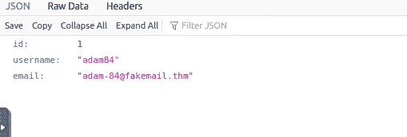

# 伊多尔—特里哈克姆

> 原文：<https://infosecwriteups.com/idor-tryhackme-92823b28b1d?source=collection_archive---------0----------------------->

## 关于访问控制的文章

嗨，朋友们，欢迎回来。我这里有一篇关于 IDOR 漏洞的很酷的文章。首先，IDOR 的意思是不安全的直接对象引用。

当 web 服务器获得客户端提供的恢复对象(记录、信息、报告)的贡献时，就会出现这种弱点，对信息的信任过度，并且服务器端没有批准确认所提到的对象在客户端中有一席之地。

**任务:**

> **伊多尔代表什么？**

不安全的直接对象引用

> **IDOR 举例:**

下图中描述了特定人员的订单和装运详情。

我们必须找到制造订购产品的特定人员的唯一 id。因此，我们必须手动点击进入电子邮件，无论任何细节是否泄露。

是的，当我点击 **orders@onlinestore.thm** 时，它给了我一张订购的发票。

点击了那张发票后，给出了一个页面

我突出显示了数字 1234，作为特定人的唯一 id，为了获取其他个人信息，我们必须将其更改为 1000。

更改号码后，我们可以看到其他个人信息。

> **在编码的 ID 中查找 IDOR:**

当从一个页面向另一个页面发送数据时，数据包括 cookies、post 数据等等。Web 开发人员利用编码技术对黑客隐藏信息。其中一个重要的方法是 base64 编码技术。

**任务:**

> **网站常用的编码类型是什么？**

base64

> **在哈希 id 中查找 id or**

在 crackstation.net 的帮助下，我们可以解码散列 id 并找到一个唯一的 id。

给出的哈希是**202 CB 962 AC 59075 b 964 b 07152d 234 b 70**，其格式是 md5 哈希。对散列解码后，我们将得到结果 123。

> **查找 ID 不可预测的 IDOR**

我们无法在 web 应用程序上找到 IDOR，只是为了创建两个帐户并交换您创建的 id，以检查一个登录的帐户是否更改为另一个帐户，如果更改了，则它是 IDOR。

**任务:**

> 您需要创建多少个帐户来检查帐户之间的 IDORs？

2

**IDOR 实例:IDOR 漏洞测试站点**

手动寻找任何端点之后，我发现了一个。

我找到了客户的登录/注册区域，在那里我进行了注册并登录。

这是我的仪表板，我在这里执行一些任务。

为了找到唯一的 id 参数和值，我使用了 network 选项卡。

当我将值改为 1 后，它会显示用户名和电子邮件 id 的详细信息。

希望你喜欢这篇文章，在未来，你想阅读更多这样的文章，请关注我的更新😉😉💥💥。