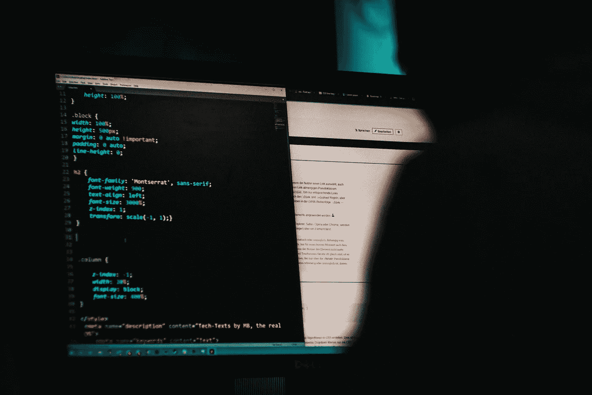
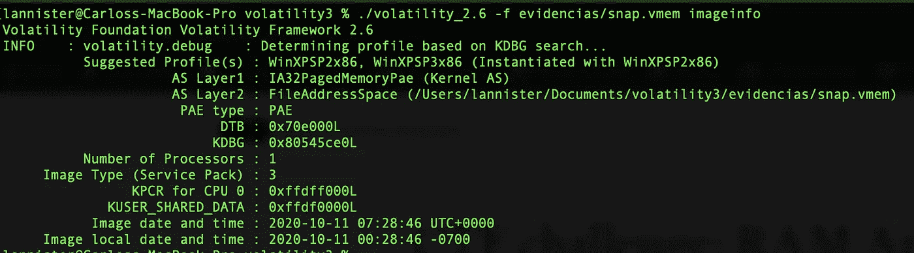
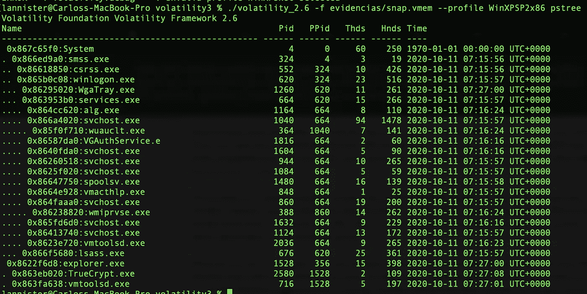
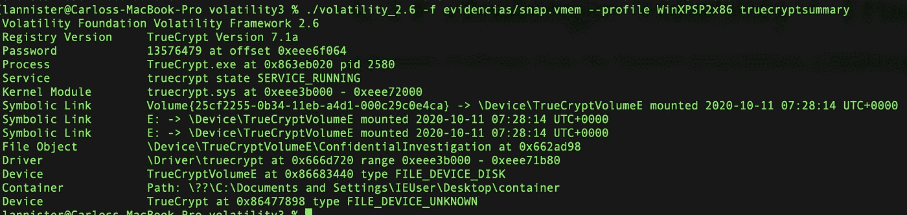
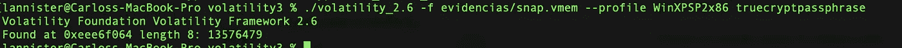
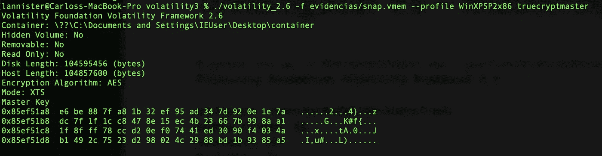
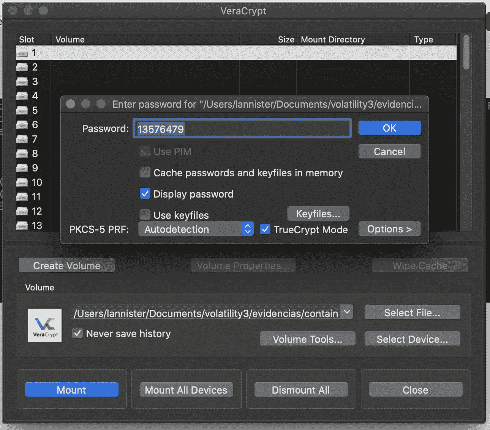
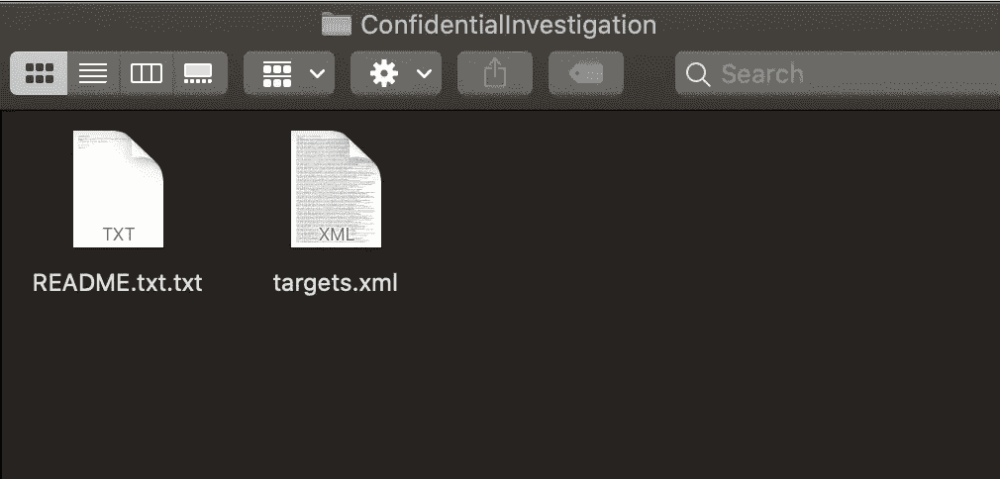
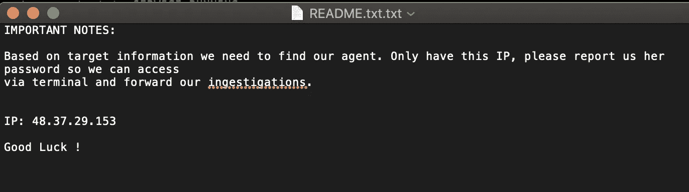
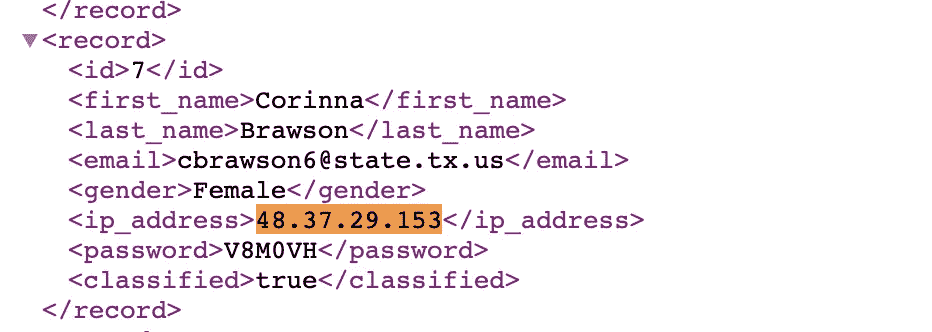

# CTF 法医挑战赛

> 原文：<https://infosecwriteups.com/ii-national-cyberleague-ctf-forensic-challenge-a0febba1e9f?source=collection_archive---------1----------------------->

## 来自西班牙国家 CTF 的法医挑战



米卡·鲍梅斯特在 [Unsplash](https://unsplash.com/s/photos/hacking?utm_source=unsplash&utm_medium=referral&utm_content=creditCopyText) 上的照片

上周，西班牙国民卫队组织了一次 CTF 活动，即第二届全国网络联赛。这个挑战是面向学生的，因此我不能参加。但是我有一个朋友参加了，他知道我喜欢法医挑战，所以他给我发了一个挑战，这是比赛的一部分。他们的团队未能解决这一挑战，所以让我们来看看是怎么回事以及如何解决它。

# 证据

有两个文件:

*   容器
*   snap.vmem

如果你玩过其他 CTF 挑战赛，这似乎有点明显，但让它分成几个部分。容器似乎是一个加密的容器，snap.vmem 是一个 RAM 采集。

记忆中的秘密一直是个问题。在数字取证调查中，获取 RAM 可以为我们提供很多信息。我们可以发现进程运行，转储文件，秘密，连接和许多有用的信息。最流行的记忆分析工具是[波动](https://www.volatilityfoundation.org/)。volatile 是一个开源项目，背后有一个伟大而活跃的社区，有像[recall](http://www.rekall-forensic.com/)这样的替代方案，但我个人更喜欢 volatile。

现在 [Volatility 有一个 3.0](https://github.com/volatilityfoundation/volatility3) 版本，有很多改进，但它还在测试阶段。正因为如此，我使用了最新的稳定版本 Volatility 2.6。

# 波动性分析

我们需要做的第一件事是识别操作系统，以便正确地分析实时内存请求。每个操作系统都以不同的方式处理内存。运行*图像信息*将为我们提供建议的操作系统配置文件。

```
./volatility_2.6 -f evidencias/snap.vmem imageinfo 
```



建议的配置文件与 Windows XP 相关，我们可以使用其中一个 WinXPSP2x86 或 WinXPSP3x86。

了解了操作系统，我们就可以开始提取有用的信息。我总是从 pstree 开始。这将让我们知道系统中正在运行什么进程。

```
./volatility_2.6 -f evidencias/snap.vmem --profile WinXPSP2x86 pstree
```



查找最有趣的进程是 TrueCrypt。TrueCrypt 是一个允许我们创建加密容器和分区的程序。现在它已经停产，被 [Veracrypt](https://www.veracrypt.fr/code/VeraCrypt/) 取代。有人认为 Truecrypt 有隐藏的漏洞，但历史长，时间短，[什么也没发现](https://www.schneier.com/blog/archives/2015/04/truecrypt_secur.html)。

无论哪种方式，Volatility 都有一些集中于分析 Truecrypt 处理的命令:

*   truecryptsummary
*   真正的密码大师
*   truecryptpassphrase

truecryptsummary 可以给我们关于 TrueCrypt 进程的信息。

```
./volatility_2.6 -f evidencias/snap.vmem --profile WinXPSP2x86 truecryptsummary
```



我们可以看到 Truecrypt 容器被打开并安装了 2020 年 10 月 11 日。这是至关重要的，因为如果容器没有安装，我们就无法检索打开它的密钥。

知道我们可以启动 truecryptpassphrase 来检索用于打开容器的密码。

```
./volatility_2.6 -f evidencias/snap.vmem --profile WinXPSP2x86 truecryptpassphrase
```



我们获得**密码:13576479** 。使用这个密码，我们应该能够打开容器，但我们可以使用 truecryptmaster 检索更多信息和主密钥。

```
./volatility_2.6 -f evidencias/snap.vmem --profile WinXPSP2x86 truecryptmaster 
```



这也将为我们提供有关加密算法、AES 和所用算法模式 XTS 的信息。在这种情况下，这是不必要的，但在我们无法检索主密钥或密码的真实场景中，这些信息总是有用的。利用这些信息，我们可以对容器发起暴力攻击。

总之，我们有一个密码、一个主密钥、加密算法和一个容器。至此，让我澄清一下，这不是一个 Truecrypt 漏洞。管理实时记忆中的秘密这是一个困难而富有挑战性的过程。现在一些系统使用硬件安全模块来实现这一点，但这并不是一个已解决的问题。

让我们打开容器，使用 Veracrypt 我们可以打开它。只要选择容器，指定密码，记得勾选 Truecrypt 模式，因为是 TrueCrypt 容器。



这将在我们的系统上安装容器，使我们能够访问两个文件。



我原以为会在这一点上找到旗子，但它离我不远了。如果我们打开 Readme.txt，我们可以看到他们正在寻找与 IP:48.37.29.153 相关的密码。



第二个文件是 XML 格式的用户和密码列表。只要找 IP 就会给我们密码，V8M0VH。



这就是我们所有的旗帜 **V8M0VH** 。

# 结论

至少对我来说，这是一个有趣又简单的挑战。CTF 的挑战通常集中在 Web 和逆向上，但是取证呢？我总是喜欢玩取证和内存分析挑战。

此外，这复制了一个真实的场景。这个挑战使得寻找容器的过程变得最容易，但是在真实的场景中，你可以通过加密的容器获得一些证据。例如，在西班牙，[我们有一个真实的案例，嫌疑人使用 Truecrypt](https://www.xataka.com/seguridad/discos-duros-villarejo-parecen-inexpugnables-desempolvan-misterio-truecrypt-su-supuesta-inseguridad) 并且不可能打开这些集装箱。我更喜欢在 CTF 挑战赛中复制和解决真实的场景，而不是非常奇怪的场景。

就这些，希望你喜欢这篇文章；)