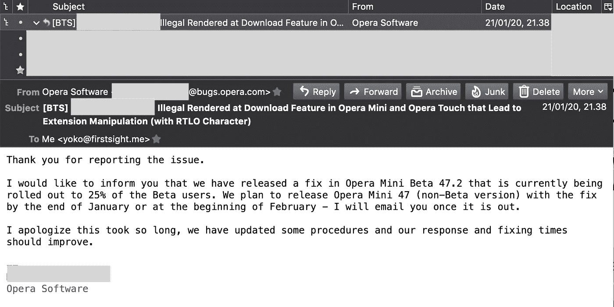
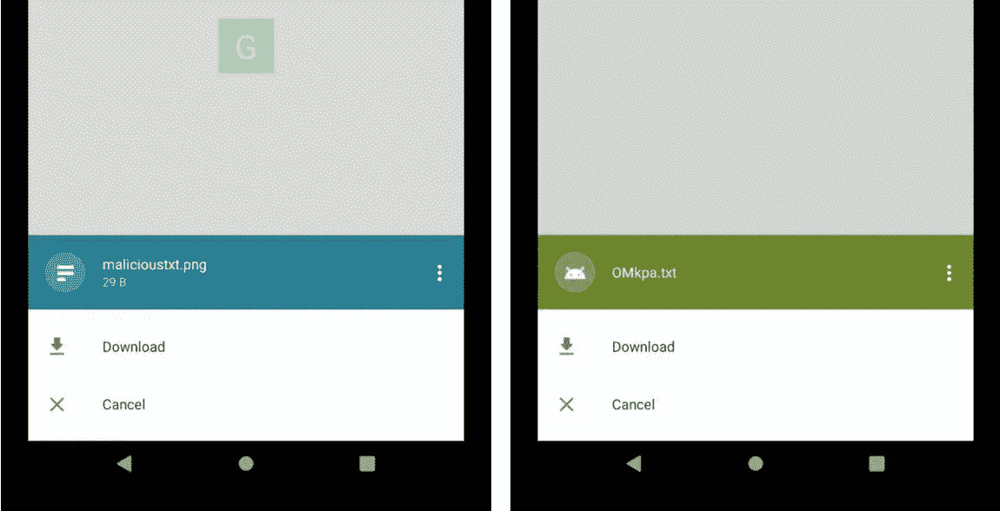
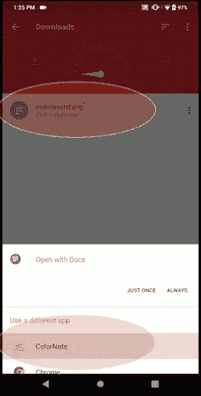
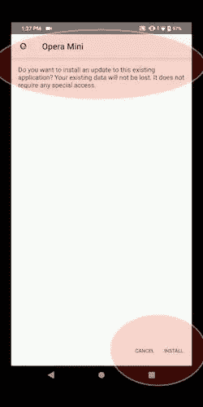
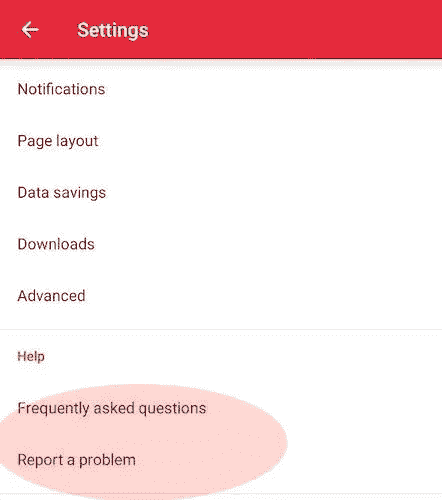

# 几个应用程序(包括 Opera Mini)的下载功能非法渲染，导致扩展操作(与 RTLO)

> 原文：<https://infosecwriteups.com/illegal-rendered-at-download-feature-in-opera-mini-that-lead-to-extension-manipulation-with-rtlo-685bf2d77d51?source=collection_archive---------0----------------------->

## 当你下载一个看起来“合法”的文件，但是当你运行这个文件时，它却改变了。

بسم الله الرحمن الرحيم

**更新一(2020 年 1 月 21 日):** Opera 已回复邮件并确认报告的问题。那一次，Opera 也为他们的延迟回应道歉。



歌剧的回应

**更新二(2020 年 2 月 27 日):** Opera 通知是否 Opera Mini 47 已经发布，正在铺开 50%。他们也提供很好的 HoF(我还没有提供需要的信息)。

```
S*o, let say you download the .png file. But when you try to open it, the file will be executed as a malicious .apk file. * *Yes, this happens at least in Opera Mini and few applications that have download feature.**As a little note, we also added few simple bug hunting tips related this RTLO things at the end of article.*
```

## I. TL 速度三角形定位法(dead reckoning)

将文件名改为:恶意 <rtlo_char><fake_ext>。 <real_ext>例如:**恶意%E2%80%AEtxt.apk**</real_ext></fake_ext></rtlo_char>

当浏览器下载功能无法完美解析字符时，文件名将更改为 **maliciouskpa.txt**

在 Opera Mini(Android 版)下载功能中非法渲染 RTLO 角色

## 二。介绍

正如我们所知，大多数已开发的浏览器都具有可供用户下载任何文件的功能。但有时当浏览器无法解析用作文件名(在下载功能上)或 URL 的字符时，会出现问题。

在这种情况下，我们发现有些浏览器无法完美呈现 RTLO 字符，攻击者可以利用这个问题来自动操纵文件名。

**2.1。关于 RTLO 的几个字**
老实说，我们无法从技术角度或处理字符的标准上很好地解释这一点。但是，一般我们知道，这个世界的人物分为两种模式，分别是**从左到右**和**从右到左**人物。我们在这个世界上知道的著名的**从右到左**读法是阿拉伯文字。

基于一些参考资料，有一个标准的方法被用来处理从右向左书写的文本。基本上，这允许计算机交换信息，不管使用什么语言。

所以，简而言之，通过使用这种方法，计算机将识别已经输入的字符。

参考资料:
[https://krebsonsecurity . com/2011/09/right-to-left-override-AIDS-email-attacks/https://krebsonsecurity . com/2011/09/right-to-left-override-AIDS-email-attacks/](https://krebsonsecurity.com/2011/09/right-to-left-override-aids-email-attacks/https://krebsonsecurity.com/2011/09/right-to-left-override-aids-email-attacks/)
[https://blog . malware bytes . com/cyber crime/2014/01/the-rtlo-method/](https://blog.malwarebytes.com/cybercrime/2014/01/the-rtlo-method/)

## **三。测试环境**

比如我们以 Opera 为例(因为有些节目要求不发布全披露)。

这是我们用来重现这个问题的环境:

*   **用过的设备**:华硕 Max Pro M1 (4/64GB)
*   **操作系统**:Android 9(2019 年 5 月 1 日更新)
*   【Android 版 Opera Mini:44 . 1 . 2254 . 142553(2019 年 8 月 29 日构建)——我们报道的版本(因为我们超过一个月没有得到回应——*让我们假设如果从他们的角度来看它没有触及安全栏*——那么我们认为这将有利于发布文章)。
    最新版本(2019 年 9 月 19 日- 44.1.2254.143214)也仍然存在漏洞。
*   **更新 III(2020 年 06 月 06 日)**:此问题触及安全栏，Opera 已修复此问题，如本文第一部分所提供的信息。

## 四。复制步骤

例如，攻击者想要将此场景“发送”给受害者:

*   攻击者的**原**文件类型为:. txt。
*   攻击者的**文件名**为:恶意
*   在这种情况下，攻击者**想要操纵**扩展名，因此受害者会将文件视为图像格式(扩展名为. png)。在这种情况下，攻击者会给文件名加上:**恶意%E2%80%AEgnp.txt** 。
*   当该文件被易受攻击的浏览器(在这种情况下，Opera Mini)下载时，该文件将在受害者的设备上保存为:**malicioustxt.png**。
*   即使这个文件保存为. png 格式，Android 仍然会以。txt(因为**原来的格式是**。txt，不是。png)。
*   当然，我们也可以对其他影响不好的人这样做。比方说，最初的扩展名是。apk，所以我们用。txt 或其他正常扩展名。

请注意， **%E2%80%AE** 字符是用作 **RTL 覆盖**[https://www . char base . com/202 e-unicode-right-to-left-Override](https://www.charbase.com/202e-unicode-right-to-left-override)的 **unicode U+202E**

## 动词 （verb 的缩写）PoC 视频

为了补充说明，我们添加了一个简单的 PoC 视频来展示这种情况:

*   GDrive 上有 2 个文件，即。txt 文件(在左边)和。右边是 apk(文件)；
*   在这种情况下，我们采取了直接下载链接。所以当用户想下载文件时，他们会看到被 RTLO 字符操纵过的扩展名；
*   视频中的**第一种情况**，用户将下载。txt 文件，但该文件将被保存为 png。当**用户想要打开**下载的文件时，文件**将被执行为。txt** (原格式)；
*   视频中的**第二种情况**，用户将下载。apk 文件，但该文件将被保存为 txt。同样，当**用户想要打开**下载的文件时，**文件将作为。apk** 并尝试安装程序(原始格式)。

## 不及物动词截图详情

在下面的截图中，我们可以看到 Opera Mini 是否将扩展渲染为。png 为原。txt 文件(左边的文件)并将扩展名呈现为。txt 为真实。apk 文件(右图)。



下载为。png(左一)并下载为。txt(右一)

当我们试图打开一个名字为**malicioustxt.png**的文件时(上图左边的)，Android 会将其识别为一个. txt 文件(原始格式)。



Android 将该文件识别为。即使名字是。png

而对于文件名为 **OMkpa.txt** 的文件，那么 Android 会执行为。apk 格式。从 Opera 想装程序的行为就可以看出来。



Opera Mini 正在尝试安装软件

## 七。报告时间表

Android 版 Opera Mini 浏览器:

*   **2019 年 9 月 10 日:**经[https://security.opera.com/report-security-issue/](https://security.opera.com/report-security-issue/)到达歌剧院。通过这条线报告可能是一个错误，因为你不会收到任何确认。我们建议您通过应用程序中的“报告问题功能”进行报告:



应用内的“报告问题”功能

即使你仍然没有收到反馈，那么至少你知道你的邮件已经到达他们那里(因为他们的自动回复)。

*   **2019 年 9 月 10 日:** Opera 看了几次 PoC 视频。
*   **2019 年 9 月 23 日:**试图联系他们询问情况，仍未得到任何信息。(也许他们现在真的很忙，或者从他们的角度来看，这没有触及安全栏)。
*   **注意:**之前我们以为在最新发布版本(2019 . 9 . 19)中是否修复了这个问题。但当我们几天前试图再次重现该问题时，我们发现它仍然容易受到攻击。不知道为什么它能工作，但不知何故却不能。
*   **2019 年 10 月 30 日:**指定为 CVE-2019–18624。
*   **更新一:**2020 年 1 月 21 日:Opera 已回复邮件并确认报告的问题。那一次，Opera 也为他们的延迟回应道歉。
*   **更新二:**2020 年 2 月 27 日:Opera 通知 Opera Mini 47 是否已经发布，正在铺开 50%。他们也提供很好的 HoF(我还没有提供需要的信息)。

简单地说，我们也向一个知名平台上我们最喜欢的 bug bounty 程序报告了这个类似的问题。和往常一样，他们不需要询问他们的状态，就能非常迅速地回应和解决问题(并给予丰厚的回报)。到目前为止，他们总是 1 天回应，5 天改善。

*   **2019 年 7 月 22 日:**某知名平台报道
*   **2019 年 7 月 24 日:**为迟到的回复道歉(因为通常他们只需要 1 天，而这次需要 2 天——很酷，不是吗？).

他们很快就解决了问题(在接下来的几天里)，并给了一笔可观的奖金(像往常一样)。

另一方面，我们也向其他计划报告此事，并在 9 天内获得有良好积分的回应。

## 八。闭幕

在这篇文章中，我想感谢 Rafay Baloch 。[从他在 2016 年写的一篇](https://www.rafaybaloch.com/2017/06/google-chrome-firefox-address-bar.html)(涉及谷歌 Chrome 和 Firefox for Android 通过使用 IP+RTL 的组合进行地址栏欺骗)中，我可以了解到这个 RTLO 的事情。

另一个学分:

*   HackerOne 的文件上传功能中的 RTLO:[https://hackerone.com/reports/298](https://hackerone.com/reports/298)
*   在 HackerOne 的重定向功能中使用 RTLO 进行域名欺骗:[https://hackerone.com/reports/299403](https://hackerone.com/reports/299403)

作为一个附加信息，如果你想尝试重现这个问题，那么这里是 Android 的 Opera Mini 的受影响版本:

*   版本 44 . 1 . 2254 . 143214(2019 年 9 月 19 日发布):[https://apk pure . com/opera-mini-fast-we B- browser/com . opera . mini . native/variant/44 . 1 . 2254 . 143214-APK](https://apkpure.com/opera-mini-fast-web-browser/com.opera.mini.native/variant/44.1.2254.143214-APK)
*   版本 44 . 1 . 2254 . 142659(2019 年 9 月 3 日发布):[https://apk pure . com/opera-mini-fast-we B- browser/com . opera . mini . native/variant/44 . 1 . 2254 . 142659-APK](https://apkpure.com/opera-mini-fast-web-browser/com.opera.mini.native/variant/44.1.2254.142659-APK)
*   版本 44 . 1 . 2254 . 142553(2019 年 8 月 29 日发布)[https://apk pure . com/opera-mini-fast-we B- browser/com . opera . mini . native/variant/44 . 1 . 2254 . 142553-APK](https://apkpure.com/opera-mini-fast-web-browser/com.opera.mini.native/variant/44.1.2254.142553-APK)

## 九。与 RTLO 事物相关的捕虫技巧

从这篇非常简单文章中，我们可以得出结论，如果 RTLO 的东西可能成为各种特性的安全问题(甚至不是每个程序都这样认为，但值得一试)。此时我们能想到的是:

9.1。在这种情况下，我们可以测试应用程序的上传功能是否容易受到扩展操作的攻击。
此外，当我们谈论“文件名”和“上传功能”时，它不仅限于一个 web 应用程序，因为它也可能“用于”信息、电子邮件和其他具有上传功能的类似应用程序。
**参考(hacker one)**:[https://hackerone.com/reports/298](https://hackerone.com/reports/298)
**参考(电报)**:[https://securelist . com/zero-day-vulnerability-in-Telegram/83800/](https://securelist.com/zero-day-vulnerability-in-telegram/83800/)

**9.2。RTLO 在 filename via cloud drive storage**
与前一个类似，只是尝试将包含 RTLO 名字的文件上传到 cloud drive storage，然后看看会发生什么。
**参考(黄牛 App 套件)**:[https://hackerone.com/reports/210354](https://hackerone.com/reports/210354)

9.3。聊天功能中的 RTLO
它也可以在每个有聊天功能的应用程序中测试(不仅仅是一个本地聊天应用程序)。在它的实现中，它可以用来切换扩展或者创建一个假的 URL，例如:*https://evil.com/RTLO/moc.rettiwt*。如果脆弱，不知何故它会切换到*twitter.com/moc.live//:sptth*。(这件事发生在脸书 bug 报告聊天会上)。

在其他情况下，它也只是将后面的东西切换到前面(就像 Chrome 和 Firefox 上的[地址栏通过 IP+RTL 欺骗](https://www.rafaybaloch.com/2017/06/google-chrome-firefox-address-bar.html))。
**参考(Snapchat)**:[https://hackerone.com/reports/196222](https://hackerone.com/reports/196222)

9.4。除了聊天功能之外，我们还可以在一个有帖子功能的应用程序中测试这一点。在 GitLab 的例子中，RTLO 问题适用于描述领域。从这里，我们还可以得出结论，如果这个 RTLO 问题可以在每一个有能力张贴诸如“网站地址”信息、张贴回复等内容的应用程序中工作。
**参考(git lab)**:[https://gitlab.com/gitlab-org/gitlab-foss/issues/29365](https://gitlab.com/gitlab-org/gitlab-foss/issues/29365)

**9.5。RTLO 在《警告》中的重定向功能**
这个 RTLO 的东西也可能被用来试图恶搞域名与普通拉丁文(LTR)和 RTLO 字符的结合。
**参考(hacker one)**:[https://hackerone.com/reports/299403](https://hackerone.com/reports/299403)

**9.6。RTLO 在浏览器的地址栏**
从 Rafay 的一篇文章中，我们可以看出他是否成功地通过 IP 地址和 RTLO 字符的组合盗用了域名。例如:*https://evil _ IP _ Address/RTLO/Google . com/log in*成为【google.com/login/RTLO/evil_IP_Address.】
**参考(谷歌 Chrome 和火狐 for Android)**:[https://www . rafaybaloch . com/2017/06/Google-Chrome-Firefox-Address-bar . html](https://www.rafaybaloch.com/2017/06/google-chrome-firefox-address-bar.html)

9.7。RTLO 在浏览器的下载功能
这个例子已经在这篇简单的文章中解释过了。作为一个注意，**对于“浏览器”的东西，它并不局限于**只有原生浏览器的下载功能。还有**应用内浏览器**(例如，存在于**消息应用**的浏览器)以及**少数密码管理器应用**(也就是说，它们大多也有应用内浏览器)。
**参考(Opera Mini for Android)** :本文或[http://first sight . me/2019/10/launch-rendered-at-download-feature-in-number-apps-including-Opera-Mini-tha-lead-to-extension-manipulation-with-rtlo/](http://firstsight.me/2019/10/illegal-rendered-at-download-feature-in-several-apps-including-opera-mini-that-lead-to-extension-manipulation-with-rtlo/)

*关注* [*Infosec 报道*](https://medium.com/bugbountywriteup) *获取更多此类精彩报道。*

[](https://medium.com/bugbountywriteup) [## 信息安全报道

### 收集了世界上最好的黑客的文章，主题从 bug 奖金和 CTF 到 vulnhub…

medium.com](https://medium.com/bugbountywriteup)