# 图像和地理空间信息

> 原文：<https://infosecwriteups.com/image-geospatial-osint-7cf8560b54f6?source=collection_archive---------1----------------------->

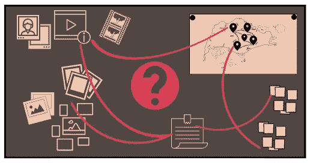

在本文中，我学习了如何使用开源智能(OSINT)技术和工具从图像或视频文件中收集信息。然后，我可以使用这些信息来进行地理定位，并仅基于视觉智能来回答环境问题。这个挑战在 [TryHackMe](https://tryhackme.com/) 平台上有，标题为“**探照灯—艾明特**，由用户“[文泽](https://twitter.com/Zewensec) 创建。

# 挑战 1

## 挑战问题和答案

> 这张照片拍摄地的街道名称是什么？

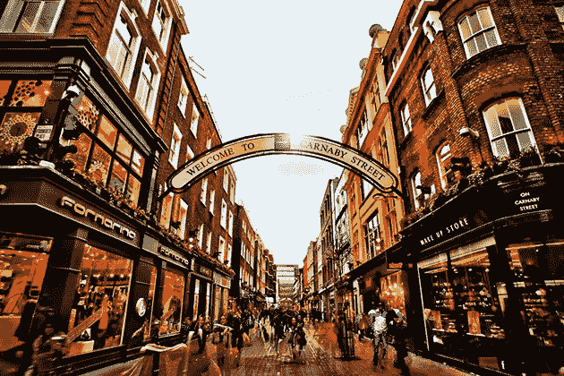

挑战 1 形象。

查看图片，我们可以看到一个欢迎标志，将街道名称标识为“*卡纳比街*”。

# 挑战 2

## 挑战描述

> 接下来的几个挑战将会提出多个问题，您需要根据从图像中提取的信息来回答这些问题。

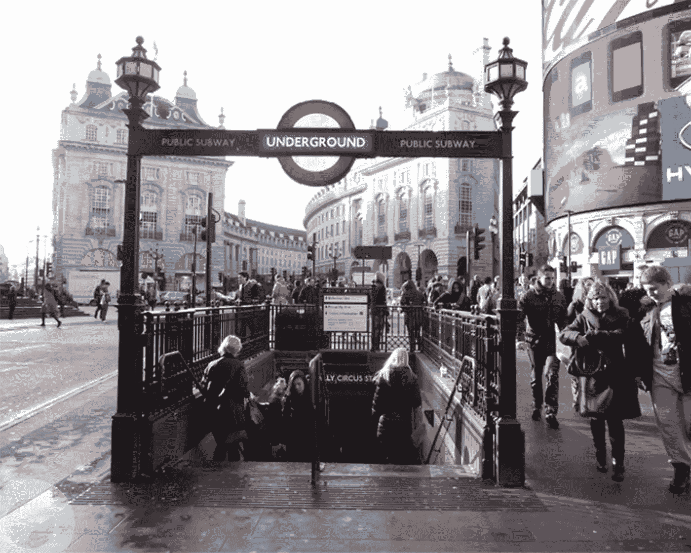

挑战 2 形象。

## 挑战问题和答案

> 1.地铁站在哪个城市？

这个标志很容易认出是伦敦地铁系统。

> 2.这些楼梯通向哪个地铁站？
> 
> 3.这个车站是哪一年开业的？
> 
> 4.这个车站有几个站台？

我可以看到楼梯上方一个部分模糊的标志，上面写着“*马戏团*”。在谷歌上快速搜索会发现一个名为“ [*皮卡迪利广场*](https://en.wikipedia.org/wiki/Piccadilly_Circus_tube_station) 的地铁站，它于 1906 年**开放，有**四个站台**。**

# **挑战 3**

## **挑战描述**

> **这个挑战将要求你做一些“谷歌呆子”来回答下面的问题。浏览图像以获取数据，并记住引言中的问题——您是否在图像中看到任何可用于搜索查询或帮助您缩小潜在位置范围的内容？**

## **挑战问题和答案**

**试图打开图像文件会导致错误。我使用 Linux **文件**命令检查图像，看到它是一个扩展名为. jpg 的 PNG 文件。**

```
$ file task4.jpg

task4.jpg: **PNG image data**, 478 x 267, 8-bit/color RGB, non-interlaced
```

**将文件扩展名更改为。png 允许我打开图像。**

**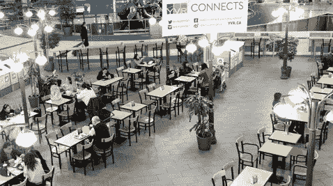**

**挑战 3 形象。**

> **1.这张照片是在哪个建筑里拍的？**

**我可以看到图像背景中的一个大型广告牌，上面有网站域名“ [yvr.ca](https://www.yvr.ca/en/passengers) ”。这是温哥华国际机场的网站，这是这张照片拍摄的建筑。**

> **2.这座建筑位于哪个国家？**

**温哥华国际机场位于加拿大。**

> **3.这座建筑位于哪个城市？**

**温哥华国际机场位于加拿大的里士满**

# **挑战 4**

## **挑战描述**

> **我的一个朋友联系我，问我是否能帮他们找到一家咖啡馆，据说那里有 T2 最好的午餐。他们告诉我咖啡店在苏格兰的某个地方，他给我发了这两张照片。你能帮我找到它并回答下面的问题吗？**

## **挑战问题和答案**

**正如在挑战 4 中看到的，当我试图打开挑战文件时，我得到了同样的错误。我需要把文件扩展名改成。png 而不是. jpg。**

****

**挑战 4 形象。**

## **挑战问题和答案**

> **1.这家咖啡店位于哪个城市？**

**我可以在图片的背景中看到“*爱丁堡毛纺厂*的标志。我知道咖啡店位于苏格兰的某个地方，所以我搜索了位于苏格兰的任何"*爱丁堡毛纺厂*"商店。**

**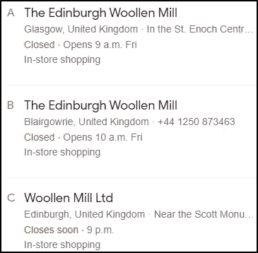**

**位于苏格兰的商店。**

**我查看了搜索返回的所有图片，找到了一家位于 [Blairgowrie](https://www.google.com/imgres?imgurl=https%3A%2F%2Fs0.geograph.org.uk%2Fgeophotos%2F01%2F64%2F75%2F1647585_dad7aa85.jpg&imgrefurl=https%3A%2F%2Fwww.geograph.org.uk%2Fphoto%2F1647585&tbnid=hrIb-rqaOx4dzM&vet=12ahUKEwiN4Yr_i_H2AhXrVfEDHXgoDd4QMygTegUIARDbAQ..i&docid=hn_0-wFKcPoCNM&w=640&h=427&q=the%20edinburgh%20woollen%20mill%20scotland&hl=en&ved=2ahUKEwiN4Yr_i_H2AhXrVfEDHXgoDd4QMygTegUIARDbAQ) 的"*The Edinburgh wool Mill*"商店，与挑战文件相匹配。**

> **2.这家咖啡店位于哪条街？**

**由于“*The Edinburgh wool Mill*”商店的入口正对着图像中的咖啡店，所以我可以在谷歌地图上看到，在“ *Allan Street* ”商店的正对面有一家咖啡店。**

**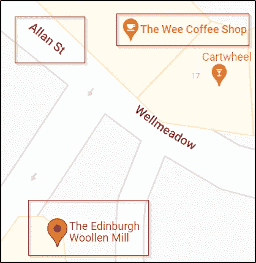**

**谷歌地图街道名称。**

> **3.他们的电话号码是多少？**

**在谷歌地图上选择“ *Wee Coffee Shop* ”，我可以在商店详情下看到他们的电话号码。**

**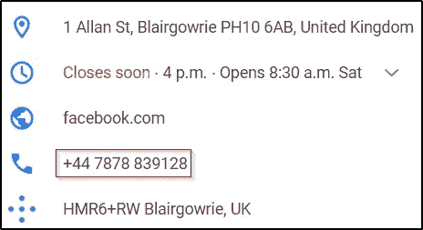**

***Wee 咖啡店*电话号码。**

> **4.他们的电子邮件地址是什么？**

**在快速搜索“ *The Wee Coffee Shop* ”时，我找到了这家店的[猫途鹰](https://www.tripadvisor.ie/Restaurant_Review-g191250-d2519557-Reviews-The_Wee_Coffee_Shop-Blairgowrie_Perth_and_Kinross_Scotland.html)页面，其中包括这家店的电子邮件地址链接。**

**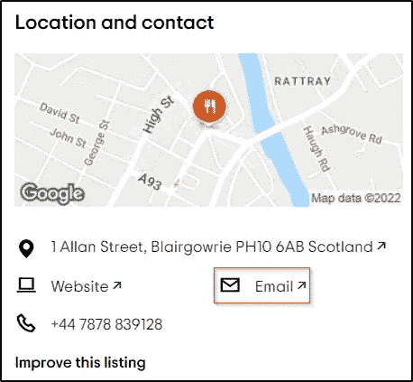**

**电子邮件地址。**

> **5.业主姓什么？**

**如果你继续往下看猫途鹰页面，你会看到一个 Q 区，有人在这里问谁是所有者。**

**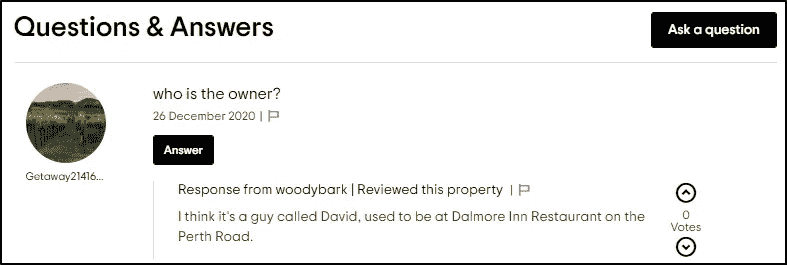**

**猫途鹰问答区。**

**看来主人的名字是“*大卫*”。我搜索了“*小咖啡店*，指定了名字“*大卫*”。我找了一个[旅游网站](https://www.barba.org.uk/blairgowrie-and-rattray-businesses/the-wee-coffee-shop)，上面显示了业主的姓氏。**

**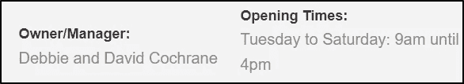**

**所有者姓氏。**

# **挑战 5**

## **挑战描述**

> **使用下面的任务文件执行反向图像查找，并回答问题。**

**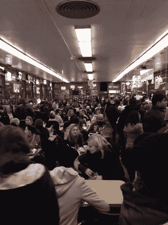**

**挑战 5 形象。**

## **挑战问题和答案**

> **1.这张照片是在哪家餐馆拍的？**

**使用 Chrome 进行反向图像查找，我发现这家餐厅是“ *Katz's Deli* ”。**

**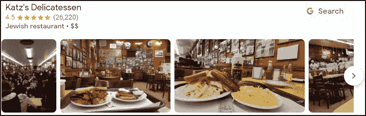**

**餐馆名称。**

> **2.在这家餐厅 24 小时工作的 Bon Appétit 编辑叫什么名字？**

**我在谷歌上快速搜索了一下，找到了一篇关于 bon appétit 的文章，标题是“ [*在卡茨熟食店连续工作 24 小时是什么感觉*](https://www.bonappetit.com/story/katzs-deli-24-hours) ”。我看到在那里工作了 24 小时的编辑的名字是“*安德鲁·诺尔顿*”。**

**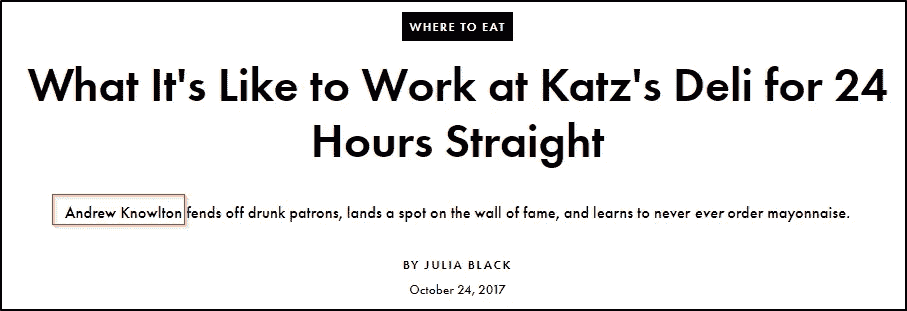**

**在这家餐厅 24 小时工作的 Bon Appétit 编辑的名字。**

# **挑战 6**

## **挑战描述**

> **这个挑战需要你运用我到目前为止提到的一些技术:扫描图像寻找视觉线索，反向图像搜索和谷歌搜索。工具不应该是你的主要关注点——不要低估你在搜索结果上的进步。**

**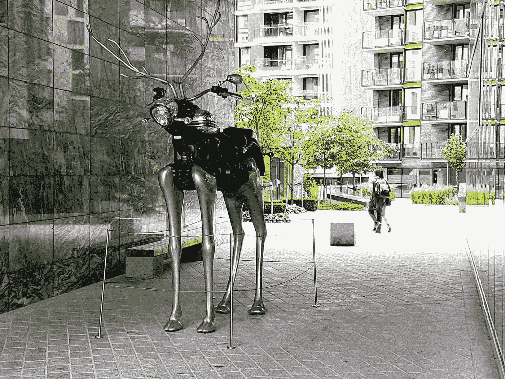**

**挑战 6 形象。**

## **挑战问题和答案**

> **1.这座雕像叫什么名字？**

**搜索“*驯鹿摩托车雕像*”会显示与上面看到的挑战文件类似的图像结果，包括一个到这个[网站的链接](https://www.alamy.com/rudolph-the-chrome-nosed-reindeer-sculpture-motorcycle-sculpture-by-magne-furuholmen-and-apparatjik-in-tjuvholmen-in-oslo-norway-image353235023.html)，它提供了雕像的名称(*铬鼻驯鹿鲁道夫*)。**

> **2.谁拍的这张照片？**

**我用谷歌进行了反向图片搜索，找到了一个名为 [VisitOSLO](https://www.google.com/search?tbs=sbi:AMhZZisRzEb80ThZo9JMGBoaCdFOA_1dFgOnX4P0TQD4begMXxQ3LTVe8Qhp32zftvLttd44ZRskZwXJE3xxqJfHKiJ9884egSyOIV0brRlYif_1rATSEIpdINSXZVdm4OQK-bXdqyGQ05sW1dktdGfEiLTNxmbgKtgl4fRFzE0b1u4rJg9WEMpq9I3vZvI74RazqOYXF4hCp9iGxJPh_1gUP27_1bq1RYih86-vLVyzNRgMyApbYyP-PvjxiyaNUi_1p7WoEw_1F9MD77RZSbUxKXdg30eIPeujNrjdR2JF1jI5CyyI33yRZplfsG9wnBF2Xgy9gY1Xn4k248&hl=en-IE) 的旅游网站的链接，该网站提供了一个户外雕塑的列表。**

**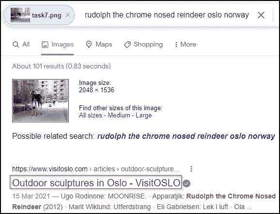**

**VisitOSLO 旅游网站。**

**该网站提供了一个可点击的地图，显示了奥斯陆一些最受欢迎的雕塑的位置。根据上面问题 1 中看到的网站提供的信息，我知道该状态位于“*挪威奥斯陆的 Tjuvholmen*”。在地图上，我可以看到“ *Tjuvholmen* 这个词被一个图标遮住了一部分。单击此图标会提供与挑战文件和拍摄照片的摄影师相同的图像。**

**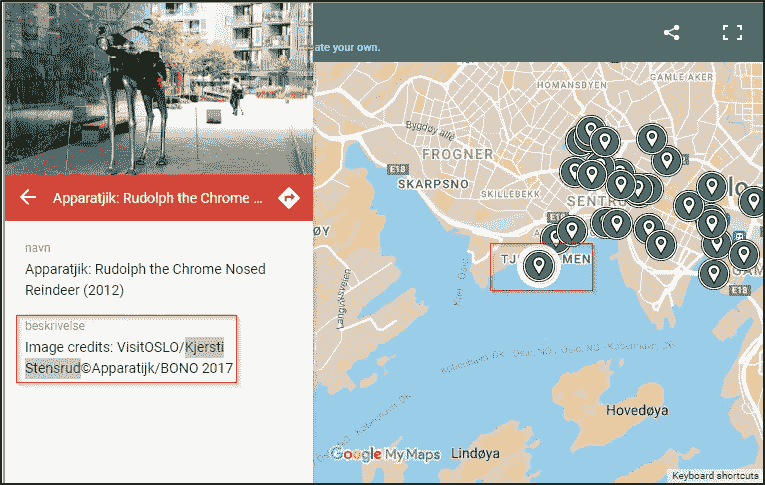**

**摄影师姓名。**

# **挑战 7**

## **挑战描述**

> **这个挑战的难度比之前的挑战更高，你不应该期望很快解决这个问题，尤其是如果你是 IMINT 的新手。虽然到目前为止你肯定可以运用你已经用过的技术和工具，但是这个挑战可能会迫使你在解决这个挑战的时候改变你的想法和方法。**

****

**挑战 7 形象。**

## **挑战问题和答案**

> **1.这座雕像所描绘的人物叫什么名字？**

**这座雕像展示了一个被蒙住眼睛、高举两个天平的女人。这座雕像代表了“[正义女神](https://en.wikipedia.org/wiki/Lady_Justice)”，**司法系统中道德力量的寓言式化身**。她的属性是眼罩、鳞片和剑。她经常和普鲁登蒂亚成对出现。**

> **2.这座雕像位于哪里？**

**我用谷歌对雕像图像进行了反向图像查找，看到了几个视觉上相似的图像。**

**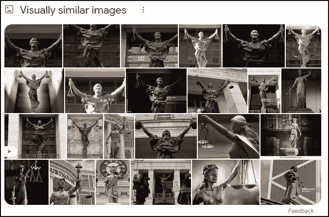**

**视觉上相似的图像。**

**浏览这些视觉上相似的图片，我发现其中一张图片曾在[americanprogress.org](https://www.americanprogress.org/article/past-time-congress-expand-lower-courts/)的文章中使用过。本文中使用的图片包含了它所在位置的详细信息。**

**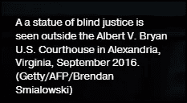**

**雕像位置。**

> **3.这座雕像对面的建筑叫什么名字？**

**我用谷歌地图确定了这座雕像所在的“*艾伯特诉布赖恩美国法院*”对面的建筑。我也可以用街景来证实这一点。**

**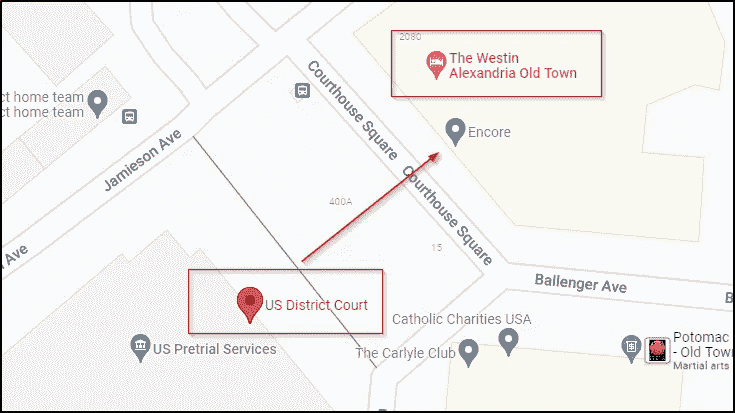**

**谷歌地图。**

# **挑战 8**

## **挑战描述**

> **下载附件视频，回答问题。**

## **挑战问题和答案**

> **1.我朋友住的酒店叫什么名字？**

**观看视频，我可以看到一些关键的地标，帮助我确定我们是在新加坡。**

**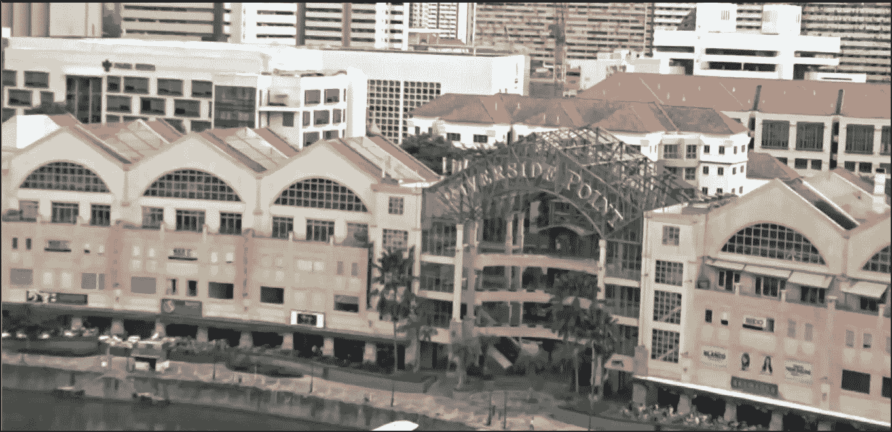**

**新加坡的河滨角。**

**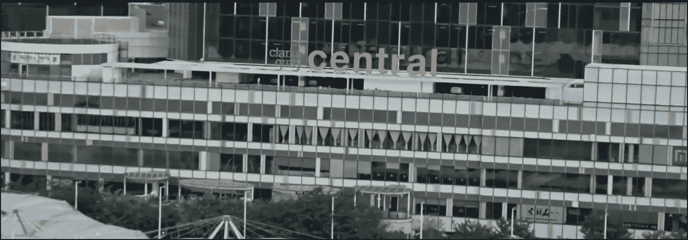**

**新加坡克拉克码头中心。**

**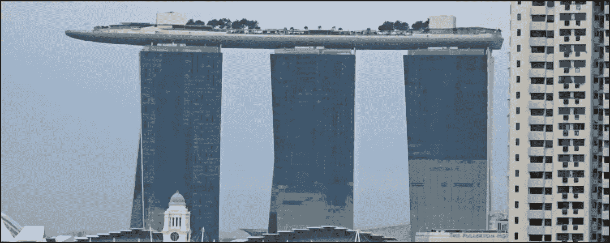**

**新加坡滨海湾金沙酒店。**

**利用这些地标，我可以使用谷歌地图来了解我相对于其他建筑的位置。**

**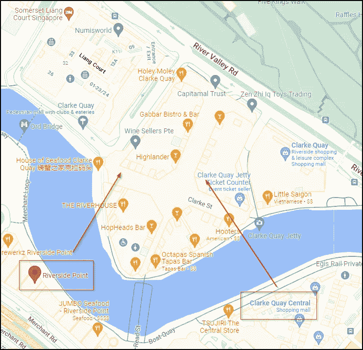**

**谷歌地图。**

**降落到“*克拉克码头中央*”外的街景，我可以回头看河对岸，看到拍摄视频的酒店。我看到大楼的名字是“*诺富特*”。**

**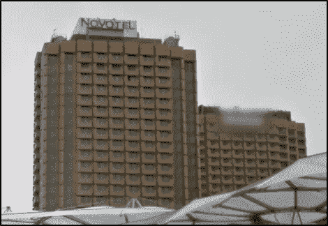**

**酒店大楼。**

**在谷歌上搜索“诺富特”,可以找到酒店的全称。**

**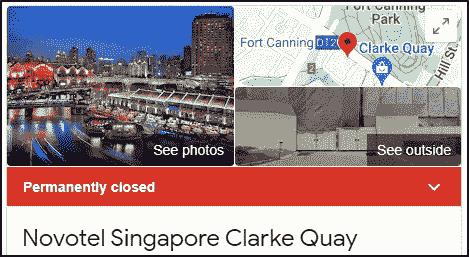**

**新加坡诺富特克拉克码头酒店。**

# **最后的想法**

**我真的很喜欢在这个房间工作，并有机会了解更多关于图像情报和地理空间情报的知识。这个挑战有一个很好的进展，我学到了很多仅仅通过分析照片或视频来收集信息的方法。谢谢你一直读到最后，继续黑下去😄！**