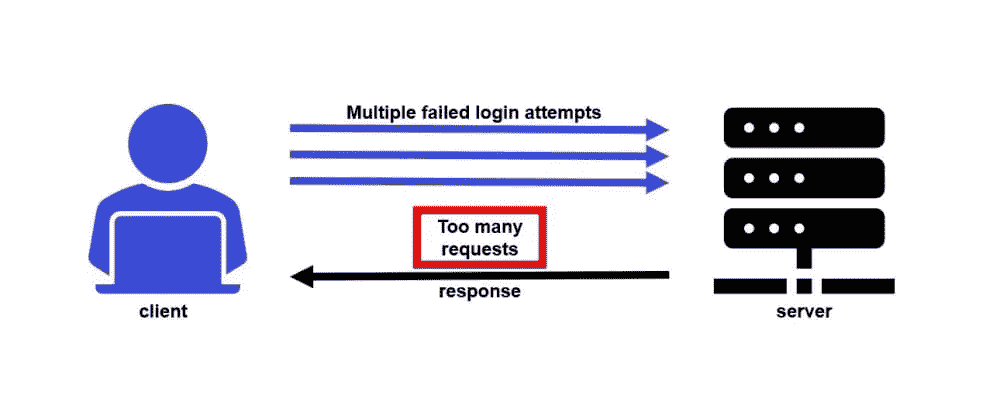
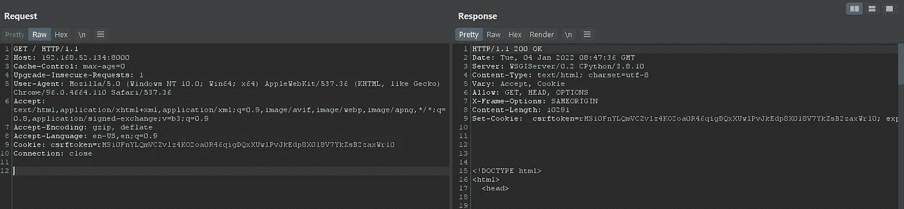
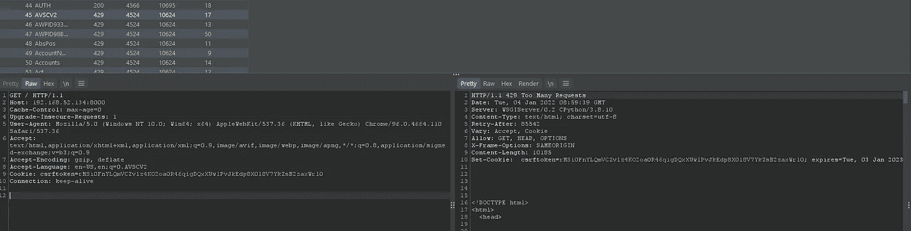
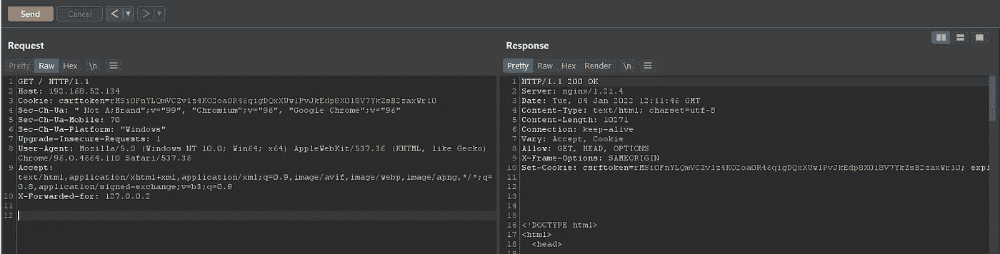
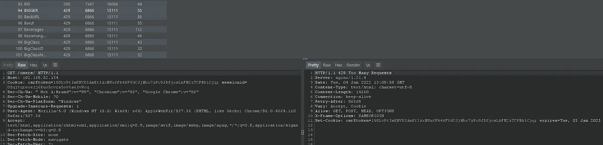

# 实现 Django-rest API 节流和未经认证的旁路

> 原文：<https://infosecwriteups.com/implementing-django-rest-api-throttling-and-unauthenticated-bypass-dda550b07443?source=collection_archive---------1----------------------->

以上帝的名义。

嗨，研究者们，

在这篇文章中，我们将通过节流实现一个 Django-Rest 项目，并尝试绕过这个特性。如果你以前没有和 Django 一起工作过，或者对它没有任何概念，不要担心，我们将一步一步地解释它，这样我们对正在发生的事情有一个清楚的了解。

# 什么是节流？

根据官方博客，节流类似于权限，因为它决定一个请求是否应该被授权。节流表示一种临时状态，用于控制客户端向 API 发出请求的速率。

# 为什么我们使用速率限制？

API 的速率限制也有助于防范恶意 bot 攻击。攻击者可以使用机器人对 API 进行多次重复调用，以至于其他任何人都无法使用该服务，或者使该服务完全崩溃。这是一种 DoS 或 DDoS 攻击。攻击者也有可能滥用该服务的缺失，对登录表单、密码重置页面、OTP 以及所有其他需要大量请求的攻击进行暴力攻击。



# 项目设置

我们将创建一个简单的 API，允许用户查看和编辑系统中的用户和组。

首先，我们需要安装 Django 和 Django Rest 框架:

```
pip install django
pip install djangorestframework
```

使用单个应用程序创建新项目:

```
django-admin startproject tutorial
cd tutorial
python3 manage.py startapp quickstart
```

当我们使用 startapp 时，我们在项目中创建了一个新的应用程序，通过这个功能，我们可以在一个项目中有多个应用程序，例如，我们可以有一个电子商务应用程序和另一个支持应用程序。

现在让我们同步数据库:

```
python3 manage.py migrate
python3 manage.py makemigrations 
```

为了在有用户和没有用户的情况下测试我们的应用程序，我们需要创建一个:

```
python3 manage.py createsuperuser
```

# 序列化程序

序列化器允许将复杂数据(如查询集和模型实例)转换为原生 Python 数据类型，然后可以轻松地呈现到 JSON 中。

为此，我们需要在快速启动应用程序项目`tutorial/quickstart/serializers.py`中创建一个名为“serializers.py”的新文件，并在其中添加以下代码:

```
from django.contrib.auth.models import User, Group
from rest_framework import serializers

class UserSerializer(serializers.HyperlinkedModelSerializer):
    class Meta:
        model = User
        fields = ['url', 'username', 'email', 'groups']

class GroupSerializer(serializers.HyperlinkedModelSerializer):
    class Meta:
        model = Group
        fields = ['url', 'name']
```

# 视图

视图是我们将向最终用户展示的某种东西，打开`tutorial/quickstart/views.py`并向其添加以下内容:

```
from django.contrib.auth.models import User, Group
from rest_framework import viewsets
from rest_framework import permissions
from quickstart.serializers import UserSerializer, GroupSerializer
from rest_framework.response import Response
from rest_framework.throttling import UserRateThrottle
from rest_framework.views import APIViewclass UserViewSet(viewsets.ModelViewSet):
    queryset = User.objects.all().order_by('-date_joined')
    serializer_class = UserSerializer
    permission_classes = [permissions.IsAuthenticated]class GroupViewSet(viewsets.ModelViewSet):
    queryset = Group.objects.all()
    serializer_class = GroupSerializer
    permission_classes = [permissions.IsAuthenticated]
```

# 资源定位符

py 是一个文件，我们在我们的项目中定义我们的路由，将下面的代码添加到`tutorial/urls.py`。

```
from django.urls import include, path
from rest_framework import routers
from quickstart import viewsrouter = routers.DefaultRouter()
router.register(r'users', views.UserViewSet)
router.register(r'groups', views.GroupViewSet)urlpatterns = [
    path('', include(router.urls)),
    path('api-auth/', include('rest_framework.urls', namespace='rest_framework'))
]
```

好了，现在我们将分页添加到我们的设置中，以定义每页将显示多少个对象。打开您的`tutorial/settings.py`,将这些行添加到其中:

```
REST_FRAMEWORK = {
    'DEFAULT_PAGINATION_CLASS': 'rest_framework.pagination.PageNumberPagination',
    'PAGE_SIZE': 10
}
```

最后一个是将“rest_framework”添加到您在上面打开的设置文件中的 INSTALLED_APPS:

```
INSTALLED_APPS = [
    ...
    'rest_framework',
]
```

好了，现在完成了，我们可以用*python 3 manage . py runserver*命令运行我们的服务器，如果你想通过网络访问它，你可以这样做*python 3 manage . py runserver IP:PORT*但是要确保你在设置中把你的 IP 添加到 ALLOWED_HOST

# 设置节流

可以使用`DEFAULT_THROTTLE_CLASSES`和`DEFAULT_THROTTLE_RATES`设置来全局设置默认节流策略。比如说。将这些行添加到您的设置中。py

```
REST_FRAMEWORK = {
    'DEFAULT_THROTTLE_CLASSES': [
        'rest_framework.throttling.AnonRateThrottle',
        'rest_framework.throttling.UserRateThrottle'
    ],
    'DEFAULT_THROTTLE_RATES': {
        'anon': '50/day',
        'user': '100/day'
    }
}
```

“Anon”被称为未经认证的用户,“User”是经过认证的用户，因此他们每天可以创建 100 个请求，Anon 每天可以创建 50 个请求。

# 让我们检查一下

让我们启动我们的 burpsuite，向我们的应用程序发出第一个请求:



如您所见，它已经启动并运行良好，现在，由于我们仍未通过身份验证，让我们发送 50 多个请求来检查我们是否被阻止:



用户在发送超过 50 个请求后被阻止

正如所料，我们现在被阻止，并从服务器接收 429 状态代码，现在的主要想法是如何绕过它，没有任何进一步的调查让我们首先看看[官方文件](https://www.django-rest-framework.org/api-guide/throttling/#how-clients-are-identified)，它谈到如何识别客户端:

> `X-Forwarded-For` HTTP 头和`REMOTE_ADDR` WSGI 变量用于唯一标识用于节流的客户端 IP 地址。如果`X-Forwarded-For`头存在，那么它将被使用，否则来自 WSGI 环境的`REMOTE_ADDR`变量的值将被使用。

记住这一点，我们已经测试了所有这些 http 头，所以让我们用 X-Forwarded-For 头再次发出请求:



绕过带有 X-Forwarded-For 标头的 429

通过这样做，我们再次获得了访问权限！但这里有一个小技巧，我们应该在每 50 个请求后改变转发头的 IP，这样我们就可以无限制地访问服务器，因为我检查过像 127.0.0.111111 这样的 IP 也可以工作。

像 Nginx 这样的一些反向代理可能会添加 X-Forwarded-For 头来告诉服务器用户的 IP 地址:

> 传统上，HTTP 反向代理使用非标准头来向上游服务器通知用户的 IP 地址和其他请求属性:
> 
> X-Forwarded-For:12.34.56.78，23.45.67.89
> X-Real-IP:12.34.56.78
> X-Forwarded-Host:example.com
> X-Forwarded-Proto:https

如果我们自己添加 X-Forwarded-For 头，我们添加的 IP 地址将是第一个值，Nginx 的将是第二个值，所以我们不会面临任何问题。

# 鉴定

当您通过身份验证时，会有一些不同的情况，让我们登录看看:



作为登录用户，我们由于克服了限制策略而被阻止，通过测试上述方法和其他一些方法，用户仍将被阻止，因此这里的行为可能是用户和 IP 一起被阻止。

# 结论

如果您使用这种方法作为您的主要速率限制预防，而没有任何进一步的高级技术来使其更加安全，请注意这种攻击将在您的系统中发生。

# 参考

[](https://www.django-rest-framework.org/tutorial/quickstart/) [## 快速入门

### 我们将创建一个简单的 API，允许管理员用户查看和编辑系统中的用户和组。创建一个…

www.django-rest-framework.org](https://www.django-rest-framework.org/tutorial/quickstart/)  [## 节流

### HTTP/1.1 420 增强您的冷静 Twitter API 速率限制响应节流类似于权限，因为它…

www.django-rest-framework.org](https://www.django-rest-framework.org/api-guide/throttling/)  [## 使用转发的报头

### NGINX 配置和部署转发头的注意事项。

www.nginx.com](https://www.nginx.com/resources/wiki/start/topics/examples/forwarded/) 

# 联系我

[](https://www.linkedin.com/in/hosein-vita-9796ba225/) [## 自由职业者| LinkedIn

### 查看 Hosein Vita 在全球最大的职业社区 LinkedIn 上的个人资料。侯赛因有一个工作列在他们的…

www.linkedin.com](https://www.linkedin.com/in/hosein-vita-9796ba225/) 

[https://twitter.com/HoseinVita](https://twitter.com/HoseinVita)