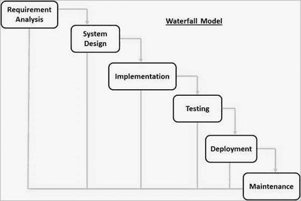
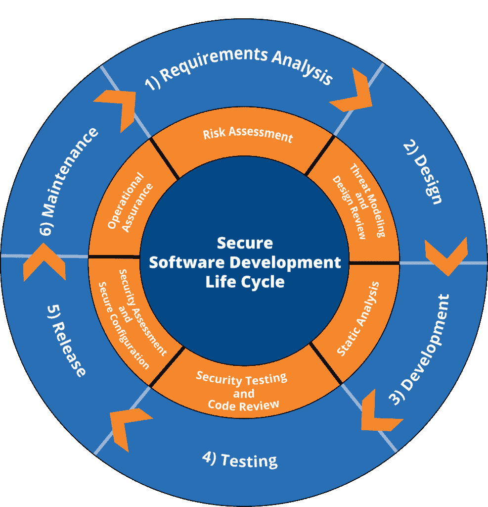

# 在 SDLC 中实现安全性

> 原文：<https://infosecwriteups.com/implementing-security-in-sdlc-631ff4fd5451?source=collection_archive---------2----------------------->

克里斯蒂娜@ wocintechchat.com 在 Unsplash 上的照片

# **简介**

[来源](https://www.tutorialspoint.com/sdlc/sdlc_waterfall_model.htm)

你认为在公司/企业向公众发布应用程序或软件之前、期间和之后会发生什么？他们只是雇佣开发人员并告知他们需求吗？这并不像你想的那么简单。

有一套完整的方法专门用于此，称为**软件开发生命周期(SDLC)** 。它指的是一种方法，在这种方法中，创建高质量软件的过程是明确定义的。因为这是一种方法，所以有各种各样的步骤。它们是:

1.  **计划和收集要求**

这是将 SDLC 付诸实施的第一步。它由团队的高级成员执行，输入来自各种不同的来源。目标是识别问题并为该问题的潜在解决方案产生想法。为了理解客户正在寻找的产品类型和他们真正需要的软件功能，他们从客户那里收集每一个需求。

**2。设计**

在这一步，软件的架构被决定。这一步的结果是定义了架构模块，以及它们将如何与其他内部和外部模块通信。

**3。开发**

如果我们只是决定而不缺乏行动，那么一个产品有什么好处呢？这个阶段是项目实际开发的开始。编写代码是将设计付诸实施的第一步。代码开发和实现是使用编程工具进行的，例如编译器、解释器、调试器和由组织的管理层提供的其他类似工具。

**4。验证和测试**

这与该过程中的任何其他阶段一样重要。正是在这个阶段，软件被测试，以查看它是否按计划执行，是否符合客户的要求。他们通常通过在软件上运行单元测试来进行验证，并寻找由于无效输入或任何类似情况而可能在软件中发生的错误。

**5。部署和维护**

一旦所有的软件都通过了验证，并且没有报告缺陷或错误，它就可以使用了。然后，根据评估的结果，软件可能会以其当前的形式发布，或者在对象部分进行建议的增强。软件安装后，下一步是维护它。一旦客户开始使用设计的系统，真正的问题和需求就会出现，必须定期解决，并根据需要解决。维护是一种特别关注成品开发的实践。

# **在 SDLC 中实施安全性**

[来源](https://www.digitalmaelstrom.net/it-security-services/secure-software-development-lifecycle-ssdlc/)

近年来，我们目睹了许多漏洞、利用和 0 days 的出现。这导致对安全性的依赖比以往任何时候都要高。这有许多原因。安全性只被认为是 IT 安全人员的职责，他们会在很久以后，甚至是在产品发布之后，检查源代码分析。

很多时候事情没有被很好的记录。因此，IT 安全团队会错过很多由开发团队更改或实现的东西，从而增加了攻击面。

执行一次安全审计和很久以后执行安全审计肯定会节省成本，但从长远来看是有害的。这是因为产品上市后修复 bug 的成本很高。这也将导致易受攻击的底层模块的改变，因此，与模块交互的其他组件也必须改变。如果安全性被包含在软件开发生命周期中，情况就不会这样了。

事实上，许多人认为这些阶段中的每一个也应该关注安全方面。这将确保更少的缺陷和更多的安全，为客户和一个更好的公司形象。

SDLC 的每个阶段都应该有助于整个应用程序的安全性，也称为安全软件开发生命周期。

1.  **规划和需求阶段的安全性。**

在规划和需求阶段的最后，您必须对成本估算、所需资源等有一个总体的了解。还必须考虑由于安全问题和可能被忽略的资源而可能产生的成本。在项目的这一阶段，应该对将要执行的技术进行风险评估，评估与之相关的风险，如何处理数据，以及如何以最小的风险安全地存储数据。

**2。安全设计&架构。**

作为此阶段的一部分，我们通常会执行威胁建模，在此过程中，应用程序团队会检查正在实施的各种技术，并寻找可能与之相关的潜在威胁。例如，如果正在实现 SQL 数据库和用户输入，则必须检查用户输入，以确保它们已经过适当的清理。

**3。开发阶段的安全性**

在这个阶段，代码被审查。在代码评审时，开发团队与了解编程及其漏洞的安全团队合作。每个代码片段都要经过彻底的检查，以识别任何漏洞。安全团队检查代码及其实现方式，然后提出建议以最大限度地减少发现的漏洞。可以手动执行，也可以由团队使用工具来执行。市场上有许多源代码审查工具，如“SonarQube”和“Fortify”。

**4。验证和测试中的安全性**

在此阶段，安全团队执行黑盒测试或漏洞评估，以识别和修复应用程序缺陷。使用 web 应用程序渗透测试方法，该团队检查应用程序的流程，并试图在可能的情况下规避逻辑。

**5。部署和维护中的安全性**

验证和测试并不标志着固态硬盘的终结。在实施安全计划后，必须确保其按预期正常运行，并得到相应的管理。可能会出现在验证和测试阶段可能不存在的各种漏洞和 0 天。这些漏洞可能存在于代码中，也可能存在于所使用的开放或封闭的库中。

# **结论**

安全在软件开发生命周期中的重要性怎么强调都不为过。因此，将安全审计和测试纳入软件开发生命周期(SDLC)是至关重要的。IT 安全人员不仅应负责调查软件和应用程序的安全方面，还应负责确保这些方面得到解决。开发人员必须训练有素，并且必须要求他们将安全性作为软件开发生命周期(SDLC)中的一个关键阶段。