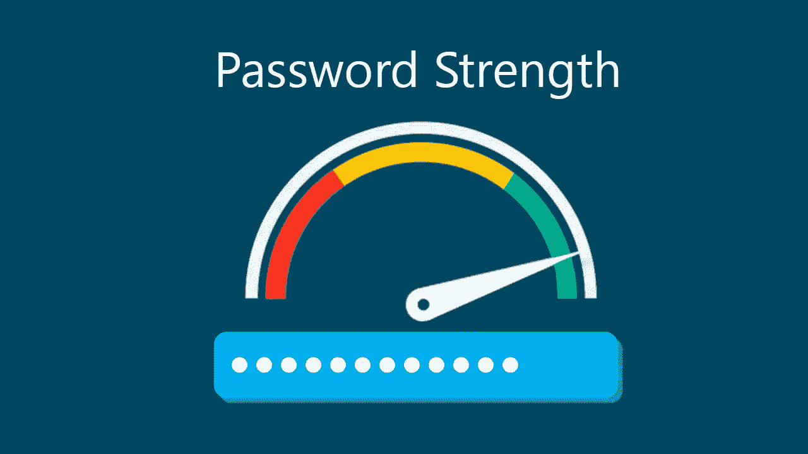
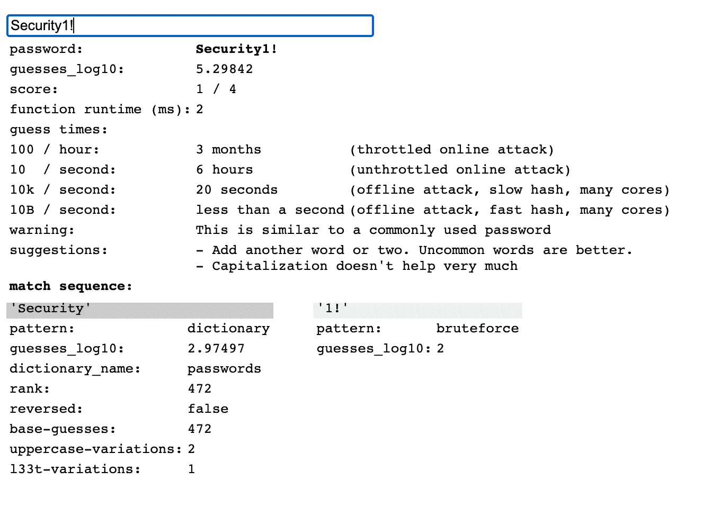

# Zxcvbn 密码强度估计器

> 原文：<https://infosecwriteups.com/implementing-zxcvbn-a-password-strength-estimator-96192af9800a?source=collection_archive---------4----------------------->

为您的 web 应用程序实现 Zxcvbn 相对简单，并且可以在密码安全性方面提供显著的好处。



## 介绍

在本教程中，我们将介绍将 Zxcvbn 集成到您的应用程序中的步骤。

这里有一个互动版给你[试用](https://lowe.github.io/tryzxcvbn/) →

 [## Zxcvbn

lowe.github.io](https://lowe.github.io/tryzxcvbn/) 

密码强度估计器的演示

1.  **安装 Zxcvbn**

第一步是安装 [Zxcvbn](https://github.com/dropbox/zxcvbn) ，通过`npm install zxcvbn`或者直接从 GitHub 库下载库。

**2。实现 Zxcvbn:**

一旦安装了 Zxcvbn，您需要将它包含在您的应用程序中。您可以通过将以下代码行添加到您的应用程序中来实现这一点:

`const zxcvbn = require('zxcvbn');`

或者

`<script type="text/javascript" src="path/to/zxcvbn.js"></script>`

**3。计算密码强度**

要计算密码的强度，可以使用`zxcvbn`函数，该函数将密码作为输入，并返回密码强度的估计值。

```
const password = 'mypassword'; 
const result = zxcvbn(password);
```

**4。“结果”的属性**

下面是用 Javascript 编写的返回函数的属性列表:

```
result.guesses            # estimated guesses needed to crack password
result.guesses_log10      # order of magnitude of result.guesses

result.crack_times_seconds # dictionary of back-of-the-envelope crack time
                          # estimations, in seconds, based on a few scenarios:
{
  # online attack on a service that ratelimits password auth attempts.
  online_throttling_100_per_hour

  # online attack on a service that doesn't ratelimit,
  # or where an attacker has outsmarted ratelimiting.
  online_no_throttling_10_per_second

  # offline attack. assumes multiple attackers,
  # proper user-unique salting, and a slow hash function
  # w/ moderate work factor, such as bcrypt, scrypt, PBKDF2.
  offline_slow_hashing_1e4_per_second

  # offline attack with user-unique salting but a fast hash
  # function like SHA-1, SHA-256 or MD5\. A wide range of
  # reasonable numbers anywhere from one billion - one trillion
  # guesses per second, depending on number of cores and machines.
  # ballparking at 10B/sec.
  offline_fast_hashing_1e10_per_second
}

result.crack_times_display # same keys as result.crack_times_seconds,
                           # with friendlier display string values:
                           # "less than a second", "3 hours", "centuries", etc.

result.score      # Integer from 0-4 (useful for implementing a strength bar)

  0 # too guessable: risky password. (guesses < 10^3)

  1 # very guessable: protection from throttled online attacks. (guesses < 10^6)

  2 # somewhat guessable: protection from unthrottled online attacks. (guesses < 10^8)

  3 # safely unguessable: moderate protection from offline slow-hash scenario. (guesses < 10^10)

  4 # very unguessable: strong protection from offline slow-hash scenario. (guesses >= 10^10)

result.feedback   # verbal feedback to help choose better passwords. set when score <= 2.

  result.feedback.warning     # explains what's wrong, eg. 'this is a top-10 common password'.
                              # not always set -- sometimes an empty string

  result.feedback.suggestions # a possibly-empty list of suggestions to help choose a less
                              # guessable password. eg. 'Add another word or two'

result.sequence   # the list of patterns that zxcvbn based the
                  # guess calculation on.

result.calc_time  # how long it took zxcvbn to calculate an answer,
                  # in milliseconds. 
```

我的推特:[https://twitter.com/AdamJSturge](https://twitter.com/AdamJSturge)
回购:[https://github.com/dropbox/zxcvbn](https://github.com/dropbox/zxcvbn)
互动应用:[https://lowe.github.io/tryzxcvbn/](https://lowe.github.io/tryzxcvbn/)

如果你喜欢阅读这样的故事，并想支持我成为一名作家，可以考虑报名成为一名媒体成员。一个月 5 美元，你可以无限制地阅读数千篇文章，包括我自己的。如果你用我的链接注册，我会给你一点佣金，不需要额外的费用。