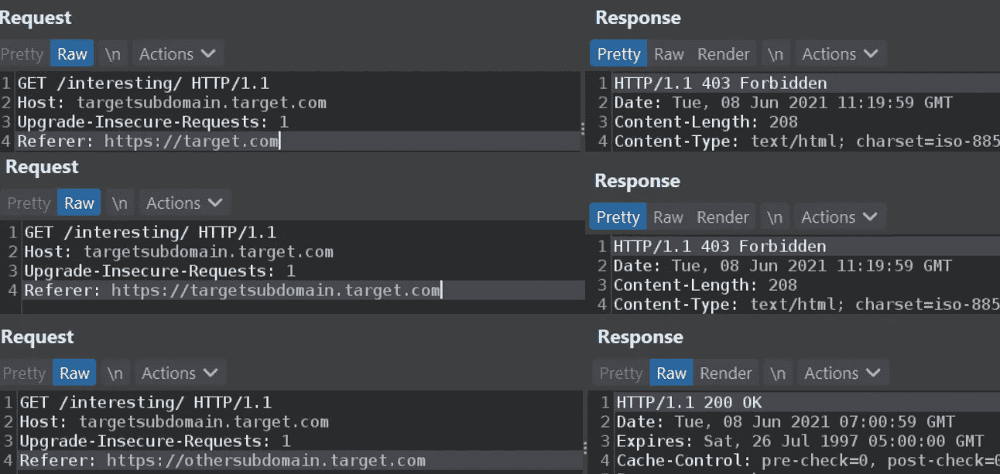

# 打嗝历史分析对旁路 403 的重要性

> 原文：<https://infosecwriteups.com/importance-of-burp-history-analysis-to-bypass-403-afc7af6c08b?source=collection_archive---------4----------------------->

或者，我是如何知道特定的 Referer header 可以产生很大的不同



当谈到 bug 狩猎时，目录暴力是必要的一部分，如果你想涵盖所有的基础。有时，根据 bug bounty 程序的政策，或者仅仅是服务器的配置，像 captcha 或 429 这样的事情，或者只是完全阻止你的 ip 会发生。有很多方法可以解决，但这不是重点。这是关于检查结果，看到有趣的端点被标记为 403，并且未能使用通常的技术(如 Host、x-forwarded-host、x-forwarded-for 等头)绕过它。)，然后呢？是时候向前看了。

**Referer header，以及更广为人知的 bypass** 现在，也许你们中的一些人知道某些端点不接受没有 Referer header 的请求。通常的情况是端点在哪里，例如:
【https://admin.target.com/interestingendpoint.php】T4

除非 Referer 是匹配的子域或至少基本域，它将导致 403 或 404 或重定向。但是，有时，这些价值观也会失效。输入 burp 或任何其他方式来分析在浏览有问题的网站时发生了什么请求和响应。

**Referer header，以及鲜为人知的 bypass** 这纯属偶然。我完成了看起来很有趣的特定子域的 ffuf。一无所获，于是我转向其他子域。这是一个大范围的 bug 赏金计划，所以我有很多其他的目标可以玩。在我忙碌的过程中，我还关注了 burp 的历史，试图找出各种端点与其他端点之间的关系，因为这是一个大范围的目标，所以我还关注了跨子域的交互。然后，我注意到一个熟悉的子域，它的一个端点响应为 200 OK。这促使我更深入地研究它的原因是，问题中的端点是 ffuf 单词表的一部分。为了验证我的困惑，我对整个位置进行了简单的复制/粘贴，得到了 403。Wtf？

**分析**
很自然的，我只是把打嗝历史的请求发送给了复读机，点了发送，得到了 200 OK。所以，这不是侥幸。下一步是删除用户代理，我仍然得到了 200 OK。所以，我尝试删除引用，并得到 403 禁止。好的。进步…算是吧。关于 Referer 头有趣的事情是，它有一个不同于端点的子域(即。不是 https://targetsubdomain.target.com 的 T3，而是 https://othersubdomain.target.com 的 T5 和 T6。我删除了子域名，估计可能只是检查基本域名部分(即 https://target.com)。还有……403 禁止入内。所以，我试着把端点的子域(即。https://target subdomain . target . com)，还有……403 又禁了。不管出于什么原因，只有一个特定的子域允许请求通过，200 OK 是响应。显然，我编辑了请求标题，将 Referer 改为这个“特殊”的子域(即 https://other subdomain . target . com)，得到了预期的 200 OK。

```
**The adjusted ffuf** >ffuf -c -w words.txt -H “Referer: othersubdomain.target.com”  [https://somethingelse.target.com/FUZZ](https://somethingelse.target.com/FUZZ)
```

它只是告诉你，即使像被动侦察这样的事情也可能需要一些主动侦察，以避免假阴性。所以，下次当你有一个大范围的目标，并且它的一个子域有一个返回 403 的有趣的端点，并且没有一个通常的旁路工作时，试着弄乱 Referer 头，但是不要忘记把它和 burp 历史分析结合起来。