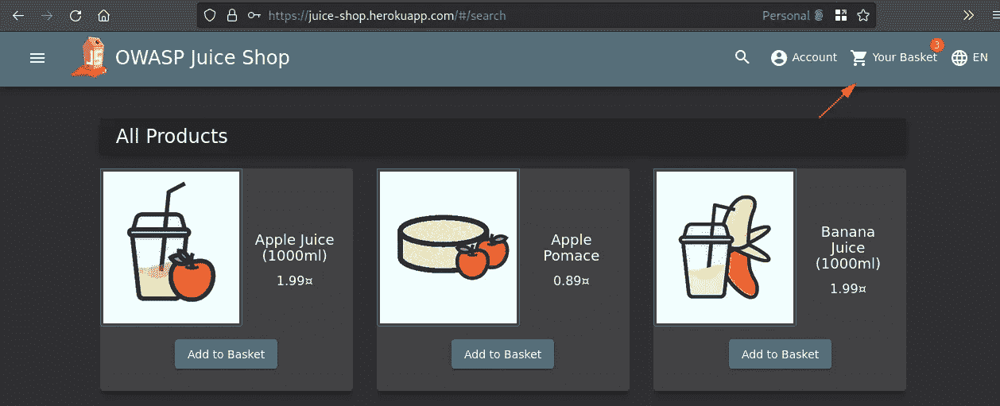
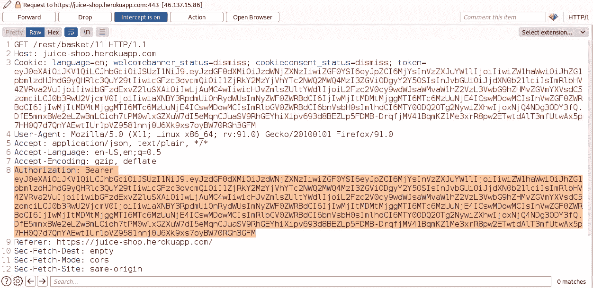
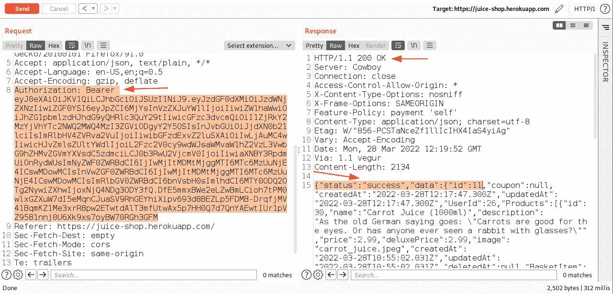
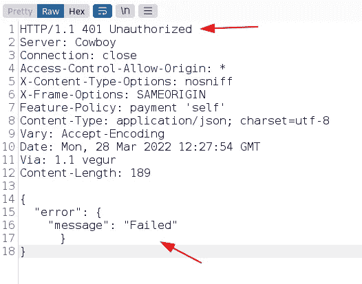
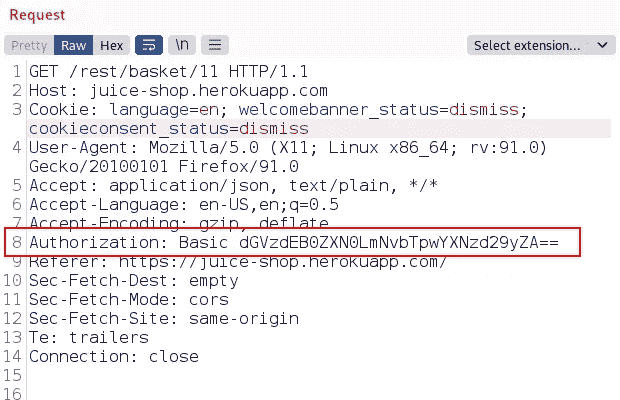

# 不当授权

> 原文：<https://infosecwriteups.com/improper-authorization-d659445901f4?source=collection_archive---------3----------------------->

这个博客将展示一个有趣的案例，其中授权没有被正确地实现。成功利用此问题会导致权限提升(水平和垂直)以及 web 应用程序中的 IDOR。

## 正常流量

这是应用程序正常流程的总结:

基本上，当用户 A 登录到应用程序时，他/她会收到一个 JWT 令牌，该令牌随后被用于授权他/她的身份以进行后续请求。因此，当用户 A 试图访问其他用户的资源(例如->用户 B 的配置文件细节)时，应用程序会以一条未经授权的错误消息进行响应。

## 应用程序中的漏洞

**请注意:仅出于演示目的，我使用了果汁店应用程序**

****逐步流程- >用户 A 点击他的购物篮查看里面的物品。****

****

**下面是使用 Burpsuite 获取购物篮细节的截取请求的屏幕截图。在这里，您可以观察到 JWT 令牌是在带有“Authorization”HTTP 头的 HTTP GET 请求中发送的。**

****

**我将截取的请求发送到 Burpsuite 中的“Repeater”选项卡，以观察正常的响应。在这里，当 JWT 令牌有效并且用户 A 被授权查看他/她的购物篮时，您可以在 repeater 选项卡中观察到一个成功的响应。**

****

**现在，当请求中的 JWT 令牌被其他用户 B(在易受攻击的应用程序中未被授权查看用户 A 的购物篮)的令牌替换时，服务器会以未经授权的消息做出响应。**

****

**但是，当请求被稍微修改时，如图所示(在授权 HTTP 头中，用 base64 编码的凭证格式“username:password”替换基本和 JWT 令牌之后的 Bearer 关键字)。**

****

**我得到了一个与我们之前看到的类似的成功响应(这只是之前请求的截图，用于演示相同的情况)**

****

**就是这样。感谢阅读！**

**如需反馈/建议，请发送电子邮件至:[psdoom@protonmail.com](mailto:psdoom@protonmail.com)**