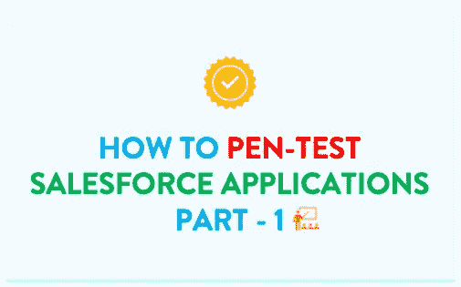
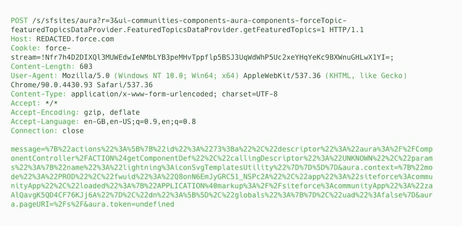
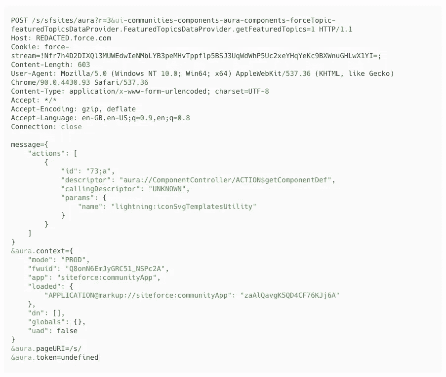
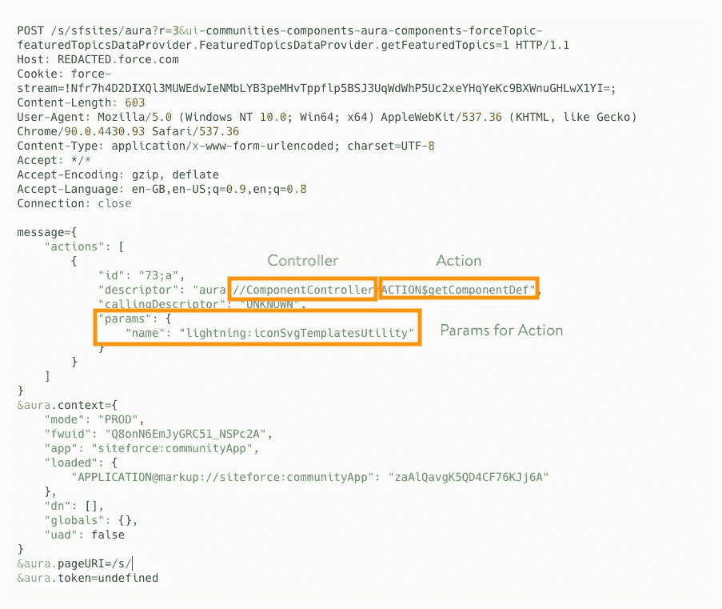

# 笔测试 Salesforce 应用程序:第 1 部分(概念)

> 原文：<https://infosecwriteups.com/in-simple-words-pen-testing-salesforce-saas-application-part-1-the-essentials-ffae632a00e5?source=collection_archive---------1----------------------->

简而言之:对于笔测试人员和安全研究人员

这是一篇关于笔测试 Salesforce SAAS 应用程序的两部分博客。第 1 部分侧重于理解 Salesforce 基础知识，第 2 部分侧重于实际的 Pen 测试步骤。我们开始吧。

# Salesforce SAAS 应用程序简介

**SAAS** 或软件即服务，是一种软件交付模式，通过网络可以访问软件。在某种程度上，它就像一个 web 应用程序。此外，使用 SAAS 就像是一种特权，SAAS 应用程序的基础设施和平台完全由供应商管理。

**CRM** 或客户关系管理，帮助商业机构维持与客户的关系。已经开发了有效管理 CRM 的软件。现在，不要与这里的“客户”一词混淆，例如，让我们考虑一个电子商务应用程序，电子商务公司将使用 CRM 来维护与其供应商(而不是购买的客户)的关系，检查他们的活动，提供关于他们如何做的分析并提供支持。

Salesforce 为 CRM 提供 SAAS 应用程序。这些 SAAS 应用程序可以通过管理面板完全管理和定制，这意味着您可以使用管理面板本身立即使 SAAS 应用程序运行。所需的编码工作是最小的，它涉及到一种 [Salesforce 编程技术](https://trailhead.salesforce.com/en/content/learn/modules/platform_dev_basics/platform_dev_basics_code#:~:text=Apex%3A%20Salesforce's%20proprietary%20programming%20language,combination%20of%20Apex%20and%20JavaScript.)。

*   **Lightning 组件框架**:类似于 AngularJS 或 React 的 UI 开发框架。这也包括**光环**组件。
*   **Apex** : Salesforce 的专有编程语言，具有类似 Java 的语法。
*   **Visualforce** :一种标记语言，允许您使用看起来很像 HTML 的代码创建自定义 Salesforce 页面，并且可以选择使用 Apex 和 JavaScript 的强大组合

通过其他编程语言定制也是允许的，但前者是最受欢迎的。

# 这与传统的 web 应用程序笔式测试有何不同？

请记住，Salesforce SAAS 应用程序是一种可以像 web 应用程序一样访问的软件。对于 web 应用程序部分，您仍将应用所有传统的 web 应用程序笔测试技能，但软件部分有所不同。该软件为管理其数据和用户提供了单独的访问控制。这些安全控制主要是通过管理面板访问的，弄乱这些安全控制会导致不当授权漏洞，从而导致敏感数据泄漏。

> 为了利用这些错误配置的安全控制，笔测试人员需要理解 HTTP 请求参数中的 Salesforce 格式。攻击的表面仍然是通过 web，但我们利用这些漏洞的方式与传统方法不同

# Salesforce 特定漏洞利用

对于 Salesforce，有几个漏洞具有独特的利用方法。

**不当授权** - Salesforce 提供安全控制来管理其数据和用户。错误配置它们会导致不适当的授权漏洞，从而导致敏感数据泄漏。然而，要利用这一点，您需要理解 Salesforce HTTP 请求参数的格式。

***注意-如果使用除 Salesforce 编程技术之外的任何其他编程语言，这可能不适用。***

**SOQL 注入-** SOQL 是 Salesforce 的 SQL 查询语言，但其范围仅限于 SELECT 语句。如果用户输入被直接注入到 SOQL 查询中，用户可以修改查询以提取比允许用户看到的更多的数据。同样，要利用这一点，您需要理解 SOQL 的查询格式，并相应地应用有效负载。

# Salesforce 术语

让我们快速浏览一下进行笔式测试所需的术语。

*   **对象**就像存储数据的表格。有两种类型。
*   **标准对象**，Salesforce 提供的预格式化表格。这将适用于所有使用 Salesforce SAAS 应用程序的组织。
*   **自定义对象，**由组织创建的对象或表格。这将只对创建它的组织可用。
*   **字段**类似于列
*   **记录**像行
*   **控制器**包含**动作**，这些是从对象(或表格)中检索数据的功能。**参数**被传递给这些函数。有两种类型
*   **标准控制器**，访问 Salesforce 对象的预格式化函数。所有使用 Salesforce SAAS 应用程序的组织都可以使用这些控制器
*   **自定义控制器，**开发用于访问 Salesforce 对象的新功能。这将只对创建它的组织可用。
*   在 Salesforce 中，未经身份验证的用户被称为**访客用户**

# 了解 HTTP 请求中的 Salesforce 格式

现在我们已经对 Salesforce SAAS 应用程序有了一个很好的了解，让我们看看 HTTP 请求参数并理解其中的 Salesforce 格式。

Salesforce HTTP 请求(编码)

POST 参数上的快速 url 解码向我们展示了这一点:

Salesforce HTTP 请求(已解码)

POST 主体中有四个参数。

*   消息
*   氛围.背景
*   aura.pageURI
*   光环.令牌

我们感兴趣的主题实际上是消息参数，特别是其中的“**描述符**和“**参数**”键值对。其他的不感兴趣。不过，万一你发现什么有趣的东西，请告诉我。

现在，让我们试着把这个和我们的术语联系起来。

Salesforce HTTP 请求—控制器、操作和参数

暂时忘记名字，你所要理解的是 ComponentController 包含 getComponentDef 函数，它将名字作为一个参数，或者它是一个带参数的函数，与一个对象(或表)交互并获取数据，有时可以是**记录**。

那么，从一个对象(表)中提取数据的函数是直接在 HTTP 请求中公开的吗？是的，确实如此。

如果权限配置错误，事情就会变得一团糟。

# 将错误配置映射到笔测试

让我们来看看权限是如何分配的，如果你想详细了解这个，你可以在这里阅读我的博客[。](/in-simple-words-pen-testing-salesforce-saas-application-part-2-fuzz-exploit-eefae11ba5ae)

简而言之，分别为 ***对象、*** 字段和记录设置权限。在这三者中，我们作为笔测试人员非常关心记录权限，因为它们是真实的数据。可能导致权限配置错误的两种情况。

1.  通过管理面板向用户提供**过许可记录权限**

2.请记住 Apex(一种具有类似 Java 语法的专有编程语言)，当使用某些方法如 **@Remote Action** 或 **@AuraEnabled** 时，如果没有执行适当的检查，它可以覆盖 UI 权限并为记录打开更大的权限

> 但是从笔测试人员的角度来看，这些真正的意思是，如果我们识别对象和控制器并用正确的参数模糊它们，我们应该能够检索到具有错误配置的权限的记录

如果我们能够以未经身份验证的用户或 Salesforce 中所谓的访客用户的身份检索这些记录，这被认为是至关重要的。但是，Salesforce 推出了许多关于访客用户安全性的升级。

我希望你喜欢阅读这篇博客:)你现在开始阅读 [Part -2](/in-simple-words-pen-testing-salesforce-saas-application-part-2-fuzz-exploit-eefae11ba5ae) ，fuzz 和 exploit Salesforce 应用程序。日安！

## 参考

[https://trail head . sales force . com/en/content/learn/modules/platform _ dev _ basics/platform _ dev _ basics _ code #:~:text = Apex % 3A % 20 sales force 的% 20 专有% 20 编程% 20 语言，组合% 20 of % 20 Apex % 20 和%20JavaScript](https://trailhead.salesforce.com/en/content/learn/modules/platform_dev_basics/platform_dev_basics_code#:~:text=Apex%3A%20Salesforce's%20proprietary%20programming%20language,combination%20of%20Apex%20and%20JavaScript) 。