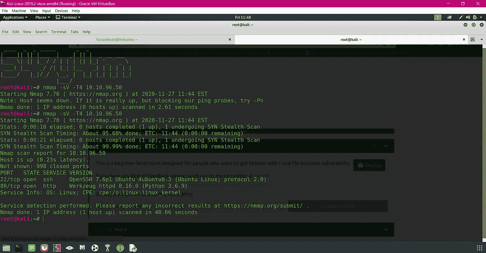
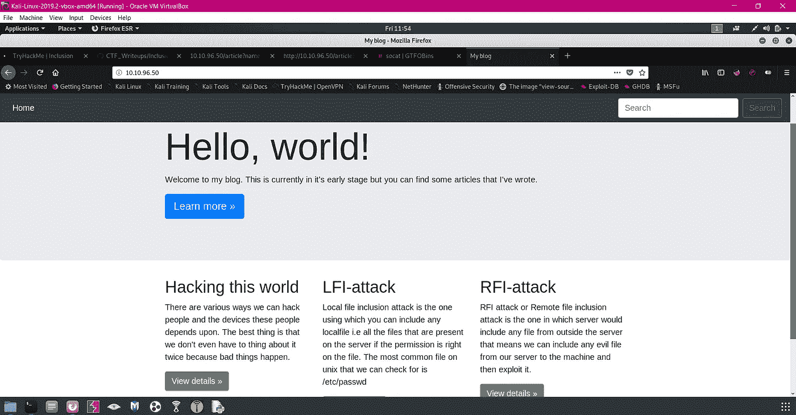
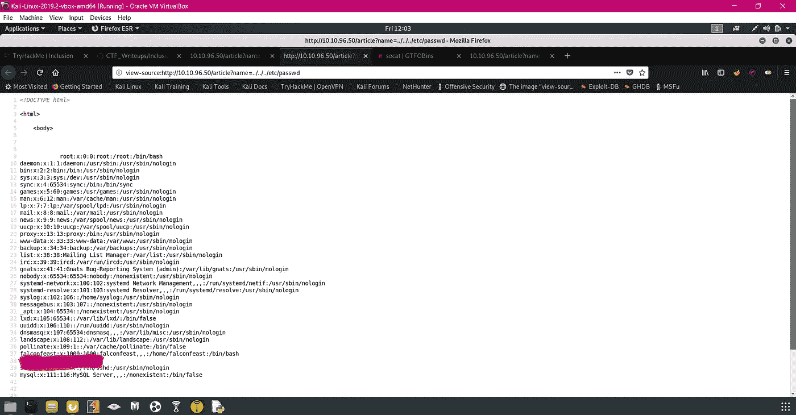
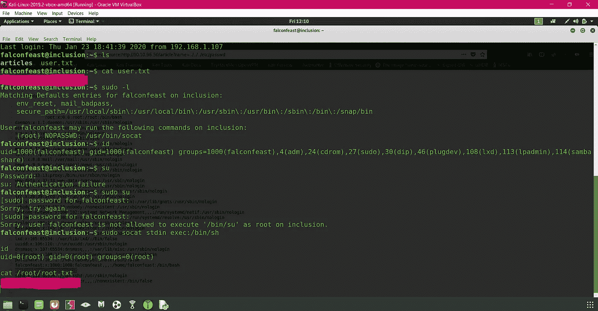

# 包容性房间报道

> 原文：<https://infosecwriteups.com/inclusion-room-write-up-19abd20583b8?source=collection_archive---------6----------------------->

在 [TryHackMe](https://tryhackme.com) 上的初级 LFI 挑战赛

LFI ( [本地文件包含](https://en.wikipedia.org/wiki/File_inclusion_vulnerability)

级别:简单

房间链接:【https://tryhackme.com/room/inclusion 

> 你好朋友，索迪黑客 krlo //跳过-这一点

## 任务 1 :-

部署机器，无需回答

## **任务 2 :-**

1.  NMAP 扫描:nmap -sV -T4

2.在浏览器上访问<i.p>时，一个 LFI 易受攻击的博客出现了</i.p>

3.在访问其中一个博客时，我们可以看到参数“？name= "在 URL 栏中，它似乎很容易受到攻击。让我们好好利用它！

4.从上面的 ssh 获得证书后，我们进入机器和 ola😎

对于权限提升:[https://gtfobins.github.io/gtfobins/socat/](https://gtfobins.github.io/gtfobins/socat/)

根深蒂固的

从上面的步骤中获取用户和根标志…………

享受，感谢阅读，并有一个美好的一天🍺

👋在 [**Github**](https://github.com/547y4m) 上关注并联系我

