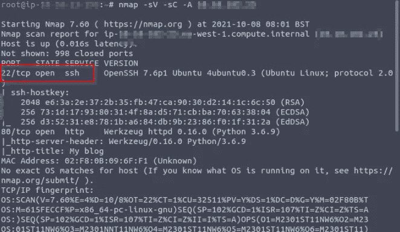
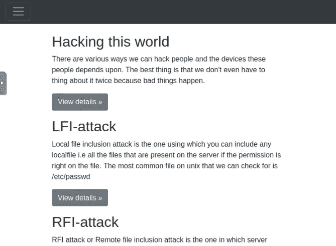
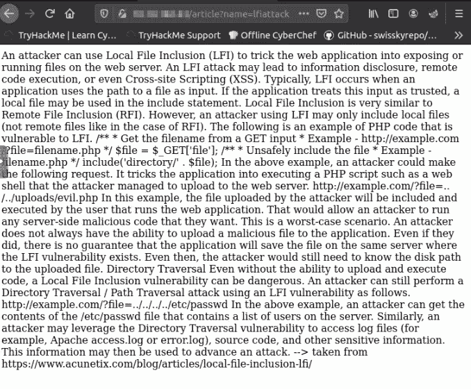
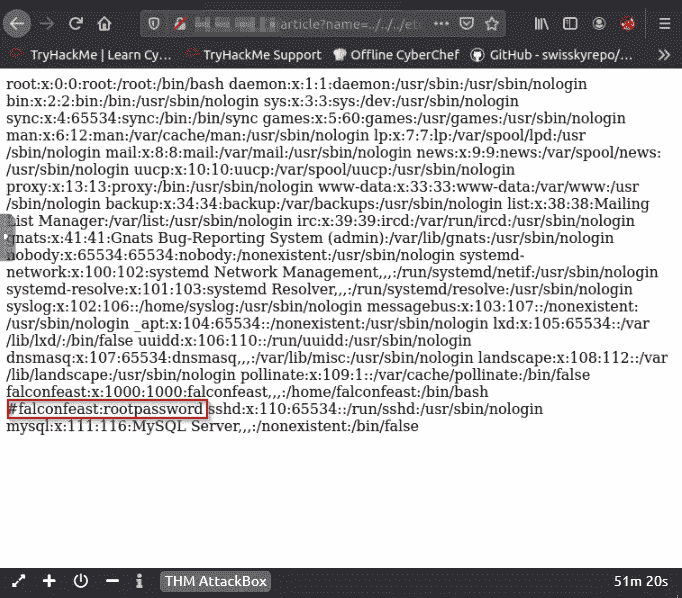
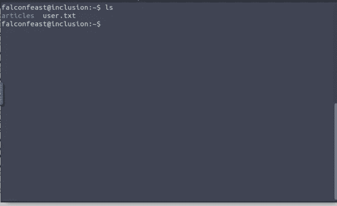
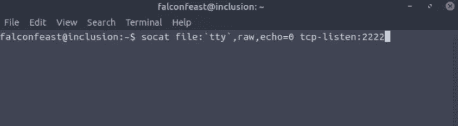
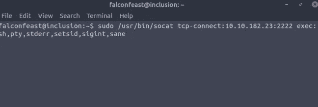
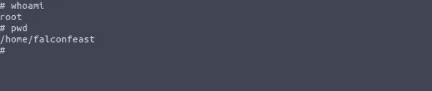
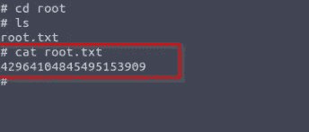

# 包容尝试

> 原文：<https://infosecwriteups.com/inclusion-tryhackme-e69d39095bab?source=collection_archive---------2----------------------->

嗨，了不起的黑客们，我今天带来了另一个有趣的话题，那就是本地文件包含。本地文件包含是 OWASP 十大漏洞之一。

LFI 漏洞允许攻击者读取(有时执行)受害机器上的文件。这可能非常危险，因为如果 web 服务器配置错误并试图以特权访问运行，黑客可能会获得敏感信息。

好了，现在让我们进入实践环节:

首先，我使用 Nmap 扫描目标，无论端口是打开的还是关闭的。我开始知道端口 22 ssh 是开放的。然后进一步挖掘，我在网站上找到了一些路径，它们是:

哪一个有点像目标 IP/文章？name=lfiattack，然后我把 name=lfiattack 改成了../../../etc/passwd/哪个看起来

我找到了 ssh 登录的用户名和密码，于是我启动了我的终端，开始输入凭证 BOOM！！！

我用 ***打开 user.txt 猫 user . txt***我得到了我的第一面旗帜。

> **用户标志**

*回复:60989655118397345799*

然后我开始翻出根旗。然后我开始用 ***sudo -l***

根本不起作用。所以我使用 **socat** 监听器权限提升

然后我连接这个监听器，我使用这个命令。

falconfeast 更改为 root 用户。

然后我浏览了根位置，找到了我的根标志。

> **根标志**

*回复:42964104845495153909*