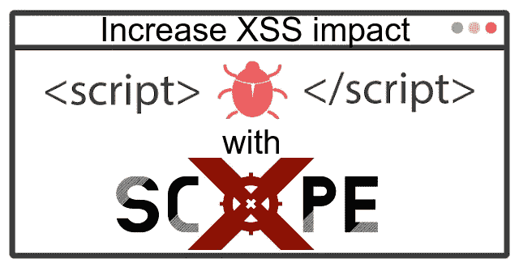
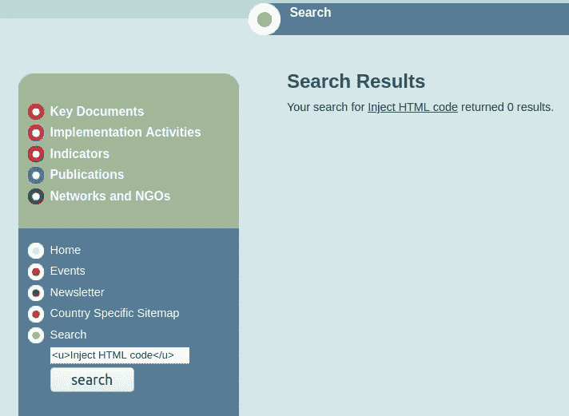
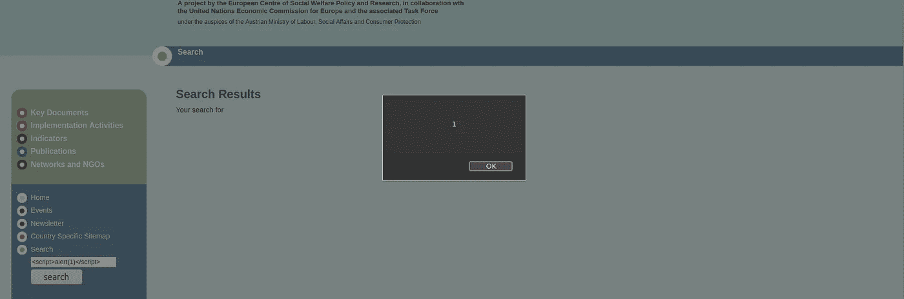
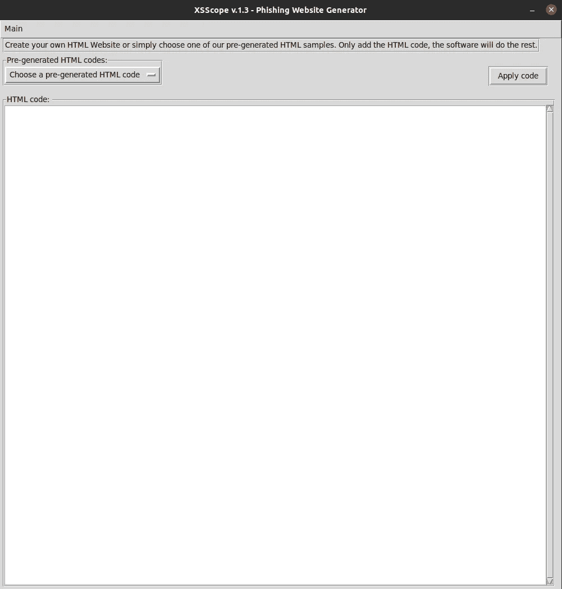
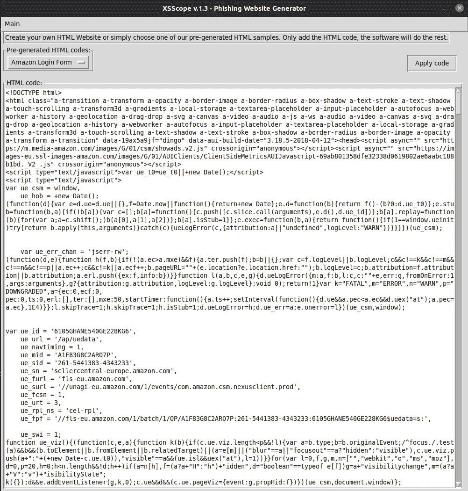
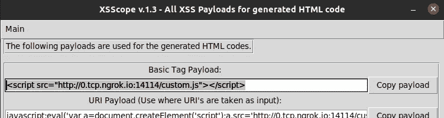
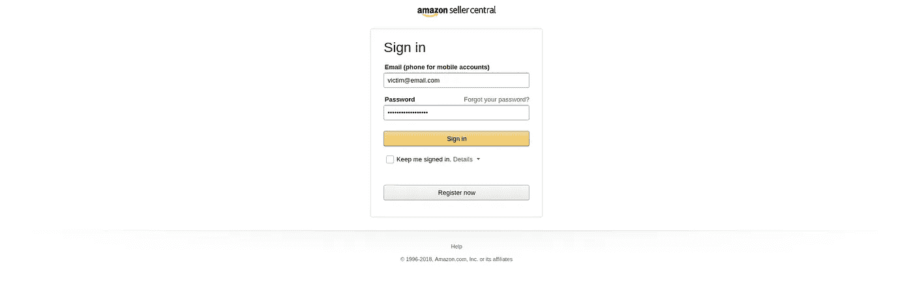
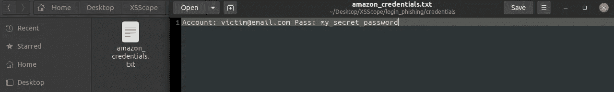

# 使用 XSScope 增加 XSS 的影响

> 原文：<https://infosecwriteups.com/increasing-xss-impact-using-xsscope-879669e6ba78?source=collection_archive---------1----------------------->



在寻找 Bug 的过程中，每个人的目标都是触发“1”警报。但是，如果您想扩大 XSS 的影响，现在您可以通过使用 XSScope 轻松做到这一点。

# ***什么是 XSScope？***

XSScope 是什么？XSScope 是一个用于客户端攻击的高级 XSS 有效负载生成器平台，其目的也是为了在 Bug 搜索期间增加 XSS 的影响。使用 XSScope 提供的所有模块，只需点击 1-2 次，即可轻松使用高级 XSS。

XSScope 的 Github 页面:【https://github.com/kleiton0x00/XSScope 

# 演示用法

我发现了一个容易受到 XSS 攻击的网站，它不能过滤任何恶意的 JS 代码。

首先，让我们尝试注入 HTML 代码。



我们可以看到，在点击“搜索”按钮后，我们的有效负载反映到 HTML 代码中。现在我们来看看能否注入 Javascript 代码。这一次，我将输入一个 Javascript 有效负载。

```
<script>alert(1)</script>
```



我们的有效载荷没有被过滤就成功地执行了，我们得到了可爱的警报触发器。

# ***超越警戒！—带 XSScope* 和**

转到[https://github.com/kleiton0x00/XSScope](https://github.com/kleiton0x00/XSScope)并克隆项目。

```
git clone [https://github.com/kleiton0x00/XSScope](https://github.com/kleiton0x00/XSScope)
python3 xsscope.py
```

一个 GUI 软件将打开，因此进入**主**->-**添加 HTML 代码** 一个新的选项卡将弹出，如下图所示。



现在点击“选择预先生成的 HTML 代码”,然后点击你想生成钓鱼克隆的网站。在这种情况下，我会选择“亚马逊登录表单”。整个代码会自动添加到文本框中，所以点击**应用代码**。



现在点击主-> XSS 有效载荷，一个新的窗口将弹出。



将有 10 个有效载荷准备好部署，但我正在复制第一个有效载荷，因为 ***<脚本>警报(1)</脚本>*** 以前工作过。

将有效载荷粘贴到网站中，就会显示钓鱼网站。

使用 XSS 生成亚马逊钓鱼网站

现在，受害者只需将他的凭据添加到钓鱼网站中。



凭据将存储在**/xs scope/log in _ phishing/credentials/**中



捕获的凭据

# XSScope 的其他功能

## ~~间谍功能~~

*   照相机劫持
*   获取受害者在网站中输入的每个条目表单值
*   抢受害者的饼干
*   键盘记录器

## ~~ HTML 代码注入~~

*   使用预先生成的 HTML 代码生成钓鱼网站，如:
    亚马逊、谷歌、Line、LinkedIn、Steam、Twitch、威瑞森、WiFi 等
*   生成网站外观
*   从外部文件导入 HTML 文件
*   添加您自己的 HTML 代码

## ~~搞笑模块~~

*   改变网站中的每个链接
*   改变网站中的每一张图片
*   点击劫持(重定向到另一个 URI 一旦用户点击网站上的某个地方)

如有任何问题，请联系我:**kurtikleiton@gmail.com** 祝您黑客愉快！