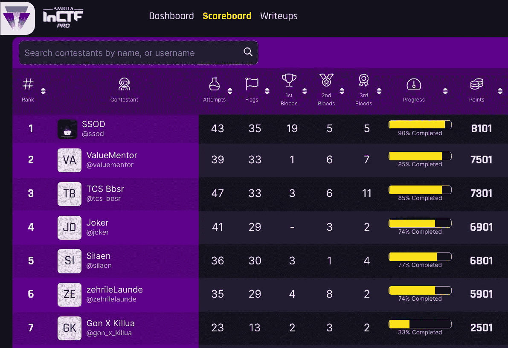
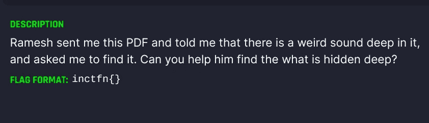
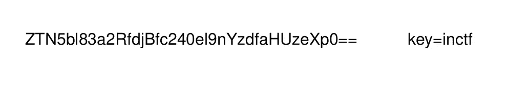
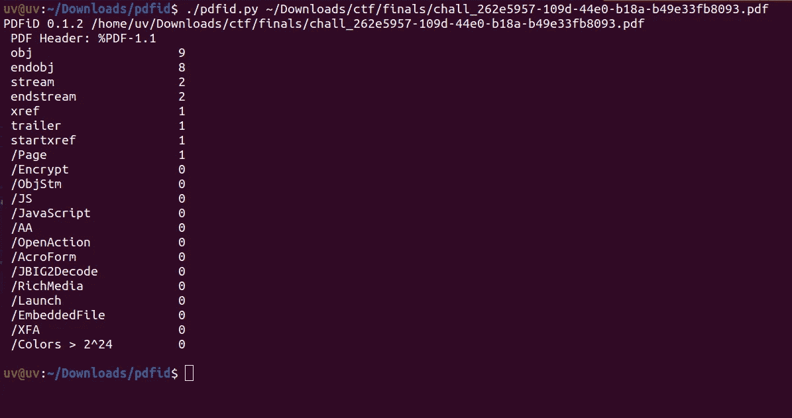
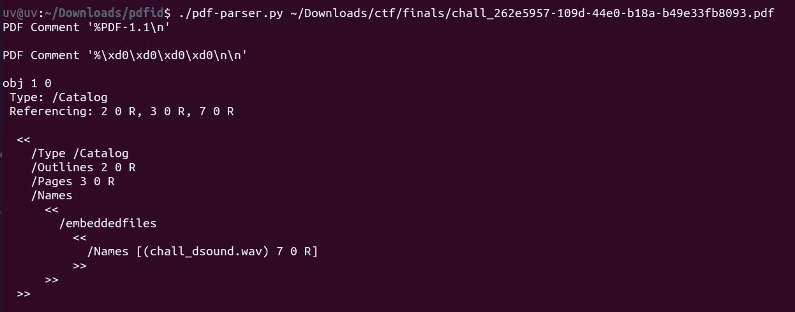
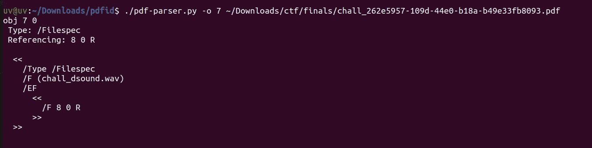
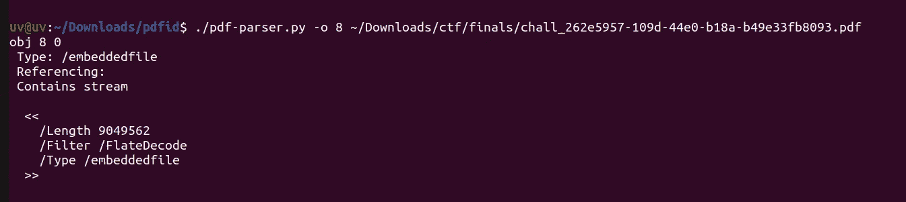
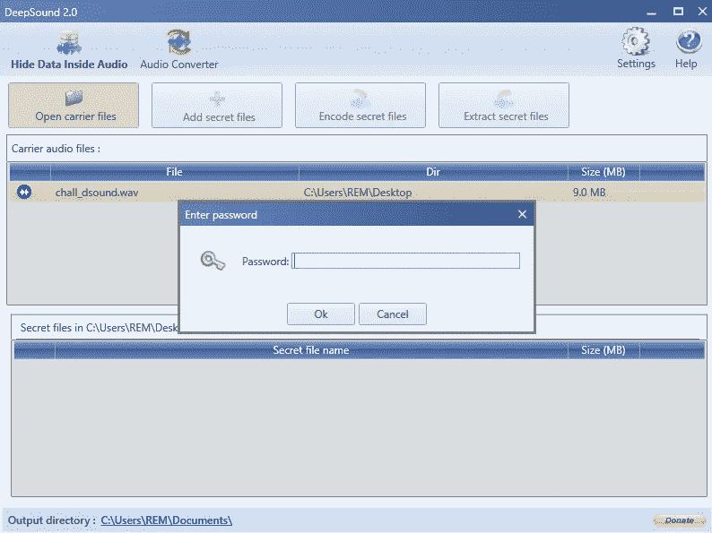
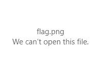
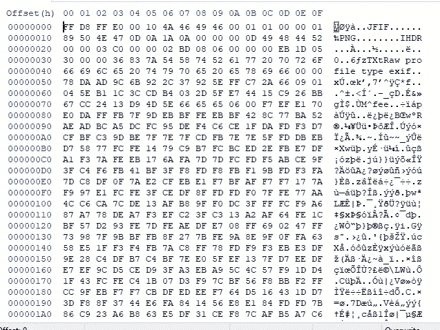

# InCTF 职业总决赛 2021:看更深入的报道

> 原文：<https://infosecwriteups.com/inctf-pro-finals-2021-look-deeper-writeup-8f2333576f48?source=collection_archive---------3----------------------->

你好黑客们！！！这次我带来了另一份法医报告。InCTF 职业选手总决赛 2021 于本周举行。挑战非常好，也很难解决。但不知何故，我们今年设法拿到了第一名。

好了，让我们来解决这个法医难题

> **挑战文件:**【https://github.com/UVvirus/ctf_files-inctf-pro-finals-2021】T2

如果我们打开给定的 pdf，有一些 base64 编码的数据和一个密钥

解码后得到这个

> **e3yn _ 7kd _ v 0 _ sn4z _ gc7 _ Hu 3yzt**

嗯……仍然不是可读的形式

好吧，我们之后再谈这个。

让我们试试 pdfid。

查看输出，我们没有得到任何有趣的东西。所以让我们试试 pdf-parser

哇！！！我们有发现了。
在对象 1 中，我们可以看到名为 chall_dsound.wav 的名称，但是根据引用，它在对象 7 中
,所以让我们导航到对象 7

它引用对象 8

好的，通过查看/Length 和/Type，我们可以得出结论，这里有一些数据。

让我们扔掉这个物体

> **。/pdf-parser . py-o 8—filter—raw-d dump _ obj _ filename chall _ file . pdf**

让我们使用 file 命令来检查转储文件

当使用文件命令时，它说这是一个 wavfile。

**到目前为止，我们从 pdf 文件中提取了一个音频文件。**

但是，现在我们还没有拿到旗子

所以我在那个 wavfile 上尝试了一些东西，比如 strings，binwalk，morse code，sonic visualizer，但是还是一无所获。
似乎是条死胡同……

但是经过几个小时的研究，我发现了这篇很好的文章。

> [https://ctftime.org/writeup/9638](https://ctftime.org/writeup/9638)

根据这篇文章，我下载了这个工具并在其中打开了文件。

但是这里有另一个转折。该标志受密码保护

要找到密码，回想第一步，pdf 文件中存在一些 base64 编码的文本。

解码后用密钥 INCTF 放入维格纳密码中

> **密码:w3ll _ 7ry _ n0 _ fl4g _ bu7 _ us3 ful**

你会得到密码的

现在在 deepsound 工具中打开 wavfile，你会得到 flag.zip

通过解压 zip 文件，我们将得到 flag.png

但是！！！！该文件已损坏

通过查看十六进制文件，我们可以看到它包含 jpeg 头和 png 头

删除 jpeg 头会给我们一个标志。

**片尾字幕:**

感谢我出色的队友

 [## 安全工程师- DeTaSECURE | LinkedIn

### 在世界上最大的职业社区 LinkedIn 上查看 yuvarajan 的个人资料。yuvarajan 有一个工作列在他们的…

www.linkedin.com](https://www.linkedin.com/in/s-yuvarajan/)  [## AJAY SK -学生- Panimalar 工程学院| LinkedIn

### 在全球最大的职业社区 LinkedIn 上查看 AJAY SK 的个人资料。AJAY 的个人资料中列出了 1 份工作…

www.linkedin.com](https://www.linkedin.com/in/ajay-sk-33ab591b0/)  [## monish Kumar——专业程序员——Infosys | LinkedIn

### 查看世界上最大的职业社区 LinkedIn 上 Monish Kumar 的个人资料。莫尼什有 3 个工作列在他们的…

www.linkedin.com](https://www.linkedin.com/in/aidenmonish/)  [## Nagendran G S -系统工程师-塔塔咨询服务| LinkedIn

### 在世界上最大的职业社区 LinkedIn 上查看 Nagendran G S 的个人资料。内根德兰有 2 份工作列在…

www.linkedin.com](https://www.linkedin.com/in/nagendrangs/) 

[https://www.linkedin.com/in/gokulavasan-p-ba24a0211/](https://www.linkedin.com/in/gokulavasan-p-ba24a0211/)