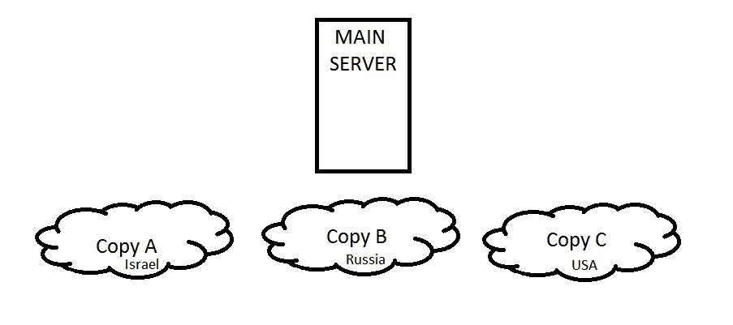

# 独立不是一个肮脏的词

> 原文：<https://infosecwriteups.com/independence-is-not-a-dirty-word-82869c611129?source=collection_archive---------0----------------------->

*注:以下文章发表于 2017 年 16 月 1 日 https://FogMarks.com*

**

*信用:[http://www.picpedia.org/highway-signs/i/independence.html](http://www.picpedia.org/highway-signs/i/independence.html)*

> *正如在[上一个案例研究](https://medium.com/bugbountywriteup/api-a-p-otentially-i-diotic-threat-de19b7f3687e)中所承诺的，今天我们将看到一个非常有趣的案例研究，有一个有趣的转折。*

*每个人似乎都喜欢 jQuery。这个令人敬畏的 Javascript 库无处不在——成千上万的公司在他们的网站应用程序中使用它，它非常方便——尤其是在 AJAX 请求方面——导入 jQuery 让我们的生活变得更加轻松。*

# *图书馆中的图书馆*

*jQuery 并不孤单。谷歌和微软(有时还有 Mozilla 和苹果，脸书和 Twitter)一直在发布新的 JS 库，并建议开发人员使用它们并将其导入到他们的产品中。例如，如果你想播放 QuickTime 视频，你应该导入[苹果的 QuickTime JS 库](https://developer.apple.com/library/content/samplecode/HTML_video_example/Listings/ac_quicktime_js.html)，如果你想要那个简洁的 jQuery DatePicker，你应该从 Google、jQuery 或任何其他镜像导入那个库。*

*统计一下我在最后一段中使用单词' **import** '的次数。完成了吗？4 次。
每当我们想要使用某个公共 JS 库，这个库属于某个公司或服务，我们就直接从那个公司导入。
为了更清楚，我们简单地在我们的网站上放置一个<脚本>标签，带有一个指向 JS 文件地址的“src”属性:*

> **<脚本 src = " http/s://trustworthydomain . com/path/to/js/file . js></脚本>**

*你拿到了吗？我们正在将另一个网站(第三方网站)的脚本加载到我们网站的上下文中。我们违反了网络安全的第一准则——我们信任其他网站！*

# *这听起来可能有点愚蠢*

*为什么我不能从像 jQuery、微软或谷歌这样值得信赖的公司导入脚本？你是对的。算是吧。*

*当你从一个值得信赖的公司导入一个脚本时，90%的情况下你会从该公司的 CDN 导入它。
CDNs 代表内容交付网络，它是(引用:)“基于用户的地理位置、网页的来源和内容交付服务器向用户交付网页和其他网络内容的分布式服务器(网络)系统。”*

*这是一种托管服务，根据客户的位置和其他一些因素为他们提供存储服务。**你正在导入的 JS 文件并没有保存在公司的官方服务器**上(还是那句话——大多数时候)。*

# *在这个案例研究中，我们将看到一家非常受欢迎的公司是如何陷入困境的*

*这家公司(当然，我们不能透露)开发了一个流行的 JS 库，并将其托管在他们购买的第三方 CDN 上。CDN 是“智能”的，根据用户的位置将用户重定向到最近的服务器:*

**

*CDNs 简单插图*

*当请求到达主服务器时，服务器确定请求的 IP 地址，然后根据确定的位置将请求路由到最近的服务器。*

*几十个网站在它们的源代码中植入了一个*

# *令人(不)愉快的惊喜*

*在对安装在服务器 C 上的 Apache 服务器(图中的副本 C)做了一些研究后，我们得出结论，它的版本确实过时了，并且容易受到任意文件上传攻击，这允许我们将文件上传到 CDN ( **，但不执行代码**)。乍一看，没那么严重。*

***但是！**当我们检查文件上传的方式时，当然是未经授权的，我们发现在文件路径上使用[目录遍历](https://en.wikipedia.org/wiki/Directory_traversal_attack)是可能的。我们简单地将文件名改为../../../ <公司域名> / <产品名称> / <版本> / < jsfilename >。我们能够用一个恶意的 js 文件替换公司的合法 JS 文件。*

*基本上，我们在几十个网站和公司上有一个 XSS，甚至没有对他们进行一分钟的研究。有趣的是，这种攻击只影响被定向到易受攻击的服务器(服务器 C)的用户。*

# *从中我们能学到什么(TL；博士)*

*永远不要相信第三方网站和服务来做你的工作！我已经告诉你无数次了。要独立。做一个可以独自呆在家里的大男孩。*

*最安全的解决方案是手动下载您使用的 JS 库文件，并将它们保存在您的服务器上。*

# *但是当我使用的 JS 库更新时会发生什么呢？*

*显然，除了使用像[鲍尔](https://bower.io/)这样的**包管理器**之外，使用建议的方法没有简单的方法来跟踪它。你所要做的就是每隔一段时间同步你的库。*

> **在 Javascript 包管理器流行之前，我建议我的一个朋友简单地写一个 cronjob 或 python 脚本，检查公司服务器上可用的 JS 库的最新版本，然后将其与本地版本进行比较。如果版本不同，脚本会向技术团队发送电子邮件。* ***大型 JS 库不会经常更新。****

*所以，在你刚刚看完恐怖电影之后，除了喝咖啡，你要做的下一件事就是把你的第三方库下载到你的服务器上。*

*干杯。*

**关注* [*Infosec 报道*](https://medium.com/bugbountywriteup) *获取更多此类精彩报道。**

* [## 信息安全报道

### 收集了世界上最好的黑客的文章，主题从 bug 奖金和 CTF 到 vulnhub…

medium.com](https://medium.com/bugbountywriteup)*