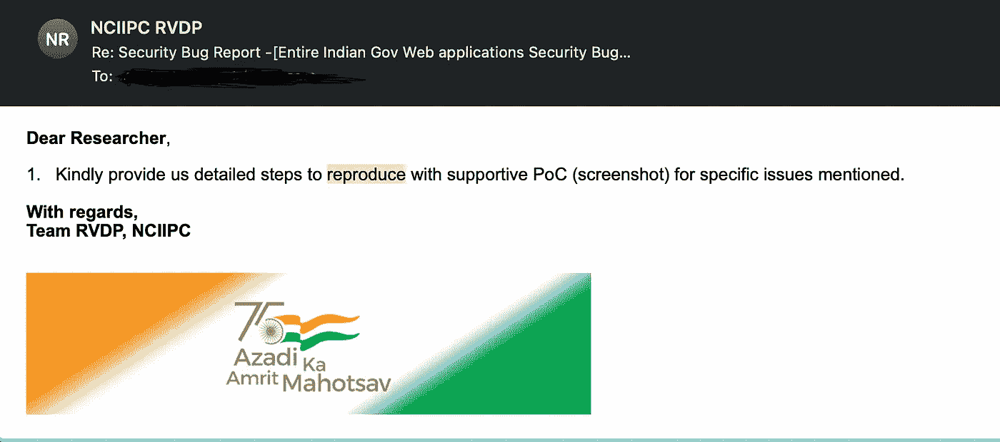

# 印度最大的黑客攻击——印度政府网站和服务器的 1100 多个安全漏洞遭到破坏

> 原文：<https://infosecwriteups.com/indias-biggest-hack-1100-security-bugs-in-indian-government-websites-and-servers-compromised-1f10a4c0a631?source=collection_archive---------5----------------------->

## 总结:

我是 Karthikeyan V，Cappricio Securities 的创始人兼首席执行官，这是一家位于泰米尔纳德邦钦奈的网络安全公司。

我们开始披露在测试印度政府网站时发现的一系列安全漏洞。

因为受影响的网站来自核心政府的不同部门，上面提到的印度政府网站在这里只是一个概括。这个致命的问题可能会对我们国家的互联网安全措施产生重大影响。

由于领先的政府网站容易受到严重攻击，任何第三方入侵都可能导致整个网络应用程序网络严重瘫痪。

错误列表

报告链接(PDF):-[https://karthithehacker.com/blogs/bugs-in-gov.pdf](https://karthithehacker.com/blogs/bugs-in-gov.pdf)

## **关于问题:**

为了进一步解释这个问题，我们发现了大约 1100 多个错误，优先级分为低、中、高和关键。

**低优先级错误**总计 471 个，其中开放重定向、CRLF 注入、缓存存储、服务器版本泄露、服务器状态和 PHP 信息文件泄露最为普遍。

中等优先级的错误总共有 495 个，最常见的是 Zip 备份文件(敏感数据，如数据库凭证、后端代码等等)、PHP 备份文件、反射 XSS、普通 CVE 等等。

检测到的 87 个**高优先级错误**包括 Firebase 数据泄露、凭据文件泄露、服务器配置文件、任意代码执行、本地和远程文件包含错误以及 SQL 注入(注入)。它允许我访问所有服务器端的敏感数据，包括管理员凭证、用户的敏感数据和服务器特权。

**关键优先级错误**总共有 38 个，其中远程代码执行、操作系统命令注入和其他 CVE id 是最常见的。它给了我完全访问服务器的权限。

## 披露:

这些安全缺陷会导致应用程序完整性的重大损失。

我向 CERT-India 提交了这些问题，他们回复了，因为我们的意图是安全地维护应用程序。

RVPD 印度政府的回复

为 1100 多个安全缺陷提供概念证明并不容易。因为 POC 链接包含在报告中。

## 免责声明:

如果黑帽黑客发现了这些漏洞中的一个，其结果将对互联网隐私造成损害。

虽然一些政府网站容易受到尚未修补的重大漏洞的攻击，但出于隐私考虑，一些漏洞已被隐藏。

我非常感谢保持我们国家的网络应用安全可靠，我们努力维护系统的完整性。

杰欣。

**学分**

***作家***:-[Karthikeyan K](https://www.linkedin.com/in/karthikeyank-d4rkl3g4cy/)([CIO Cappricio 证券](http://cappriciosec.com))

**:-*[*karthithehacker*](http://karthithehacker.com/)*(*[*Karthikeyan)。*](https://medium.com/u/a14784d94f2c?source=post_page-----c422ca43bd2--------------------------------) V *)**