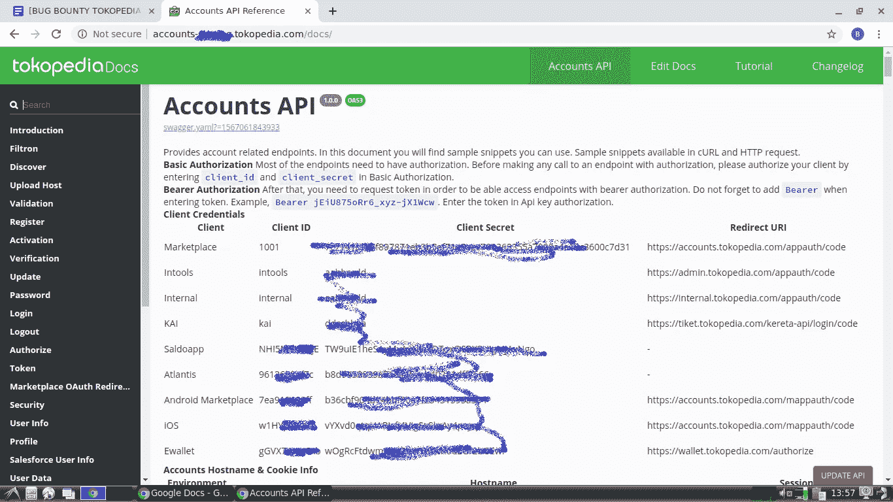
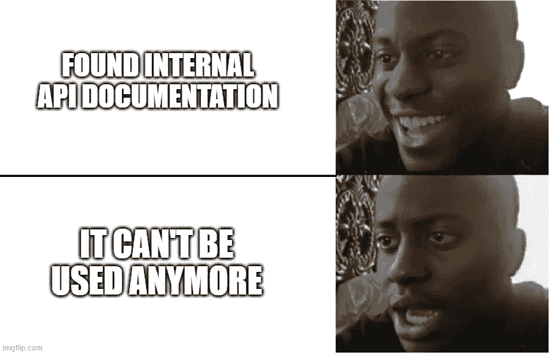
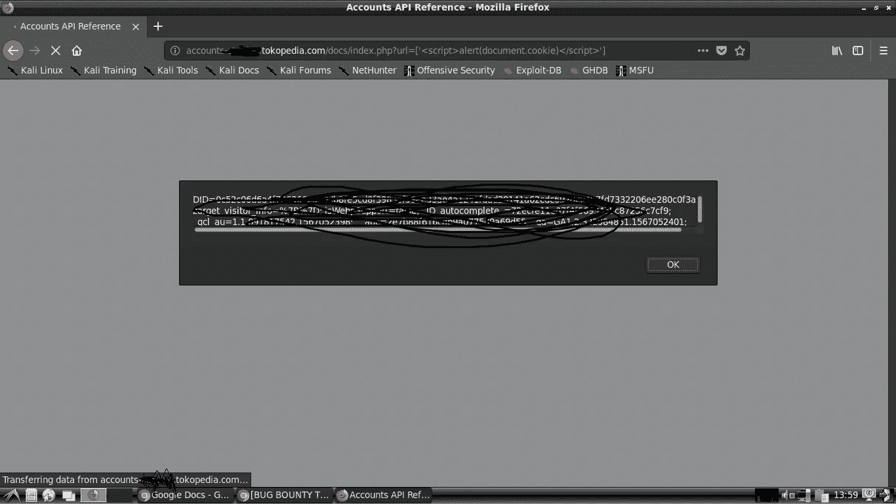

# 被遗忘的内容:东京媒体上的信息披露与反思 XSS

> 原文：<https://infosecwriteups.com/information-disclosure-and-reflected-xss-on-tokopedia-1b3a00ec64c6?source=collection_archive---------1----------------------->

*Tl；博士:我是如何在 Tokopedia 的网站上发现“应该删除”的内容，这些内容泄露了一些敏感信息，容易受到 XSS 的影响。*

Assalamualaikum Wr。Wb。(亲爱的读者，愿你平安)

在我之前关于 Tokopedia 上的子域接管的文章中，我提到我也发现了一些有趣的子域，其中之一是 accounts-REDACTED.tokopedia.com 的*。*

*因为有趣的子域名，我决定在这个特殊的子域名中挖掘更多。嗯，首页只显示 **410 消失** http 代码，其他什么都没有，所以这意味着这个子域上的资源已经被有意移除，应该被清除。*

*我没有就此止步，我用了一些工具进行目录蛮力，dirbuster，dirsearch 等。并且所有的暴力破解路径都返回 **410 消失**，除了这个路径，*accounts-REDACTED.tokopedia.com/docs/*，返回不同的响应，一个 **200 OK** http 代码。*

*我在浏览器上打开了路径，但它返回 **410 消失**。*

**

*我很确定这不是假阳性。经过仔细检查，发现它是在不同的港口提供的。端口 **80 (http)** 返回 **200 OK** ，端口 **443 (https)** 返回 **410 Gone** ，我不直接指定我的浏览器自动重定向到 https。*

*所以我使用 **http** 协议打开路径，我注意到端口 **80** 上的 */docs/* 路径是一个使用 Swagger UI 的 API 文档，这是一个开源项目，可以可视化地呈现用 OpenAPI (Swagger)规范定义的 API 的文档。*

**

*令人惊讶的是，它包含一些敏感的 API，如检索用户数据，以及其他敏感的 PII，如国民身份号码等。这是给 Tokopedia 的第三方合作伙伴的。它甚至包含用于授权的客户端 ID 和客户端机密。*

**

*但是，在我检查之后，API 不再工作了。实际上，根据我以前在 Tokopedia 上的搜索经验，他们现在使用的是 GraphQL，与我找到的这个不同。我检查了变更日志，他们的员工最后一次更新是在 2019 年 6 月左右。我晚了，晚了两个月，他们已经改变了他们的网络架构。 **410 消失**状态码现在有意义了，这个资源应该被删除，但不知何故还在那里。*

**

*所以我开始在这个特别版本的 Swagger UI 中寻找 CVE。我实际上找到了一个 XSS CVE，但在我尝试后，又一次失望，它不起作用。*

**

*这让我很好奇，为什么它不起作用？因为这个版本容易受到攻击。经过进一步挖掘，我认为他们已经定制了这个大摇大摆的用户界面，他们甚至在部分公开的源代码上使用了他们员工的名字。所以*也许*，这个霸气的 UI 和正式版不一样。*

*但是我不会放弃。*

**事实上，我确实休息了大约 1-2 周。**

*从那以后，我开始挖掘更多。我注意到这个文档是开放的，这意味着任何人都可以修改或更新文档，而不必登录或注册。我其实有一次不小心把整个文档都删了，还好我可以从 changelog 下载过去的数据，重新导入。*

**

*我在导入功能中发现了这个有趣的 URL:*

***file . YAML***

**我试图寻找 LFI 和 SSRF 的网址参数，没有工作。但是我注意到文件名反映在 html 页面上，所以我试图插入 XSS 有效载荷，然而另一个失望的是，**没有**弹出出现。**

**但是当我检查元素来检查反射的结果时，发现 XSS 实际上被解雇了，但是被 Chrome 的 XSS 审计员阻止了。它在另一个浏览器如 Firefox 等上运行良好。**

****

**最终的有效载荷如下所示:**

****=['<脚本>alert(document . cookie)</脚本> ']****

**我在最新版本的 Swagger UI 上尝试了这一点，但它不起作用，而且我在旧版本上找不到任何记录该漏洞的 CVE。所以*也许*我是对的，他们的版本已经被定制了(或者也许还没有人指定 CVE？或者我在这里遗漏了什么\_(ツ)_/)。**

**无论如何，我向他们的安全团队报告了这一情况，20 分钟后得到了回复*告诉我这一报告被核实为中等严重程度。很好的反应时间。***

***Wassalamualaikum Wr。Wb。***

*****时间线:*****

*   *****2019 年 8 月 29 日:**报告已发送。***
*   *****2019 年 8 月 29 日:**安全团队验证了该报告，有效，严重性为中。***
*   *****2019 年 9 月 17 日:** Bug 修复，他们让我重新测试 Bug。他们还询问了我发送奖励的银行信息。***
*   *****2019 年 11 月 20 日:** $$$获奖。***

***请原谅我对模因的过度使用，在这种艰难的情况下，我们需要更多的微笑。注意安全，洗手！:D***