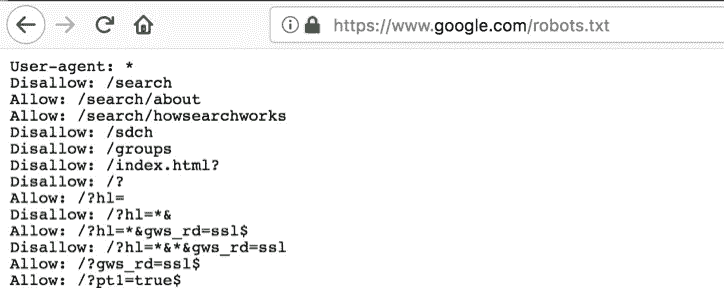
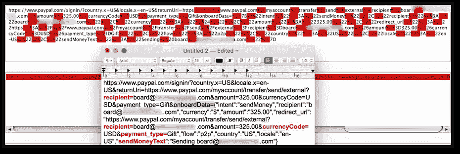
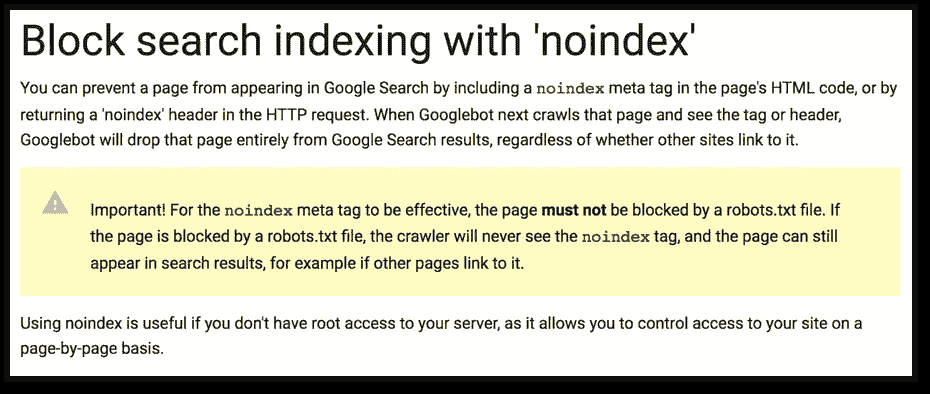
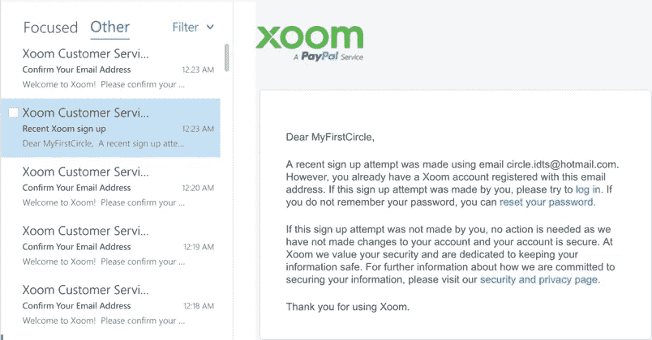
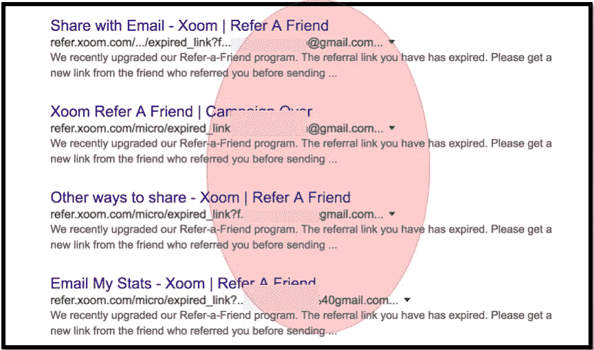
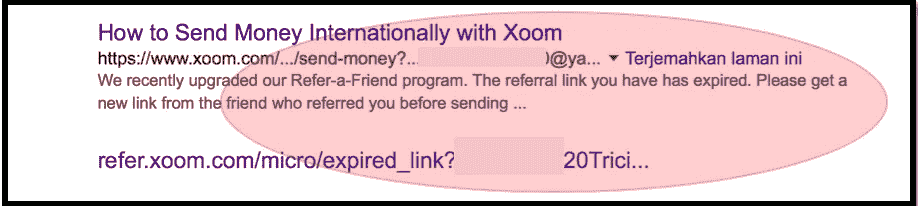
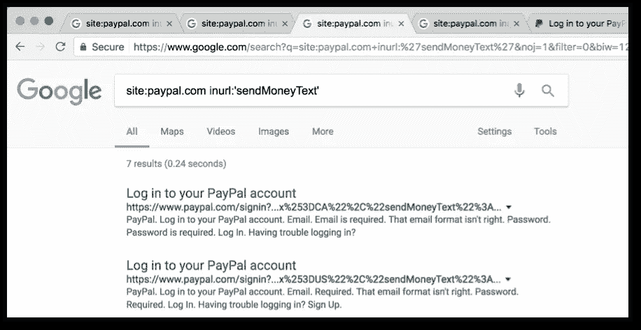
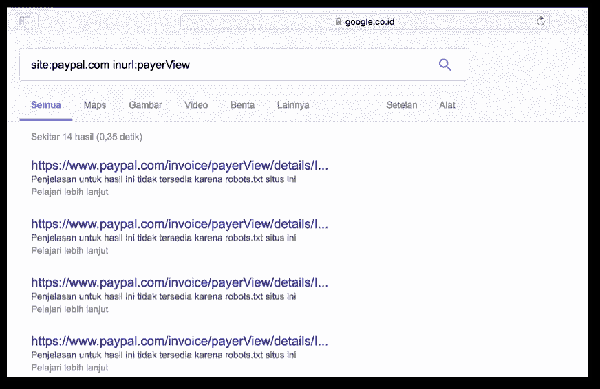
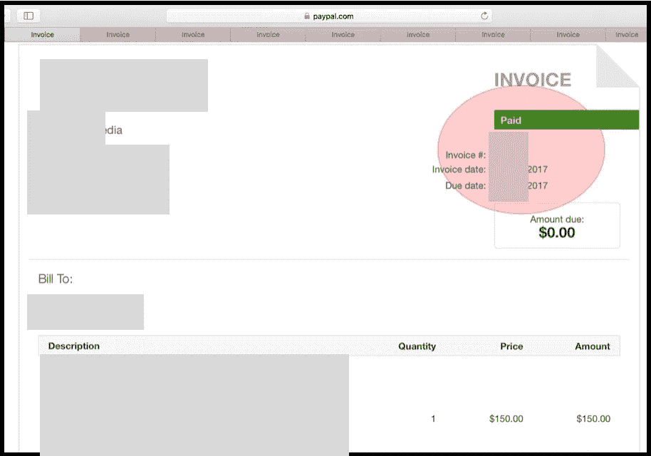

# 通过简单的 Google Dork-1000 美元在 PayPal 和 Xoom (PayPal 收购)披露信息

> 原文：<https://infosecwriteups.com/information-disclosure-at-paypal-and-xoom-paypal-acquisition-via-simple-google-dork-1-000-usd-b726fe628a05?source=collection_archive---------0----------------------->

بسم الله الرحمن الرحيم

> (这是 2017 年的一篇文章，已经在我的个人博客发布)。

## 一.摘要

我们不能否认，如果每个人最大的梦想之一，有这么多的内容在他们的网站上是在世界顶级搜索引擎被索引。事实上，我们应该意识到，即使搜索引擎可以帮助我们向公众“推广”我们的内容，如果网站所有者没有正确设置屏蔽规则，搜索引擎本身也可能“背叛”网站所有者泄露信息。

Ateeq Khan 进行的研究得出了一个很好的事实，证明了这种心态。2013 年 11 月，何[利用搜索引擎的主要功能，展示了微软 Yammer 产品存在的有趣漏洞(关键信息泄露)](https://www.vulnerability-lab.com/get_content.php?id=1003)。由于“泄漏”了被搜索引擎“意外”索引的令牌，攻击者当时就可以使用这些信息登录到相关的帐户。

正如我们可以从搜索引擎功能的两个方面看到的，在这篇简单的文章中，我们也想谈谈另一家大公司 PayPal 的相同漏洞(Ateeq Khan 在 2013 年发现的)。当 PayPal 和 Xoom (PayPal 收购)没有正确设置阻止规则以阻止搜索引擎索引用户在其应用程序中使用的电子邮件列表和少数交易目的列表时，问题就存在了。通过使用简单的呆子(在谷歌或其他)，然后我们可以很容易地列举这些信息。

## 二。介绍

在其实现中，PayPal 将用户交易配置为通过安全 HTTP 传输的 GET 方法发送。请注意，**的方法**没有错。随着如此多的客户在世界各地进行如此多的交易，如果网站没有正确设置屏蔽规则，搜索引擎索引该网站的可能性就会变得更高。

通常，可以通过在 robots.txt 文件中编写一些“禁止”规则来轻松设置阻止规则。



图 1 常见拦截规则—通过 Robots.txt

从上面的示例结构可以看出，这些规则对于防止搜索引擎索引这些目录中的内容非常有效。但是，当一切都像 PayPal 一样在 URL 中处理时，这将成为另一种观点。



图 2 PayPal 交易中解码请求的示例

正如我们从上面的示例图片中看到的，如果没有搜索引擎阻止的正确设置，那么攻击者可以尝试通过搜索引擎枚举信息列表。

**请注意**:(据我的理解)一般来说，为了防止搜索引擎索引这类请求，开发者应该在页面中使用 **noindex** meta 标签。[谷歌在其文档](https://support.google.com/webmasters/answer/93710)中已经告知其他方法来阻止搜索引擎索引这种方法。



图 3 使用“noindex”的块搜索索引

HubSpot 也从他们的一篇文章中告诉了[两种有效的方法来阻止搜索引擎索引](https://blog.hubspot.com/marketing/how-to-unindex-pages-from-search-engines)我们可能敏感或无用的内容。

## 2.1.HTTP 请求时 PayPal 的交易参数

当用户想发送一些钱到其他账户时，PayPal 通常会用 GET 方法向服务器发送几个请求，如:recipient，onboardData，sendMoney，currencyCode，payment_type，sendMoneyText 或 intent。

例如，以下是用户在想要汇款时发送的完整请求列表:

```
(GET Method): https://www.paypal.com/signin/?country.x=US&locale.x=en-US&returnUri=https://www.paypal.com/myaccount/transfer/send/external?**recipient=**(**victim_email_address**)&amount=1000.00&currencyCode=USD&payment_type=Gift&**onboardData=**{"intent":"**sendMoney**","recipient":"(**victim_email_address**)","currency":"$","amount":"1000.00","redirect_url":"https://www.paypal.com/myaccount/transfer/send/external?**recipient=**(**victim_email_address**)&amount=1000.00&**currencyCode=**USD&**payment_type=**Gift","flow":"p2p","country":"US","locale":"en-US","**sendMoneyText**":"Custom message, for example is sending a money to **victim_email_address**”}
```

*表 1 完整请求的样本*

如前所述，通过使用所有参数，我们可以尝试枚举注册用户进行的交易。

## 2.2.Xoom 的问题相关信息披露

这个和 PayPal 有点不一样。当我们用这种伎俩做调查时，除了电子邮件地址，我们得不到任何信息。最初，我们曾想过，从 PayPal 的角度来看，这些信息是否会被视为漏洞。但是当我们发现 Xoom 是否实施了独特的方法来防止用户在其门户网站上枚举时，我们决定也向 PayPal 报告这个问题(是的，他们承认该报告是一个有效的问题)。

## 2.2.1.Xoom 的用户枚举预防概念

当我们第一次尝试在 Xoom 上注册我们的帐户时，Xoom 将正常进行注册并向相关用户发送验证请求。但是，当用户/攻击者试图**在应用程序**注册现有帐户时，会发生独特的事情，然后 Xoom 仍然**正常处理注册**，就像用户在系统中不存在时的注册过程一样。

另一方面，Xoom 向攻击者用来再次注册的注册帐户发送警告邮件。

一个简单的解释，换句话说，注册与否，Xoom 仍然正常处理注册，而不会显示错误，如果帐户已经存在。但是在后端，Xoom 有不同的方式来区分注册或未注册的帐户。



图 4 注册已注册的电子邮件帐户—保护枚举

所以通过学习这个流程，然后**如果我们能枚举出用户 ID** ，那么**就会是一个漏洞**。

## 2.2.2.Xoom 的引用者参数

我们想到的一个最大的问题是我们如何在 Xoom 上列举用户列表。最后，答案随着 referrer 特性的显示而出现。

推荐是上市公司普遍使用的功能之一，以增加其服务的使用。在通常情况下，这个推荐链接总是提供有趣的推广，可以被接收者使用。在现实中，Xoom 也有这个独特的功能(位于:【https://www.xoom.com/xoom-refer-a-friend-program】的)，注册用户可以使用它来获得“20 美元亚马逊电子商务卡”，每一个新用户的首次转账价值达到或超过 400 美元(不包括交易费)。

就像我们之前描述的一样，此功能的缺失阻止规则保护可能会允许攻击者在搜索引擎上枚举注册用户的列表。

## 三。问题摘要

如前所述，本报告中的安全问题与通过搜索引擎列举某些信息(信息泄露)的方式有关。问题的存在是因为 PayPal 还没有实施适当的封锁规则。

## 四。概念证明

与此相关的概念证明非常简单。我们只需要一个简单的 Google Dork 来找出用户使用服务时曾经存在的一些信息的列表。

## 4.1.在 Xoom 中枚举电子邮件地址列表

与此相关的概念证明非常简单。我们只需要一个简单的谷歌呆子找到曾经使用过这项服务的注册用户列表(在 Xoom)。以下是可以用来找出注册用户的谷歌呆子名单:

```
· site:xoom.com inurl:'@gmail.com'
· site:xoom.com inurl:'@yahoo.com'
· site:xoom.com inurl:'@hotmail.com'
· site:xoom.com inurl:'@msn.com'
· site:xoom.com inurl:'e=' 'refer'
· site:xoom.com inurl:'tellapal.id'
```

请注意:

*   我们可以将@yahoo.com 等域名改为其他有电子邮件服务的域名。
*   此外，列表中的信息泄露也可以被其他功能检测到，如寄钱(不仅在 referrer 功能)。



图 5 通过搜索引擎的信息披露—推荐人功能



图 6 通过搜索引擎的信息披露—汇款功能

## 4.2.列举一些 PayPal 的信息列表

就像前一个一样，下面是可以用来查找一些信息的谷歌呆子列表:

```
· site:paypal.com inurl:'payment_type='
· site:paypal.com inurl:intent
· site:paypal.com inurl:'sendMoneyText'
· site:paypal.com inurl:'recipient='
· site:paypal.com inurl:currencyCode=
· site:paypal.com inurl:onboardData=
· site:paypal.com inurl:sendMoney
· site:paypal.com inurl:item_name
· site:paypal.com inurl:counterparty
```



图 7 PayPal 的信息披露—sendmonetext 参数



图 8 PayPal 的信息披露 payerView 参数


图 9 PayPal 的信息披露— em 参数

在另一种情况下，我们可以找到偶然张贴在公共区域(互联网)的有效客户发票:



图 10 有效客户发票样本

## 动词 （verb 的缩写）建议

谷歌解释了详细的解释，以防止这一问题的发生。作为一个信息，这个细节可以在文章“[使用‘no index’](https://support.google.com/webmasters/answer/93710)的块搜索索引”中找到。

## 不及物动词附加说明

为了完成解释，我们在 Youtube 上传了两个场景的未列出的视频:
**6.1。**支付宝信息披露:[https://youtu.be/N4owd36BNJY](https://youtu.be/N4owd36BNJY)
**6.2。**Xoom 信息披露:[https://youtu.be/1cwwcFeJge8](https://youtu.be/1cwwcFeJge8)

## 七。吸取的教训

**7.1。**从 Xoom 的案例来看:通过查看其程序或应用程序的流程，总是试图找到一种方法来触发您的发现成为有效的发现。即使在某些情况下，这不是一个有效的安全问题，那么它值得一试(特别是如果没有点会减少，即使问题是无效的)。

**7.2。是的，要学习的一个非常有用的课程是，请抽出我们的时间阅读其他研究者进行的任何研究。作为一个信息，这项研究的灵感来自于 Ateeq Khan 进行的关于微软 Yammer 产品中存在的关键信息泄露的研究。**

详情请见:[https://www.vulnerability-lab.com/get_content.php?id=1003](https://www.vulnerability-lab.com/get_content.php?id=1003)

## 八。附加说明

*   **初始赏金**发送时间:2017 年 7 月 13 日(Xoom 域)和 2017 年 8 月 25 日(PayPal 域)——共计 500 美元。
*   **最终赏金**发送时间:2017 年 8 月 25 日(Xoom 域)和 2017 年 12 月 6 日(PayPal 域)——再次合计 500 美元。

*关注* [*Infosec 报道*](https://medium.com/bugbountywriteup) *获取更多此类精彩报道。*

[](https://medium.com/bugbountywriteup) [## 信息安全报道

### 收集了世界上最好的黑客的文章，主题从 bug 奖金和 CTF 到 vulnhub…

medium.com](https://medium.com/bugbountywriteup)