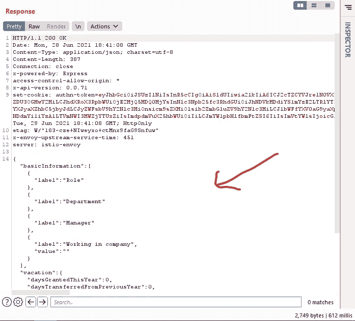

# 通过 api 错误配置泄露信息

> 原文：<https://infosecwriteups.com/information-disclosure-via-api-misconfiguration-c05ed327f9d2?source=collection_archive---------1----------------------->

祝你平安

你好，神奇黑客我叫 [Rizwan Siddiqui](https://twitter.com/Rizwan_SiDdiqu1) 我是一名 Bug 猎人。这是我的第一篇文章，希望你们会喜欢并从中学习到新的东西。让我们开始讨论我是如何发现这个 API 错误配置的。


我们走吧

***场景:web 应用是一些出售 web 应用的汽车或公共汽车，那里也有与工作相关的东西。我尝试文件上传 XSS，但没有工作，然后我去 id.target.com 有一些配置文件类型的功能，我可以上传我的文件，有我的登录日志我的 IP 地址谁登录到我的帐户通过哪个 IP。我又尝试了一些 XSS 文件上传*的**漏洞但是没有效果

在那之后，我想我应该放弃并改变我的目标，但在 id.target.com 有一个 api 端点正在获取我的个人信息，如我的 ip 地址和姓名等。那一次，我认为我应该在这里模糊化，然后我尝试模糊化，我注意到这是经过验证的端点，我应该用我的 cookie 模糊化，这样我可以找到一些果汁信息，我开始模糊化，就像这样 ffuf-u[https://id.target.com/api/FUZZ](https://id.target.com/api/FUZZ)-w wordlist-c COOKIE _ 在这里过了一段时间，它给了我[https://id.target.com/api/work](https://id.target.com/api/work)，猜猜在 api 端点中有一些错误配置，它泄漏了公司员工数据，比如公司工作描述配置文件中的职位 pic 的时候，我以为这只是一些基本的或某人的个人信息，但我错了，当我把它发送到 repeater 标签，我发送请求，一次又一次，他们给我新的员工数据。



**再现**的步骤:

1.  使用您的凭证登录 id.target.com。
2.  打开 burp suite 转发请求，直到您看到这样的请求:

```
GET /api/personal HTTP 1.1
HOST: id.target.com
Cookie : JWT TOKEN
Accept: application/json
```

3.只要去掉“个人”，加上“工作”，就能看到神奇之处。

**外卖:**

如果有一个 API 端点，总是用你的 cookies 模糊。永远不要失去希望。