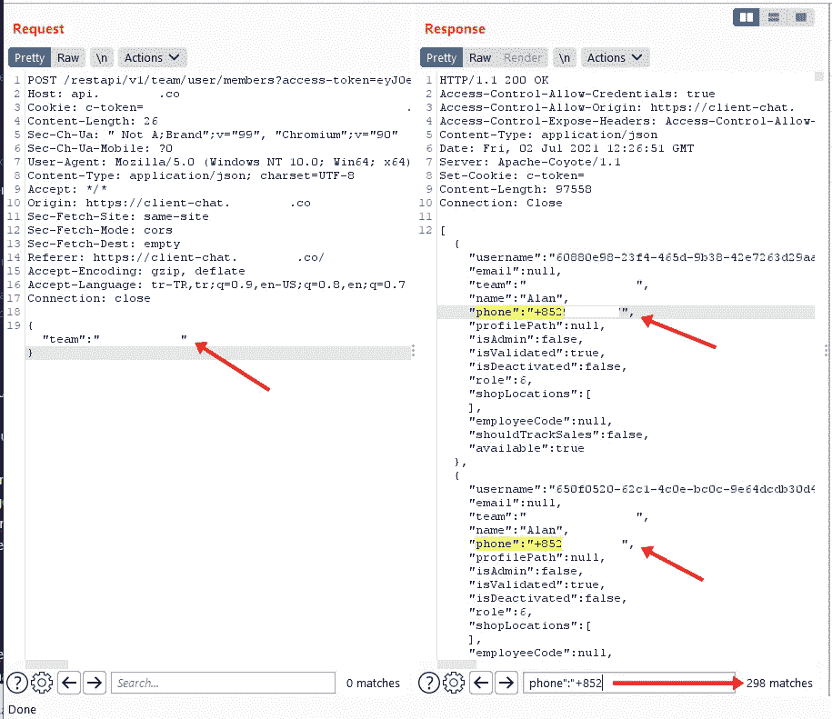

# 通过外部实时聊天服务披露信息

> 原文：<https://infosecwriteups.com/information-disclosure-via-external-live-chat-service-416c1b525276?source=collection_archive---------2----------------------->

**大家好！**

我希望你们都平安无事。今天的文章解释了我是如何通过外部实时聊天服务获取网站员工的名字、电话号码和电子邮件地址的。

我在一个私人程序 HackerOne 中发现了这个漏洞。所以我们可以称这个程序为 redacted.com。首先，我在主域上寻找一个实时聊天服务，但是我什么也找不到。然后，我在网站上注册了。现在我可以看到实时聊天在那里。我向实时聊天服务发送了一些消息。但似乎这是一个自动回复聊天服务。我失去了短暂的快乐。

在我完成了对主域的研究之后，我开始检查 Burp Suite 中的请求历史。我看到了一个`https://api.redactedchatservice.com/restapi/v1/team/user/members?access-token=jwttoken`请求。

嗯，我大概找到了 298 个现场支持代理的电话号码！

然后我查了一个电话号码的 WhatsApp 账号，验证是不是实体(真实)的 sim 卡。耶！那个电话号码有 WhatsApp 账号，所以是实体电话号码。然后我就立马举报了。

> **报告时间表**

*   2021 年 7 月 2 日提交
*   2021 年 7 月 6 日固定
*   $$$赏金于 2021 年 7 月 20 日颁发。

我的反应是在报告被:D 审判后

感谢你阅读我的第一篇文章。很高兴与大家分享这一发现。如果你发现任何有趣的东西，请随意分享。如果你有任何疑问，请在推特上给我发消息。呆在家里，注意安全！♥