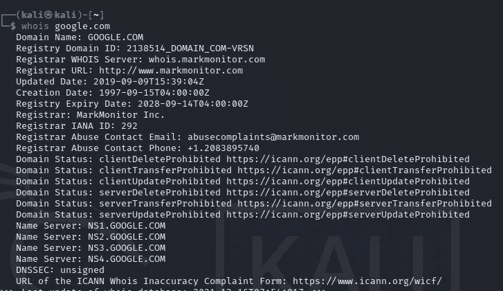
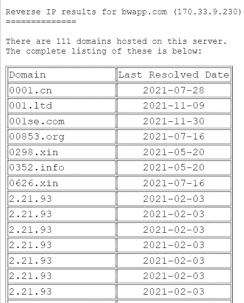
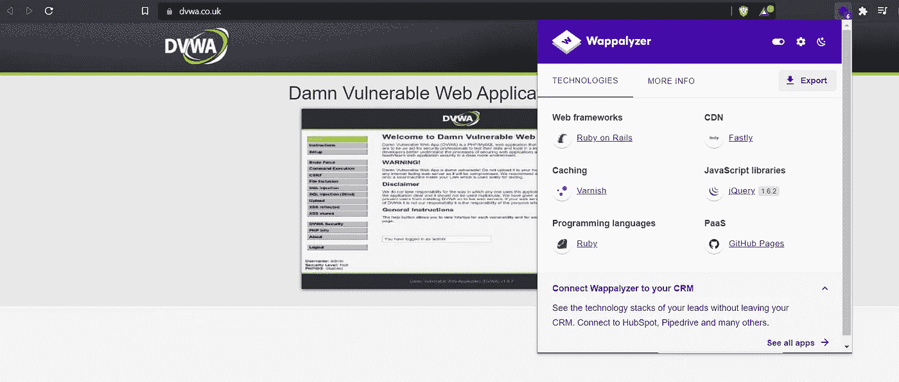
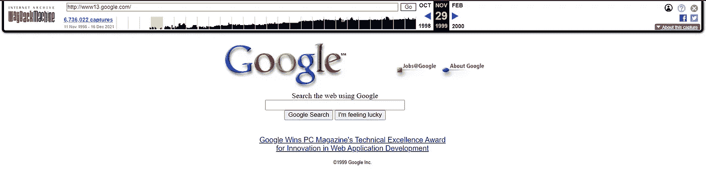
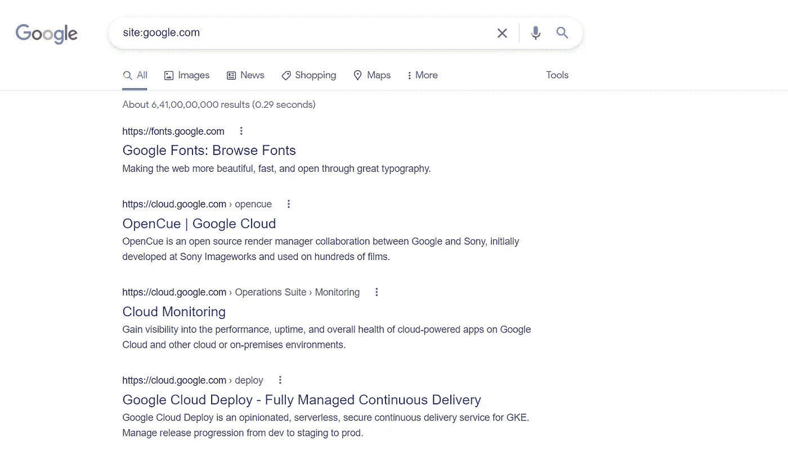
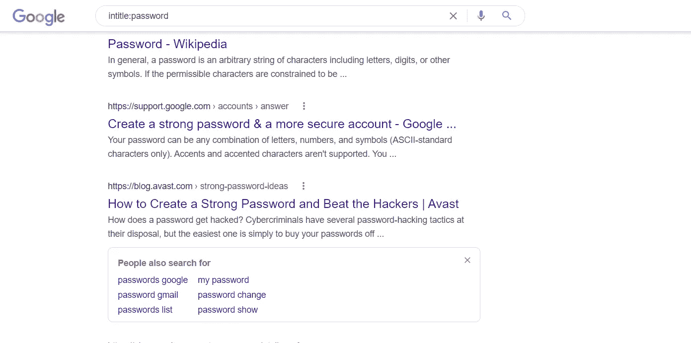
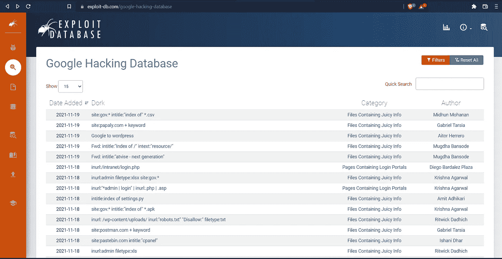

# 渗透测试中的信息收集

> 原文：<https://infosecwriteups.com/information-gathering-in-penetration-testing-770e01bab326?source=collection_archive---------1----------------------->

大家好，今天在这篇文章中，我们将学习一些关于任何目标的信息收集技巧。

首先，**什么是信息收集？**

信息收集是渗透测试的第一阶段，在此阶段，我们收集公开可用的信息或有关目标的内部信息，同时执行主动侦察和被动侦察，我们可以在进一步的测试阶段使用这些信息..

现在你要想想谁是目标，什么是主动和被动侦察:

**信息:**基本上，我们将尝试获取有关组织的数字足迹的信息，如他们的 IP 地址、DNS 记录、邮件服务器、子域名、web 应用程序的旧快照、后端技术、服务器信息、公开披露的正在使用的软件漏洞等。

**目标:**我们的目标只是我们将要测试的 web 应用程序。

**主动侦察:**这意味着每当我们与目标交战以获取信息时，就称之为主动侦察。

**被动侦察:**这意味着我们在不与目标交战的情况下收集有关目标的公开信息，这种情况称为被动侦察。

我希望到目前为止，大家都清楚什么是信息收集。

现在有许多我们用来获取信息的工具，让我们来看看其中的一些:

**whois:** 每当有人购买域名时，他/她的信息就会存储在数据库中，然后 whois 协议会查询这些数据库，并向我们显示有关该特定目标的信息。

目标 google.com 截图

在这里您可以看到，我们如何借助 whois 工具收集有关 google.com 的公开信息。移动到下一个工具:

**反向 Ip 查找:**这是一种查找托管在同一服务器或同一 IP 地址上的所有域的方法。例如:假设有一台 IP 为 192.168.1.17 的服务器，它托管着两个域，比如 abc.com 和 test.com(这叫做共享托管)。因此，在这种情况下，如果我们无法在 abc.com 找到漏洞，但同时我们可以尝试在 test.com 寻找漏洞，这也是我们应该进行反向 ip 查找的原因。

**工具:**[https://viewdns.info/reverseip/](https://viewdns.info/reverseip/)

截图:

在这里你可以看到网站**bwapp.com**的反向 IP 查找结果

Wappalyzer 是一个扩展，它向我们展示了在一个特定的 web 应用程序中使用了哪些技术，因此如果一个网站是用 java 构建的，那么安全研究员将会尝试寻找与 Java 相关的漏洞，或者如果有 apache 服务器，那么安全研究员将会尝试寻找与 apache 服务器相关的漏洞，或者如果有 nginx 服务器或任何其他技术，他/她将会尝试寻找该技术中的漏洞。现在让我们看看任何网站是如何制作的，例如:dvwa.co.uk

或者我们可以使用 https://builtwith.com 网站[获得相同的。](https://builtwith.com)

dvwa 网站的结果

**whatweb:** Whatweb 是一个命令行工具，我们可以用它来识别 web 技术，包括内容管理系统(CMS)、博客平台、统计/分析包、JavaScript 库、web 服务器和嵌入式设备。

现在接下来我们可以使用 waybackmachine 检查网站的历史。

Waybackmachine: 这可以用来检查网站早期的情况，从开始到现在，网站中添加了什么技术，什么新功能。

**链接:**[https://archive.org/web/](https://archive.org/web/)

1999 年 11 月 google.com 的结果

同样地，你也可以把它用在你的目标网站上，看看有什么新的功能被添加进来。

**Dnsdumpster:**Dnsdumpster 是一个在线实用程序，我们用它来查找目标的子域和 DNS 记录。我们寻找目标的子域来扩大我们的范围，而不是在主域上寻找域，每个人都试图在子域上寻找。

**Sublist3r:** Sublist3 是一个基于命令行的工具，我们可以用它来查找目标的子域。

**谷歌呆子:**呆子是指定的关键字，可用于获得准确的搜索结果。

一些谷歌呆子的名单:

**网站:google.com** —这个傻瓜只会给出给定域名 nmae 的结果。

这个傻瓜只会给出那些页面中有 login.html 的网址的结果。

intitle:password——如果任何网站的标题中有登录，这个呆子就会给出结果。

**filetype:pdf** —该工具将以给定的文件格式给出结果。假设你想要 pdf 格式的化学书，你可以用这个。

你也可以在 GHDB(谷歌黑客数据库)找到呆子矿

**链接:**https://www.exploit-db.com/google-hacking-database

今天我们就讲到这里，感谢各位极客的阅读。我们将在下一篇博客中见面，到那时再见&祝黑客快乐！