# 信息泄露:张贴，发现和误用！犯罪分子获取你的数据有多容易？

> 原文：<https://infosecwriteups.com/information-leak-posted-discovered-misused-how-easy-for-criminals-to-get-your-data-7a83b39f9df7?source=collection_archive---------0----------------------->

> **注意**:这篇文章解释了**如何容易地收集个人数据，然后据称这些数据被网络罪犯**利用表层/深层/深层网络用于攻击目的。本文仅用于**教育目的**。

如今，在这个数字化的世界中掌握个人数据(这意味着严格保密)是件轻而易举的事，因为大多数数据在各种情况下都会被有意(无意)暴露。

由于大量数据在各种情况下被暴露，因此对于任何持有您的数据的人来说，滥用您的数据的可能性都是轻而易举的。

**犯罪分子利用 OSINT 收集数据|来源:peakpx.com**

通常，暴露的信息(**包括购物习惯、饮食计划、旅行兴趣、约会偏好、健康信息、财务状况、密码选择等**)会帮助坏人更有效地对受害者进行网络攻击。

**商业内幕报告摘录**

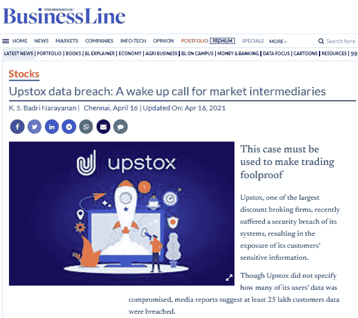

**来自 induBusinessLine 的片段**

这种泄露是网络犯罪分子对相同的受害者和新的受害者发动下一轮黑客攻击的基点。

这种泄漏背后的一些原因是:-

> 1.社交媒体平台上粗心的数据分享
> 2。来自各种黑客攻击的数据泄露
> 3。第三方泄漏
> 4。暗网市场上的数据交易。深层/黑暗网络爬行

在这篇文章中，我将展示一个关于如何毫不费力地收集数据的案例研究。

> **注**:本文重点介绍**印度**

大多数泄密都针对某个特定的国家。为了利用数据泄露，我们需要了解特定目标国家的运作情况？

以下是一些在印度需要保密的敏感数据

> Aadhaar
> 潘证
> 驾驶证
> 护照
> 银行卡
> 选民身份证
> 
> 手机号码
> 电子邮件地址
> 出生日期
> 家庭住址
> 车辆号码
> CVV 号码

但是由于必要的日常需要，如注册任何服务，人们需要在生活中的各种场合提交上述文件中的任何一种。

让我们深入了解 5 个主要的互联网身份，这是任何人都容易跟踪的目标

**目标— 1: AADHAAR**

Aadhaar 是分配给印度公民的 12 位数字。这类似于美国的 SSN。Aadhaar 还包括虹膜扫描和拇指印等生物特征数据。随机的 Aadhaar 卡被上传到各种图片分享网站。

只需点击一下鼠标，就可以毫不费力地收集这些数据！

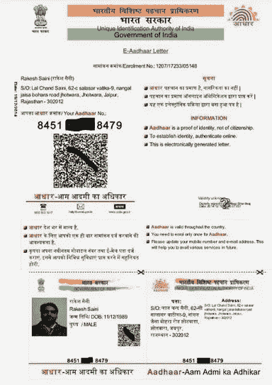

**个人的 Aadhaar 卡**

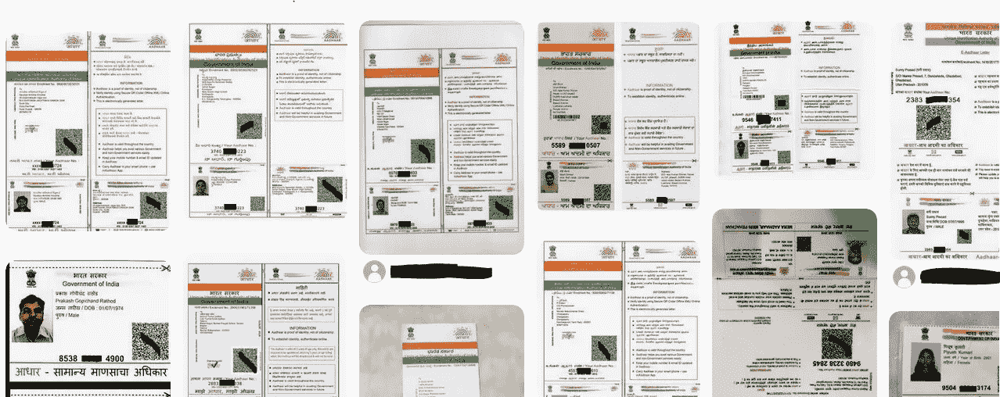

**Aaadhaar 数据可免费获得**

*有* ***病房号、区、副区*** *等分钟细节也可以通过扫描 AADHAAR 卡中存在的二维码* *提取* ***，这是卡中初看不到的。***

任何人甚至可以使用你的 AADHAAR 数据注册任何进行金融/身份欺诈的服务(你甚至没有听说过)。除此之外，从这里收集的数据可以映射到其他连接的服务以获得状态。

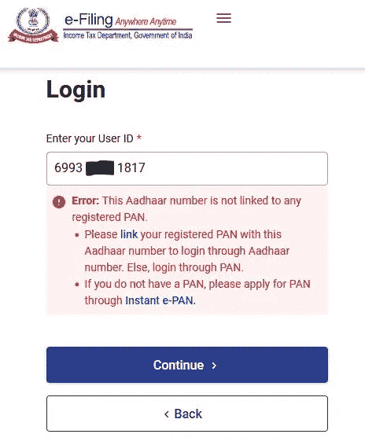

**任何人都可以弄清楚他们的 AADHAAR 是否与他们的 PAN 相关联**

> **注**:在这种情况下，任何持有 AADHAAR 信息的人都可以通过虚拟方式提供持有人的数据，将其与任何 PAN 编号进行映射，因为在此过程中不涉及直接查询。

访问这些个人信息(包括物理位置)是非常危险的。相同的信息可能被用于各种其他邪恶的活动，包括 **SIM 卡注册**(用相同的名字接收 OTP)**申请贷款**等等。这是一个很明显的**身份诈骗**的案例。

> 注:在最坏的情况下，这甚至会对目标造成身体伤害。

因为 AADHAAR 与每个服务相关联(除了选民 ID)；一个持有必要数据的人对你的数字生活有一个清晰的蓝图。

> **注**:维基解密在 2017 年揭露了一个名为“ [**ExpressLane**](https://wikileaks.org/vault7/#ExpressLane) ”的中情局项目，该项目旨在收集全球公民的生物特征信息。“ [Crossmatch](https://www.indiamart.com/proddetail/crossmatch-aadhar-kit-18561602212.html) ”据说是向其客户(包括政府或私人组织)提供生物特征记录硬件设备的官方合作伙伴。

**目标— 2:潘**

PAN 代表永久账号，是一个由 10 位字母数字组成的唯一号码，用于识别印度的纳税人。因此，把这看作是一个人的财务跟踪器。

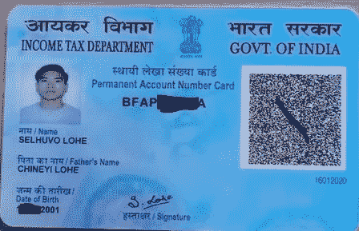

**网上搜到的正版锅**

从以上获得的潘泄漏，任何人都可以使用他的个人信息，包括一个数字签名的恶意目的。

这种情况与上述 AADHAAR 数据没有什么不同，因为许多服务也可以用这种身份证注册。

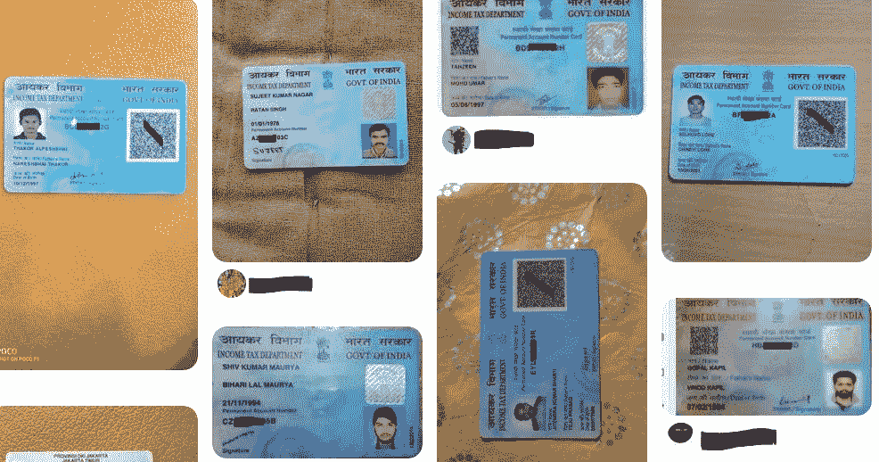

**免费提供各种 PAN 卡**

**目标— 3:银行对账单**

个人银行对账单的曝光是网络犯罪分子策划针对受害者的详细目标攻击的宝库。

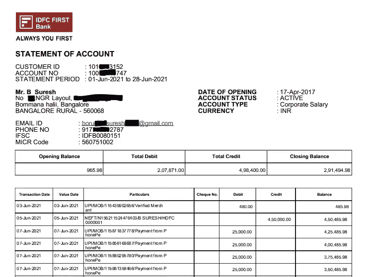

**通过搜索找到未受保护的银行对账单**

任何敏感信息都可能被犯罪分子利用各种技术获取，如**社会工程、翻垃圾箱、网络钓鱼、视像**等。

> **注意**:有些人使用图片分享网站是为了真正保存他们的敏感文件，以防丢失。但是这是有害的，并且通过对其的利用会导致灾难性的后果。其中一个受欢迎的平台是 Pinterest，那里有很多免费的 aad Haar/PAN/驾驶执照。

**目标— 4:车辆牌照**

当你开车时，车辆号码牌不能被掩盖，任何人只需轻轻一点就能找到你的信息，因此你在社交媒体上发布车辆号码的机会可以降到最低。这将揭示大量信息，包括:-

> 注册详情
> 税务信息
> 健康保险
> NOC
> 历史
> 租赁
> 业主的永久和当前地址

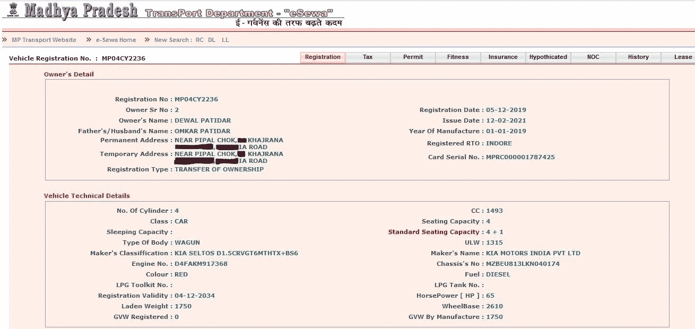

下次，当你在社交媒体上发布你的豪车时；不要忘记模糊你的车牌(如果看得见的话)；-)

**目标— 5:航班登机牌**

大多数网民直接在社交媒体或博客上发布他们的登机牌，要么吹嘘他们的旅行目的地，要么直接通过 Twitter 进行投诉，以获得更快的回应。

不知不觉中，通过公开他们的数据，他们正在成为互联网的猎物。

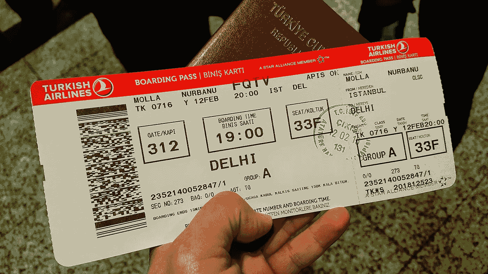

**一名乘客在博客上展示她的登机牌**

使用上面上传的图像，以下信息可以简化为:-

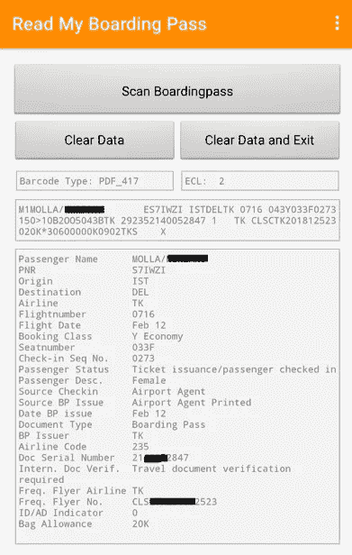

使用像“**阅读我的登机牌**”这样的应用程序，任何人都可以提取更多的信息，以便更好地侦察他们的目标。

> **注意**:在这里，我没有提到社交媒体或社交网站，因为这是绘制个人资料的常用方法。
> 
> **注**:由于 OTP 是攻击者最难获得控制权的部分，因此 **SIM 克隆、短信重定向服务、SS7 信号漏洞、**等方法将帮助黑客获得受害者手机的访问权限。

— — — — — — — — —我找你泄露的东西！！！— — — — — — — — —

**黑暗/深层网络数据暴露**

现在，让我们来看看攻击性的深度网络，在这里，网络罪犯表达他们对数据的渴望，并通过黑暗/深度网络论坛和市场满足他们的利益。

**事件— 1:黑暗网络论坛**

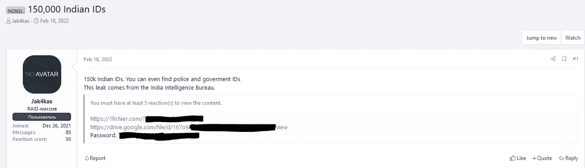

**在暗网论坛发现的印度 ID 数据**

这是一个出现在黑暗网络论坛上的数据泄露，在那里人们交易他们的泄露**来换取因果积分**以在黑客社区中获得人气。

**事件— 2:私有数据存储库**

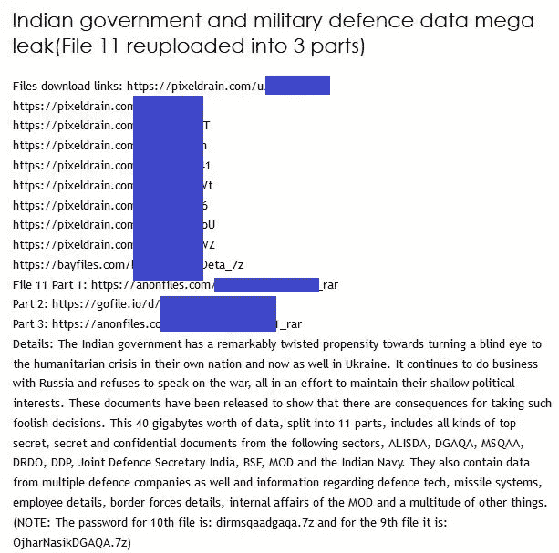

**印度军方数据库泄露**

这是在一个文件共享网站上发现的另一个漏洞。该数据由 100+GBs 的印度数据组成。

**事件— 3:馅饼**

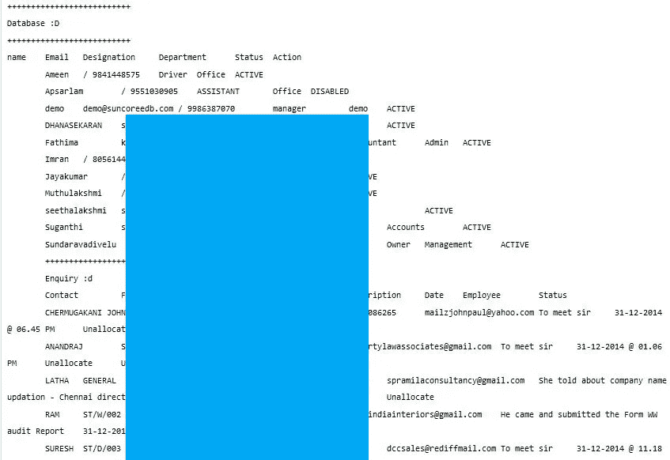

从各种来源收集的数据被匿名发布在各种粘贴网站上，任何人都可以查看这些数据，并为未来的犯罪周期收集这些数据。

**事件— 4:勒索软件数据泄露**

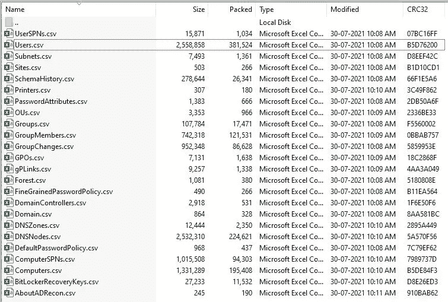

**报价包装上列出的数据**

这是印度支付系统的一次数据泄露。由此可以假设，大多数敏感信息，如**密码、用户、BitLocker 密钥、**等都存储在 Excel 表中，任何拥有这些信息的人都可以渗透到企业网络中，并可以秘密地进行金融/身份欺诈，从而导致各种犯罪，如**勒索软件部署、数据泄露、后门植入、隐藏外壳访问、数据爬行、初始访问代理、在暗网上出售数据**等。

攻击后，勒索软件运营商可能会在其泄露网站上泄露公司信息(如果受害者否认支付赎金)。

**事件— 5:暗网泄密市场**

**暗网市场提供的数据泄露**

**印度公牛**——2020 年 6 月**一项广受欢迎的金融服务遭到 **Clop 勒索软件**的攻击，所有金融文件在网上被泄露给公众。所有这些泄露信息现在都被网络罪犯收集起来，放在暗网上出售(暗网只能通过 TOR 访问)。**

**在黑暗网络上有专门的市场，任何人都可以提供他们被破坏的数据，并以加密货币如比特币、以太币或 Monero 得到支付。**

****事件— 6:电报商店****

**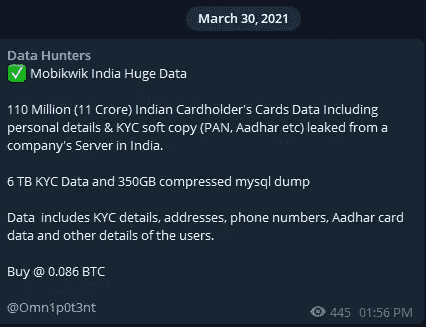**

****电报数据交易****

**最近，网络犯罪分子开始通过电报渠道提供他们的服务(如**泄漏、利用和勒索软件**),而不是建立一个全新的网站，并提供额外的安全层来掩盖注册者的姓名以隐藏他们的真实身份。**

**Telegram 也方便了犯罪分子向他们的追随者提供直接服务，而不是在市场上销售他们的产品，根据一般市场经验法则收取佣金。**

****事件— 7:网络攻击活动****

**许多网络攻击活动的发生是由于国家之间的各种政治分歧。因此，许多网络攻击通常会发生，例如“ **#OpIsrael** ”，许多以色列网站被黑客攻击，数据通过 Twitter 或其他社交媒体平台被转储。**

**以下是一个黑客组织针对印度实施的一项行动的结果**

**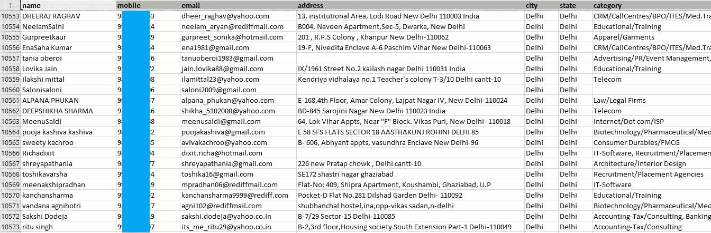**

****黑客倾倒的印度女性数据****

****结论****

****随着越来越多的新服务每天如雨后春笋般涌现，提交个人信息的需求被最小化，以加快延长的传统方法。**这是攻击者/骗子用来诈骗老百姓的漏洞。**

**越来越多的数据被输入互联网，发现类似数据的机会很容易，因为它们大多是由算法驱动的。**

> ****注意**:由于这篇文章只关注印度，但是任何人都可以采用同样的方法来针对任何国家的敏感文件来欺骗无辜者；因为信息泄露会造成严重的数字危险！已通知 **CERT-IN** ，等待响应。**

****关键要点****

> **不要在任何在线文件/图片分享网站上传你的敏感文档。万一，检查它是否在保护/私人模式。**
> 
> **不要在任何平台上传你的数字签名。**
> 
> **为了隐藏你的 AADHAAR 号码，请始终使用 AADHAAR 的屏蔽版本。**
> 
> **千万不要展示你的**航班登机牌**或**车号**(在社交媒体帖子的情况下)。**
> 
> **如果您的私人信息在谷歌搜索(或任何其他搜索引擎结果)中暴露，您可以通过向托管方提交您的详细信息来删除该信息。**
> 
> **不要在不同的平台上使用相同的密码，以防意外的邮件泄露。**
> 
> **永远不要在任何公共投诉论坛上透露你的 AADHAAR 号码或任何其他敏感信息，因为任何人都可以利用这些信息跟踪你。**
> 
> **您可能永远也不知道您的数据是否在任何时候遭到破坏。但是你可以通过访问 [HaveIBeenPwned (](https://haveibeenpwned.com/) 获取电子邮件地址和电话号码)来确认。**
> 
> **您的敏感数据泄露并不总是您的错，因为由于糟糕的安全实践，第三方泄露的可能性很大，因为公司无意中泄露了数据。因此，责任并不总是在你身上，但你可以将风险降到最低。**

**永远记住:轻松的数字生活伴随着巨大的隐性代价！**

## **下次，远离犯罪分子精心制作的电子邮件/请求/电话网络来欺骗你！！！**

## **关注我在 Twitter 上的有趣的 DarkWeb/InfoSec 简短发现！；-)**

> *****注:-* 本文纯属个人研究，未经作者同意，不得在任何地方使用/发表。****