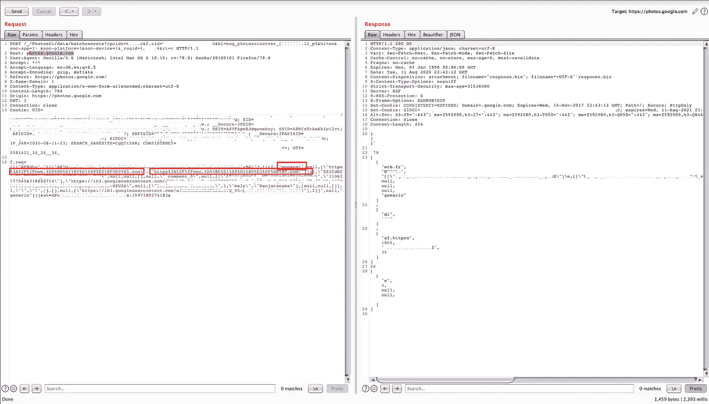
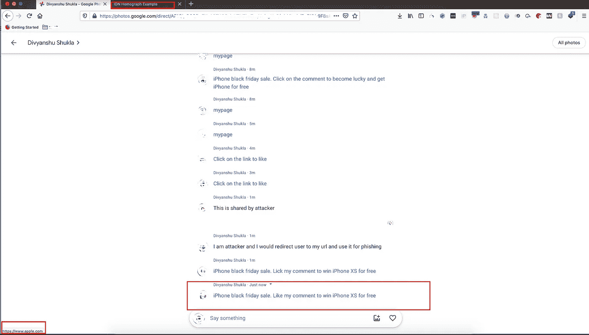
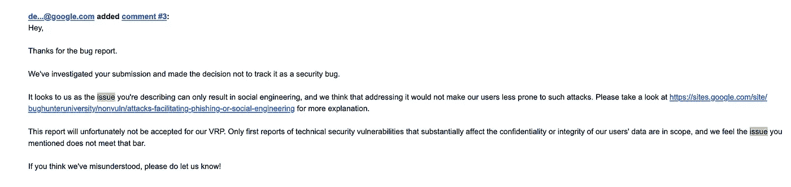

# 通过谷歌照片共享选项中的评论框在任意文本中注入 Punycode URL

> 原文：<https://infosecwriteups.com/injecting-punycode-url-within-the-arbitrary-text-via-comment-box-in-google-photos-sharing-option-8b424065deb3?source=collection_archive---------0----------------------->

# 定义:

HTML 注入是一种注入漏洞，当用户控制输入点时会出现这种漏洞，它可以将任意 HTML 代码注入易受攻击的网页。
有可能注入<一个>标签以及 Punycode 域，并创建钓鱼评论，从而被攻击者用来通过公开图像来攻击任何人。


# 攻击场景:

照片分享允许在[https://photos . Google . com/direct/afxxxxdquppxxxxxxxxxxxxxraxxxxxxx](https://photos.google.com/direct/AFxxxxxDqUPppXXXXXXXXXXXrAXXXXXXX)上用心形表情符号进行评论和照片上传。在评论时，可以插入任意文本的任何 URL，它在评论中表现为一个超链接。HTML < a >元素(或锚元素)通过它的 href 属性，创建一个指向网页、文件、电子邮件地址、同一页面上的位置或 URL 可以寻址的任何其他内容的超链接。
**在火狐浏览器中，使用这种任意的内容注入和注入 Punycode URL 使其更有冲击力。**

攻击者可以与多人共享图像/视频，也可以创建可共享的链接。从而使其对公众可用。

攻击者可以利用注释中注入的文本内容将用户重定向到恶意网站。没有任何警告显示网络钓鱼攻击是可行的。直接注入 Punycode 域是不可能的，因为它会导致完全删除 URL。

> **可以绕过限制，通过 URL 编码值插入 Punycode URL。**

同样在火狐中，IDN _ 秀 _punycode 默认是禁用的。这使得它更容易受到 URL 重定向和通过同形异义词攻击的钓鱼网站的攻击。当用户单击时，没有警告消息表明用户将被重定向到攻击者的(Punycode)域。

**有效载荷:**

```
<a href=”[https://www.аррӏе.com](https://www.аррӏе.com)”>iPhone Black Friday sale</a>
```

# 复制步骤:

1.  参观[https://photos.google.com/](https://photos.google.com/)
2.  在[photos.google.com](http://photos.google.com)中选择视频/图像
3.  点击共享选项，然后在 Google 相册中点击发送。
4.  输入您想要共享的用户名。此外，还可以生成一个可共享的链接以供查看。
5.  公共链接将类似于:[https://photos.app.goo.gl/ophzhxxxxxxxxxx9](https://photos.app.goo.gl/ophzhxxxxxxxxxx9)
6.  点击说点什么，然后输入评论。在评论中添加 URL，如[https://google.com](https://google.com)或[https://www.аррӏе.com](https://www.аррӏе.com)(这是 Punycode 域名)。
7.  通过 Burpsuite 拦截请求，并篡改添加的 URL 的值。将任意文本(标签)与任何恶意 URL 一起添加到攻击者想要重定向的位置。
8.  以火狐为例。也可以注入 Punycode URL，注入任意文字:点击评论喜欢，查看更多照片。

```
**Request Body:**f.req=[[[“HF8OLc”,”[[\”AF1Qip6767676767676767r_24-KRiu868NGwdddddddddddddddddddddddddddddddddddddA\”],[[[2,\”mypage\”,null,[\”https%3A%2F%2Fwww.%D0%B0%D1%80%D1%80%D3%8F%D0%B5.com\",\"https%3A%2F%2Fwww.%D0%B0%D1%80%D1%80%D3%8F%D0%B5.com\"]]]],\"ZS1CdDZ6dG8yTFBdddddddddddddYS\",null,null,[],null,\"`comment_0\",null,[[\"AF1QipNMmL5__WEl4ODcdOzFEjOeXQRw\",\"99999277788885631999999999995\"],\"https://lh3.googleusercontent.com/JcxcvcvcvbvvbbbbbbbbbbbbbbbbbbbbbwMT-J3vWAycxxxxxxxxxxxxxxxxxxxxxxxxxxx1H-XZU2A\",null,[\"Demo+App\",1,\"male\",\"justmorpheus\"],[null,null,[]],1,\"\",\"\",[],[],null,[\"[https://lh3.googleusercontent.com/a/AATXAJxUjjEGFNSdcXVQ_Y5hhhcZ32-b9L7TZw-SeY4\](https://www.google.com/url?q=https://lh3.googleusercontent.com/a/AATXAJxUEGFNSdcXVQ_Y5-QmHDcZ32-b9L7TZw-SeY4%5C&sa=D&usg=AFQjCNFSnVwNv_b8sOXV6F25RLsTgZP5mQ)"],2]]",null,"generic"]]]&at=AP9999999999DfSxzVFVXTRacxcxcxcxcx:16979004365222&
```

8.发送请求并检查 200 OK。



用恶意数据篡改输入的打嗝请求

9.重新加载页面并将鼠标悬停在用任意文本创建的超链接上。

10.在 Firefox 中，任意文本显示为原始域名，而不是 Punycode，一旦用户点击链接。它可以被重定向或钓鱼。



最终攻击者控制的带有 Punycode 的图像

# 结果:

由于社会工程攻击，谷歌将该问题标记为不适用。，这不属于范围。



## *后来被谷歌修复:P.*


重新测试后，问题得到了解决。

再见，下次见。

[](https://www.buymeacoffee.com/justmorpheus)