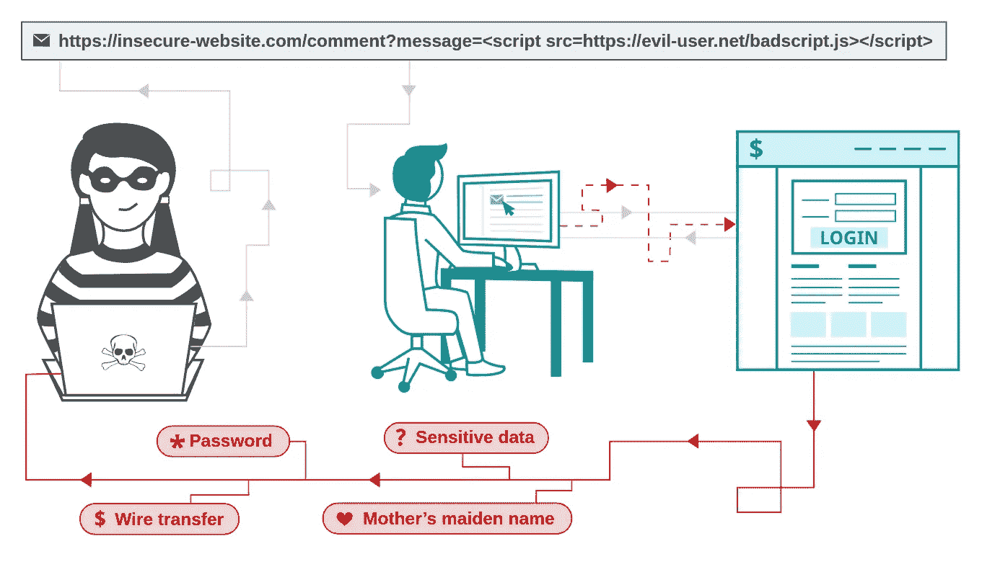

# 安全性:防止跨站点脚本(XSS)

> 原文：<https://infosecwriteups.com/injection-vulnerabilities-cross-site-scripting-xss-7fd9dc28cc47?source=collection_archive---------0----------------------->



PortSwigger

跨站点脚本是最常见和最流行的 web 攻击之一。

它允许攻击者将客户端代码注入 web 应用程序屏幕，然后被受害者查看。

后果和影响可能因攻击类型和攻击发起的环境而异。

XSS 可以归类为:

*   自体 XSS /反射 XSS /非持续性 XSS /二型 XSS
*   持久性 XSS /储存的 XSS/I 型 XSS
*   基于 DOM 的 XSS

# 自我 XSS

假设我们有下面的 PHP 代码——PHP 只是为了挑选一个(清晰的)代码:

自我 XSS 的例子

教科书 XSS:受害者打开一个链接，看起来像

```
GET https://my-website.com/page.php?id=%22%3B%20alert(1)%3B%20var%20a%20%3D%20%22(GET https://my-website.com/page.php?id=”; alert(1); var a = “)
```

神奇的是，上面的代码在被 PHP 渲染并发送到受害者浏览器后，看起来会像这样

生成的输出

在这种情况下，我们只是打开一个弹出窗口，并在其中显示“1”，但攻击者可以变得更有创意:他可以进行 AJAX 调用，并将 document.cookie 发送到他的服务器(假设应用程序没有为会话 cookie 设置仅 HTTP 标志)。

这叫做反射 XSS，因为你发送了一个恶意的请求，得到了一些恶意的回应。请记住:受害者需要打开一个恶意制作的链接(也可以使用第三方链接缩短程序网站来缩短)

# 执着的 XSS

类似于自我 XSS，但工作流程不同:在这种情况下,$id 已经存储到数据库(或其他持久存储)中，然后在稍后的时间被受害者读取。

一个典型的例子是一个平台，允许用户发布内容，然后显示给其他用户(即媒体):攻击者将能够在帖子中编写一些 JS，任何阅读该帖子的用户都将自动(可能悄悄地)运行恶意 JS 代码。

你可以看到这是如何很快变得非常糟糕*非常*，使得持续的 XSS 成为这种攻击的一个更加危险的子类。

# 基于 DOM 的 XSS

Amit Klein 在 2005 年首次描述了基于 DOM 的 XSS，这是一种鲜为人知的变体，每当修改常规客户端代码运行的 DOM 上下文直接导致 XSS 时就会出现，因此执行会导致“意外”行为。

基于 DOM 的 XSS 示例

通常这个 HTML 页面会用来欢迎用户:

```
GET [http://my-website.example.com/welcome.html?name=Michele](http://my-website.example.com/welcome.html?name=Michele)
```

然而，诸如以下的请求:

```
GET http://my-website.example.com/welcome.html?name=<script>alert(document.cookie)</script>
```

会导致 XSS 病。

同样-你可以升级这个:发送 cookie 到一个恶意的服务器-可能持有会话信息(即会话 cookie)并接管一个帐户。

*在核心*处，每当应用程序接受不可信的(应用程序从外部接收的任何东西——通常是用户输入数据)**数据并显示它，而没有根据其上下文正确地对其进行转义**时，就会出现一个 XSS 漏洞**。**

上下文是这句话中的一个基本词汇，这也是为什么 XSS 与 SQL 或 XML/HTML 注入没有太大区别的原因。

# 攻击者能做什么？

一般来说，如果攻击者设法执行 XSS 攻击，他基本上可以执行以下一项或多项操作:

> **广告劫持** —将他的广告注入其中赚钱
> **点击劫持** —在页面上创建一个隐藏的覆盖图，劫持受害者的点击以执行恶意操作。
> **会话劫持** —如果 cookie 中没有 HTTP ONLY 标志，JavaScript 可以访问 HTTP cookies。
> **内容欺骗** — JavaScript 可以完全访问 web 应用的客户端代码，因此他可以使用它来显示/修改所需的内容。
> **凭证收集** —他可以使用一个别致的弹出窗口来收集凭证:WiFi 固件已更新，请重新输入您的凭证进行身份验证。
> **强制下载**——所以受害者不是从 absolutely-safe.com 下载他的恶意 flash 播放器？没问题:他可以尝试从受害者访问的可信网站强制下载。
> **密码挖掘** —他可以使用受害者的 CPU 挖掘一些比特币(或 altcoin)
> **绕过 CSRF 保护** —他可以收集并提交 CSRF 令牌，以在网站的其他地方执行 POST 操作。
> **键盘记录** —不言自明
> **录音、拍照、地理定位** —需要用户授权，但他可以访问受害者的摄像头、麦克风和位置。多亏了 HTML5 和 JavaScript。
> **窃取 HTML5 web 存储数据** —网站可以在浏览器中存储数据以备后用，当然，JavaScript 可以通过 window.localStorage()和 window.webStorage()
> **指纹识别** —非常容易找到您的浏览器名称、版本、安装的插件及其版本、您的操作系统、架构、系统时间、语言和屏幕分辨率。
> **网络扫描** —受害者的浏览器可被滥用，用 Javascript 扫描端口和主机。
> **崩溃浏览器** —为什么不？！:-)
> **窃取信息** —从网页抓取信息，发送到他的恶意服务器。
> **重定向**—自明
> **Tabnapping** —花式版重定向:当超过一分钟没有接收到键盘或鼠标事件时，这可能意味着用户是 afk，他可以偷偷地用一个假的网页替换当前网页。
> **截图** —再次感谢 HTML5，现在可以截图网页了。盲人 XSS 检测工具已经这样做之前，这是很酷的。
> **执行动作** —他在控制浏览器

不是全部丢失，跨站脚本是可以防止的！

# 能做些什么？

不幸的是，没有灵丹妙药。你可以是:

*   使用 Web 应用程序防火墙(希望有最好的结果:他们可以阻止一些/大多数常见的攻击，但不是全部)
*   使用 [*X-XSS 保护*](https://developer.mozilla.org/en-US/docs/Web/HTTP/Headers/X-XSS-Protection) ，当浏览器检测到反射的跨站脚本时，阻止页面加载(不推荐使用 IE 功能)
*   使用[内容安全策略](https://developer.mozilla.org/en-US/docs/Web/HTTP/CSP)、 [X-FRAME-OPTIONS](https://developer.mozilla.org/en-US/docs/Web/HTTP/Headers/X-Frame-Options) 、(等等..)标题以限制影响

但是，以上(或组合)都不是实际问题的解决方案。如果有的话，他们可能会给你一种虚假的安全感。

真正的解决方案是编写不易受攻击的代码😃。

如前所述:

> *在核心*处，每当应用程序接受不可信的(应用程序从外部接收的任何东西——通常是用户输入数据)**数据并显示它，而没有根据其上下文正确地对其进行转义**时，就会出现一个 XSS 漏洞**。**

因此，解决方案是根据内容所处的上下文来正确地对内容进行转义:在通用的 HTML 上下文中有特殊的含义，因此它们应该被转换成对应的 HTML 代码(<>)；相反，在 HTML 属性上下文中，双引号(或单引号)具有特殊的含义，因此它们应该被转换成对应的 HTML 代码(")等等

相反，在 Javascript 中，根据注入不可信输入的具体区域，理解哪些字符有特殊含义可能会有点困难——因此，在这种情况下，用十六进制的等价字符对所有非字母数字字符进行转义更容易(例如，双引号变成\x22，＄变成\x24，等等)。

不要自行开发安全性:相反，您应该依赖您选择的语言/框架为此提供的任何东西。

我会试着列出每种语言的一些例子。

你的语言/框架不在这个列表中吗？
欢迎留下评论/建议，我会修改列表！

分享就是关心，嗯？😄

由于您对安全性和常见漏洞感兴趣，您可能还想了解一下 SQL 注入以及如何在您的应用程序中防止它们。

## 原生—c#(ASP.NET)

MVC 中使用的 [Razor 引擎](https://docs.microsoft.com/en-us/aspnet/core/security/cross-site-scripting?view=aspnetcore-3.1#html-encoding-using-razor)自动编码所有来自变量的输出。您还可以使用 [JavaScriptEncoder](https://docs.microsoft.com/en-us/dotnet/api/system.text.encodings.web.javascriptencoder?view=netcore-3.1) 来编码 Javascript 上下文中的变量。

## 本地语— Go (Golang)

【golang.org/pkg/html#EscapeString】将特殊字符(<>&’”)转义为它们的 HTML 代码等价物

golang.org/pkg/html/template 给你更多的控制和更好的 CSS/JS/HTML 转义功能。

## 本机— Java

OWASP 提供了 [AntiSamy](https://github.com/nahsra/antisamy) (用于确保用户提供的 HTML/CSS 符合应用程序规则的 API)

OWASP 还提供了 [Java-HTML-Sanitizer](https://github.com/OWASP/java-html-sanitizer) ，以不同的方式做着同样的事情。HTML-Sanitizer 使用起来更快更简单，但灵活性较差。

OWASP 也曾经提供 ESAPI，但是现在这个项目已经不存在了。

## 本机— PHP

htmlentities 会将所有适用的字符转换成 HTML 实体，但这并不是防止 XSS 的最好方法。

[HTMLPurifier](http://htmlpurifier.org/) 默认情况下会剥离恶意代码，但是您可以将其配置为避开它。

## 原生— Python

[html 包](https://docs.python.org/3/library/html.html)允许你将& < >(如果需要的话，还有“)转换成它们的 html 代码等价物。

## 角度 2，3，4，5，6，7，8，9-JS

默认情况下，角度将所有值视为不受信任。当一个值通过属性、特性、样式、类绑定或插值从模板插入到 DOM 中时，Angular 清理并转义不可信的值。

## Django — Python

如果你使用 Django 模板，你可以抵御大多数 XSS 攻击。然而，这并不是万无一失的: [Django 模板](https://docs.djangoproject.com/en/3.0/topics/security/)转义[特定字符](https://docs.djangoproject.com/en/3.0/ref/templates/language/#automatic-html-escaping)，这些字符对 HTML 来说尤其危险，但是它不能保护你免受基于 HTML 属性的攻击。

## 烧瓶——Python

Flask [默认配置 Jinja2 自动转义所有值](https://flask.palletsprojects.com/en/1.1.x/security/#cross-site-scripting-xss)。

## Laravel — PHP

在 Laravel ≥5 时，缺省值{{ }}应该对所有输出进行转义

## React — JS

React 会自动为您转义变量，但是有一些问题。更多关于那个[在这里](https://medium.com/javascript-security/avoiding-xss-in-react-is-still-hard-d2b5c7ad9412)。

## Symfony — PHP

[Symfony 应用程序默认是安全的，因为它们执行自动输出转义](https://symfony.com/doc/current/templates.html)

*关注* [*Infosec 报道*](https://medium.com/bugbountywriteup) *获取更多此类精彩报道。*

[](https://medium.com/bugbountywriteup) [## 信息安全报道

### 收集了世界上最好的黑客的文章，主题从 bug 奖金和 CTF 到 vulnhub…

medium.com](https://medium.com/bugbountywriteup)