# 受伤的机器人 CTF 报道

> 原文：<https://infosecwriteups.com/injuredandroid-ctf-writeup-41dd40165cfa?source=collection_archive---------2----------------------->

在这篇文章中，我将走过受伤的机器人 CTF。这是一个易受攻击的 Android 应用程序，带有基于 bug bounty 发现、开发概念和纯创造性的 CTF 示例。我在下面的参考资料中留下了创建者 GitHub 和我用来下载 APK 的 Github 的链接，供有兴趣尝试 CTF 的人使用。


# 放弃

这篇文章显然会有剧透，我鼓励读者在看这篇文章之前尝试一下这个 CTF。通过自己先尝试，你会学到更多，并从自己解决挑战中获得更多的满足感。

这本《CTF》的作者也曾提到:

> 查看 InjuredAndroid 目录中应用程序的源代码、injured Android flag walk throughs . MD 文件或 Binaries 目录中的二进制源代码会破坏一些(如果不是全部)ctf 挑战。

我还必须指出，我所使用的 APK 发布版的挑战七和挑战八不能正常工作，也没有标志。我在开始写文章后发现了这一点，并决定继续写下去。说了这么多，是时候继续写文章了！

# 初始设置

对于这个 CTF，我将使用 Kali Linux 虚拟机作为我的主机设备，并使用 Genymotion 创建一个三星 Galaxy S8 仿真器，规格如下:


为了开始 CTF，我使用 Android Debug Bridge (ADB)连接到我的仿真器，并安装了“伤害 android.apk”文件。

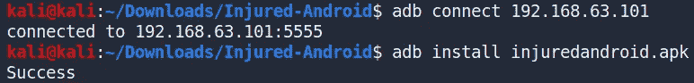

查看我的模拟器，我可以看到应用程序已经成功安装。


这位 CTF 作者还强烈推荐反编译“伤害 android.apk”。为此，我将使用一个叫做移动安全框架(MobSF)的工具。MobSF 自动执行反编译 APK、读取清单文件、识别源代码和清单文件中的问题、提取应用程序的证书等过程。让我不必手动完成这项工作。下图显示了应用程序已经被 MobSF 成功反编译。

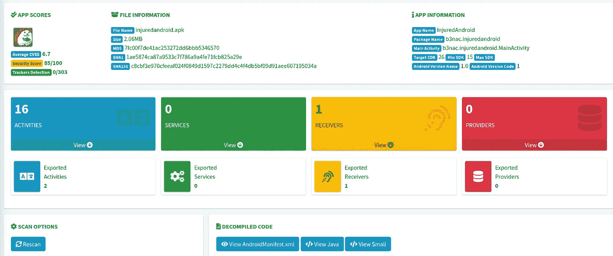

初始设置完成后，我现在可以开始迎接挑战了。

# XSS 试验

打开应用程序，我看到了下面的主要活动。

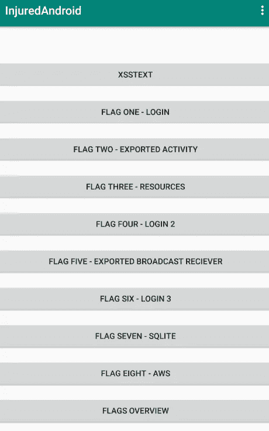

似乎总共有八面旗帜。据提交人称:

> XSSTEST 只是为了好玩，并提高人们对网页浏览量如何容易受到 XSS 攻击的认识。

查看 XSSTEST 活动，我看到了一个简单的输入字段，我可以在其中提交文本。

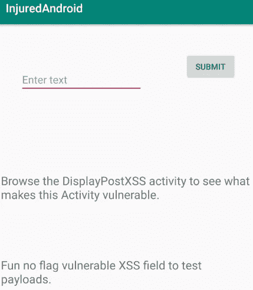

我可以输入一些简单的 JavaScript，它将创建一个警告框来演示漏洞是否存在。

```
<script>alert('XSS!!')</script>
```

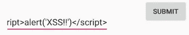

输入这个输入会导致在加载用于显示我们的输入的活动时生成一个警告框。

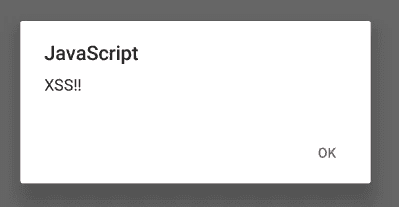

挑战建议查看“DisplayPostXSS”活动，以确定是什么使该活动易受攻击。在下图中可以看到“DisplayPostXSS”活动的源代码。

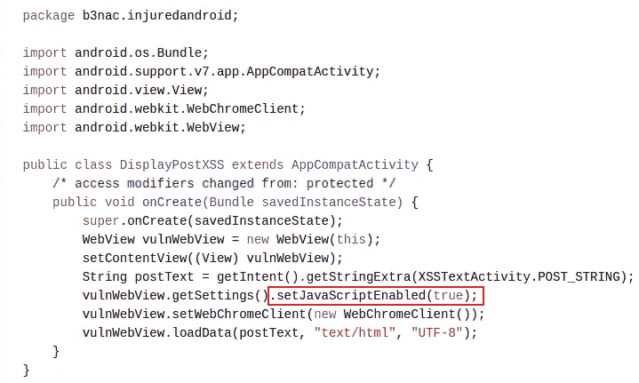

检查源代码，我可以看到创建了一个新的 WebView 对象，它允许开发人员将 web 内容显示为他们活动布局的一部分。此活动易受 XSS 攻击，因为开发人员启用了 JavaScript 执行，如上面以红色突出显示的内容所示。这是一个很好的、简单的例子，说明了开发者如何让 WebViews 容易受到 XSS 的攻击。

# 标志一:登录

在第一个带标志的挑战中，我看到一个活动，要求我输入标志并登录。

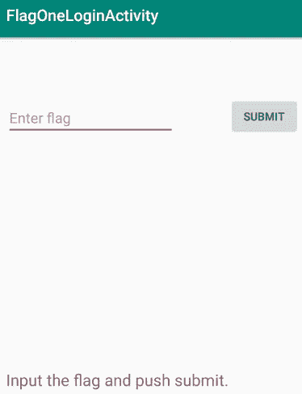

对于这个挑战，我从检查“FlagOneLoginActivity”源代码开始。检查源代码发现，这个活动是检查我的输入是否等于 flag，flag 是用明文硬编码的。

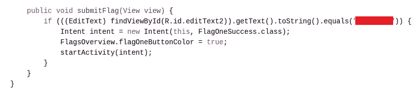

进入这面旗帜会给我一个新的活动，祝贺我找到了这面旗帜。很好很容易😄。

# 标志二:导出的活动

继续挑战二，我看到了一个活动，它解释了我可以绕过主活动并调用导出的其他活动。

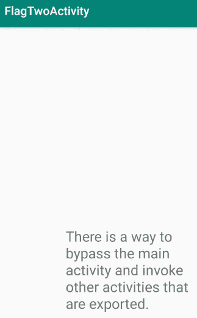

我通过查看应用程序的 AndroidManifest 文件来查看导出了哪些活动，从而开始了这个挑战。该文件充当应用程序的蓝图。

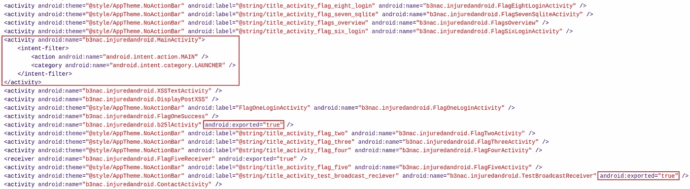

根据 AndroidManifest 文件导出了三个活动。这些活动包括“MainActivity ”,由于设置了意图过滤器，默认情况下会导出“main activity ”,一个名为“b25lActivity”的活动和一个名为“TestBroadcastReciever”的活动。“b25lActivity”是一个不同寻常的活动名称。使用下图所示的 ADB，我可以开始这个导出的活动。

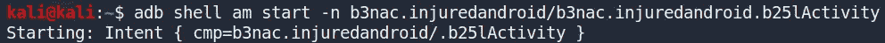

这个活动向我展示了这次挑战的旗帜。

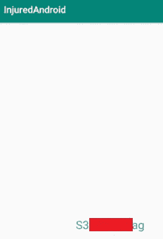

# 旗帜三:资源

在这个挑战中，我被要求输入并提交旗帜。

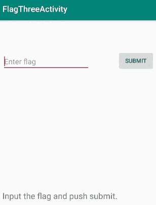

查看“FlagThreeActivity”的源代码，我可以看到开发人员再次使用“equals()”方法来比较我的输入和标志。但是，这一次我的输入将与从资源文件中检索的字符串进行比较。

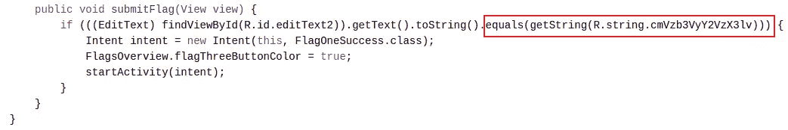

在 Java 中，可以通过键入“R.string. <string_name>”来引用资源。在这个实例中，被引用的字符串名称是“cmVzb3VyY2VzX3lv”。因为我使用了 MobSF 来反编译应用程序，所以我可以检查从应用程序的资源文件中恢复的字符串。搜索字符串名称“cmVzb3VyY2VzX3lv”会显示此挑战的标志。</string_name>


还可以通过使用 APKTool 反编译应用程序并检查“strings.xml”文件来检索此标志。

# 标志四:登录 2

这个挑战建立在挑战一的基础上。如前所述，挑战是要求我通过提交标志来登录。

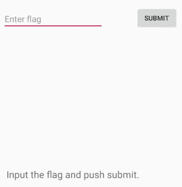

查看这个活动的源代码，我可以看到它从另一个名为“Decoder”的类中检索数据，然后将其与我的输入进行比较。

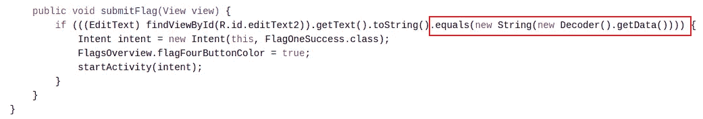

我可以检查这个“Decoder”类 java 文件，它揭示了一个 base64 编码的文本字符串。

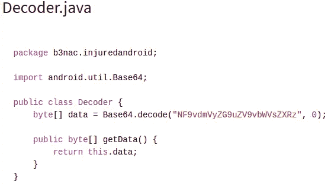

使用 CyberChef 等在线工具解码这个 base64 编码的字符串给了我这个挑战的旗帜。

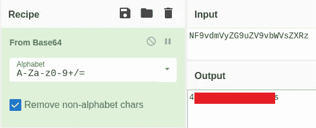

# 标志五:出口广播接收机

查看此挑战的活动，没有提供文本或挑战描述。相反，每次我单击挑战链接时都会显示一条消息。在参观了几次挑战赛的活动后，旗帜被广播给了我们。

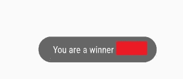

显然，我不满足于仅仅得到旗子，我决定看看这个活动的源代码，以便了解这个挑战是如何进行的。顾名思义，这个应用程序已经导出了一个广播接收器。广播接收机被设计成收听被称为广播的系统范围的事件(例如，网络活动、应用程序更新等)。)然后如果广播消息与广播接收机内的当前参数匹配，则触发某个事件。这个挑战活动的源代码创建了一个新的意图，然后广播这个意图。

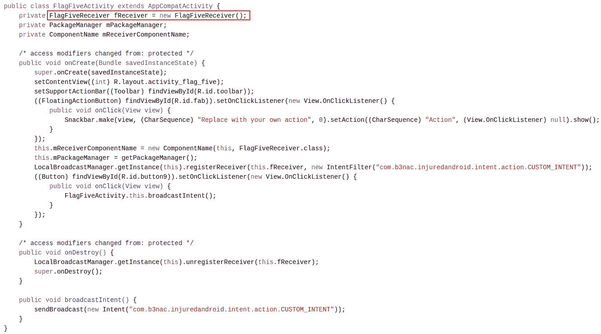

一个名为“FlagFiveReceiver”的类处理 BroadcastReceiver 在接收意图广播时所做的事情。

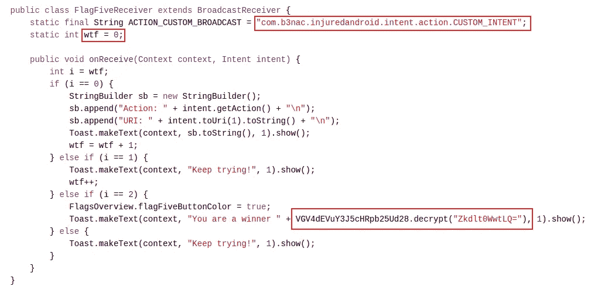

该类的源代码从声明一个字符串变量开始，该变量是触发广播接收器的动作。还声明了一个名为“wtf”的变量，该变量在每次与活动交互时递增。“if else”块语句用于在“wtf”变量增加到值 2 后打印标志。可以看到一个随机命名的有趣类，它有一个名为“decrypt()”的函数。我可以假设被解密的文本是标志，我决定更仔细地研究这个类。

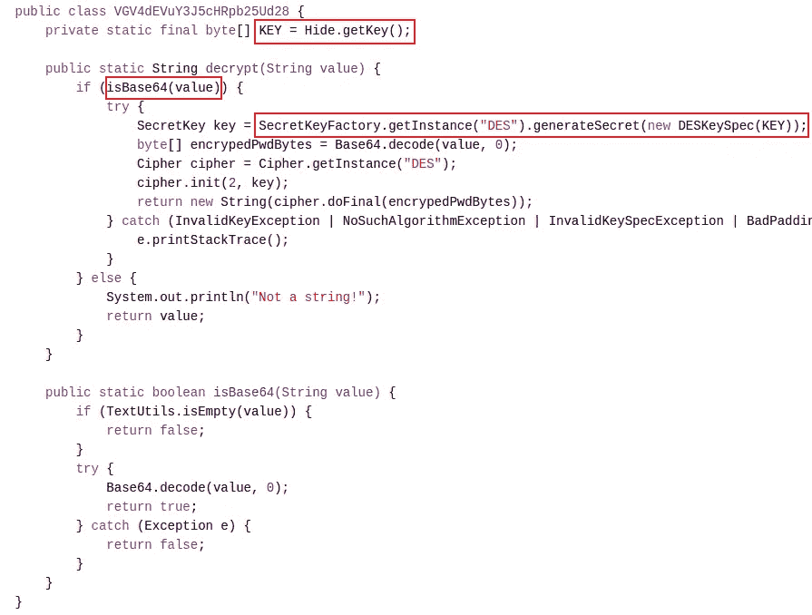

查看源代码，我可以看到该标志是使用已弃用的 DES 加密算法加密的。“decrypt()”函数接受一个字符串参数，检查它是否是 base64 编码的，然后继续对标志进行解密。为了解密该标志，需要用于初始加密该标志的密钥，并且可以看到该密钥是使用函数“getKey()”从名为“Hide”的类中检索的。这个类的源代码可以在下面看到。

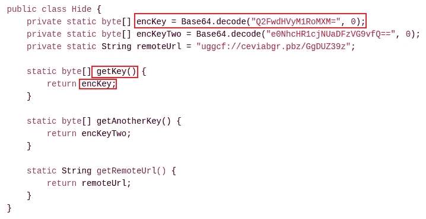

查看上图中的源代码，我可以看到“getKey()”函数返回一个名为“encKey”的变量，该变量包含 base64 解码的密钥。使用 CyberChef 这样的在线工具，我可以检索用于加密旗帜的明文密钥。

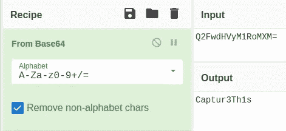

# 标志六:登录 3

正如前面看到的这种类型的挑战，我被要求提供标志以便登录。

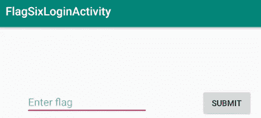

查看活动的源代码，我可以看到它使用了上一个挑战中使用的名为“VGV4dEVuY3J5cHRpb25Ud28”的类中的“decrypt()”方法来解密一个字符串，并将其与我的输入进行比较。


如上图所示，该标志是硬编码的，但需要解密。这个挑战的一个可能的解决方案是使用一个叫做 **Frida** 的工具。Frida 是一个免费的开源动态工具套件。该工具允许您注入自己的代码，并以编程方式和交互方式检查和更改正在运行的进程。Frida 可以用来挂钩方法，然后用你自己的代码注入它们。

> 在编程中，术语挂钩涵盖了一系列用于通过拦截软件组件之间传递的函数调用或消息或事件来改变或增强操作系统、应用程序或其他软件组件的行为的技术。处理这种截取的函数调用、事件或消息的代码被称为钩子。

Frida 允许我在正在运行的应用程序的函数中**插入 JavaScript 代码**(钩子)。我也可以用 **python** 调用**钩子**，甚至用**钩子**与**交互**。我在下面的参考资料中留下了一个关于如何设置和使用 Frida 的优秀指南的链接。本指南提供了一个有用的例子(参见参考资料),说明如何用自己的参数来挂钩和调用函数。这可以用来挂钩“decrypt()”函数，然后用我自己的参数(即加密的标志)调用它，这个参数将被解密。JavaScript 代码(挂钩)如下所示:

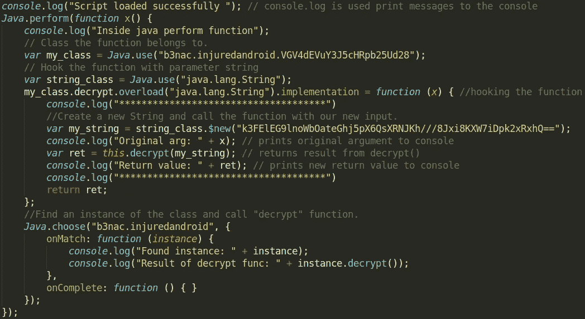

下面提供了用于加载这个钩子的 python 脚本。

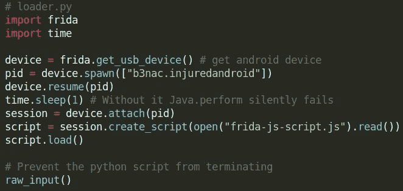

我确保 Frida 服务器正在我的模拟器上运行，然后执行我的 python 脚本来注入 JavaScript 代码。

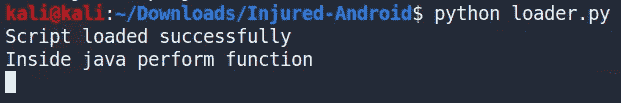

我的脚本加载成功，现在我需要提交一个标志来调用 decrypt 方法。

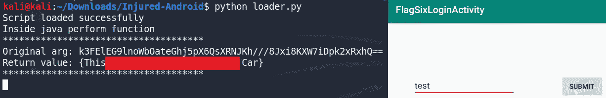

提交单词“test”会导致调用“decrypt()”函数，然后我用自己的输入(即加密标志)覆盖它。这给了我旗子。

# 旗帜七:SQLite

转到挑战七，我发现我最初无法访问挑战的活动。查看“MainActivity”的源代码，我发现必须先完成挑战 1 到 6，然后才能尝试挑战 7。

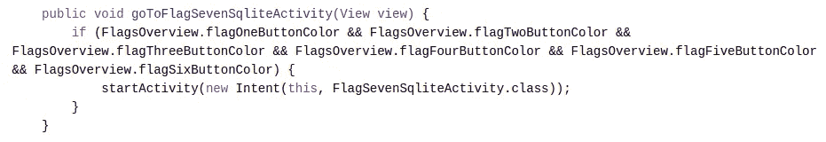

“if”语句用于检查位于“FlagsOverview”类中的六个变量的布尔值。如果这六个布尔值都为真，则挑战七的活动可以开始。我意识到，每次我关闭应用程序，这些布尔变量将被重置，我将不得不再次输入标志，然后才能进行挑战七。

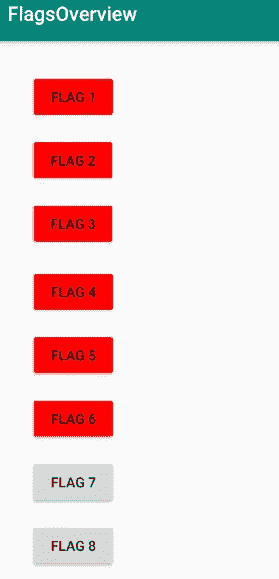

由于我很懒，不想在每次关闭应用程序时输入所有六个标志，所以我创建了一个 Frida 脚本，将所有标志设置为 true😏。

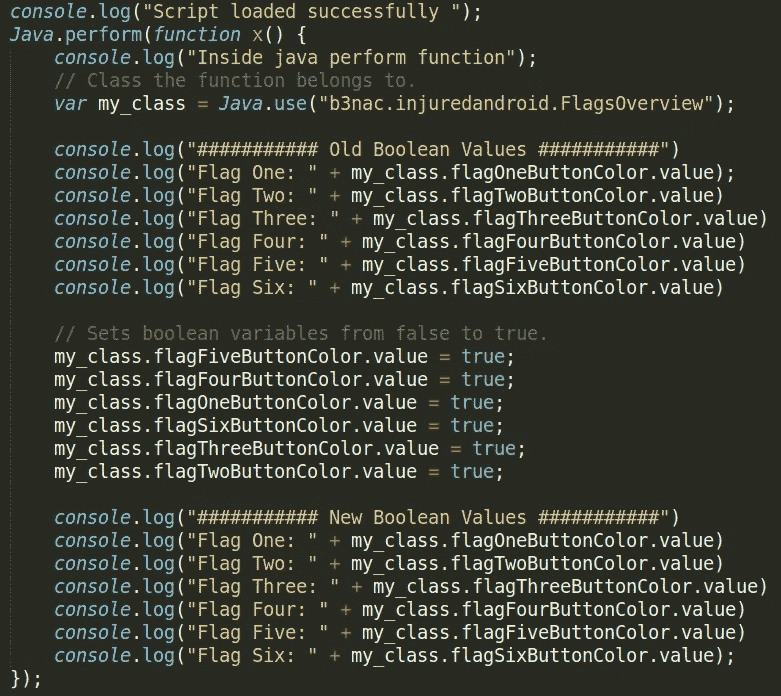

使用与挑战六中相同的 python 加载器脚本，我将我的 JavaScript 代码注入应用程序，并更改变量的值。

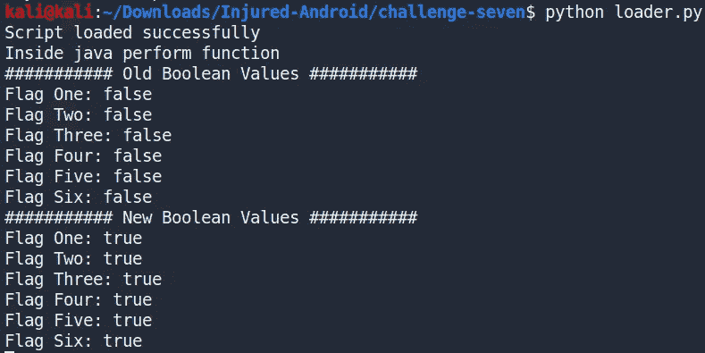

上面的输出显示变量值已经更改。在 flags overview 活动中，我还可以看到按钮的颜色变成了绿色。我现在可以访问挑战七的活动。

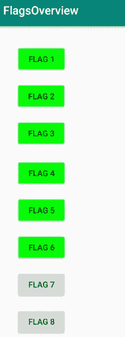

挑战 7 的练习不包含任何挑战描述或文本。查看活动的源代码，我可以看到一个名为“DatabaseSchema”的类用于创建一个 SQLite 数据库文件。

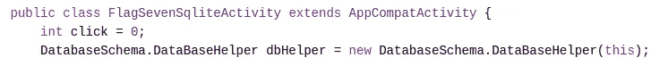

在源代码的下面，检索数据库文件，并将一些值输入数据库。

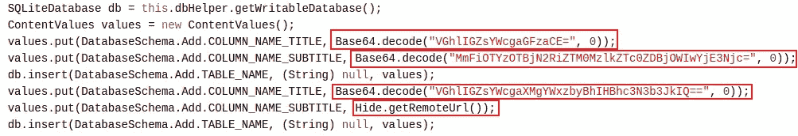

还需要注意的是，销毁 challenge seven 活动时会删除数据库文件。

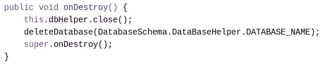

查看“DatabaseSchema”类源代码，可以看到 SQLite 数据库文件的名称叫做“Thisisatest.db”。


可以在应用程序数据目录中找到该文件(注意:确保挑战七活动已打开，否则不会创建该文件)。

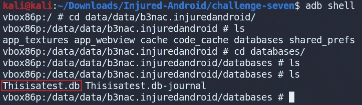

使用 ADB，我可以将文件从它在模拟器上的位置取出，并使用工具(如 sqlitebrowser)查看它。

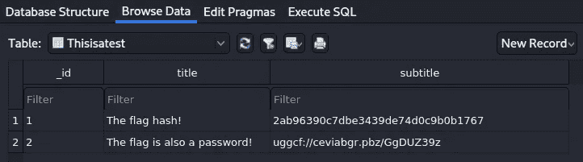

数据库似乎有两个条目，其中包括一个哈希和一个似乎是某种 URL 的内容。使用在线工具破解 MD5 散列，我可以恢复如下所示的散列文本。

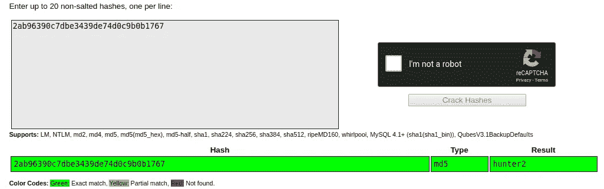

对于 URL，我发现它是用 ROT13 加密的，因为只有字母被旋转了，而没有特殊字符。利用赛博网，我恢复了网址。

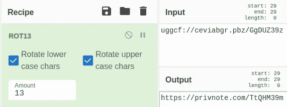

访问此 URL 时，我得到一个“未找到注释错误”。

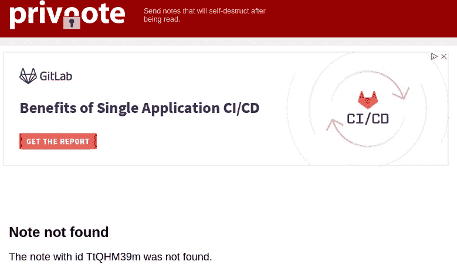

不幸的是，这是挑战的终点😢。参考 GitHub 存储库上提供的演练注释，可以发现 URL 现在已经改变了。也没有提交 URL 和散列文本的位置。出于这个挑战的目的，我将不得不满足于将破解的散列(即“hunter2”)作为标志。

# 旗帜八:AWS

挑战描述解释说在应用程序的某个地方隐藏了 AWS 凭证，但是不幸的是没有找到。在查找了这些凭证之后，我参考了 GitHub 仓库上的演练笔记。我发现我使用的 APK 版本没有这些证书，所以我无法解决这个问题。

# 结束语

这是一个有趣的机器人主题的 CTF，我真的很喜欢完成。尽管最后两个挑战无法解决，但我相信这个 CTF 能够展示一些简单的安全问题，这些问题可能存在于 Android 应用程序中，并且对于初学者来说是一种有趣的 Android 应用程序安全入门方式。非常感谢《CTF》的作者，感谢你一直读到最后😃！

# 参考

*   [https://github.com/B3nac/InjuredAndroid](https://github.com/B3nac/InjuredAndroid)
*   https://github.com/AlirezaChegini/InjuredAndroid
*   [https://github.com/MobSF/Mobile-Security-Framework-MobSF](https://github.com/MobSF/Mobile-Security-Framework-MobSF)
*   ( **Frida 指南链接**)[https://book . hack tricks . XYZ/mobile-apps-pentesting/Android-app-pentesting/Frida-tutorial](https://book.hacktricks.xyz/mobile-apps-pentesting/android-app-pentesting/frida-tutorial)
*   (**弗里达代码链接**)[https://book . hack tricks . XYZ/mobile-apps-pentesting/Android-app-pentesting/Frida-tutorial/Frida-tutorial-2](https://book.hacktricks.xyz/mobile-apps-pentesting/android-app-pentesting/frida-tutorial/frida-tutorial-2)
*   [https://www . cbronline . com/interview/Frida-tool-software-reverse](https://www.cbronline.com/interview/frida-tool-software-reverse)
*   [https://Android . JL else . eu/hacking-Android-app-with-Frida-a 85516 F4 F8 b 7](https://android.jlelse.eu/hacking-android-app-with-frida-a85516f4f8b7)
*   [https://www.shielder.it/blog/fridalab-writeup/](https://www.shielder.it/blog/fridalab-writeup/)