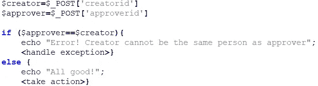

# PHP 中的不安全比较—业务逻辑旁路漏洞

> 原文：<https://infosecwriteups.com/insecure-comparison-in-php-business-logic-bypass-vulnerability-83e08190f2e2?source=collection_archive---------2----------------------->

我最近在一个 PHP 应用程序中发现了一个有趣的漏洞，它属于一个私人 bug bounty 程序的范围。这个漏洞与 SQLi、XSS 或 IDOR 等标准 web 应用程序问题无关，因此尽管影响相对较小，我还是决定写几段关于它的内容。

不幸的是，由于 NDA，我不会在这篇文章中发布任何截图，但希望描述和伪代码可以让你理解这个问题。

# 应用程序描述

作为测试对象的应用程序具有允许用户创建和发布对象的功能。发布对象之前，需要由创建者在对象创建过程中选择的用户批准。为了防止欺诈活动，现有的安全机制不允许创建者选择自己作为批准者。尝试这样做导致了一个错误。

从 HTTP 请求的角度来看，web 浏览器向 web 服务器发送了一个带有多个参数的 POST 请求。其中两个参数包含创建者和批准者的用户标识——3 位数的自然数。

伪 PHP 代码来呈现机制:

# 安全问题

了解 PHP 在值比较方面的问题后，我决定尝试一下，看看如果我将一个浮点数作为 *approverid* 传递会发生什么。

我修改了 HTTP 请求并通过了 200.9，作为 *approverid* 的值。令我惊讶的是，应用程序并没有返回一个错误，而是做了一些奇怪的舍入，并设置了一个 UserID 为 201 的用户作为批准者。

有了这样的行为，下一步的行动对我来说就很清楚了。我向 web 服务器发送了一个 POST 请求，其中 201 为 *creatorid* ，200.9 为 *approverid* 。

**应用程序比较了两个值，确定它们不相同，向上舍入*批准 id* 值，并成功保存两个值(201 和 201)。**

未返回任何错误。创建者能够将自己设置为批准者，并批准自己的对象。这导致应用程序完全绕过了业务逻辑。

# 摘要

Bug 在提交 4 小时后被分类并接受。由于业务影响有限，奖金数额相对较小。

但是，重要的是要记住，如果在关键应用领域(如身份验证、授权)中实施不当，与值比较相关的安全问题可能会带来悲剧性的后果。在无法访问源代码的情况下识别这些问题可能会非常困难，通常需要一些运气或灵光一现。

狩猎愉快！